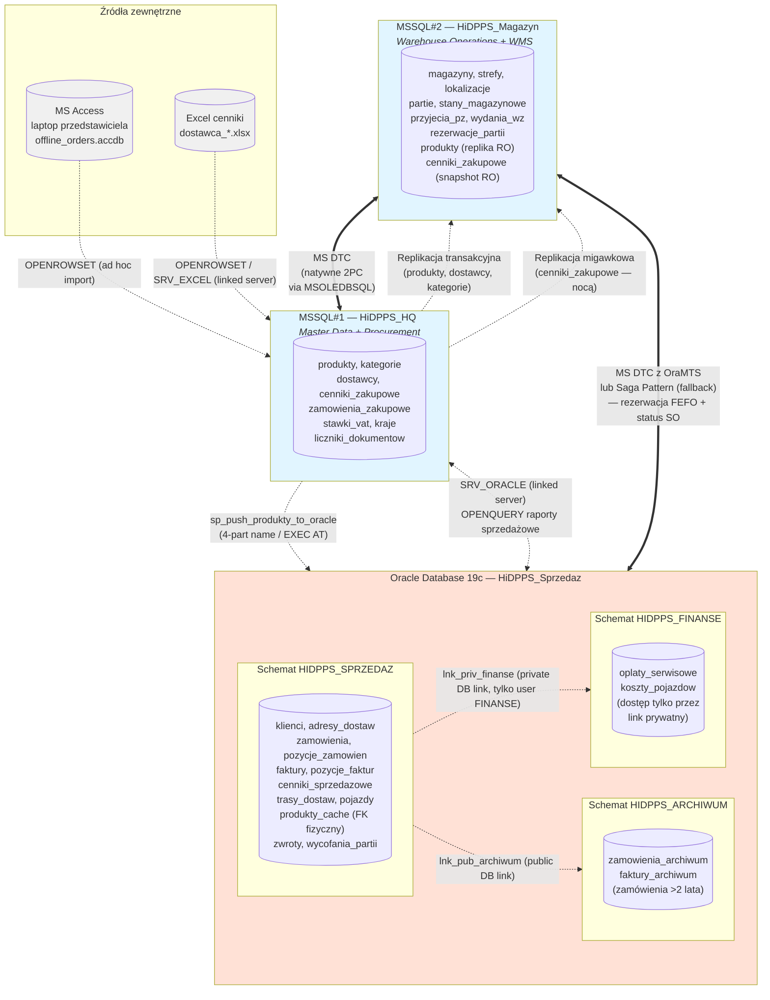
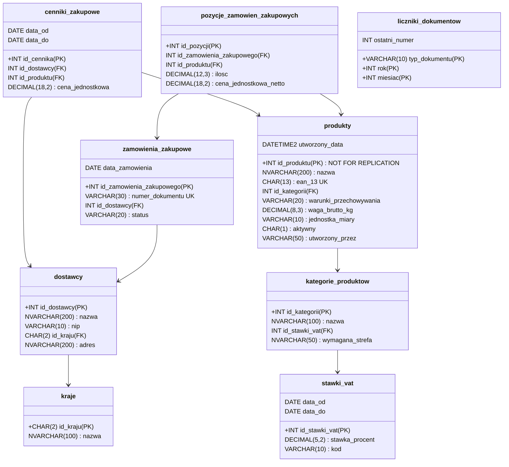
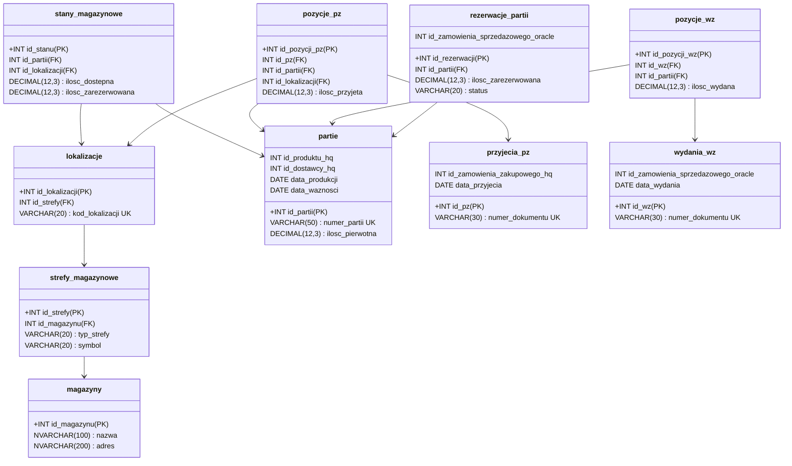
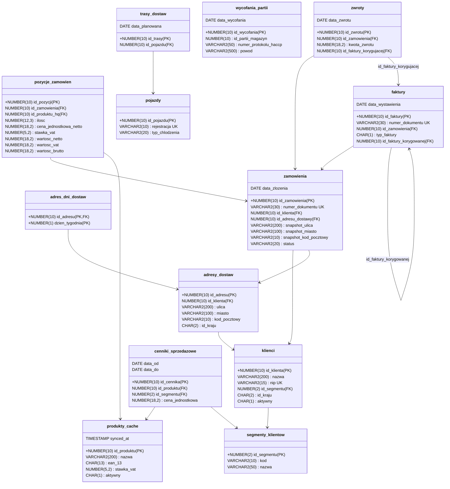
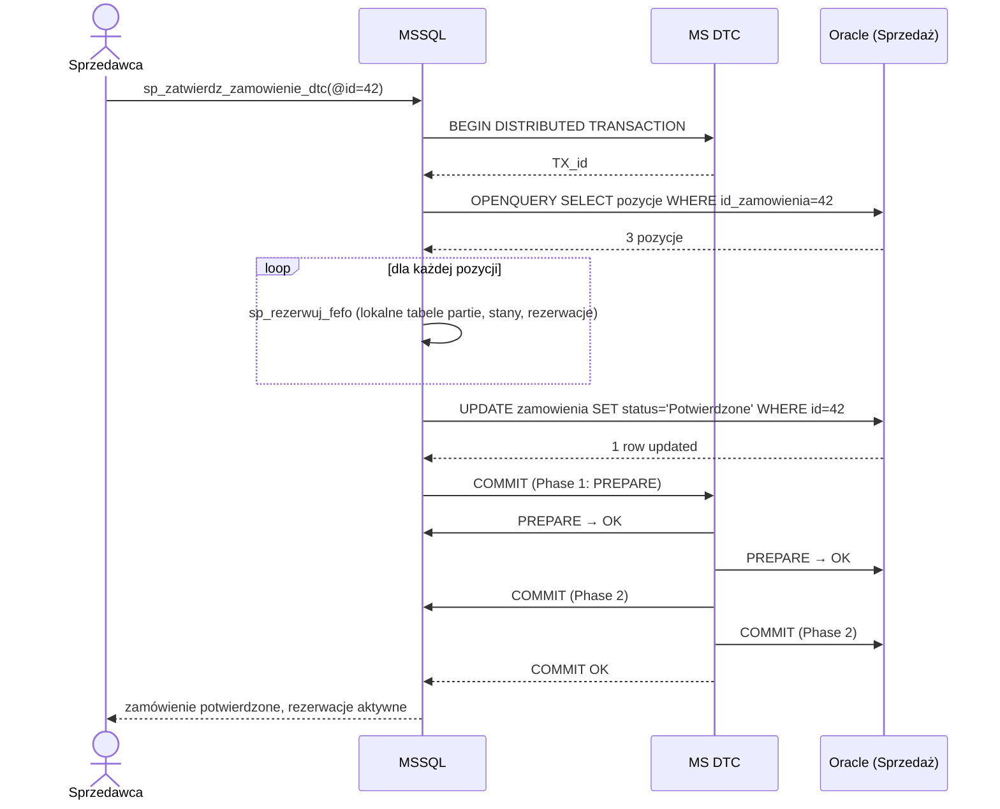
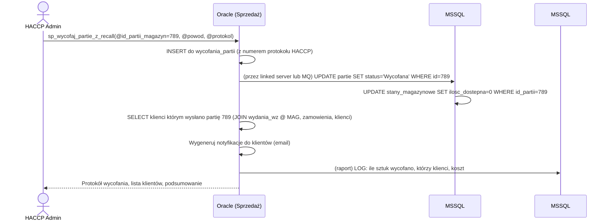

# Projekt rozproszonej bazy danych

## Hurtownia i Dystrybucja Przetworzonych Produktów Spożywczych (HiDPPS)

**Autorzy:** Mateusz Mróz (251190), Maciej Górka (251143)
**Przedmiot:** Rozproszone Bazy Danych
**Rok akademicki:** 2025/2026 (semestr letni)
**Politechnika Łódzka, WEEIA, Informatyka — semestr 6**

---

## Spis treści

1. [Streszczenie projektu](#1-streszczenie-projektu)
2. [Architektura RBD i uzasadnienie podziału](#2-architektura-rbd-i-uzasadnienie-podzialu)
3. [Założenia projektowe i biznesowe](#3-zalozenia-projektowe-i-biznesowe)
4. [Baza MSSQL#1 — HiDPPS_HQ (Master Data + Procurement)](#4-baza-mssql1--hidpps_hq-master-data--procurement)
5. [Baza MSSQL#2 — HiDPPS_Magazyn (Warehouse Operations)](#5-baza-mssql2--hidpps_magazyn-warehouse-operations)
6. [Baza Oracle — HiDPPS_Sprzedaz (3 schematy)](#6-baza-oracle--hidpps_sprzedaz-3-schematy)
7. [Zewnętrzne źródła danych — Access i Excel](#7-zewnetrzne-zrodla-danych--access-i-excel)
8. [Linked Servers — konfiguracja i mapowanie loginów (p.3)](#8-linked-servers--konfiguracja-i-mapowanie-loginow-p3)
9. [OPENROWSET — zapytania ad hoc + wielodostęp (p.2)](#9-openrowset--zapytania-ad-hoc--wielodostep-p2)
10. [OPENQUERY — zapytania przekazujące (p.4)](#10-openquery--zapytania-przekazujace-p4)
11. [Modyfikacje danych na zdalnych źródłach (p.5)](#11-modyfikacje-danych-na-zdalnych-zrodlach-p5)
12. [MS DTC — transakcje rozproszone (p.6)](#12-ms-dtc--transakcje-rozproszone-p6)
13. [Replikacja danych (p.7)](#13-replikacja-danych-p7)
14. [Oracle — użytkownicy, role, uprawnienia (p.8)](#14-oracle--uzytkownicy-role-uprawnienia-p8)
15. [Oracle Database Links (p.9, p.10)](#15-oracle-database-links-p9-p10)
16. [Niemodyfikowalne widoki rozproszone Oracle + rzutowanie typów (p.11)](#16-niemodyfikowalne-widoki-rozproszone-oracle--rzutowanie-typow-p11)
17. [Wyzwalacze INSTEAD OF do widoków rozproszonych (p.12)](#17-wyzwalacze-instead-of-do-widokow-rozproszonych-p12)
18. [Procedury składowane Oracle — pakiet PL/SQL (p.13)](#18-procedury-skladowane-oracle--pakiet-plsql-p13)
19. [Reguły biznesowe — constraints, triggery, walidacje (HACCP)](#19-reguly-biznesowe--constraints-triggery-walidacje-haccp)
20. [Edge cases — scenariusze brzegowe](#20-edge-cases--scenariusze-brzegowe)
21. [Bezpieczeństwo i konta serwisowe](#21-bezpieczenstwo-i-konta-serwisowe)
22. [Wnioski i ograniczenia MVP](#22-wnioski-i-ograniczenia-mvp)

---

## 1. Streszczenie projektu

**HiDPPS** to projekt rozproszonej bazy danych dla średniej wielkości hurtowni dystrybuującej przetworzone produkty spożywcze (mrożonki, konserwy, nabiał, produkty suche) do sieci sklepów detalicznych i HoReCa w Polsce. System pokrywa cały łańcuch wartości: od zakupów u dostawców (procurement), przez operacje magazynowe (przyjęcia, składowanie z kontrolą HACCP, kompletacja FEFO), po sprzedaż, fakturowanie, logistykę i archiwum.

**Środowisko heterogeniczne:**
- **2× MS SQL Server 2019** — `MSSQL#1` (HQ, master data, zakupy) + `MSSQL#2` (magazyn, operacje WMS)
- **1× Oracle Database 19c** z **3 schematami** (HIDPPS_SPRZEDAZ, HIDPPS_ARCHIWUM, HIDPPS_FINANSE) symulującymi rozproszenie w obrębie jednej instancji
- **MS Access (.accdb)** — laptop przedstawiciela handlowego (offline zamówienia)
- **Excel (.xlsx)** — cenniki dostawców wymieniane mailem

**Kluczowe mechanizmy RBD pokryte w projekcie:**

| Wymaganie | Realizacja |
|---|---|
| p.1 Struktura RBD + uzasadnienie | Podział funkcjonalny: HQ-master / Magazyn-operacje / Oracle-sprzedaż |
| p.2 OPENROWSET (4 typy + wielodostęp) | Import cenników Excel, snapshot Access, ad-hoc Oracle, widok wielodostępny `vw_porownanie_cen_zakup_vs_sprzedaz` |
| p.3 Linked Servers (4 typy + mapowanie loginów) | 5 linked serverów + `sp_addlinkedsrvlogin` z dedykowanymi loginami |
| p.4 OPENQUERY pass-through | Raporty sprzedażowe Oracle z agregacją po stronie zdalnej |
| p.5 INSERT/UPDATE zdalne | Push katalogu produktów do `produkty_cache` w Oracle |
| p.6 MS DTC + konfiguracja | 4 scenariusze atomowych transakcji rozproszonych (MSSQL↔MSSQL + cross-platform z OraMTS) |
| p.7 Replikacja | Transakcyjna (katalog HQ→Magazyn) + Migawkowa (cenniki zakupowe) |
| p.8 Oracle użytkownicy/role | 5 ról + 5 użytkowników z hierarchią uprawnień |
| p.9 DB linki prywatne i publiczne | `lnk_priv_finanse` (prywatny) + 2 publiczne |
| p.10 Symulacja zdalnych źródeł przez DB link | 3 schematy Oracle jako "wirtualne instancje" |
| p.11 Widoki rozproszone Oracle + rzutowanie | `vw_klient_360`, `vw_wszystkie_zamowienia` z CAST |
| p.12 INSTEAD OF triggery | Triggery DML na widokach rozproszonych |
| p.13 Procedury PL/SQL | Pakiet `PKG_HIDPPS_SPRZEDAZ` z 10 procedurami (kursor + autonomous transaction) |

---

## 2. Architektura RBD i uzasadnienie podziału

### 2.1 Diagram architektury



### 2.2 Uzasadnienie podziału (funkcjonalny, nie geograficzny)

Architektura odzwierciedla **realną organizację firmy** dystrybucyjnej, gdzie różne piony mają różne wymagania na bazę:

| Pion | Baza | Charakterystyka | Wzorzec dostępu |
|---|---|---|---|
| **Centrala** (HQ) | MSSQL#1 | Master data, zakupy, zarządzanie katalogiem | Niski write, średni read, sporadyczne raporty cross-system |
| **Magazyn regionalny** (Łódź) | MSSQL#2 | Operacje WMS: przyjęcia, składowanie, kompletacja, wydania | Wysoki write/read, real-time, niska tolerancja na opóźnienia |
| **Sprzedaż + Finanse** | Oracle | Zamówienia od klientów, faktury, logistyka, archiwum | Średni write, wysoki read raportowy, długoterminowe archiwa |

**Dlaczego ten podział, a nie inny:**

1. **Separacja domen biznesowych** — katalog produktów (HQ) jest stabilny i centralnie zarządzany; operacje magazynowe (Magazyn) generują wysoki ruch transakcyjny niezwiązany z HQ; sprzedaż (Oracle) ma swoje własne tabele klientów, których HQ ani Magazyn nie potrzebują na co dzień.
2. **Niezależne SLA** — awaria magazynu (MSSQL#2) nie blokuje przyjmowania zamówień od klientów (Oracle).
3. **Heterogeniczność technologiczna uzasadniona** — Oracle ma silniejsze możliwości partycjonowania i archiwizacji (perfect dla historii zamówień), MSSQL jest tańszy w utrzymaniu dla operacji typu CRUD.
4. **Dydaktycznie pokrywa wszystkie wymagane mechanizmy** — replikacja MSSQL↔MSSQL, DTC cross-platform, OPENROWSET wielodostępny, linki publiczne i prywatne w Oracle.

### 2.3 Macierz mechanizmów RBD per wymaganie

| # | Wymaganie | Realizacja w HiDPPS |
|---|---|---|
| 1 | Struktura RBD + uzasadnienie | §2.2 |
| 2 | OPENROWSET 4 typy + wielodostęp | §9 (4 scenariusze + widok `vw_porownanie_cen_zakup_vs_sprzedaz` łączący Excel + MSSQL local + Oracle) |
| 3 | Linked Servers 4 typy + mapowanie loginów | §8 (`SRV_HQ`, `SRV_MAGAZYN`, `SRV_ORACLE`, `SRV_ACCESS`, `SRV_EXCEL`) |
| 4 | OPENQUERY pass-through | §10 (`sp_raport_top_klienci_oracle`, `vw_porownanie_cen_zakup_vs_sprzedaz`) |
| 5 | INSERT/UPDATE zdalne | §11 (push katalogu produktów do Oracle, update statusu zamówienia) |
| 6 | MS DTC | §12 (4 scenariusze + konfiguracja MSDTC + OraMTS + Plan B saga) |
| 7 | Replikacja | §13 (transakcyjna + migawkowa) |
| 8 | Oracle użytkownicy/role | §14 |
| 9 | DB linki prywatne i publiczne | §15 |
| 10 | Symulacja zdalnych źródeł przez DB link | §15 (3 schematy Oracle) |
| 11 | Widoki rozproszone Oracle + rzutowanie | §16 |
| 12 | INSTEAD OF triggery | §17 |
| 13 | Procedury PL/SQL | §18 (pakiet `PKG_HIDPPS_SPRZEDAZ` v2) |

---

## 3. Założenia projektowe i biznesowe

### 3.1 Constraints architektoniczne (tablica prawdy)

1. **2× MSSQL + 1× Oracle** — zgodnie z przerobionym materiałem (replikacja tylko MSSQL↔MSSQL).
2. **Wszystkie serwery to różne fizyczne instancje** (w demo: 2 instancje MSSQL + 1 Oracle).
3. **Każdy mechanizm RBD ma jasny use case biznesowy** — nie demo dla demo.
4. **Wzór Northwind** — proste schematy, jasne klucze, biznesowa logika w procedurach (nie w aplikacji).
5. **Oracle NIE jest subscriberem replikacji ani celem linked server z MSSQL przez logical replication**; sync MSSQL→Oracle realizowany **wyłącznie procedurą push z MSSQL** (4-part name).
6. **Naming convention:** snake_case, polskie nazwy biznesowe, PK = `id_<encja>`, FK = `id_<encja>_<rola>` (np. `id_klienta_platnik`).
7. **Typy danych:** `DECIMAL(18,2)` dla pieniędzy w MSSQL, `NUMBER(18,2)` w Oracle, `DATE` dla dat biznesowych, `DATETIME2`/`TIMESTAMP` dla audytu, **nigdy FLOAT** dla wartości pieniężnych.

### 3.2 Założenia biznesowe domeny

- **1 magazyn regionalny** (Łódź) — uproszczenie MVP; tabela `magazyny` jako placeholder do rozszerzenia.
- **FEFO** (First Expired, First Out) jako algorytm kompletacji zamówień — krytyczne dla przetworzonych produktów spożywczych.
- **Partie produkcyjne** (LOT) z datą produkcji, datą ważności, dostawcą — recall HACCP wymaga jednoznacznej identyfikacji.
- **3 typy stref magazynowych:** suchy / chłodniczy (2-8°C) / mroźniczy (-18°C i poniżej).
- **2 typy pojazdów dostawczych:** zwykły (suchy) / chłodniczy / mroźniczy.
- **Stawki VAT:** 0%, 5%, 8%, 23% (polskie), słownikowe, historia zmian.
- **Soft delete** w katalogu (`aktywny='N'`) — historyczne pozycje muszą zachowywać integralność.
- **Recall HACCP** działa per partia (sub-LOT poza zakresem MVP).
- **Audit trail** dla operacji krytycznych biznesowo (wycofania, anulowania, korekty cenników) — wymóg rozporządzenia 178/2002 (traceability).
- **Numerowanie dokumentów księgowo bez luk** — tabela `liczniki_dokumentow` z `SERIALIZABLE` (patrz §4.4).

### 3.3 Routing typów dokumentów (gdzie żyje który licznik)

| Typ dokumentu | Skrót | Serwer | Procedura |
|---|---|---|---|
| Zamówienie zakupowe (do dostawcy) | `PO` | MSSQL#1 | `sp_utworz_zamowienie_zakupowe` |
| Przyjęcie magazynowe | `PZ` | MSSQL#2 | `sp_przyjmij_dostawe` |
| Wydanie magazynowe | `WZ` | MSSQL#2 | `sp_wystaw_wz` |
| Zamówienie sprzedażowe (od klienta) | `ZS` | Oracle | `sp_zarejestruj_zamowienie` |
| Faktura sprzedażowa | `FV` | Oracle | `sp_wystaw_fakture` |
| Faktura korygująca | `FK` | Oracle | `sp_wystaw_korekte` |

---

## 4. Baza MSSQL#1 — HiDPPS_HQ (Master Data + Procurement)

### 4.1 Diagram ER (uproszczony)



### 4.2 Inwentarz tabel (14 sztuk)

| Tabela | Opis | Replika do MSSQL#2? |
|---|---|---|
| `kraje` | Słownik krajów ISO 3166-1 alpha-2 | TAK (transakcyjna) |
| `kategorie_produktow` | Drzewo kategorii (z FK do `stawki_vat`) | TAK (transakcyjna) |
| `stawki_vat` | Słownik stawek VAT z historią | TAK (transakcyjna) |
| `produkty` | Katalog produktów (z `aktywny`, `IDENTITY NOT FOR REPLICATION`) | TAK (transakcyjna) |
| `wartosci_odzywcze` | 1:1 do `produkty` (rzadko używane) | NIE |
| `dostawcy` | Dostawcy z NIP, krajem | TAK (transakcyjna) |
| `cenniki_zakupowe` | Ceny od dostawców z `data_od`/`data_do` | TAK (migawkowa, nocą) |
| `zamowienia_zakupowe` | Zamówienia do dostawców (PO) | NIE |
| `pozycje_zamowien_zakupowych` | Pozycje PO | NIE |
| `pracownicy_hq` | Użytkownicy systemu HQ | NIE |
| `liczniki_dokumentow` | Liczniki dla `PO` | NIE |
| `audyt_zmian_produktow` | Temporal table dla `produkty` (system-versioned) | NIE |
| `audyt_zmian_cennikow` | Temporal table dla `cenniki_zakupowe` | NIE |
| `import_zamowien_log` | Historia importów z Access (OPENROWSET) | NIE |

### 4.3 DDL kluczowych tabel

```sql
-- MSSQL#1: HiDPPS_HQ
CREATE DATABASE HiDPPS_HQ;
GO
USE HiDPPS_HQ;
GO

CREATE TABLE kraje (
    id_kraju CHAR(2) NOT NULL PRIMARY KEY,
    nazwa    NVARCHAR(100) NOT NULL UNIQUE
);

CREATE TABLE stawki_vat (
    id_stawki_vat   INT IDENTITY(1,1) NOT FOR REPLICATION PRIMARY KEY,
    stawka_procent  DECIMAL(5,2) NOT NULL,
    kod             VARCHAR(10) NOT NULL,
    opis            NVARCHAR(100),
    data_od         DATE NOT NULL,
    data_do         DATE NULL,
    CONSTRAINT uq_stawki_vat UNIQUE (kod, data_od)
);

CREATE TABLE kategorie_produktow (
    id_kategorii      INT IDENTITY(1,1) NOT FOR REPLICATION PRIMARY KEY,
    nazwa             NVARCHAR(100) NOT NULL UNIQUE,
    wymagana_strefa   VARCHAR(20) NOT NULL CHECK (wymagana_strefa IN ('Suchy', 'Chłodniczy', 'Mroźniczy')),
    id_stawki_vat     INT NOT NULL
        CONSTRAINT fk_kategorie_vat REFERENCES stawki_vat(id_stawki_vat)
);

CREATE TABLE produkty (
    id_produktu              INT IDENTITY(1,1) NOT FOR REPLICATION PRIMARY KEY,
    nazwa                    NVARCHAR(200) NOT NULL,
    ean_13                   CHAR(13) NOT NULL UNIQUE CHECK (dbo.fn_waliduj_ean13(ean_13) = 1),
    id_kategorii             INT NOT NULL CONSTRAINT fk_produkty_kategoria REFERENCES kategorie_produktow(id_kategorii),
    warunki_przechowywania   VARCHAR(20) NOT NULL CHECK (warunki_przechowywania IN ('Suchy', 'Chłodniczy', 'Mroźniczy')),
    waga_brutto_kg           DECIMAL(8,3) NOT NULL CHECK (waga_brutto_kg > 0),
    jednostka_miary          VARCHAR(10) NOT NULL,
    aktywny                  CHAR(1) NOT NULL DEFAULT 'T' CHECK (aktywny IN ('T','N')),
    utworzony_przez          NVARCHAR(50) NOT NULL DEFAULT SUSER_SNAME(),
    utworzony_data           DATETIME2 NOT NULL DEFAULT SYSUTCDATETIME(),
    zmodyfikowany_przez      NVARCHAR(50) NOT NULL DEFAULT SUSER_SNAME(),
    zmodyfikowany_data       DATETIME2 NOT NULL DEFAULT SYSUTCDATETIME(),
    ValidFrom                DATETIME2 GENERATED ALWAYS AS ROW START HIDDEN NOT NULL,
    ValidTo                  DATETIME2 GENERATED ALWAYS AS ROW END HIDDEN NOT NULL,
    PERIOD FOR SYSTEM_TIME (ValidFrom, ValidTo)
) WITH (SYSTEM_VERSIONING = ON (HISTORY_TABLE = dbo.audyt_zmian_produktow));

CREATE INDEX ix_produkty_kategoria ON produkty(id_kategorii) WHERE aktywny = 'T';
CREATE INDEX ix_produkty_ean ON produkty(ean_13);

CREATE TABLE dostawcy (
    id_dostawcy   INT IDENTITY(1,1) NOT FOR REPLICATION PRIMARY KEY,
    nazwa         NVARCHAR(200) NOT NULL,
    nip           VARCHAR(15) NOT NULL UNIQUE,
    id_kraju      CHAR(2) NOT NULL CONSTRAINT fk_dostawcy_kraj REFERENCES kraje(id_kraju),
    adres         NVARCHAR(200) NOT NULL,
    email         NVARCHAR(100),
    telefon       VARCHAR(20),
    aktywny       CHAR(1) NOT NULL DEFAULT 'T' CHECK (aktywny IN ('T','N'))
);

CREATE TABLE cenniki_zakupowe (
    id_cennika          INT IDENTITY(1,1) PRIMARY KEY,
    id_dostawcy         INT NOT NULL CONSTRAINT fk_cz_dostawca REFERENCES dostawcy(id_dostawcy),
    id_produktu         INT NOT NULL CONSTRAINT fk_cz_produkt REFERENCES produkty(id_produktu),
    cena_jednostkowa    DECIMAL(18,2) NOT NULL CHECK (cena_jednostkowa > 0),
    waluta              CHAR(3) NOT NULL DEFAULT 'PLN',
    data_od             DATE NOT NULL,
    data_do             DATE NULL,
    CONSTRAINT ck_cz_okres CHECK (data_do IS NULL OR data_do > data_od)
);
CREATE INDEX ix_cz_produkt_okres ON cenniki_zakupowe(id_produktu, data_od, data_do);

CREATE TABLE liczniki_dokumentow (
    typ_dokumentu  VARCHAR(10) NOT NULL,
    rok            INT NOT NULL,
    miesiac        INT NOT NULL,
    ostatni_numer  INT NOT NULL DEFAULT 0,
    CONSTRAINT pk_liczniki PRIMARY KEY (typ_dokumentu, rok, miesiac)
);

CREATE TABLE zamowienia_zakupowe (
    id_zamowienia_zakupowego  INT IDENTITY(1,1) PRIMARY KEY,
    numer_dokumentu           VARCHAR(30) NOT NULL UNIQUE,
    id_dostawcy               INT NOT NULL CONSTRAINT fk_zz_dostawca REFERENCES dostawcy(id_dostawcy),
    data_zamowienia           DATE NOT NULL DEFAULT CAST(GETDATE() AS DATE),
    data_planowanej_dostawy   DATE NOT NULL,
    status                    VARCHAR(20) NOT NULL DEFAULT 'Złożone'
                              CHECK (status IN ('Złożone', 'Potwierdzone', 'Częściowo zrealizowane', 'Zrealizowane', 'Anulowane')),
    utworzony_przez           NVARCHAR(50) NOT NULL DEFAULT SUSER_SNAME(),
    utworzony_data            DATETIME2 NOT NULL DEFAULT SYSUTCDATETIME()
);

CREATE TABLE pozycje_zamowien_zakupowych (
    id_pozycji                INT IDENTITY(1,1) PRIMARY KEY,
    id_zamowienia_zakupowego  INT NOT NULL CONSTRAINT fk_pzz_zamowienie REFERENCES zamowienia_zakupowe(id_zamowienia_zakupowego),
    id_produktu               INT NOT NULL CONSTRAINT fk_pzz_produkt REFERENCES produkty(id_produktu),
    ilosc                     DECIMAL(12,3) NOT NULL CHECK (ilosc > 0),
    cena_jednostkowa_netto    DECIMAL(18,2) NOT NULL
);
CREATE INDEX ix_pzz_zamowienie ON pozycje_zamowien_zakupowych(id_zamowienia_zakupowego);
```

### 4.4 Bezpieczne numerowanie dokumentów

```sql
CREATE PROCEDURE sp_nastepny_numer_dokumentu
    @typ VARCHAR(10),
    @numer VARCHAR(30) OUTPUT
AS
BEGIN
    SET NOCOUNT ON;
    SET XACT_ABORT ON;
    DECLARE @rok INT = YEAR(GETDATE()),
            @miesiac INT = MONTH(GETDATE()),
            @nowy INT;
    BEGIN TRANSACTION;
        UPDATE liczniki_dokumentow WITH (UPDLOCK, SERIALIZABLE)
        SET @nowy = ostatni_numer + 1,
            ostatni_numer = ostatni_numer + 1
        WHERE typ_dokumentu = @typ AND rok = @rok AND miesiac = @miesiac;
        IF @@ROWCOUNT = 0
        BEGIN
            INSERT INTO liczniki_dokumentow (typ_dokumentu, rok, miesiac, ostatni_numer)
            VALUES (@typ, @rok, @miesiac, 1);
            SET @nowy = 1;
        END
    COMMIT TRANSACTION;
    SET @numer = @typ + '/' + FORMAT(@rok, 'D4') + '/' + FORMAT(@miesiac, 'D2') + '/' + FORMAT(@nowy, 'D4');
END;
GO
```

Mechanizm gwarantuje: brak luk (księgowo OK), thread-safe (`UPDLOCK, SERIALIZABLE`), reset numeracji per miesiąc, jednolity format `PO/2026/05/0001`.

---

## 5. Baza MSSQL#2 — HiDPPS_Magazyn (Warehouse Operations)

### 5.1 Diagram ER



### 5.2 Inwentarz tabel (12 sztuk)

| Tabela | Opis |
|---|---|
| `produkty` | **Replika RO z MSSQL#1** (replikacja transakcyjna) |
| `kategorie_produktow` | Replika RO |
| `dostawcy` | Replika RO |
| `cenniki_zakupowe` | **Replika RO migawkowa** (nocą) |
| `magazyny` | Magazyny (MVP: 1 sztuka) |
| `strefy_magazynowe` | Strefy z `typ_strefy` (Suchy/Chłodniczy/Mroźniczy) |
| `lokalizacje` | Miejsca paletowe (regał/poziom/miejsce) |
| `partie` | Partie produkcyjne z `numer_partii`, `data_waznosci` (LOT) |
| `stany_magazynowe` | Bieżące stany per partia × lokalizacja (`ilosc_dostepna`, `ilosc_zarezerwowana`) |
| `przyjecia_pz` + `pozycje_pz` | Przyjęcia magazynowe |
| `wydania_wz` + `pozycje_wz` | Wydania magazynowe |
| `rezerwacje_partii` | Rezerwacje FEFO przy zatwierdzeniu zamówienia z Oracle |
| `liczniki_dokumentow` | Liczniki dla `PZ`, `WZ` |
| `stany_magazynowe_historia` | Snapshoty inwentaryzacyjne |

### 5.3 DDL kluczowych tabel

```sql
-- MSSQL#2: HiDPPS_Magazyn
CREATE DATABASE HiDPPS_Magazyn;
GO
USE HiDPPS_Magazyn;
GO

CREATE TABLE magazyny (
    id_magazynu  INT IDENTITY(1,1) PRIMARY KEY,
    nazwa        NVARCHAR(100) NOT NULL,
    adres        NVARCHAR(200) NOT NULL
);

CREATE TABLE strefy_magazynowe (
    id_strefy    INT IDENTITY(1,1) PRIMARY KEY,
    id_magazynu  INT NOT NULL CONSTRAINT fk_s_magazyn REFERENCES magazyny(id_magazynu),
    typ_strefy   VARCHAR(20) NOT NULL CHECK (typ_strefy IN ('Suchy', 'Chłodniczy', 'Mroźniczy')),
    symbol       VARCHAR(20) NOT NULL,
    CONSTRAINT uq_s_symbol UNIQUE (id_magazynu, symbol)
);

CREATE TABLE lokalizacje (
    id_lokalizacji   INT IDENTITY(1,1) PRIMARY KEY,
    id_strefy        INT NOT NULL CONSTRAINT fk_l_strefa REFERENCES strefy_magazynowe(id_strefy),
    kod_lokalizacji  VARCHAR(20) NOT NULL UNIQUE  -- np. 'A-01-03'
);

CREATE TABLE partie (
    id_partii              INT IDENTITY(1,1) PRIMARY KEY,
    id_produktu_hq         INT NOT NULL,  -- FK logiczny do MSSQL#1.produkty (zsynchronizowane przez replikację)
    numer_partii           VARCHAR(50) NOT NULL UNIQUE,
    id_dostawcy_hq         INT NOT NULL,
    data_produkcji         DATE NOT NULL,
    data_waznosci          DATE NOT NULL,
    ilosc_pierwotna        DECIMAL(12,3) NOT NULL CHECK (ilosc_pierwotna > 0),
    utworzony_data         DATETIME2 NOT NULL DEFAULT SYSUTCDATETIME(),
    utworzony_przez        NVARCHAR(50) NOT NULL DEFAULT SUSER_SNAME(),
    CONSTRAINT ck_partia_okres CHECK (data_waznosci > data_produkcji),
    CONSTRAINT fk_partie_produkt FOREIGN KEY (id_produktu_hq) REFERENCES produkty(id_produktu)
);
CREATE INDEX ix_partie_produkt_waznosc ON partie(id_produktu_hq, data_waznosci) INCLUDE (id_partii, numer_partii);  -- FEFO

CREATE TABLE stany_magazynowe (
    id_stanu                INT IDENTITY(1,1) PRIMARY KEY,
    id_partii               INT NOT NULL CONSTRAINT fk_sm_partia REFERENCES partie(id_partii),
    id_lokalizacji          INT NOT NULL CONSTRAINT fk_sm_lokalizacja REFERENCES lokalizacje(id_lokalizacji),
    ilosc_dostepna          DECIMAL(12,3) NOT NULL DEFAULT 0 CHECK (ilosc_dostepna >= 0),
    ilosc_zarezerwowana     DECIMAL(12,3) NOT NULL DEFAULT 0 CHECK (ilosc_zarezerwowana >= 0),
    zmodyfikowany_data      DATETIME2 NOT NULL DEFAULT SYSUTCDATETIME(),
    CONSTRAINT uq_sm_partia_lokalizacja UNIQUE (id_partii, id_lokalizacji)
);

CREATE TABLE rezerwacje_partii (
    id_rezerwacji                          INT IDENTITY(1,1) PRIMARY KEY,
    id_partii                              INT NOT NULL CONSTRAINT fk_rp_partia REFERENCES partie(id_partii),
    id_zamowienia_sprzedazowego_oracle     INT NOT NULL,  -- FK logiczny do Oracle.zamowienia
    ilosc_zarezerwowana                    DECIMAL(12,3) NOT NULL CHECK (ilosc_zarezerwowana > 0),
    status                                 VARCHAR(20) NOT NULL DEFAULT 'Aktywna'
                                           CHECK (status IN ('Aktywna', 'Zrealizowana', 'Anulowana')),
    data_rezerwacji                        DATETIME2 NOT NULL DEFAULT SYSUTCDATETIME()
);
CREATE INDEX ix_rp_zamowienie ON rezerwacje_partii(id_zamowienia_sprzedazowego_oracle, status);
```

### 5.4 Procedura FEFO — rezerwacja partii

```sql
CREATE PROCEDURE sp_rezerwuj_fefo
    @id_produktu_hq INT,
    @ilosc_zadana   DECIMAL(12,3),
    @id_zamowienia_sprzedazowego_oracle INT,
    @wynik VARCHAR(20) OUTPUT  -- 'OK' / 'BRAK_TOWARU'
AS
BEGIN
    SET NOCOUNT ON;
    SET XACT_ABORT ON;
    SET TRANSACTION ISOLATION LEVEL SERIALIZABLE;

    DECLARE @pozostalo DECIMAL(12,3) = @ilosc_zadana,
            @id_partii INT,
            @ilosc_w_partii DECIMAL(12,3);

    BEGIN TRANSACTION;

    -- kursor FEFO: partie z najwcześniejszą datą ważności pierwsze
    DECLARE c_fefo CURSOR LOCAL FAST_FORWARD FOR
        SELECT p.id_partii, SUM(sm.ilosc_dostepna)
        FROM partie p
        JOIN stany_magazynowe sm ON sm.id_partii = p.id_partii
        WHERE p.id_produktu_hq = @id_produktu_hq
          AND p.data_waznosci > GETDATE()      -- nie wydaje przeterminowanych
          AND sm.ilosc_dostepna > 0
        GROUP BY p.id_partii
        HAVING SUM(sm.ilosc_dostepna) > 0
        ORDER BY p.data_waznosci ASC, p.id_partii ASC;

    OPEN c_fefo;
    FETCH NEXT FROM c_fefo INTO @id_partii, @ilosc_w_partii;
    WHILE @@FETCH_STATUS = 0 AND @pozostalo > 0
    BEGIN
        DECLARE @do_rezerwacji DECIMAL(12,3) = CASE WHEN @ilosc_w_partii >= @pozostalo THEN @pozostalo ELSE @ilosc_w_partii END;

        INSERT INTO rezerwacje_partii (id_partii, id_zamowienia_sprzedazowego_oracle, ilosc_zarezerwowana)
        VALUES (@id_partii, @id_zamowienia_sprzedazowego_oracle, @do_rezerwacji);

        UPDATE stany_magazynowe
        SET ilosc_dostepna = ilosc_dostepna - @do_rezerwacji,
            ilosc_zarezerwowana = ilosc_zarezerwowana + @do_rezerwacji
        WHERE id_partii = @id_partii;

        SET @pozostalo = @pozostalo - @do_rezerwacji;
        FETCH NEXT FROM c_fefo INTO @id_partii, @ilosc_w_partii;
    END
    CLOSE c_fefo;
    DEALLOCATE c_fefo;

    IF @pozostalo > 0
    BEGIN
        ROLLBACK TRANSACTION;
        SET @wynik = 'BRAK_TOWARU';
        RETURN;
    END

    COMMIT TRANSACTION;
    SET @wynik = 'OK';
END;
GO
```

---

## 6. Baza Oracle — HiDPPS_Sprzedaz (3 schematy)

### 6.1 Architektura 3 schematów

| Schemat | Opis | Dostęp |
|---|---|---|
| `HIDPPS_SPRZEDAZ` | Główny: klienci, zamówienia, faktury, logistyka, `produkty_cache` | Wszyscy użytkownicy operacyjni |
| `HIDPPS_ARCHIWUM` | Historia zamówień >2 lata (partycjonowanie roczne) | Read-only przez `lnk_pub_archiwum` |
| `HIDPPS_FINANSE` | Opłaty serwisowe pojazdów, koszty operacyjne | **Tylko user `FINANSE`** przez `lnk_priv_finanse` |

Schematy reprezentują **logiczne rozproszenie** (p.10) — z perspektywy `HIDPPS_SPRZEDAZ` są to "zdalne źródła" dostępne wyłącznie przez DB linki.

### 6.2 Diagram ER HIDPPS_SPRZEDAZ



### 6.3 Inwentarz tabel (16 sztuk w HIDPPS_SPRZEDAZ + 3 w archiwum + 2 w finanse)

**HIDPPS_SPRZEDAZ:**
- `klienci`, `segmenty_klientow`, `adresy_dostaw`, `adres_dni_dostaw`
- `produkty_cache` (synchronizowany z MSSQL#1)
- `cenniki_sprzedazowe`
- `zamowienia`, `pozycje_zamowien`
- `faktury`, `pozycje_faktur`
- `trasy_dostaw`, `pojazdy`, `przystanki_trasy`
- `wycofania_partii`, `zwroty`, `pozycje_zwrotow`
- `liczniki_dokumentow`
- `zamowienia_history`, `faktury_history`, `cenniki_history` (audit)

**HIDPPS_ARCHIWUM:**
- `zamowienia_archiwum`, `pozycje_zamowien_archiwum`, `faktury_archiwum`

**HIDPPS_FINANSE:**
- `oplaty_serwisowe` (leasing, serwisy pojazdów)
- `koszty_pojazdow` (paliwo, ubezpieczenia)

### 6.4 DDL kluczowych tabel

```sql
-- Oracle: HIDPPS_SPRZEDAZ
CREATE TABLE segmenty_klientow (
    id_segmentu             NUMBER(2) PRIMARY KEY,
    kod                     VARCHAR2(10) NOT NULL UNIQUE,
    nazwa                   VARCHAR2(50) NOT NULL,
    minimalny_obrot_roczny  NUMBER(18,2)
);

INSERT INTO segmenty_klientow VALUES (1, 'VIP',  'Klient VIP',        500000);
INSERT INTO segmenty_klientow VALUES (2, 'STD',  'Standard',          0);
INSERT INTO segmenty_klientow VALUES (3, 'HURT', 'Hurt sieciowy',     2000000);

CREATE TABLE klienci (
    id_klienta       NUMBER(10) GENERATED ALWAYS AS IDENTITY PRIMARY KEY,
    nazwa            VARCHAR2(200) NOT NULL,
    nip              VARCHAR2(15) NOT NULL UNIQUE,
    id_segmentu      NUMBER(2) DEFAULT 2 NOT NULL
                     CONSTRAINT fk_kl_segment REFERENCES segmenty_klientow(id_segmentu),
    id_kraju         CHAR(2) NOT NULL,
    email            VARCHAR2(100),
    telefon          VARCHAR2(20),
    aktywny          CHAR(1) DEFAULT 'T' NOT NULL CHECK (aktywny IN ('T','N')),
    utworzony_data   TIMESTAMP DEFAULT SYSTIMESTAMP NOT NULL,
    utworzony_przez  VARCHAR2(50) DEFAULT USER NOT NULL
);

CREATE TABLE adresy_dostaw (
    id_adresu        NUMBER(10) GENERATED ALWAYS AS IDENTITY PRIMARY KEY,
    id_klienta       NUMBER(10) NOT NULL CONSTRAINT fk_ad_klient REFERENCES klienci(id_klienta),
    ulica            VARCHAR2(200) NOT NULL,
    miasto           VARCHAR2(100) NOT NULL,
    kod_pocztowy     VARCHAR2(10) NOT NULL,
    id_kraju         CHAR(2) NOT NULL,
    domyslny         CHAR(1) DEFAULT 'N' NOT NULL CHECK (domyslny IN ('T','N'))
);

CREATE TABLE adres_dni_dostaw (
    id_adresu       NUMBER(10) NOT NULL,
    dzien_tygodnia  NUMBER(1) NOT NULL CHECK (dzien_tygodnia BETWEEN 1 AND 7),
    CONSTRAINT pk_add PRIMARY KEY (id_adresu, dzien_tygodnia),
    CONSTRAINT fk_add_adres FOREIGN KEY (id_adresu) REFERENCES adresy_dostaw(id_adresu)
);

-- KLUCZOWE: produkty_cache jako lokalna kopia z MSSQL#1, FK fizyczny
CREATE TABLE produkty_cache (
    id_produktu       NUMBER(10) PRIMARY KEY,        -- ten sam ID co w MSSQL#1
    nazwa             VARCHAR2(200) NOT NULL,
    ean_13            CHAR(13) UNIQUE,
    id_kategorii      NUMBER(10),
    stawka_vat        NUMBER(5,2) NOT NULL,           -- denormalizowana z stawki_vat (HQ)
    jednostka_miary   VARCHAR2(10),
    aktywny           CHAR(1) DEFAULT 'T' NOT NULL CHECK (aktywny IN ('T','N')),
    synced_at         TIMESTAMP DEFAULT SYSTIMESTAMP NOT NULL
);

CREATE TABLE produkty_cache_staging (  -- tabela tymczasowa do MERGE
    id_produktu      NUMBER(10),
    nazwa            VARCHAR2(200),
    ean_13           CHAR(13),
    id_kategorii     NUMBER(10),
    stawka_vat       NUMBER(5,2),
    jednostka_miary  VARCHAR2(10),
    aktywny          CHAR(1)
);

CREATE TABLE zamowienia (
    id_zamowienia              NUMBER(10) GENERATED ALWAYS AS IDENTITY PRIMARY KEY,
    numer_dokumentu            VARCHAR2(30) NOT NULL UNIQUE,
    id_klienta                 NUMBER(10) NOT NULL CONSTRAINT fk_z_klient REFERENCES klienci(id_klienta),
    id_adresu_dostawy          NUMBER(10) NOT NULL CONSTRAINT fk_z_adres REFERENCES adresy_dostaw(id_adresu),
    -- SNAPSHOT adresu (denormalizacja świadoma — niezmienność historyczna):
    snapshot_ulica             VARCHAR2(200) NOT NULL,
    snapshot_miasto            VARCHAR2(100) NOT NULL,
    snapshot_kod_pocztowy      VARCHAR2(10) NOT NULL,
    snapshot_id_kraju          CHAR(2) NOT NULL,
    data_zlozenia              DATE DEFAULT TRUNC(SYSDATE) NOT NULL,
    data_planowanej_realizacji DATE,
    status                     VARCHAR2(30) DEFAULT 'Złożone' NOT NULL
                               CHECK (status IN ('Złożone', 'Potwierdzone', 'W trakcie kompletacji',
                                                  'Wydane', 'Zafakturowane', 'Zrealizowane', 'Anulowane')),
    wartosc_calkowita_brutto   NUMBER(18,2) DEFAULT 0 NOT NULL,
    utworzony_data             TIMESTAMP DEFAULT SYSTIMESTAMP NOT NULL,
    utworzony_przez            VARCHAR2(50) DEFAULT USER NOT NULL,
    zmodyfikowany_data         TIMESTAMP DEFAULT SYSTIMESTAMP NOT NULL,
    zmodyfikowany_przez        VARCHAR2(50) DEFAULT USER NOT NULL
);

CREATE TABLE pozycje_zamowien (
    id_pozycji              NUMBER(10) GENERATED ALWAYS AS IDENTITY PRIMARY KEY,
    id_zamowienia           NUMBER(10) NOT NULL CONSTRAINT fk_pz_zamowienie REFERENCES zamowienia(id_zamowienia),
    id_produktu_hq          NUMBER(10) NOT NULL CONSTRAINT fk_pz_produkt REFERENCES produkty_cache(id_produktu),
    ilosc                   NUMBER(12,3) NOT NULL CHECK (ilosc > 0),
    cena_jednostkowa_netto  NUMBER(18,2) NOT NULL CHECK (cena_jednostkowa_netto > 0),
    stawka_vat              NUMBER(5,2) NOT NULL,
    wartosc_netto           NUMBER(18,2) NOT NULL,
    wartosc_vat             NUMBER(18,2) NOT NULL,
    wartosc_brutto          NUMBER(18,2) NOT NULL,
    CONSTRAINT ck_pozycje_wartosci CHECK (wartosc_brutto = wartosc_netto + wartosc_vat)
);
CREATE INDEX ix_pz_zamowienie ON pozycje_zamowien(id_zamowienia);
CREATE INDEX ix_pz_produkt ON pozycje_zamowien(id_produktu_hq);

CREATE TABLE faktury (
    id_faktury              NUMBER(10) GENERATED ALWAYS AS IDENTITY PRIMARY KEY,
    numer_dokumentu         VARCHAR2(30) NOT NULL UNIQUE,
    id_zamowienia           NUMBER(10) NOT NULL CONSTRAINT fk_f_zamowienie REFERENCES zamowienia(id_zamowienia),
    typ_faktury             CHAR(1) DEFAULT 'F' NOT NULL CHECK (typ_faktury IN ('F','K')),  -- F = Faktura, K = Korekta
    id_faktury_korygowanej  NUMBER(10) NULL
                            CONSTRAINT fk_f_korygowana REFERENCES faktury(id_faktury),
    data_wystawienia        DATE DEFAULT TRUNC(SYSDATE) NOT NULL,
    termin_platnosci        DATE,
    wartosc_netto           NUMBER(18,2) NOT NULL,
    wartosc_vat             NUMBER(18,2) NOT NULL,
    wartosc_brutto          NUMBER(18,2) NOT NULL,
    status                  VARCHAR2(20) DEFAULT 'Wystawiona' NOT NULL,
    CONSTRAINT ck_f_korekta CHECK ((typ_faktury = 'K' AND id_faktury_korygowanej IS NOT NULL) OR
                                    (typ_faktury = 'F' AND id_faktury_korygowanej IS NULL))
);

CREATE TABLE wycofania_partii (
    id_wycofania             NUMBER(10) GENERATED ALWAYS AS IDENTITY PRIMARY KEY,
    id_partii_magazyn        NUMBER(10) NOT NULL,  -- FK logiczny do MSSQL#2.partie
    numer_protokolu_haccp    VARCHAR2(50) NOT NULL UNIQUE,
    data_wycofania           DATE DEFAULT TRUNC(SYSDATE) NOT NULL,
    powod                    VARCHAR2(500) NOT NULL,
    decydent                 VARCHAR2(100) NOT NULL,
    utworzony_data           TIMESTAMP DEFAULT SYSTIMESTAMP NOT NULL,
    utworzony_przez          VARCHAR2(50) DEFAULT USER NOT NULL
);
```

### 6.5 HIDPPS_FINANSE — schemat zdalny

```sql
-- Schemat HIDPPS_FINANSE (osobny user Oracle)
CREATE TABLE hidpps_finanse.oplaty_serwisowe (
    id_oplaty         NUMBER(10) GENERATED ALWAYS AS IDENTITY PRIMARY KEY,
    id_pojazdu        NUMBER(10) NOT NULL,
    typ_oplaty        VARCHAR2(50) NOT NULL,  -- 'Leasing', 'Ubezpieczenie', 'Serwis'
    kwota             NUMBER(18,2) NOT NULL,
    data_naliczenia   DATE NOT NULL,
    okres_od          DATE,
    okres_do          DATE
);

CREATE TABLE hidpps_finanse.koszty_pojazdow (
    id_kosztu         NUMBER(10) GENERATED ALWAYS AS IDENTITY PRIMARY KEY,
    id_pojazdu        NUMBER(10) NOT NULL,
    typ_kosztu        VARCHAR2(50) NOT NULL,  -- 'Paliwo', 'Mycie', 'Naprawa'
    kwota             NUMBER(18,2) NOT NULL,
    data_kosztu       DATE NOT NULL
);
```

---

## 7. Zewnętrzne źródła danych — Access i Excel

### 7.1 Access — laptop przedstawiciela handlowego

**Plik:** `\\fileserver\hidpps\offline_orders.accdb`

Tabela `oferty_offline` w Access:

| Kolumna | Typ |
|---|---|
| `id_oferty` | AutoNumber PK |
| `data_oferty` | Date/Time |
| `nip_klienta` | Short Text(15) |
| `ean_produktu` | Short Text(13) |
| `ilosc` | Number (Double) |
| `cena_proponowana` | Currency |
| `notatka` | Long Text |

**Use case:** przedstawiciel handlowy na spotkaniu z klientem zapisuje zamówienie w Access offline. Po powrocie do biura plik jest podłączany przez linked server `SRV_ACCESS`, a procedura `sp_importuj_oferty_z_access` (MSSQL#1) waliduje NIP-y, mapuje EAN-y na `produkty.id_produktu` i tworzy `zamowienia_zakupowe` lub przesyła do Oracle (zamówienia od klientów).

### 7.2 Excel — cenniki dostawców

**Plik:** `C:\cenniki\dostawca_<NIP>_<rok-miesiac>.xlsx`

Arkusz `Sheet1`:

| Kolumna | Opis |
|---|---|
| `EAN_13` | EAN-13 produktu |
| `Cena_Netto_PLN` | Cena netto w PLN |
| `Data_obowiazywania_od` | Data startu obowiązywania |
| `Min_ilosc_zamowienia` | Minimalna ilość |

**Use case:** dostawca przysyła nowy cennik mailem co miesiąc. Procedura `sp_importuj_cennik_excel` (MSSQL#1) ładuje plik przez `OPENROWSET(Microsoft.ACE.OLEDB.16.0)` lub linked server `SRV_EXCEL`, dopisuje wpisy do `cenniki_zakupowe` z `data_od` zgodną z plikiem.

---

## 8. Linked Servers — konfiguracja i mapowanie loginów (p.3)

### 8.1 Pięć linked serverów na MSSQL#1

```sql
-- 1. SQLServer ↔ SQLServer: HQ → Magazyn
EXEC sp_addlinkedserver
    @server = 'SRV_MAGAZYN',
    @srvproduct = '',
    @provider = 'MSOLEDBSQL',
    @datasrc = 'localhost\MSSQL2',
    @catalog = 'HiDPPS_Magazyn';

EXEC sp_addlinkedsrvlogin
    @rmtsrvname = 'SRV_MAGAZYN',
    @useself = 'FALSE',
    @locallogin = NULL,        -- mapowanie dla wszystkich loginów lokalnych
    @rmtuser = 'hq_to_mag_user',
    @rmtpassword = 'StrongPwd!23';

-- 2. SQLServer ↔ Oracle (tylko od SQL Server do Oracle, zgodnie z wymaganiem)
EXEC sp_addlinkedserver
    @server = 'SRV_ORACLE',
    @srvproduct = 'Oracle',
    @provider = 'OraOLEDB.Oracle',
    @datasrc = 'ORCL';         -- TNS alias z tnsnames.ora

EXEC sp_addlinkedsrvlogin
    @rmtsrvname = 'SRV_ORACLE',
    @useself = 'FALSE',
    @locallogin = NULL,
    @rmtuser = 'hidpps_sprzedaz',
    @rmtpassword = 'OraclePwd!23';

-- Włącz RPC OUT i DTC dla Oracle (potrzebne do INSERT/UPDATE i DTC)
EXEC sp_serveroption 'SRV_ORACLE', 'rpc out', 'true';
EXEC sp_serveroption 'SRV_ORACLE', 'rpc', 'true';
EXEC sp_serveroption 'SRV_ORACLE', 'remote proc transaction promotion', 'true';

-- 3. SQLServer ↔ Access
EXEC sp_addlinkedserver
    @server = 'SRV_ACCESS',
    @srvproduct = 'Access',
    @provider = 'Microsoft.ACE.OLEDB.16.0',
    @datasrc = '\\fileserver\hidpps\offline_orders.accdb';

EXEC sp_addlinkedsrvlogin 'SRV_ACCESS', 'FALSE', NULL, 'Admin', '';

-- 4. SQLServer ↔ Excel
EXEC sp_addlinkedserver
    @server = 'SRV_EXCEL',
    @srvproduct = 'Excel',
    @provider = 'Microsoft.ACE.OLEDB.16.0',
    @datasrc = 'C:\cenniki\dostawca_aktualny.xlsx',
    @provstr = 'Excel 12.0;HDR=YES';

EXEC sp_addlinkedsrvlogin 'SRV_EXCEL', 'FALSE', NULL, 'Admin', '';

-- 5. Z MSSQL#2 (Magazyn) link zwrotny do HQ (do raportów)
-- Konfigurowany analogicznie na MSSQL#2
```

### 8.2 Weryfikacja konfiguracji

```sql
-- Lista wszystkich linked serverów
SELECT name, provider, data_source, catalog FROM sys.servers WHERE is_linked = 1;

-- Mapowanie loginów
SELECT s.name AS server_name, l.local_principal_id, l.remote_name
FROM sys.servers s
JOIN sys.linked_logins l ON l.server_id = s.server_id
WHERE s.is_linked = 1;

-- Test połączenia
EXEC sp_testlinkedserver 'SRV_ORACLE';
EXEC sp_testlinkedserver 'SRV_MAGAZYN';
```

---

## 9. OPENROWSET — zapytania ad hoc + wielodostęp (p.2)

### 9.1 Włączenie ad hoc queries

```sql
-- Najpierw musimy włączyć Ad Hoc Distributed Queries (raz, server-wide)
EXEC sp_configure 'show advanced options', 1; RECONFIGURE;
EXEC sp_configure 'Ad Hoc Distributed Queries', 1; RECONFIGURE;
```

### 9.2 SQLServer → SQLServer (MSSQL#1 ↔ MSSQL#2)

```sql
-- Z MSSQL#1: ile sztuk danego produktu jest w magazynie
SELECT *
FROM OPENROWSET('MSOLEDBSQL', 'Server=localhost\MSSQL2;Database=HiDPPS_Magazyn;Trusted_Connection=yes',
    'SELECT id_produktu_hq, SUM(sm.ilosc_dostepna) AS dostepne
     FROM partie p JOIN stany_magazynowe sm ON sm.id_partii = p.id_partii
     GROUP BY id_produktu_hq');
```

### 9.3 SQLServer → Oracle

```sql
-- Aktywne zamówienia z Oracle
SELECT *
FROM OPENROWSET('OraOLEDB.Oracle', 'ORCL';'hidpps_sprzedaz';'OraclePwd!23',
    'SELECT id_zamowienia, numer_dokumentu, data_zlozenia, status
     FROM hidpps_sprzedaz.zamowienia
     WHERE status IN (''Złożone'', ''Potwierdzone'')');
```

### 9.4 SQLServer → Access

```sql
-- Oferty offline z laptopa przedstawiciela
SELECT *
FROM OPENROWSET('Microsoft.ACE.OLEDB.16.0',
    'Microsoft.ACE.OLEDB.16.0;Database=\\fileserver\hidpps\offline_orders.accdb',
    'SELECT id_oferty, data_oferty, nip_klienta, ean_produktu, ilosc, cena_proponowana
     FROM oferty_offline
     WHERE data_oferty >= DateAdd("d", -7, Now())');
```

### 9.5 SQLServer → Excel

```sql
-- Cennik dostawcy z Excela
SELECT *
FROM OPENROWSET('Microsoft.ACE.OLEDB.16.0',
    'Excel 12.0;HDR=YES;Database=C:\cenniki\dostawca_aktualny.xlsx',
    'SELECT EAN_13, Cena_Netto_PLN, Data_obowiazywania_od FROM [Sheet1$]');
```

### 9.6 **Wielodostęp** — sprzęganie 3 źródeł równocześnie

**Kluczowy widok** spełniający wymóg p.2 "sprzęganie jednocześnie różnych źródeł danych":

```sql
CREATE VIEW vw_porownanie_cen_zakup_vs_sprzedaz AS
SELECT
    p.id_produktu,
    p.nazwa,
    p.ean_13,
    excel.cena_zakup_excel,                              -- z Excela
    CAST(cz.cena_jednostkowa AS DECIMAL(18,2)) AS cena_zakup_lokalna,  -- lokalna MSSQL#1
    CAST(oracle_sales.avg_cena_sprzedazy AS DECIMAL(18,2)) AS avg_cena_sprzedazy,  -- z Oracle (agregacja zdalna)
    CAST(oracle_sales.avg_cena_sprzedazy - excel.cena_zakup_excel AS DECIMAL(18,2)) AS marza_potencjalna
FROM produkty p
LEFT JOIN cenniki_zakupowe cz
    ON p.id_produktu = cz.id_produktu
   AND GETDATE() BETWEEN cz.data_od AND ISNULL(cz.data_do, '9999-12-31')
LEFT JOIN OPENROWSET('Microsoft.ACE.OLEDB.16.0',
    'Excel 12.0;HDR=YES;Database=C:\cenniki\dostawca_aktualny.xlsx',
    'SELECT EAN_13, Cena_Netto_PLN AS cena_zakup_excel FROM [Sheet1$]') AS excel
    ON excel.EAN_13 = p.ean_13
LEFT JOIN OPENQUERY(SRV_ORACLE,
    'SELECT id_produktu_hq, AVG(cena_jednostkowa_netto) AS avg_cena_sprzedazy
     FROM hidpps_sprzedaz.pozycje_zamowien pz
     JOIN hidpps_sprzedaz.zamowienia z ON z.id_zamowienia = pz.id_zamowienia
     WHERE z.data_zlozenia > SYSDATE - 30
     GROUP BY id_produktu_hq') AS oracle_sales
    ON oracle_sales.id_produktu_hq = p.id_produktu
WHERE p.aktywny = 'T';
```

Widok pokazuje:
- **Funkcje agregujące zdalne** (`AVG()` po stronie Oracle przez `OPENQUERY`)
- **Funkcje lokalne** (`GETDATE()`, `ISNULL()`, `CAST`)
- **Rzutowanie typów** (`CAST AS DECIMAL(18,2)`)
- **Sprzęganie 3 heterogenicznych źródeł** (MSSQL local + Excel + Oracle)

---

## 10. OPENQUERY — zapytania przekazujące (p.4)

`OPENQUERY` wykonuje SQL po stronie zdalnego serwera (pass-through), co pozwala na agregacje i operacje natywne dla danego silnika.

### 10.1 Raport top klientów (agregacja po stronie Oracle)

```sql
CREATE PROCEDURE sp_raport_top_klienci_oracle
    @data_od DATE,
    @top_n  INT
AS
BEGIN
    DECLARE @sql NVARCHAR(MAX) = N'
    SELECT * FROM OPENQUERY(SRV_ORACLE,
        ''SELECT k.id_klienta, k.nazwa, SUM(z.wartosc_calkowita_brutto) AS suma_brutto, COUNT(z.id_zamowienia) AS liczba_zamowien
          FROM hidpps_sprzedaz.klienci k
          JOIN hidpps_sprzedaz.zamowienia z ON z.id_klienta = k.id_klienta
          WHERE z.data_zlozenia >= TO_DATE(''''' + CONVERT(VARCHAR(10), @data_od, 120) + ''''', ''''YYYY-MM-DD'''')
            AND z.status NOT IN (''''Anulowane'''')
          GROUP BY k.id_klienta, k.nazwa
          ORDER BY suma_brutto DESC
          FETCH FIRST ' + CAST(@top_n AS NVARCHAR) + ' ROWS ONLY'')';
    EXEC sp_executesql @sql;
END;
GO

-- Wywołanie:
EXEC sp_raport_top_klienci_oracle '2026-01-01', 10;
```

Agregacja `SUM`, `COUNT`, `ORDER BY` i `FETCH FIRST N ROWS` są wykonywane po stronie Oracle — sieć transportuje tylko 10 wierszy zamiast wszystkich zamówień.

### 10.2 OPENQUERY w `vw_porownanie_cen_zakup_vs_sprzedaz` (już pokazany w §9.6)

---

## 11. Modyfikacje danych na zdalnych źródłach (p.5)

### 11.1 Push katalogu produktów do `produkty_cache` w Oracle

Procedura uruchamiana co godzinę SQL Server Agent jobem:

```sql
-- MSSQL#1
CREATE PROCEDURE sp_push_produkty_to_oracle AS
BEGIN
    SET NOCOUNT ON;
    -- 1. Wyczyść tabelę stagingową w Oracle przez 4-part name
    DELETE FROM SRV_ORACLE..HIDPPS_SPRZEDAZ.PRODUKTY_CACHE_STAGING;

    -- 2. INSERT zdalny z lokalnymi danymi
    INSERT INTO SRV_ORACLE..HIDPPS_SPRZEDAZ.PRODUKTY_CACHE_STAGING
        (ID_PRODUKTU, NAZWA, EAN_13, ID_KATEGORII, STAWKA_VAT, JEDNOSTKA_MIARY, AKTYWNY)
    SELECT p.id_produktu, p.nazwa, p.ean_13, p.id_kategorii, sv.stawka_procent, p.jednostka_miary, p.aktywny
    FROM produkty p
    JOIN kategorie_produktow k ON k.id_kategorii = p.id_kategorii
    JOIN stawki_vat sv ON sv.id_stawki_vat = k.id_stawki_vat
                       AND CAST(GETDATE() AS DATE) BETWEEN sv.data_od AND ISNULL(sv.data_do, '9999-12-31');

    -- 3. Wywołaj MERGE po stronie Oracle (procedura PL/SQL)
    EXEC ('BEGIN HIDPPS_SPRZEDAZ.sp_merge_produkty_cache; END;') AT SRV_ORACLE;
END;
GO
```

Po stronie Oracle:

```sql
CREATE OR REPLACE PROCEDURE hidpps_sprzedaz.sp_merge_produkty_cache AS
BEGIN
    MERGE INTO produkty_cache c
    USING produkty_cache_staging s
    ON (c.id_produktu = s.id_produktu)
    WHEN MATCHED THEN UPDATE SET
        c.nazwa = s.nazwa, c.aktywny = s.aktywny, c.stawka_vat = s.stawka_vat,
        c.jednostka_miary = s.jednostka_miary, c.synced_at = SYSTIMESTAMP
    WHEN NOT MATCHED THEN INSERT (id_produktu, nazwa, ean_13, id_kategorii, stawka_vat, jednostka_miary, aktywny)
                          VALUES (s.id_produktu, s.nazwa, s.ean_13, s.id_kategorii, s.stawka_vat, s.jednostka_miary, s.aktywny);
    COMMIT;
END;
/
```

### 11.2 UPDATE statusu zamówienia w Oracle z MSSQL#2

```sql
-- MSSQL#2: gdy wystawione WZ, aktualizuj status zamówienia w Oracle
CREATE PROCEDURE sp_aktualizuj_status_zamowienia_oracle
    @id_zamowienia_oracle INT,
    @nowy_status VARCHAR(30)
AS
BEGIN
    UPDATE SRV_ORACLE..HIDPPS_SPRZEDAZ.ZAMOWIENIA
    SET STATUS = @nowy_status,
        ZMODYFIKOWANY_DATA = CAST(SYSUTCDATETIME() AS DATETIME2(0))
    WHERE ID_ZAMOWIENIA = @id_zamowienia_oracle;
END;
GO
```

---

## 12. MS DTC — transakcje rozproszone (p.6)

### 12.1 Konfiguracja MSDTC

**Po stronie MS SQL Server:**
1. `Component Services` → `Component Services` → `Computers` → `My Computer` → `Distributed Transaction Coordinator` → `Local DTC`
2. Properties → tab `Security`:
   - ✅ Network DTC Access
   - ✅ Allow Inbound
   - ✅ Allow Outbound
   - ✅ Mutual Authentication Required (lub `No Authentication Required` w środowisku testowym)
   - ✅ Enable XA Transactions
3. Firewall: TCP 135 + dynamic port range
4. Usługa `Distributed Transaction Coordinator` musi być uruchomiona na obu serwerach

**Po stronie Oracle (dla DTC cross-platform):**

Wymaga **Oracle Services for MTS (OraMTS)** — instalowany razem z Oracle Client po stronie serwera Oracle:

```sql
-- Jako SYSDBA: uruchom skrypt XAVIEW.SQL
@?/rdbms/admin/xaview.sql

-- Nadaj uprawnienia
GRANT SELECT ON V$XATRANS$ TO PUBLIC;
GRANT SELECT ON DBA_PENDING_TRANSACTIONS TO PUBLIC;
GRANT SELECT ON V$GLOBAL_TRANSACTION TO PUBLIC;
```

Po stronie MSSQL — w linked server:

```sql
EXEC sp_serveroption 'SRV_ORACLE', 'remote proc transaction promotion', 'true';
```

### 12.2 Cztery scenariusze DTC

| # | Scenariusz | Bazy | Mechanizm | Fallback |
|---|---|---|---|---|
| **DTC.1** | Import zamówienia z Access do HQ + log do Magazyn | MSSQL#1 ↔ MSSQL#2 | DTC natywne (MSOLEDBSQL) — działa zawsze | n/a |
| **DTC.2** | Zatwierdzenie zamówienia: status SO + rezerwacja FEFO | Oracle + MSSQL#2 | DTC z OraMTS | Saga (status='Potwierdzone_Pending' → rezerwacja → callback) |
| **DTC.3** | Anulowanie zatwierdzonego zamówienia | Oracle + MSSQL#2 | DTC z OraMTS | Saga (status='Anulowane' → zwolnij rezerwacje) |
| **DTC.4** | Wydanie WZ + zmiana statusu w Oracle | MSSQL#2 + Oracle | DTC z OraMTS | Saga (WZ wystawione → callback statusu) |

### 12.3 Scenariusz DTC.1 — natywne MSSQL ↔ MSSQL

```sql
CREATE PROCEDURE sp_importuj_oferte_z_access_dtc
    @id_oferty INT
AS
BEGIN
    SET XACT_ABORT ON;  -- WAŻNE: dla DTC

    BEGIN DISTRIBUTED TRANSACTION;
    BEGIN TRY
        -- 1. Pobierz ofertę z Access (linked server)
        DECLARE @nip VARCHAR(15), @ean CHAR(13), @ilosc DECIMAL(12,3), @cena DECIMAL(18,2);
        SELECT @nip = nip_klienta, @ean = ean_produktu, @ilosc = ilosc, @cena = cena_proponowana
        FROM OPENQUERY(SRV_ACCESS, 'SELECT nip_klienta, ean_produktu, ilosc, cena_proponowana FROM oferty_offline')
        WHERE id_oferty = @id_oferty;

        -- 2. INSERT do zamowienia_zakupowe w HQ (lokalna baza)
        DECLARE @numer VARCHAR(30);
        EXEC sp_nastepny_numer_dokumentu 'PO', @numer OUTPUT;
        INSERT INTO zamowienia_zakupowe (numer_dokumentu, id_dostawcy, data_planowanej_dostawy)
        SELECT @numer, d.id_dostawcy, DATEADD(DAY, 7, GETDATE())
        FROM dostawcy d WHERE d.nip = @nip;

        -- 3. Log do MSSQL#2 (linked server)
        INSERT INTO SRV_MAGAZYN.HiDPPS_Magazyn.dbo.import_zamowien_log (zrodlo, nip, ean, data_importu)
        VALUES ('Access', @nip, @ean, GETDATE());

        COMMIT TRANSACTION;
    END TRY
    BEGIN CATCH
        IF @@TRANCOUNT > 0 ROLLBACK TRANSACTION;
        THROW;
    END CATCH
END;
GO
```

### 12.4 Scenariusz DTC.2 — Zatwierdzenie zamówienia (cross-platform Oracle ↔ MSSQL#2)

```sql
-- Procedura w MSSQL#2 (bo to ona inicjuje rezerwację)
CREATE PROCEDURE sp_zatwierdz_zamowienie_dtc
    @id_zamowienia_oracle INT
AS
BEGIN
    SET XACT_ABORT ON;

    BEGIN DISTRIBUTED TRANSACTION;
    BEGIN TRY
        -- 1. Pobierz pozycje zamówienia z Oracle (kursor)
        DECLARE @sql NVARCHAR(MAX) = N'
            SELECT id_produktu_hq, ilosc
            FROM OPENQUERY(SRV_ORACLE,
                ''SELECT id_produktu_hq, ilosc FROM hidpps_sprzedaz.pozycje_zamowien WHERE id_zamowienia = ' + CAST(@id_zamowienia_oracle AS NVARCHAR) + ''')';

        DECLARE @pozycje TABLE (id_produktu INT, ilosc DECIMAL(12,3));
        INSERT INTO @pozycje EXEC sp_executesql @sql;

        -- 2. Dla każdej pozycji wywołaj sp_rezerwuj_fefo
        DECLARE @id_p INT, @il DECIMAL(12,3), @wynik VARCHAR(20);
        DECLARE c CURSOR FOR SELECT id_produktu, ilosc FROM @pozycje;
        OPEN c; FETCH NEXT FROM c INTO @id_p, @il;
        WHILE @@FETCH_STATUS = 0
        BEGIN
            EXEC sp_rezerwuj_fefo @id_p, @il, @id_zamowienia_oracle, @wynik OUTPUT;
            IF @wynik = 'BRAK_TOWARU' THROW 60001, 'Brak towaru w magazynie', 1;
            FETCH NEXT FROM c INTO @id_p, @il;
        END
        CLOSE c; DEALLOCATE c;

        -- 3. Zmień status zamówienia w Oracle (atomowo z rezerwacją)
        UPDATE SRV_ORACLE..HIDPPS_SPRZEDAZ.ZAMOWIENIA
        SET STATUS = 'Potwierdzone'
        WHERE ID_ZAMOWIENIA = @id_zamowienia_oracle;

        COMMIT TRANSACTION;
    END TRY
    BEGIN CATCH
        IF @@TRANCOUNT > 0 ROLLBACK TRANSACTION;
        THROW;
    END CATCH
END;
GO
```

### 12.5 Sequence diagram DTC.2



### 12.6 Plan B — Saga Pattern (gdy OraMTS niedostępne)

```sql
CREATE PROCEDURE sp_zatwierdz_zamowienie_saga
    @id_zamowienia_oracle INT
AS
BEGIN
    SET NOCOUNT ON;
    BEGIN TRY
        -- KROK 1: Oracle ustaw status na "Potwierdzanie_w_toku"
        UPDATE SRV_ORACLE..HIDPPS_SPRZEDAZ.ZAMOWIENIA SET STATUS = 'Potwierdzanie_w_toku' WHERE ID_ZAMOWIENIA = @id_zamowienia_oracle;

        -- KROK 2: Lokalna rezerwacja FEFO
        EXEC sp_rezerwuj_pozycje_zamowienia @id_zamowienia_oracle;

        -- KROK 3: Oracle finalizuj status
        UPDATE SRV_ORACLE..HIDPPS_SPRZEDAZ.ZAMOWIENIA SET STATUS = 'Potwierdzone' WHERE ID_ZAMOWIENIA = @id_zamowienia_oracle;
    END TRY
    BEGIN CATCH
        -- COMPENSATION: cofnij stan zamówienia + zwolnij już zarezerwowane partie
        UPDATE SRV_ORACLE..HIDPPS_SPRZEDAZ.ZAMOWIENIA SET STATUS = 'Złożone' WHERE ID_ZAMOWIENIA = @id_zamowienia_oracle;
        EXEC sp_zwolnij_rezerwacje_zamowienia @id_zamowienia_oracle;
        THROW;
    END CATCH
END;
GO
```

---

## 13. Replikacja danych (p.7)

### 13.1 Replikacja transakcyjna — katalog HQ → Magazyn

**Publisher:** MSSQL#1 (HQ)
**Distributor:** MSSQL#1 (lokalny)
**Subscriber:** MSSQL#2 (Magazyn) — push subscription, read-only

**Replikowane artykuły:**
- `produkty` (z `aktywny` — soft delete propaguje się automatycznie)
- `kategorie_produktow`
- `dostawcy`
- `kraje`
- `stawki_vat`

**Konfiguracja (skrócona):**

```sql
-- MSSQL#1: utwórz publikację
USE HiDPPS_HQ;
EXEC sp_addpublication
    @publication = 'pub_HQ_katalog',
    @description = 'Replikacja transakcyjna katalogu',
    @sync_method = 'concurrent',
    @repl_freq = 'continuous',
    @status = 'active';

EXEC sp_addarticle
    @publication = 'pub_HQ_katalog',
    @article = 'produkty',
    @source_object = 'produkty',
    @type = 'logbased',
    @ins_cmd = 'CALL sp_MSins_dboprodukty',
    @upd_cmd = 'SCALL sp_MSupd_dboprodukty',
    @del_cmd = 'CALL sp_MSdel_dboprodukty';
-- (analogicznie dla kategorie_produktow, dostawcy, kraje, stawki_vat)

-- MSSQL#1: dodaj subskrypcję push
EXEC sp_addsubscription
    @publication = 'pub_HQ_katalog',
    @subscriber = 'localhost\MSSQL2',
    @destination_db = 'HiDPPS_Magazyn',
    @subscription_type = 'push';
```

**Kluczowe:** wszystkie kolumny IDENTITY w publikowanych tabelach mają atrybut `NOT FOR REPLICATION` — eliminuje konflikty publisher/subscriber.

### 13.2 Replikacja migawkowa — cenniki HQ → Magazyn

**Publisher:** MSSQL#1, **Subscriber:** MSSQL#2

**Artykuły:** `cenniki_zakupowe`

**Harmonogram:** snapshot raz na dobę, godz. 02:00

**SLA:** akceptujemy opóźnienie ≤24h. Jeśli operacyjnie potrzebna aktualna cena, Magazyn pyta HQ bezpośrednio przez `SRV_HQ` (fallback linked server).

```sql
EXEC sp_addpublication
    @publication = 'pub_HQ_cenniki',
    @sync_method = 'native',
    @repl_freq = 'snapshot',
    @status = 'active';

EXEC sp_addarticle
    @publication = 'pub_HQ_cenniki',
    @article = 'cenniki_zakupowe',
    @source_object = 'cenniki_zakupowe',
    @type = 'logbased';
```

---

## 14. Oracle — użytkownicy, role, uprawnienia (p.8)

### 14.1 Pięć ról

```sql
-- jako SYSDBA
CREATE ROLE r_sprzedaz_read;
CREATE ROLE r_sprzedaz_write;
CREATE ROLE r_archiwum_read;
CREATE ROLE r_finanse_read;
CREATE ROLE r_admin_haccp;

-- r_sprzedaz_read: czytanie kluczowych tabel
GRANT SELECT ON hidpps_sprzedaz.klienci      TO r_sprzedaz_read;
GRANT SELECT ON hidpps_sprzedaz.zamowienia   TO r_sprzedaz_read;
GRANT SELECT ON hidpps_sprzedaz.pozycje_zamowien TO r_sprzedaz_read;
GRANT SELECT ON hidpps_sprzedaz.faktury      TO r_sprzedaz_read;
GRANT SELECT ON hidpps_sprzedaz.produkty_cache TO r_sprzedaz_read;

-- r_sprzedaz_write: dziedziczy + INSERT/UPDATE
GRANT r_sprzedaz_read TO r_sprzedaz_write;
GRANT INSERT, UPDATE ON hidpps_sprzedaz.zamowienia TO r_sprzedaz_write;
GRANT INSERT, UPDATE ON hidpps_sprzedaz.pozycje_zamowien TO r_sprzedaz_write;
GRANT EXECUTE ON hidpps_sprzedaz.pkg_hidpps_sprzedaz TO r_sprzedaz_write;

-- r_archiwum_read: dostęp do schematu archiwum
GRANT SELECT ON hidpps_archiwum.zamowienia_archiwum TO r_archiwum_read;
GRANT SELECT ON hidpps_archiwum.faktury_archiwum   TO r_archiwum_read;

-- r_finanse_read: dostęp do HIDPPS_FINANSE
GRANT SELECT ON hidpps_finanse.oplaty_serwisowe    TO r_finanse_read;
GRANT SELECT ON hidpps_finanse.koszty_pojazdow    TO r_finanse_read;

-- r_admin_haccp: wycofania partii
GRANT INSERT, SELECT ON hidpps_sprzedaz.wycofania_partii TO r_admin_haccp;
GRANT EXECUTE ON hidpps_sprzedaz.pkg_hidpps_sprzedaz TO r_admin_haccp;
```

### 14.2 Pięciu użytkowników

```sql
CREATE USER sprzedawca_jan IDENTIFIED BY "Pwd!2026"; GRANT r_sprzedaz_write, CREATE SESSION TO sprzedawca_jan;
CREATE USER raporty       IDENTIFIED BY "Rap!2026"; GRANT r_sprzedaz_read, r_archiwum_read, CREATE SESSION TO raporty;
CREATE USER finanse       IDENTIFIED BY "Fin!2026"; GRANT r_finanse_read, r_sprzedaz_read, CREATE SESSION TO finanse;
CREATE USER haccp_admin   IDENTIFIED BY "Hac!2026"; GRANT r_admin_haccp, r_sprzedaz_read, CREATE SESSION TO haccp_admin;
CREATE USER etl_service   IDENTIFIED BY "Etl!2026"; GRANT r_sprzedaz_write, CREATE SESSION TO etl_service;  -- dla sp_push z MSSQL#1
```

---

## 15. Oracle Database Links (p.9, p.10)

### 15.1 Trzy DB linki

```sql
-- 1. PUBLIC LINK do schematu archiwum (wszyscy widzą)
CREATE PUBLIC DATABASE LINK lnk_pub_archiwum
    CONNECT TO hidpps_archiwum IDENTIFIED BY "Arch!2026"
    USING 'ORCL';  -- ten sam TNS, ale inny user → "wirtualna instancja"

-- 2. PUBLIC LINK do katalogu produktów (alternatywa do produkty_cache, dla raportów ad-hoc)
CREATE PUBLIC DATABASE LINK lnk_pub_katalog
    CONNECT TO hidpps_sprzedaz IDENTIFIED BY "Spr!2026"
    USING 'ORCL';

-- 3. PRIVATE LINK do schematu finansowego (tylko user FINANSE)
-- Wykonane jako FINANSE:
CONNECT finanse/"Fin!2026"@ORCL;
CREATE DATABASE LINK lnk_priv_finanse
    CONNECT TO hidpps_finanse IDENTIFIED BY "Fin_data!2026"
    USING 'ORCL';
```

### 15.2 Mechanika dydaktyczna linka prywatnego

`vw_finanse_glowne_pomocnicze` (zdefiniowany w §16.3) używa `lnk_priv_finanse`. Inni użytkownicy WIDZĄ definicję widoku, ale przy `SELECT FROM vw_finanse_glowne_pomocnicze` dostają błąd:

```
ORA-02019: connection description for remote database not found
```

To celowe — pokazuje mechanizm prywatnego DB linka (visible vs accessible).

---

## 16. Niemodyfikowalne widoki rozproszone Oracle + rzutowanie typów (p.11)

### 16.1 `vw_wszystkie_zamowienia` (sprzedaż + archiwum)

```sql
CREATE OR REPLACE VIEW hidpps_sprzedaz.vw_wszystkie_zamowienia AS
SELECT
    CAST(id_zamowienia AS NUMBER(10))           AS id_zamowienia,
    CAST(numer_dokumentu AS VARCHAR2(30))       AS numer_dokumentu,
    CAST(id_klienta AS NUMBER(10))              AS id_klienta,
    CAST(data_zlozenia AS DATE)                 AS data_zlozenia,
    CAST(wartosc_calkowita_brutto AS NUMBER(18,2)) AS wartosc_brutto,
    'AKTYWNE' AS zrodlo
FROM hidpps_sprzedaz.zamowienia
UNION ALL
SELECT
    CAST(id_zamowienia AS NUMBER(10)),
    CAST(numer_dokumentu AS VARCHAR2(30)),
    CAST(id_klienta AS NUMBER(10)),
    CAST(data_zlozenia AS DATE),
    CAST(wartosc_brutto AS NUMBER(18,2)),
    'ARCHIWUM'
FROM zamowienia_archiwum@lnk_pub_archiwum;
```

Widok **niemodyfikowalny** przez naturę `UNION ALL` (Oracle blokuje DML na takich widokach). Trigger `INSTEAD OF` (p.12) wymusza pisanie do `zamowienia` (sprzedaż) lub `zamowienia_archiwum` w zależności od daty.

### 16.2 `vw_klient_360` (klient + zamówienia + faktury)

```sql
CREATE OR REPLACE VIEW hidpps_sprzedaz.vw_klient_360 AS
SELECT
    k.id_klienta,
    k.nazwa AS nazwa_klienta,
    k.nip,
    s.nazwa AS segment,
    CAST(COUNT(z.id_zamowienia) AS NUMBER(10))      AS liczba_zamowien,
    CAST(SUM(z.wartosc_calkowita_brutto) AS NUMBER(18,2)) AS suma_brutto,
    CAST(MAX(z.data_zlozenia) AS DATE)              AS ostatnie_zamowienie
FROM klienci k
LEFT JOIN segmenty_klientow s ON s.id_segmentu = k.id_segmentu
LEFT JOIN zamowienia z ON z.id_klienta = k.id_klienta AND z.status NOT IN ('Anulowane')
GROUP BY k.id_klienta, k.nazwa, k.nip, s.nazwa;
```

### 16.3 `vw_finanse_glowne_pomocnicze` (pokazuje link prywatny)

```sql
CREATE OR REPLACE VIEW hidpps_sprzedaz.vw_finanse_glowne_pomocnicze AS
SELECT
    p.id_pojazdu,
    p.rejestracja,
    p.typ_chlodzenia,
    CAST(SUM(o.kwota) AS NUMBER(18,2))     AS suma_oplat_serwisowych,
    CAST(SUM(k.kwota) AS NUMBER(18,2))     AS suma_kosztow_paliwa,
    CAST(SUM(o.kwota + k.kwota) AS NUMBER(18,2)) AS koszt_calkowity
FROM pojazdy p
LEFT JOIN oplaty_serwisowe@lnk_priv_finanse o ON o.id_pojazdu = p.id_pojazdu
LEFT JOIN koszty_pojazdow@lnk_priv_finanse k ON k.id_pojazdu = p.id_pojazdu
GROUP BY p.id_pojazdu, p.rejestracja, p.typ_chlodzenia;
```

**Rzutowanie typów** — wszystkie agregaty mają jawny `CAST` na `NUMBER(18,2)` żeby uniknąć rozjazdu skali między schematami.

---

## 17. Wyzwalacze INSTEAD OF do widoków rozproszonych (p.12)

### 17.1 Trigger INSTEAD OF INSERT na `vw_wszystkie_zamowienia`

```sql
CREATE OR REPLACE TRIGGER hidpps_sprzedaz.trg_vw_wszystkie_zamowienia_ins
INSTEAD OF INSERT ON hidpps_sprzedaz.vw_wszystkie_zamowienia
FOR EACH ROW
BEGIN
    IF :NEW.data_zlozenia >= ADD_MONTHS(SYSDATE, -24) THEN
        -- wstaw do aktywnej tabeli sprzedaży
        INSERT INTO hidpps_sprzedaz.zamowienia
            (numer_dokumentu, id_klienta, id_adresu_dostawy,
             snapshot_ulica, snapshot_miasto, snapshot_kod_pocztowy, snapshot_id_kraju,
             data_zlozenia, wartosc_calkowita_brutto)
        SELECT :NEW.numer_dokumentu, :NEW.id_klienta, ad.id_adresu,
               ad.ulica, ad.miasto, ad.kod_pocztowy, ad.id_kraju,
               :NEW.data_zlozenia, :NEW.wartosc_brutto
        FROM hidpps_sprzedaz.adresy_dostaw ad
        WHERE ad.id_klienta = :NEW.id_klienta AND ad.domyslny = 'T'
        FETCH FIRST 1 ROWS ONLY;
    ELSE
        -- starsze niż 2 lata → archiwum (zdalna baza)
        INSERT INTO hidpps_archiwum.zamowienia_archiwum@lnk_pub_archiwum
            (id_zamowienia, numer_dokumentu, id_klienta, data_zlozenia, wartosc_brutto)
        VALUES (:NEW.id_zamowienia, :NEW.numer_dokumentu, :NEW.id_klienta, :NEW.data_zlozenia, :NEW.wartosc_brutto);
    END IF;
END;
/
```

### 17.2 Trigger INSTEAD OF UPDATE

```sql
CREATE OR REPLACE TRIGGER hidpps_sprzedaz.trg_vw_wszystkie_zamowienia_upd
INSTEAD OF UPDATE ON hidpps_sprzedaz.vw_wszystkie_zamowienia
FOR EACH ROW
BEGIN
    IF :OLD.zrodlo = 'AKTYWNE' THEN
        UPDATE hidpps_sprzedaz.zamowienia
        SET wartosc_calkowita_brutto = :NEW.wartosc_brutto
        WHERE id_zamowienia = :OLD.id_zamowienia;
    ELSE
        RAISE_APPLICATION_ERROR(-20200, 'Archiwum jest read-only — modyfikacja niedozwolona');
    END IF;
END;
/
```

### 17.3 Trigger INSTEAD OF DELETE — blokada usuwania

```sql
CREATE OR REPLACE TRIGGER hidpps_sprzedaz.trg_vw_wszystkie_zamowienia_del
INSTEAD OF DELETE ON hidpps_sprzedaz.vw_wszystkie_zamowienia
FOR EACH ROW
BEGIN
    RAISE_APPLICATION_ERROR(-20201, 'Usuwanie zamówień niedozwolone — użyj statusu Anulowane (sp_anuluj_zamowienie)');
END;
/
```

---

## 18. Procedury składowane Oracle — pakiet PL/SQL (p.13)

### 18.1 Specyfikacja pakietu `PKG_HIDPPS_SPRZEDAZ`

```sql
CREATE OR REPLACE PACKAGE hidpps_sprzedaz.pkg_hidpps_sprzedaz AS
    -- Named exceptions
    e_brak_partii          EXCEPTION; PRAGMA EXCEPTION_INIT(e_brak_partii, -20100);
    e_produkt_wycofany     EXCEPTION; PRAGMA EXCEPTION_INIT(e_produkt_wycofany, -20101);
    e_klient_zablokowany   EXCEPTION; PRAGMA EXCEPTION_INIT(e_klient_zablokowany, -20102);
    e_zly_status           EXCEPTION; PRAGMA EXCEPTION_INIT(e_zly_status, -20103);
    e_produkt_nieaktywny   EXCEPTION; PRAGMA EXCEPTION_INIT(e_produkt_nieaktywny, -20104);

    -- Procedury publiczne
    PROCEDURE sp_zarejestruj_zamowienie(p_id_klienta IN NUMBER, p_id_adresu IN NUMBER, p_id_zamowienia OUT NUMBER);
    PROCEDURE sp_dodaj_pozycje_zamowienia(p_id_zamowienia IN NUMBER, p_id_produktu IN NUMBER, p_ilosc IN NUMBER);
    PROCEDURE sp_anuluj_zamowienie(p_id_zamowienia IN NUMBER);
    PROCEDURE sp_wystaw_fakture(p_id_zamowienia IN NUMBER, p_id_faktury OUT NUMBER);
    PROCEDURE sp_wystaw_korekte(p_id_zwrotu IN NUMBER, p_id_korekty OUT NUMBER);
    PROCEDURE sp_wycofaj_partie_z_recall(p_id_partii_magazyn IN NUMBER, p_powod IN VARCHAR2, p_protokol IN VARCHAR2);
    PROCEDURE sp_zaplanuj_trase(p_id_trasy IN NUMBER, p_id_zamowien IN SYS.ODCINUMBERLIST);
    PROCEDURE sp_raport_top_klienci(p_data_od IN DATE, p_n IN NUMBER);
    PROCEDURE sp_inwentaryzacja_oracle;
    PROCEDURE sp_log_event(p_event IN VARCHAR2, p_details IN VARCHAR2);
    PROCEDURE sp_merge_produkty_cache;

    -- Funkcja pomocnicza
    FUNCTION fn_pobierz_aktualna_cena(p_id_produktu IN NUMBER, p_id_klienta IN NUMBER, p_data IN DATE) RETURN NUMBER;
END pkg_hidpps_sprzedaz;
/
```

### 18.2 Implementacja kluczowych procedur

```sql
CREATE OR REPLACE PACKAGE BODY hidpps_sprzedaz.pkg_hidpps_sprzedaz AS

    PROCEDURE sp_dodaj_pozycje_zamowienia(p_id_zamowienia IN NUMBER, p_id_produktu IN NUMBER, p_ilosc IN NUMBER) AS
        v_cena       NUMBER(18,2);
        v_stawka_vat NUMBER(5,2);
        v_id_klienta NUMBER(10);
        v_aktywny    CHAR(1);
        v_netto      NUMBER(18,2);
        v_vat        NUMBER(18,2);
        v_brutto     NUMBER(18,2);
    BEGIN
        SELECT aktywny INTO v_aktywny FROM produkty_cache WHERE id_produktu = p_id_produktu;
        IF v_aktywny = 'N' THEN
            RAISE e_produkt_nieaktywny;
        END IF;

        SELECT id_klienta INTO v_id_klienta FROM zamowienia WHERE id_zamowienia = p_id_zamowienia;
        v_cena := fn_pobierz_aktualna_cena(p_id_produktu, v_id_klienta, SYSDATE);  -- FREEZE ceny

        SELECT stawka_vat INTO v_stawka_vat FROM produkty_cache WHERE id_produktu = p_id_produktu;

        -- Spójna formuła: brutto = netto + vat (gwarantuje spełnienie CHECK)
        v_netto  := ROUND(p_ilosc * v_cena, 2);
        v_vat    := ROUND(v_netto * v_stawka_vat / 100, 2);
        v_brutto := v_netto + v_vat;

        INSERT INTO pozycje_zamowien
            (id_zamowienia, id_produktu_hq, ilosc, cena_jednostkowa_netto,
             stawka_vat, wartosc_netto, wartosc_vat, wartosc_brutto)
        VALUES
            (p_id_zamowienia, p_id_produktu, p_ilosc, v_cena,
             v_stawka_vat, v_netto, v_vat, v_brutto);

        pkg_hidpps_sprzedaz.sp_log_event('POZYCJA_DODANA', 'Zam=' || p_id_zamowienia || ' Prod=' || p_id_produktu);
    END;

    PROCEDURE sp_anuluj_zamowienie(p_id_zamowienia IN NUMBER) AS
        v_status VARCHAR2(30);
    BEGIN
        SELECT status INTO v_status FROM zamowienia WHERE id_zamowienia = p_id_zamowienia FOR UPDATE;
        IF v_status NOT IN ('Złożone', 'Potwierdzone') THEN
            RAISE_APPLICATION_ERROR(-20103,
                'Nie można anulować zamówienia w statusie ' || v_status ||
                ' — dla wydanych/zafakturowanych użyj procedury zwrotu (sp_wystaw_korekte)');
        END IF;

        UPDATE zamowienia
        SET status = 'Anulowane',
            zmodyfikowany_data = SYSTIMESTAMP,
            zmodyfikowany_przez = USER
        WHERE id_zamowienia = p_id_zamowienia;

        -- Saga: callback do MSSQL#2 (zwolnij rezerwacje) — w realnym DTC otacza całość BEGIN DISTRIBUTED
        pkg_hidpps_sprzedaz.sp_log_event('ZAMOWIENIE_ANULOWANE', 'Id=' || p_id_zamowienia);
        COMMIT;
    END;

    PROCEDURE sp_raport_top_klienci(p_data_od IN DATE, p_n IN NUMBER) AS
        CURSOR c_top IS
            SELECT k.id_klienta, k.nazwa, SUM(z.wartosc_calkowita_brutto) AS suma
            FROM klienci k
            JOIN zamowienia z ON z.id_klienta = k.id_klienta
            WHERE z.data_zlozenia >= p_data_od AND z.status NOT IN ('Anulowane')
            GROUP BY k.id_klienta, k.nazwa
            ORDER BY suma DESC
            FETCH FIRST p_n ROWS ONLY;
    BEGIN
        FOR r IN c_top LOOP
            DBMS_OUTPUT.PUT_LINE(RPAD(r.nazwa, 50) || ' ' || LPAD(TO_CHAR(r.suma, 'FM999G999G990D00'), 15));
        END LOOP;
    END;

    PROCEDURE sp_log_event(p_event IN VARCHAR2, p_details IN VARCHAR2) IS
        PRAGMA AUTONOMOUS_TRANSACTION;
    BEGIN
        INSERT INTO event_log (data_log, event, details, user_name)
        VALUES (SYSTIMESTAMP, p_event, p_details, USER);
        COMMIT;  -- autonomous COMMIT, nie wpływa na transakcję rodzica
    END;

    FUNCTION fn_pobierz_aktualna_cena(p_id_produktu IN NUMBER, p_id_klienta IN NUMBER, p_data IN DATE) RETURN NUMBER IS
        v_id_segmentu NUMBER(2);
        v_cena NUMBER(18,2);
    BEGIN
        SELECT id_segmentu INTO v_id_segmentu FROM klienci WHERE id_klienta = p_id_klienta;
        SELECT cena_jednostkowa INTO v_cena
        FROM cenniki_sprzedazowe
        WHERE id_produktu = p_id_produktu
          AND id_segmentu = v_id_segmentu
          AND p_data BETWEEN data_od AND NVL(data_do, DATE '9999-12-31');
        RETURN v_cena;
    EXCEPTION WHEN NO_DATA_FOUND THEN
        RAISE_APPLICATION_ERROR(-20105, 'Brak cennika dla produktu ' || p_id_produktu);
    END;

    PROCEDURE sp_zaplanuj_trase(p_id_trasy IN NUMBER, p_id_zamowien IN SYS.ODCINUMBERLIST) AS
        v_min_temp NUMBER;
        v_pojazd_typ VARCHAR2(20);
    BEGIN
        SELECT MIN(CASE
                    WHEN pc.warunki_przechowywania = 'Mroźniczy' THEN 1
                    WHEN pc.warunki_przechowywania = 'Chłodniczy' THEN 2
                    ELSE 3
                END)
        INTO v_min_temp
        FROM TABLE(p_id_zamowien) ids
        JOIN pozycje_zamowien pz ON pz.id_zamowienia = ids.column_value
        JOIN produkty_cache pc ON pc.id_produktu = pz.id_produktu_hq;

        SELECT p.typ_chlodzenia INTO v_pojazd_typ
        FROM trasy_dostaw td
        JOIN pojazdy p ON p.id_pojazdu = td.id_pojazdu
        WHERE td.id_trasy = p_id_trasy;

        IF (v_min_temp = 1 AND v_pojazd_typ != 'Mroźniczy')
           OR (v_min_temp = 2 AND v_pojazd_typ NOT IN ('Chłodniczy', 'Mroźniczy')) THEN
            RAISE_APPLICATION_ERROR(-20001, 'Typ pojazdu niewystarczający dla ładunku (HACCP)');
        END IF;
        -- (dalej: przypisanie przystanków do trasy)
    END;

END pkg_hidpps_sprzedaz;
/
```

---

## 19. Reguły biznesowe — constraints, triggery, walidacje (HACCP)

### 19.1 Walidacja warunków przechowywania (MSSQL#2)

```sql
CREATE TRIGGER trg_stany_validate_haccp
ON stany_magazynowe
INSTEAD OF INSERT
AS
BEGIN
    IF EXISTS (
        SELECT 1
        FROM inserted i
        JOIN partie p ON p.id_partii = i.id_partii
        JOIN produkty pr ON pr.id_produktu = p.id_produktu_hq
        JOIN lokalizacje l ON l.id_lokalizacji = i.id_lokalizacji
        JOIN strefy_magazynowe s ON s.id_strefy = l.id_strefy
        WHERE
            (pr.warunki_przechowywania = 'Mroźniczy' AND s.typ_strefy != 'Mroźniczy')
            OR (pr.warunki_przechowywania = 'Chłodniczy' AND s.typ_strefy NOT IN ('Chłodniczy', 'Mroźniczy'))
    )
    BEGIN
        RAISERROR('Naruszenie HACCP: lokalizacja nie spełnia warunków przechowywania produktu', 16, 1);
        RETURN;
    END
    INSERT INTO stany_magazynowe (id_partii, id_lokalizacji, ilosc_dostepna, ilosc_zarezerwowana)
    SELECT id_partii, id_lokalizacji, ilosc_dostepna, ilosc_zarezerwowana FROM inserted;
END;
```

### 19.2 Walidacja typu pojazdu vs ładunek (Oracle — w `sp_zaplanuj_trase`, §18.2)

### 19.3 Reguły anulowania zamówienia (Oracle — w `sp_anuluj_zamowienie`, §18.2)

| Status zamówienia | Można anulować? | Komentarz |
|---|---|---|
| `Złożone` | ✅ TAK | Brak rezerwacji, anulowanie swobodne |
| `Potwierdzone` | ✅ TAK | Wymaga zwolnienia rezerwacji (saga/DTC) |
| `W trakcie kompletacji` | ❌ NIE | Towar opuścił półki |
| `Wydane` / `Zafakturowane` | ❌ NIE | Wymaga procedury zwrotu + faktury korygującej |
| `Anulowane` / `Zrealizowane` | ❌ NIE | Stany terminalne |

### 19.4 Recall HACCP — sequence diagram



### 19.5 Audit trail HACCP-compliant

Wszystkie operacje krytyczne (`wycofania_partii`, `zamowienia`, `faktury`, `cenniki_zakupowe`) mają:
- 4 audit columns (`utworzony_przez`, `utworzony_data`, `zmodyfikowany_przez`, `zmodyfikowany_data`)
- **MSSQL:** temporal tables (system-versioned)
- **Oracle:** history tables z triggerem `AFTER INSERT OR UPDATE OR DELETE`

Przykładowy trigger Oracle:

```sql
CREATE TABLE zamowienia_history AS SELECT z.*, SYSTIMESTAMP AS history_date, 'I' AS operation_type FROM zamowienia z WHERE 1=0;

CREATE OR REPLACE TRIGGER trg_zamowienia_audit
AFTER INSERT OR UPDATE OR DELETE ON zamowienia
FOR EACH ROW
BEGIN
    IF INSERTING THEN
        INSERT INTO zamowienia_history VALUES (:NEW.id_zamowienia, :NEW.numer_dokumentu, :NEW.id_klienta, ..., SYSTIMESTAMP, 'I');
    ELSIF UPDATING THEN
        INSERT INTO zamowienia_history VALUES (:OLD.id_zamowienia, :OLD.numer_dokumentu, :OLD.id_klienta, ..., SYSTIMESTAMP, 'U');
    ELSIF DELETING THEN
        INSERT INTO zamowienia_history VALUES (:OLD.id_zamowienia, :OLD.numer_dokumentu, :OLD.id_klienta, ..., SYSTIMESTAMP, 'D');
    END IF;
END;
/
```

---

## 20. Edge cases — scenariusze brzegowe

| # | Scenariusz | Mechanizm obsługi |
|---|---|---|
| 1 | Rezerwacja partii bliskiej terminowi ważności (FEFO) | `sp_rezerwuj_fefo` z `ORDER BY data_waznosci ASC` |
| 2 | Brak towaru w magazynie podczas zatwierdzenia zamówienia | `sp_rezerwuj_fefo` zwraca `BRAK_TOWARU` → rollback DTC |
| 3 | Anulowanie zatwierdzonego zamówienia | `sp_anuluj_zamowienie` z guard clause statusów + saga zwolnienia rezerwacji |
| 4 | Częściowy odbiór dostawy (PZ) | `pozycje_pz.ilosc_przyjeta` różna od `pozycje_zamowien_zakupowych.ilosc`, status zamówienia → `Częściowo zrealizowane` |
| 5 | Zmiana ceny w trakcie obowiązywania zamówienia | Freeze ceny w `pozycje_zamowien.cena_jednostkowa_netto` w momencie tworzenia |
| 6 | Zmiana stawki VAT ustawą | Freeze `stawka_vat` w pozycji, historia w `stawki_vat.data_od/data_do` |
| 7 | Zwrot towaru i faktura korygująca | `sp_wystaw_korekte` tworzy fakturę z `typ_faktury='K'` + `id_faktury_korygowanej` |
| 8 | Klient z nieaktywnym statusem składa zamówienie | Walidacja w `sp_zarejestruj_zamowienie` (`klienci.aktywny='T'`) |
| 9 | Wycofany produkt w nowym zamówieniu | Walidacja w `sp_dodaj_pozycje_zamowienia` (`produkty_cache.aktywny='T'`) — exception `e_produkt_nieaktywny` |
| 10 | Opóźnienie replikacji katalogu (produkt jeszcze nie zsynchronizowany) | Magazyn pyta HQ przez `SRV_HQ` fallback |
| 11 | Opóźnienie sync `produkty_cache` (Oracle nie zna nowego produktu) | Oracle blokuje `INSERT pozycji_zamowien` (FK), użytkownik proszony o retry |
| 12 | Naruszenie HACCP przy składowaniu (mrożonki w strefie suchej) | `trg_stany_validate_haccp` blokuje |
| 13 | Niewłaściwy typ pojazdu dla ładunku | `sp_zaplanuj_trase` rzuca `ORA-20001` |
| 14 | Recall partii HACCP | `sp_wycofaj_partie_z_recall` + raport klientów |
| 15 | Adres dostawy zmieniony po wysyłce | Snapshot w `zamowienia.snapshot_*` zachowuje historyczny adres |
| 16 | Konflikt IDENTITY przy replikacji | `NOT FOR REPLICATION` na wszystkich publikowanych IDENTITY |
| 17 | Awaria sieci podczas DTC | `XACT_ABORT ON` + `THROW` + automatyczny rollback przez DTC; fallback saga w Plan B |
| 18 | Race condition przy numerowaniu dokumentów | Tabela `liczniki_dokumentow` z `UPDLOCK, SERIALIZABLE` |
| 19 | Klient pyta o status zamówienia w trakcie kompletacji | Widok `vw_klient_360` agreguje dane wprost ze sprzedaży |
| 20 | Raport top klientów za ostatni rok | `sp_raport_top_klienci` z kursorem (PL/SQL) |
| 21 | Próba usunięcia zamówienia | `trg_vw_wszystkie_zamowienia_del` blokuje (`ORA-20201`) |
| 22 | Próba edycji archiwalnego zamówienia | `trg_vw_wszystkie_zamowienia_upd` blokuje (`ORA-20200`) |
| 23 | Procedura DTC bez OraMTS w środowisku | Fallback: `sp_zatwierdz_zamowienie_saga` z compensation |
| 24 | Klient zamawia produkt z nieaktywnym cennikiem | `fn_pobierz_aktualna_cena` rzuca `ORA-20105` |

---

## 21. Bezpieczeństwo i konta serwisowe

### 21.1 Konto MSDTC

- **Konto Windows:** `dtc_service` z uprawnieniem "Impersonate a client after authentication" (Local Security Policy → Local Policies → User Rights Assignment)
- **Usługa MSDTC** uruchomiona pod tym kontem
- Konto musi być w grupie `Distributed COM Users` na obu serwerach

### 21.2 Mapowanie loginów linked server

`sp_addlinkedsrvlogin` z dedykowanymi loginami (nigdy `sa` lub `SYS`):

```sql
EXEC sp_addlinkedsrvlogin
    @rmtsrvname = 'SRV_ORACLE',
    @useself = 'FALSE',
    @locallogin = 'hidpps_app_user',  -- konkretny login MSSQL
    @rmtuser = 'etl_service',          -- konkretny user Oracle
    @rmtpassword = 'StrongPwd!2026';
```

### 21.3 Procedury DTC z `EXECUTE AS OWNER`

```sql
CREATE PROCEDURE sp_zatwierdz_zamowienie_dtc
    @id_zamowienia_oracle INT
WITH EXECUTE AS OWNER  -- ważne: ujednolica kontekst bezpieczeństwa dla DTC
AS
BEGIN
    -- ...
END;
```

---

## 22. Wnioski i ograniczenia MVP

### 22.1 Co projekt pokrywa

✅ Wszystkie 13 wymagań z `Projekt.md` (patrz macierz §2.3)
✅ Realna architektura korporacyjna (HQ / Magazyn / Sprzedaż)
✅ Biznesowo sensowne mechanizmy (FEFO, HACCP, recall, snapshot adresów)
✅ Wszystkie 4 typy `OPENROWSET` + wielodostęp (Excel + MSSQL + Oracle w jednym widoku)
✅ 4 scenariusze MS DTC + konfiguracja MSDTC + OraMTS + Plan B saga
✅ 2 typy replikacji (transakcyjna + migawkowa) z uzasadnieniem
✅ Pakiet PL/SQL z named exceptions, kursorem, `AUTONOMOUS_TRANSACTION`
✅ 3 schematy Oracle (sprzedaż / archiwum / finanse) z DB linkami publicznymi i prywatnymi
✅ Audit trail HACCP-compliant (temporal tables MSSQL + history tables Oracle)
✅ Pełny model VAT (słownik + freeze w pozycjach)
✅ Faktury korygujące, soft delete, snapshot adresów, księgowo bezpieczne numerowanie dokumentów

### 22.2 Ograniczenia MVP (jawnie poza zakresem)

| Aspekt | Status | Powód |
|---|---|---|
| Wielomagazynowość (split delivery) | Placeholder (1 magazyn) | Wzór Northwind: prostota dydaktyczna |
| Sub-LOT recall (selektywny w obrębie partii) | NIE | Komplikuje model partii; rzadko realne |
| EDI z sieciami handlowymi (B2B XML) | NIE | Poza zakresem dydaktycznym |
| Palety/SSCC (kody pal) | NIE | Wymaga rozbudowy modelu logistycznego |
| Cross-EU VAT (WDT, NIP UE) | NIE | Wymaga osobnego modelu obowiązku podatkowego |
| Backup/recovery scenariusze | Wzmiankowane | Realnie wymaga konfiguracji DR per środowisko |
| Multi-currency z kursami NBP | NIE | Wszystko w PLN |

### 22.3 Sposób uruchomienia (kroki demo)

1. **Setup MSSQL#1 + MSSQL#2** — uruchom skrypty DDL z §4.3, §5.3
2. **Setup Oracle** — utwórz 3 schematy (HIDPPS_SPRZEDAZ, HIDPPS_ARCHIWUM, HIDPPS_FINANSE) wraz z rolami (§14)
3. **Skonfiguruj 5 linked serverów** (§8)
4. **Skonfiguruj MSDTC + OraMTS** (§12.1) lub przygotuj Plan B saga
5. **Włącz replikację** — Snapshot Agent + Distribution Agent (§13)
6. **Uruchom job `sp_push_produkty_to_oracle`** — startowa synchronizacja `produkty_cache`
7. **Załaduj dane testowe** (skrypty seed osobno)
8. **Demo:** zatwierdź przykładowe zamówienie (`sp_zatwierdz_zamowienie_dtc` — pokazuje 2PC), wycofaj partię HACCP, wystaw fakturę korygującą, uruchom `vw_porownanie_cen_zakup_vs_sprzedaz` (wielodostęp)

### 22.4 Podział pracy w zespole

| Obszar | Mateusz Mróz (251190) | Maciej Górka (251143) |
|---|---|---|
| Architektura ogólna | ✅ wspólnie | ✅ wspólnie |
| MSSQL#1 (HQ) | ✅ | |
| MSSQL#2 (Magazyn) + FEFO | | ✅ |
| Oracle HIDPPS_SPRZEDAZ + pakiet PL/SQL | ✅ | |
| Oracle HIDPPS_ARCHIWUM + HIDPPS_FINANSE | | ✅ |
| Linked Servers + OPENROWSET | ✅ | |
| MS DTC + replikacja | | ✅ |
| Audit HACCP + reguły biznesowe | ✅ wspólnie | ✅ wspólnie |
| Dokumentacja | ✅ wspólnie | ✅ wspólnie |

---

**Koniec dokumentu projektowego.**

> Wersja: 1.0 (post-review Opus #2 + audyt Opus #3, 4 mikropoprawki zaaplikowane)
> Data: 2026-05-21
> Autorzy: Mateusz Mróz (251190), Maciej Górka (251143)
