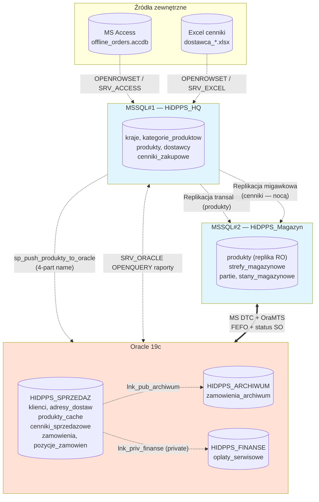
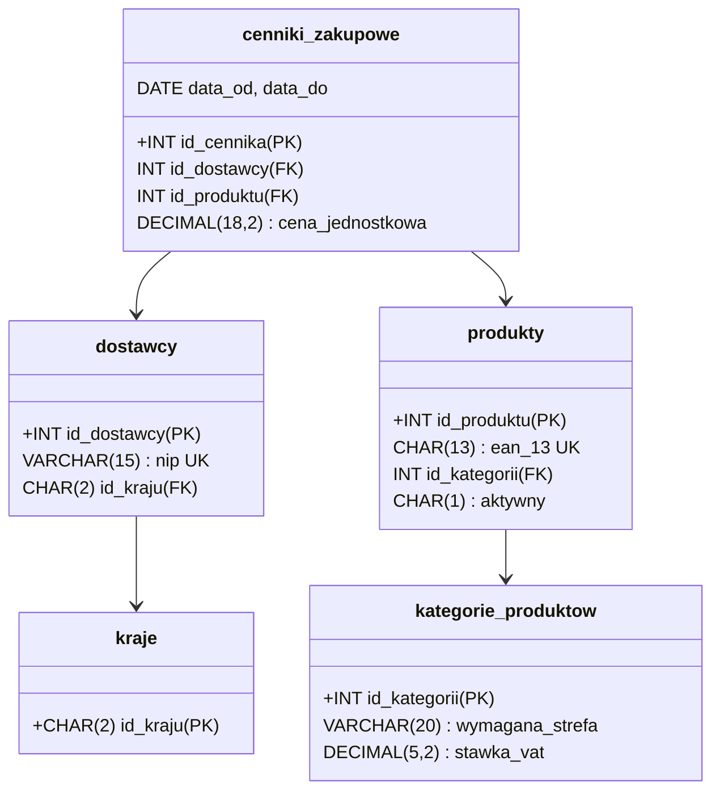
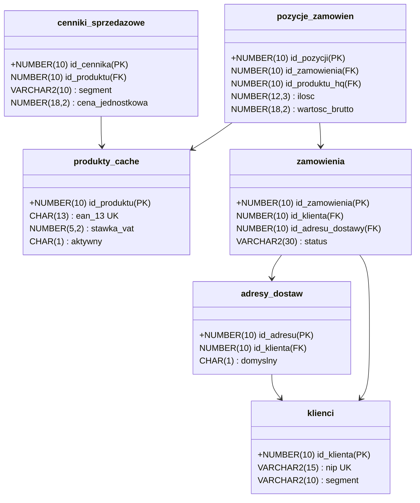
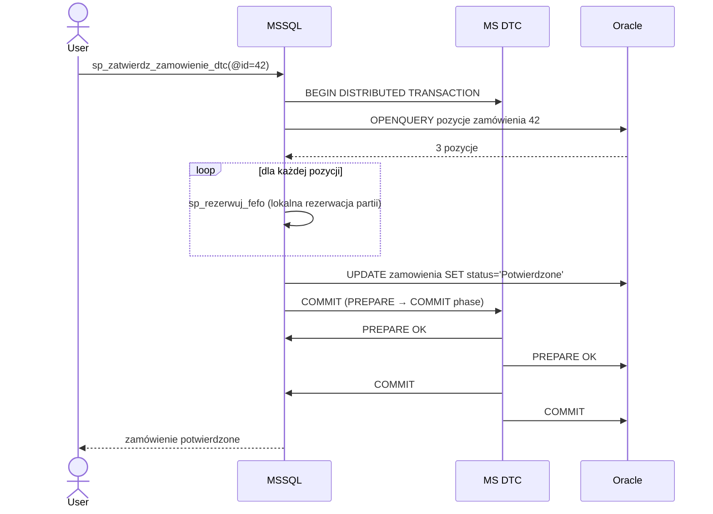

# Projekt rozproszonej bazy danych

## Hurtownia i Dystrybucja Przetworzonych Produktów Spożywczych (HiDPPS)

**Autorzy:** Mateusz Mróz (251190), Maciej Górka (251143)
**Przedmiot:** Rozproszone Bazy Danych
**Rok akademicki:** 2025/2026 (semestr letni)
**Politechnika Łódzka, WEEIA, Informatyka — semestr 6**

> Wersja: 2.0 (uproszczona). Pełna wersja korporacyjna: [HiDPPS_v1_full.md](HiDPPS_v1_full.md).

---

## Spis treści

1. [Streszczenie](#1-streszczenie)
2. [Architektura RBD](#2-architektura-rbd)
3. [MSSQL#1 — HiDPPS_HQ](#3-mssql1--hidpps_hq)
4. [MSSQL#2 — HiDPPS_Magazyn](#4-mssql2--hidpps_magazyn)
5. [Oracle — 3 schematy](#5-oracle--3-schematy)
6. [Źródła zewnętrzne — Access, Excel](#6-zrodla-zewnetrzne--access-excel)
7. [Linked Servers (p.3)](#7-linked-servers-p3)
8. [OPENROWSET + wielodostęp (p.2)](#8-openrowset--wielodostep-p2)
9. [OPENQUERY (p.4)](#9-openquery-p4)
10. [INSERT/UPDATE zdalne (p.5)](#10-insertupdate-zdalne-p5)
11. [MS DTC (p.6)](#11-ms-dtc-p6)
12. [Replikacja (p.7)](#12-replikacja-p7)
13. [Oracle — użytkownicy, role (p.8)](#13-oracle--uzytkownicy-role-p8)
14. [Oracle — DB linki (p.9, p.10)](#14-oracle--db-linki-p9-p10)
15. [Widok rozproszony + INSTEAD OF (p.11, p.12)](#15-widok-rozproszony--instead-of-p11-p12)
16. [Pakiet PL/SQL (p.13)](#16-pakiet-plsql-p13)
17. [Wnioski i ograniczenia MVP](#17-wnioski-i-ograniczenia-mvp)

---

## 1. Streszczenie

**HiDPPS** to projekt rozproszonej bazy danych dla hurtowni przetworzonych produktów spożywczych. Zakres MVP semestralny: zakupy → magazyn (FEFO) → sprzedaż.

**Architektura heterogeniczna:**
- **2× MS SQL Server 2019** — `MSSQL#1` (HQ — katalog, dostawcy, cenniki zakupowe) + `MSSQL#2` (Magazyn — partie, stany, FEFO)
- **1× Oracle 19c** z **3 schematami** (HIDPPS_SPRZEDAZ, HIDPPS_ARCHIWUM, HIDPPS_FINANSE) symulującymi rozproszenie
- **MS Access** (laptop przedstawiciela) + **Excel** (cenniki dostawców)

### 1.1 Macierz pokrycia wymagań

| # | Wymaganie z [Projekt.md](Projekt.md) | Realizacja | Sekcja |
|---|---|---|---|
| 1 | Struktura RBD + uzasadnienie | Podział funkcjonalny HQ/Magazyn/Sprzedaż | §2 |
| 2 | OPENROWSET 4 typy + wielodostęp | 4 zapytania + 1 widok łączący Excel + Oracle | §8 |
| 3 | Linked Servers 4 typy + mapowanie loginów | 5 linked serverów + `sp_addlinkedsrvlogin` | §7 |
| 4 | OPENQUERY pass-through | Raport top klientów z agregacją po stronie Oracle | §9 |
| 5 | INSERT/UPDATE zdalne | Push katalogu produktów do `produkty_cache` w Oracle | §10 |
| 6 | MS DTC | Atomowa rezerwacja FEFO + zmiana statusu zamówienia | §11 |
| 7 | Replikacja | Transakcyjna (produkty) + migawkowa (cenniki, nocą) | §12 |
| 8 | Oracle użytkownicy/role | 3 role + 3 użytkowników | §13 |
| 9 | DB linki publiczne i prywatne | `lnk_pub_archiwum` (public) + `lnk_priv_finanse` (private) | §14 |
| 10 | Symulacja zdalnych źródeł przez DB link | 2 dodatkowe schematy Oracle dostępne tylko przez linki | §14 |
| 11 | Widoki rozproszone Oracle + rzutowanie | `vw_wszystkie_zamowienia` z `CAST` | §15 |
| 12 | INSTEAD OF triggery | Router INSERT/UPDATE/DELETE na widoku rozproszonym | §15 |
| 13 | Procedury PL/SQL | Pakiet `PKG_HIDPPS_SPRZEDAZ` (4 procedury, kursor, exception) | §16 |

---

## 2. Architektura RBD

### 2.1 Diagram



### 2.2 Uzasadnienie podziału (funkcjonalny)

| Pion | Baza | Charakterystyka |
|---|---|---|
| Centrala (HQ) | MSSQL#1 | Stabilny katalog, niski write, średni read |
| Magazyn | MSSQL#2 | Operacje WMS, wysoki write/read, real-time |
| Sprzedaż | Oracle | Klienci, zamówienia, archiwa długoterminowe |

**Dlaczego ten podział:**
1. Separacja domen biznesowych (katalog ≠ operacje ≠ sprzedaż)
2. Niezależne SLA (awaria magazynu nie blokuje przyjmowania zamówień)
3. Heterogeniczność — Oracle ma lepsze partycjonowanie dla archiwum, MSSQL prostszy CRUD
4. Pokrycie wszystkich wymaganych mechanizmów RBD (replikacja MSSQL↔MSSQL, DTC cross-platform, OPENROWSET, linki Oracle)

---

## 3. MSSQL#1 — HiDPPS_HQ

### 3.1 DDL (5 tabel)

```sql
CREATE DATABASE HiDPPS_HQ;
GO
USE HiDPPS_HQ;
GO

CREATE TABLE kraje (
    id_kraju  CHAR(2)       NOT NULL PRIMARY KEY,
    nazwa     NVARCHAR(100) NOT NULL UNIQUE
);

CREATE TABLE kategorie_produktow (
    id_kategorii      INT IDENTITY(1,1) NOT FOR REPLICATION PRIMARY KEY,
    nazwa             NVARCHAR(100) NOT NULL UNIQUE,
    wymagana_strefa   VARCHAR(20)   NOT NULL CHECK (wymagana_strefa IN ('Suchy','Chłodniczy','Mroźniczy')),
    stawka_vat        DECIMAL(5,2)  NOT NULL CHECK (stawka_vat IN (0, 5, 8, 23))
);

CREATE TABLE produkty (
    id_produktu              INT IDENTITY(1,1) NOT FOR REPLICATION PRIMARY KEY,
    nazwa                    NVARCHAR(200) NOT NULL,
    ean_13                   CHAR(13)      NOT NULL UNIQUE,
    id_kategorii             INT NOT NULL CONSTRAINT fk_produkty_kategoria REFERENCES kategorie_produktow(id_kategorii),
    jednostka_miary          VARCHAR(10)   NOT NULL DEFAULT 'szt',
    aktywny                  CHAR(1)       NOT NULL DEFAULT 'T' CHECK (aktywny IN ('T','N'))
);
CREATE INDEX ix_produkty_kategoria ON produkty(id_kategorii);

CREATE TABLE dostawcy (
    id_dostawcy   INT IDENTITY(1,1) NOT FOR REPLICATION PRIMARY KEY,
    nazwa         NVARCHAR(200) NOT NULL,
    nip           VARCHAR(15)   NOT NULL UNIQUE,
    id_kraju      CHAR(2)       NOT NULL CONSTRAINT fk_dostawcy_kraj REFERENCES kraje(id_kraju),
    email         NVARCHAR(100)
);

CREATE TABLE cenniki_zakupowe (
    id_cennika          INT IDENTITY(1,1) PRIMARY KEY,
    id_dostawcy         INT NOT NULL CONSTRAINT fk_cz_dostawca REFERENCES dostawcy(id_dostawcy),
    id_produktu         INT NOT NULL CONSTRAINT fk_cz_produkt  REFERENCES produkty(id_produktu),
    cena_jednostkowa    DECIMAL(18,2) NOT NULL CHECK (cena_jednostkowa > 0),
    data_od             DATE NOT NULL,
    data_do             DATE NULL,
    CONSTRAINT ck_cz_okres CHECK (data_do IS NULL OR data_do > data_od)
);
CREATE INDEX ix_cz_produkt_okres ON cenniki_zakupowe(id_produktu, data_od, data_do);
```

### 3.2 ER diagram



---

## 4. MSSQL#2 — HiDPPS_Magazyn

### 4.1 DDL (4 tabele + replika)

```sql
CREATE DATABASE HiDPPS_Magazyn;
GO
USE HiDPPS_Magazyn;
GO

-- produkty będzie replikowana z MSSQL#1 (read-only subscriber)

CREATE TABLE strefy_magazynowe (
    id_strefy    INT IDENTITY(1,1) PRIMARY KEY,
    typ_strefy   VARCHAR(20) NOT NULL UNIQUE CHECK (typ_strefy IN ('Suchy','Chłodniczy','Mroźniczy'))
);
INSERT INTO strefy_magazynowe (typ_strefy) VALUES ('Suchy'), ('Chłodniczy'), ('Mroźniczy');

CREATE TABLE partie (
    id_partii         INT IDENTITY(1,1) PRIMARY KEY,
    id_produktu_hq    INT          NOT NULL,  -- FK logiczny do produkty (replika)
    numer_partii      VARCHAR(50)  NOT NULL UNIQUE,
    data_produkcji    DATE         NOT NULL,
    data_waznosci     DATE         NOT NULL,
    id_strefy         INT          NOT NULL CONSTRAINT fk_partie_strefa REFERENCES strefy_magazynowe(id_strefy),
    utworzony_data    DATETIME2    NOT NULL DEFAULT SYSUTCDATETIME(),
    CONSTRAINT ck_partia_okres CHECK (data_waznosci > data_produkcji),
    CONSTRAINT fk_partie_produkt FOREIGN KEY (id_produktu_hq) REFERENCES produkty(id_produktu)
);
CREATE INDEX ix_partie_produkt_waznosc ON partie(id_produktu_hq, data_waznosci);  -- FEFO

CREATE TABLE stany_magazynowe (
    id_partii               INT NOT NULL PRIMARY KEY CONSTRAINT fk_sm_partia REFERENCES partie(id_partii),
    ilosc_dostepna          DECIMAL(12,3) NOT NULL DEFAULT 0 CHECK (ilosc_dostepna >= 0),
    ilosc_zarezerwowana     DECIMAL(12,3) NOT NULL DEFAULT 0 CHECK (ilosc_zarezerwowana >= 0)
);

-- Walidacja HACCP: produkt może trafić tylko do strefy zgodnej z `kategorie_produktow.wymagana_strefa`
CREATE TRIGGER trg_partie_haccp
ON partie INSTEAD OF INSERT
AS
BEGIN
    IF EXISTS (
        SELECT 1
        FROM inserted i
        JOIN produkty p   ON p.id_produktu  = i.id_produktu_hq
        JOIN kategorie_produktow k ON k.id_kategorii = p.id_kategorii
        JOIN strefy_magazynowe s   ON s.id_strefy   = i.id_strefy
        WHERE s.typ_strefy <> k.wymagana_strefa
    )
    BEGIN
        RAISERROR('Naruszenie HACCP: strefa niezgodna z wymaganą dla kategorii produktu', 16, 1);
        RETURN;
    END
    INSERT INTO partie (id_produktu_hq, numer_partii, data_produkcji, data_waznosci, id_strefy)
    SELECT id_produktu_hq, numer_partii, data_produkcji, data_waznosci, id_strefy FROM inserted;
END;
GO
```

### 4.2 Procedura FEFO (z kursorem, używana w DTC)

```sql
CREATE PROCEDURE sp_rezerwuj_fefo
    @id_produktu_hq                     INT,
    @ilosc_zadana                       DECIMAL(12,3),
    @id_zamowienia_sprzedazowego_oracle INT,
    @wynik VARCHAR(20) OUTPUT  -- 'OK' lub 'BRAK_TOWARU'
AS
BEGIN
    SET NOCOUNT ON; SET XACT_ABORT ON;
    SET TRANSACTION ISOLATION LEVEL SERIALIZABLE;

    DECLARE @pozostalo DECIMAL(12,3) = @ilosc_zadana,
            @id_partii INT, @dostepne DECIMAL(12,3);

    BEGIN TRANSACTION;

    DECLARE c_fefo CURSOR LOCAL FAST_FORWARD FOR
        SELECT p.id_partii, sm.ilosc_dostepna
        FROM partie p
        JOIN stany_magazynowe sm ON sm.id_partii = p.id_partii
        WHERE p.id_produktu_hq = @id_produktu_hq
          AND p.data_waznosci  > GETDATE()
          AND sm.ilosc_dostepna > 0
        ORDER BY p.data_waznosci ASC, p.id_partii ASC;

    OPEN c_fefo;
    FETCH NEXT FROM c_fefo INTO @id_partii, @dostepne;
    WHILE @@FETCH_STATUS = 0 AND @pozostalo > 0
    BEGIN
        DECLARE @do_rez DECIMAL(12,3) = CASE WHEN @dostepne >= @pozostalo THEN @pozostalo ELSE @dostepne END;
        UPDATE stany_magazynowe
        SET ilosc_dostepna       = ilosc_dostepna - @do_rez,
            ilosc_zarezerwowana  = ilosc_zarezerwowana + @do_rez
        WHERE id_partii = @id_partii;
        SET @pozostalo = @pozostalo - @do_rez;
        FETCH NEXT FROM c_fefo INTO @id_partii, @dostepne;
    END
    CLOSE c_fefo; DEALLOCATE c_fefo;

    IF @pozostalo > 0
    BEGIN
        ROLLBACK TRANSACTION;
        SET @wynik = 'BRAK_TOWARU';
        RETURN;
    END
    COMMIT TRANSACTION;
    SET @wynik = 'OK';
END;
GO
```

---

## 5. Oracle — 3 schematy

### 5.1 HIDPPS_SPRZEDAZ (6 tabel)

```sql
-- schemat HIDPPS_SPRZEDAZ
CREATE TABLE klienci (
    id_klienta       NUMBER(10) GENERATED ALWAYS AS IDENTITY PRIMARY KEY,
    nazwa            VARCHAR2(200) NOT NULL,
    nip              VARCHAR2(15)  NOT NULL UNIQUE,
    segment          VARCHAR2(10)  DEFAULT 'STD' NOT NULL CHECK (segment IN ('VIP','STD','HURT')),
    id_kraju         CHAR(2)       NOT NULL,
    email            VARCHAR2(100),
    aktywny          CHAR(1)       DEFAULT 'T' NOT NULL CHECK (aktywny IN ('T','N'))
);

CREATE TABLE adresy_dostaw (
    id_adresu        NUMBER(10) GENERATED ALWAYS AS IDENTITY PRIMARY KEY,
    id_klienta       NUMBER(10) NOT NULL CONSTRAINT fk_ad_klient REFERENCES klienci(id_klienta),
    ulica            VARCHAR2(200) NOT NULL,
    miasto           VARCHAR2(100) NOT NULL,
    kod_pocztowy     VARCHAR2(10)  NOT NULL,
    domyslny         CHAR(1) DEFAULT 'N' NOT NULL CHECK (domyslny IN ('T','N'))
);

-- Lokalna kopia katalogu z MSSQL#1 (push-em w sp_push_produkty_to_oracle, §10)
CREATE TABLE produkty_cache (
    id_produktu       NUMBER(10) PRIMARY KEY,    -- = produkty.id_produktu z MSSQL#1
    nazwa             VARCHAR2(200) NOT NULL,
    ean_13            CHAR(13) UNIQUE,
    stawka_vat        NUMBER(5,2)   NOT NULL,
    jednostka_miary   VARCHAR2(10),
    aktywny           CHAR(1)       DEFAULT 'T' NOT NULL CHECK (aktywny IN ('T','N')),
    synced_at         TIMESTAMP     DEFAULT SYSTIMESTAMP NOT NULL
);

CREATE TABLE produkty_cache_staging (
    id_produktu      NUMBER(10),
    nazwa            VARCHAR2(200),
    ean_13           CHAR(13),
    stawka_vat       NUMBER(5,2),
    jednostka_miary  VARCHAR2(10),
    aktywny          CHAR(1)
);

CREATE TABLE cenniki_sprzedazowe (
    id_cennika          NUMBER(10) GENERATED ALWAYS AS IDENTITY PRIMARY KEY,
    id_produktu         NUMBER(10) NOT NULL CONSTRAINT fk_cs_produkt REFERENCES produkty_cache(id_produktu),
    segment             VARCHAR2(10) NOT NULL CHECK (segment IN ('VIP','STD','HURT')),
    cena_jednostkowa    NUMBER(18,2) NOT NULL CHECK (cena_jednostkowa > 0),
    data_od             DATE NOT NULL,
    data_do             DATE NULL
);

CREATE TABLE zamowienia (
    id_zamowienia               NUMBER(10) GENERATED ALWAYS AS IDENTITY PRIMARY KEY,
    numer_dokumentu             VARCHAR2(30) GENERATED ALWAYS AS ('ZS/' || TO_CHAR(id_zamowienia, 'FM0000000000')) VIRTUAL,
    id_klienta                  NUMBER(10) NOT NULL CONSTRAINT fk_z_klient REFERENCES klienci(id_klienta),
    id_adresu_dostawy           NUMBER(10) NOT NULL CONSTRAINT fk_z_adres REFERENCES adresy_dostaw(id_adresu),
    data_zlozenia               DATE DEFAULT TRUNC(SYSDATE) NOT NULL,
    status                      VARCHAR2(30) DEFAULT 'Złożone' NOT NULL
                                CHECK (status IN ('Złożone','Potwierdzone','Wydane','Zafakturowane','Anulowane')),
    wartosc_calkowita_brutto    NUMBER(18,2) DEFAULT 0 NOT NULL
);

CREATE TABLE pozycje_zamowien (
    id_pozycji              NUMBER(10) GENERATED ALWAYS AS IDENTITY PRIMARY KEY,
    id_zamowienia           NUMBER(10) NOT NULL CONSTRAINT fk_pz_zam REFERENCES zamowienia(id_zamowienia),
    id_produktu_hq          NUMBER(10) NOT NULL CONSTRAINT fk_pz_prod REFERENCES produkty_cache(id_produktu),
    ilosc                   NUMBER(12,3) NOT NULL CHECK (ilosc > 0),
    cena_jednostkowa_netto  NUMBER(18,2) NOT NULL CHECK (cena_jednostkowa_netto > 0),
    stawka_vat              NUMBER(5,2)  NOT NULL,
    wartosc_netto           NUMBER(18,2) NOT NULL,
    wartosc_vat             NUMBER(18,2) NOT NULL,
    wartosc_brutto          NUMBER(18,2) NOT NULL,
    CONSTRAINT ck_pz_wartosci CHECK (wartosc_brutto = wartosc_netto + wartosc_vat)
);
CREATE INDEX ix_pz_zamowienie ON pozycje_zamowien(id_zamowienia);
```

### 5.2 HIDPPS_ARCHIWUM (1 tabela)

```sql
-- schemat HIDPPS_ARCHIWUM
CREATE TABLE zamowienia_archiwum (
    id_zamowienia       NUMBER(10) PRIMARY KEY,
    numer_dokumentu     VARCHAR2(30) NOT NULL,
    id_klienta          NUMBER(10)   NOT NULL,
    nazwa_klienta       VARCHAR2(200) NOT NULL,  -- denormalizowane (archiwum)
    data_zlozenia       DATE NOT NULL,
    wartosc_brutto      NUMBER(18,2) NOT NULL,
    data_archiwizacji   TIMESTAMP DEFAULT SYSTIMESTAMP NOT NULL
);
```

### 5.3 HIDPPS_FINANSE (1 tabela)

```sql
-- schemat HIDPPS_FINANSE
CREATE TABLE oplaty_serwisowe (
    id_oplaty         NUMBER(10) GENERATED ALWAYS AS IDENTITY PRIMARY KEY,
    typ_kosztu        VARCHAR2(50) NOT NULL,   -- 'Leasing', 'Paliwo', 'Serwis', ...
    opis              VARCHAR2(200),
    kwota             NUMBER(18,2) NOT NULL,
    data_kosztu       DATE         NOT NULL
);
```

### 5.4 ER (HIDPPS_SPRZEDAZ)



---

## 6. Źródła zewnętrzne — Access, Excel

### 6.1 MS Access — laptop przedstawiciela

Plik: `\\fileserver\hidpps\offline_orders.accdb`, tabela `oferty_offline` (kolumny: `id_oferty`, `data_oferty`, `nip_klienta`, `ean_produktu`, `ilosc`, `cena_proponowana`).

**Use case:** przedstawiciel w terenie zapisuje wstępne oferty offline. Po powrocie procedura na MSSQL#1 importuje je przez `OPENROWSET` (§8.4) lub linked server `SRV_ACCESS` (§7).

### 6.2 Excel — cenniki dostawców

Plik: `C:\cenniki\dostawca_aktualny.xlsx`, arkusz `Sheet1` (kolumny: `EAN_13`, `Cena_Netto_PLN`, `Data_obowiazywania_od`).

**Use case:** dostawca przysyła nowy cennik mailem. Procedura na MSSQL#1 ładuje plik przez `OPENROWSET(Microsoft.ACE.OLEDB.16.0)` (§8.5).

---

## 7. Linked Servers (p.3)

```sql
-- 1. SQLServer ↔ SQLServer: HQ → Magazyn
EXEC sp_addlinkedserver
    @server     = 'SRV_MAGAZYN',
    @srvproduct = '',
    @provider   = 'MSOLEDBSQL',
    @datasrc    = 'localhost\MSSQL2',
    @catalog    = 'HiDPPS_Magazyn';

EXEC sp_addlinkedsrvlogin
    @rmtsrvname  = 'SRV_MAGAZYN',
    @useself     = 'FALSE',
    @locallogin  = NULL,
    @rmtuser     = 'hq_to_mag_user',
    @rmtpassword = 'StrongPwd!23';

-- 2. SQLServer ↔ Oracle
EXEC sp_addlinkedserver
    @server     = 'SRV_ORACLE',
    @srvproduct = 'Oracle',
    @provider   = 'OraOLEDB.Oracle',
    @datasrc    = 'ORCL';   -- TNS alias

EXEC sp_addlinkedsrvlogin 'SRV_ORACLE', 'FALSE', NULL, 'hidpps_sprzedaz', 'OraclePwd!23';

-- Włącz RPC + promocję transakcji (potrzebne do INSERT zdalnych i DTC)
EXEC sp_serveroption 'SRV_ORACLE', 'rpc out', 'true';
EXEC sp_serveroption 'SRV_ORACLE', 'rpc',     'true';
EXEC sp_serveroption 'SRV_ORACLE', 'remote proc transaction promotion', 'true';

-- 3. SQLServer ↔ Access
EXEC sp_addlinkedserver
    @server     = 'SRV_ACCESS',
    @srvproduct = 'Access',
    @provider   = 'Microsoft.ACE.OLEDB.16.0',
    @datasrc    = '\\fileserver\hidpps\offline_orders.accdb';
EXEC sp_addlinkedsrvlogin 'SRV_ACCESS', 'FALSE', NULL, 'Admin', '';

-- 4. SQLServer ↔ Excel
EXEC sp_addlinkedserver
    @server     = 'SRV_EXCEL',
    @srvproduct = 'Excel',
    @provider   = 'Microsoft.ACE.OLEDB.16.0',
    @datasrc    = 'C:\cenniki\dostawca_aktualny.xlsx',
    @provstr    = 'Excel 12.0;HDR=YES';
EXEC sp_addlinkedsrvlogin 'SRV_EXCEL', 'FALSE', NULL, 'Admin', '';

-- 5. (Z MSSQL#2) link zwrotny do HQ
EXEC sp_addlinkedserver 'SRV_HQ', '', 'MSOLEDBSQL', 'localhost\MSSQL1', NULL, NULL, 'HiDPPS_HQ';
EXEC sp_addlinkedsrvlogin 'SRV_HQ', 'FALSE', NULL, 'mag_to_hq_user', 'StrongPwd!23';
```

### Weryfikacja

```sql
SELECT name, provider, data_source FROM sys.servers WHERE is_linked = 1;
EXEC sp_testlinkedserver 'SRV_ORACLE';
```

---

## 8. OPENROWSET + wielodostęp (p.2)

```sql
EXEC sp_configure 'show advanced options', 1; RECONFIGURE;
EXEC sp_configure 'Ad Hoc Distributed Queries', 1; RECONFIGURE;
```

### 8.1 SQLServer → SQLServer

```sql
SELECT *
FROM OPENROWSET('MSOLEDBSQL', 'Server=localhost\MSSQL2;Database=HiDPPS_Magazyn;Trusted_Connection=yes',
    'SELECT p.id_produktu_hq, SUM(sm.ilosc_dostepna) AS dostepne
     FROM partie p JOIN stany_magazynowe sm ON sm.id_partii = p.id_partii
     GROUP BY p.id_produktu_hq');
```

### 8.2 SQLServer → Oracle

```sql
SELECT *
FROM OPENROWSET('OraOLEDB.Oracle', 'ORCL';'hidpps_sprzedaz';'OraclePwd!23',
    'SELECT id_zamowienia, status, wartosc_calkowita_brutto
     FROM hidpps_sprzedaz.zamowienia WHERE status = ''Złożone''');
```

### 8.3 SQLServer → Access

```sql
SELECT *
FROM OPENROWSET('Microsoft.ACE.OLEDB.16.0',
    'Microsoft.ACE.OLEDB.16.0;Database=\\fileserver\hidpps\offline_orders.accdb',
    'SELECT id_oferty, nip_klienta, ean_produktu, ilosc, cena_proponowana FROM oferty_offline');
```

### 8.4 SQLServer → Excel

```sql
SELECT *
FROM OPENROWSET('Microsoft.ACE.OLEDB.16.0',
    'Excel 12.0;HDR=YES;Database=C:\cenniki\dostawca_aktualny.xlsx',
    'SELECT EAN_13, Cena_Netto_PLN, Data_obowiazywania_od FROM [Sheet1$]');
```

### 8.5 Wielodostęp — widok łączący 2 heterogeniczne źródła

```sql
CREATE VIEW vw_porownanie_cen_zakup_vs_sprzedaz AS
SELECT
    p.id_produktu,
    p.nazwa,
    p.ean_13,
    excel.cena_zakup_excel,                                                  -- Excel
    CAST(oracle_sales.avg_cena_sprzedazy AS DECIMAL(18,2)) AS avg_cena_sprzedazy,  -- Oracle (OPENQUERY)
    CAST(oracle_sales.avg_cena_sprzedazy - excel.cena_zakup_excel AS DECIMAL(18,2)) AS marza_potencjalna
FROM produkty p
LEFT JOIN OPENROWSET('Microsoft.ACE.OLEDB.16.0',
    'Excel 12.0;HDR=YES;Database=C:\cenniki\dostawca_aktualny.xlsx',
    'SELECT EAN_13, Cena_Netto_PLN AS cena_zakup_excel FROM [Sheet1$]') AS excel
    ON excel.EAN_13 = p.ean_13
LEFT JOIN OPENQUERY(SRV_ORACLE,
    'SELECT id_produktu_hq, AVG(cena_jednostkowa_netto) AS avg_cena_sprzedazy
     FROM hidpps_sprzedaz.pozycje_zamowien
     GROUP BY id_produktu_hq') AS oracle_sales
    ON oracle_sales.id_produktu_hq = p.id_produktu
WHERE p.aktywny = 'T';
```

Widok łączy 3 elementy: **MSSQL local** (`produkty`) + **Excel** (`OPENROWSET`) + **Oracle agregat** (`OPENQUERY`), z **rzutowaniem typów** (`CAST`).

---

## 9. OPENQUERY (p.4)

Agregacja po stronie Oracle — sieć transportuje tylko `top_n` wierszy:

```sql
CREATE PROCEDURE sp_raport_top_klienci_oracle
    @data_od DATE,
    @top_n   INT
AS
BEGIN
    DECLARE @sql NVARCHAR(MAX) = N'
    SELECT * FROM OPENQUERY(SRV_ORACLE,
        ''SELECT k.nazwa, SUM(z.wartosc_calkowita_brutto) AS suma_brutto, COUNT(*) AS liczba_zamowien
          FROM hidpps_sprzedaz.klienci k
          JOIN hidpps_sprzedaz.zamowienia z ON z.id_klienta = k.id_klienta
          WHERE z.data_zlozenia >= TO_DATE(''''' + CONVERT(VARCHAR(10), @data_od, 120) + ''''',''''YYYY-MM-DD'''')
            AND z.status <> ''''Anulowane''''
          GROUP BY k.nazwa
          ORDER BY suma_brutto DESC
          FETCH FIRST ' + CAST(@top_n AS NVARCHAR) + ' ROWS ONLY'')';
    EXEC sp_executesql @sql;
END;
GO

EXEC sp_raport_top_klienci_oracle '2026-01-01', 10;
```

---

## 10. INSERT/UPDATE zdalne (p.5)

**Push katalogu produktów z HQ do Oracle** (uruchamiany cyklicznie SQL Server Agent jobem):

```sql
-- MSSQL#1
CREATE PROCEDURE sp_push_produkty_to_oracle AS
BEGIN
    SET NOCOUNT ON;
    -- 1. Wyczyść tabelę stagingową w Oracle przez 4-part name
    DELETE FROM SRV_ORACLE..HIDPPS_SPRZEDAZ.PRODUKTY_CACHE_STAGING;

    -- 2. INSERT zdalny
    INSERT INTO SRV_ORACLE..HIDPPS_SPRZEDAZ.PRODUKTY_CACHE_STAGING
        (ID_PRODUKTU, NAZWA, EAN_13, STAWKA_VAT, JEDNOSTKA_MIARY, AKTYWNY)
    SELECT p.id_produktu, p.nazwa, p.ean_13, k.stawka_vat, p.jednostka_miary, p.aktywny
    FROM produkty p
    JOIN kategorie_produktow k ON k.id_kategorii = p.id_kategorii;

    -- 3. Wywołaj MERGE w Oracle
    EXEC ('BEGIN HIDPPS_SPRZEDAZ.PKG_HIDPPS_SPRZEDAZ.sp_merge_produkty_cache; END;') AT SRV_ORACLE;
END;
GO
```

Po stronie Oracle MERGE jest częścią pakietu (§16).

---

## 11. MS DTC (p.6)

### 11.1 Konfiguracja MSDTC + OraMTS

**MS SQL Server:**
1. `Component Services` → `My Computer` → `Distributed Transaction Coordinator` → `Local DTC` → Properties → Security:
   - ✅ Network DTC Access
   - ✅ Allow Inbound + Outbound
   - ✅ Enable XA Transactions
2. Firewall: TCP 135 + dynamic range
3. Usługa `Distributed Transaction Coordinator` uruchomiona

**Oracle (jako SYSDBA, dla DTC cross-platform):**

```sql
@?/rdbms/admin/xaview.sql
GRANT SELECT ON V$XATRANS$               TO PUBLIC;
GRANT SELECT ON DBA_PENDING_TRANSACTIONS TO PUBLIC;
GRANT SELECT ON V$GLOBAL_TRANSACTION     TO PUBLIC;
```

**Linked server:**
```sql
EXEC sp_serveroption 'SRV_ORACLE', 'remote proc transaction promotion', 'true';
```

> Wymaga **Oracle Services for MTS (OraMTS)** zainstalowanego razem z Oracle Client po stronie serwera SQL.

### 11.2 Scenariusz — Zatwierdzenie zamówienia (FEFO + status SO)

Procedura na MSSQL#2 inicjuje transakcję rozproszoną obejmującą:
- **Lokalnie (MSSQL#2):** rezerwacja partii FEFO (`sp_rezerwuj_fefo`)
- **Zdalnie (Oracle):** zmiana statusu zamówienia na `Potwierdzone`

```sql
CREATE PROCEDURE sp_zatwierdz_zamowienie_dtc
    @id_zamowienia_oracle INT
AS
BEGIN
    SET NOCOUNT ON; SET XACT_ABORT ON;
    BEGIN DISTRIBUTED TRANSACTION;
    BEGIN TRY
        -- 1. Pobierz pozycje z Oracle
        DECLARE @sql NVARCHAR(MAX) = N'
            SELECT id_produktu_hq, ilosc FROM OPENQUERY(SRV_ORACLE,
                ''SELECT id_produktu_hq, ilosc FROM hidpps_sprzedaz.pozycje_zamowien
                  WHERE id_zamowienia = ' + CAST(@id_zamowienia_oracle AS NVARCHAR) + ''')';
        DECLARE @pozycje TABLE (id_produktu INT, ilosc DECIMAL(12,3));
        INSERT INTO @pozycje EXEC sp_executesql @sql;

        -- 2. Rezerwuj FEFO każdą pozycję
        DECLARE @id_p INT, @il DECIMAL(12,3), @wynik VARCHAR(20);
        DECLARE c CURSOR FOR SELECT id_produktu, ilosc FROM @pozycje;
        OPEN c; FETCH NEXT FROM c INTO @id_p, @il;
        WHILE @@FETCH_STATUS = 0
        BEGIN
            EXEC sp_rezerwuj_fefo @id_p, @il, @id_zamowienia_oracle, @wynik OUTPUT;
            IF @wynik = 'BRAK_TOWARU' THROW 60001, 'Brak towaru w magazynie', 1;
            FETCH NEXT FROM c INTO @id_p, @il;
        END
        CLOSE c; DEALLOCATE c;

        -- 3. Zmień status w Oracle (atomowo z rezerwacją)
        UPDATE SRV_ORACLE..HIDPPS_SPRZEDAZ.ZAMOWIENIA
        SET STATUS = 'Potwierdzone'
        WHERE ID_ZAMOWIENIA = @id_zamowienia_oracle;

        COMMIT TRANSACTION;
    END TRY
    BEGIN CATCH
        IF @@TRANCOUNT > 0 ROLLBACK TRANSACTION;
        THROW;
    END CATCH
END;
GO
```

### 11.3 Sequence diagram



---

## 12. Replikacja (p.7)

### 12.1 Replikacja transakcyjna — produkty HQ → Magazyn

**Publisher:** MSSQL#1, **Distributor:** MSSQL#1 (lokalny), **Subscriber:** MSSQL#2 (push, read-only).
**Artykuły:** `produkty`, `kategorie_produktow`, `kraje`, `dostawcy`.

```sql
USE HiDPPS_HQ;
EXEC sp_addpublication
    @publication = 'pub_HQ_katalog',
    @sync_method = 'concurrent',
    @repl_freq   = 'continuous',
    @status      = 'active';

EXEC sp_addarticle @publication='pub_HQ_katalog', @article='produkty', @source_object='produkty', @type='logbased';
EXEC sp_addarticle @publication='pub_HQ_katalog', @article='kategorie_produktow', @source_object='kategorie_produktow', @type='logbased';
EXEC sp_addarticle @publication='pub_HQ_katalog', @article='kraje',    @source_object='kraje',    @type='logbased';
EXEC sp_addarticle @publication='pub_HQ_katalog', @article='dostawcy', @source_object='dostawcy', @type='logbased';

EXEC sp_addsubscription
    @publication      = 'pub_HQ_katalog',
    @subscriber       = 'localhost\MSSQL2',
    @destination_db   = 'HiDPPS_Magazyn',
    @subscription_type = 'push';
```

Wszystkie IDENTITY w publikowanych tabelach mają `NOT FOR REPLICATION` (patrz DDL §3).

### 12.2 Replikacja migawkowa — cenniki HQ → Magazyn

Snapshot raz na dobę o 02:00, SLA opóźnienia ≤24h:

```sql
EXEC sp_addpublication
    @publication = 'pub_HQ_cenniki',
    @sync_method = 'native',
    @repl_freq   = 'snapshot',
    @status      = 'active';

EXEC sp_addarticle @publication='pub_HQ_cenniki', @article='cenniki_zakupowe', @source_object='cenniki_zakupowe', @type='logbased';
```

---

## 13. Oracle — użytkownicy, role (p.8)

```sql
-- jako SYSDBA
CREATE ROLE r_sprzedaz_read;
CREATE ROLE r_sprzedaz_write;
CREATE ROLE r_finanse_read;

GRANT SELECT ON hidpps_sprzedaz.klienci          TO r_sprzedaz_read;
GRANT SELECT ON hidpps_sprzedaz.zamowienia       TO r_sprzedaz_read;
GRANT SELECT ON hidpps_sprzedaz.pozycje_zamowien TO r_sprzedaz_read;
GRANT SELECT ON hidpps_sprzedaz.produkty_cache   TO r_sprzedaz_read;

GRANT r_sprzedaz_read TO r_sprzedaz_write;
GRANT INSERT, UPDATE ON hidpps_sprzedaz.zamowienia        TO r_sprzedaz_write;
GRANT INSERT, UPDATE ON hidpps_sprzedaz.pozycje_zamowien  TO r_sprzedaz_write;
GRANT EXECUTE ON hidpps_sprzedaz.pkg_hidpps_sprzedaz       TO r_sprzedaz_write;

GRANT SELECT ON hidpps_finanse.oplaty_serwisowe TO r_finanse_read;

-- Użytkownicy
CREATE USER sprzedawca_jan IDENTIFIED BY "Pwd!2026"; GRANT r_sprzedaz_write, CREATE SESSION TO sprzedawca_jan;
CREATE USER raporty       IDENTIFIED BY "Rap!2026"; GRANT r_sprzedaz_read,  CREATE SESSION TO raporty;
CREATE USER finanse       IDENTIFIED BY "Fin!2026"; GRANT r_finanse_read, r_sprzedaz_read, CREATE SESSION TO finanse;
```

---

## 14. Oracle — DB linki (p.9, p.10)

```sql
-- PUBLIC LINK do schematu archiwum (wszyscy widzą i mogą używać)
CREATE PUBLIC DATABASE LINK lnk_pub_archiwum
    CONNECT TO hidpps_archiwum IDENTIFIED BY "Arch!2026"
    USING 'ORCL';

-- PRIVATE LINK do schematu finansowego (tylko user FINANSE)
-- Wykonane jako FINANSE:
CONNECT finanse/"Fin!2026"@ORCL;
CREATE DATABASE LINK lnk_priv_finanse
    CONNECT TO hidpps_finanse IDENTIFIED BY "FinData!2026"
    USING 'ORCL';
```

Inni użytkownicy widzą definicję widoku `vw_finanse` (§15), ale przy `SELECT` dostają `ORA-02019: connection description for remote database not found` — to demo prywatnego linka.

---

## 15. Widok rozproszony + INSTEAD OF (p.11, p.12)

### 15.1 `vw_wszystkie_zamowienia` — UNION sprzedaż + archiwum

```sql
CREATE OR REPLACE VIEW hidpps_sprzedaz.vw_wszystkie_zamowienia AS
SELECT
    CAST(id_zamowienia AS NUMBER(10))              AS id_zamowienia,
    CAST(numer_dokumentu AS VARCHAR2(30))          AS numer_dokumentu,
    CAST(id_klienta AS NUMBER(10))                 AS id_klienta,
    CAST(data_zlozenia AS DATE)                    AS data_zlozenia,
    CAST(wartosc_calkowita_brutto AS NUMBER(18,2)) AS wartosc_brutto,
    'AKTYWNE' AS zrodlo
FROM hidpps_sprzedaz.zamowienia
UNION ALL
SELECT
    CAST(id_zamowienia AS NUMBER(10)),
    CAST(numer_dokumentu AS VARCHAR2(30)),
    CAST(id_klienta AS NUMBER(10)),
    CAST(data_zlozenia AS DATE),
    CAST(wartosc_brutto AS NUMBER(18,2)),
    'ARCHIWUM'
FROM zamowienia_archiwum@lnk_pub_archiwum;
```

Widok jest niemodyfikowalny (UNION ALL).

### 15.2 INSTEAD OF triggery (router)

```sql
CREATE OR REPLACE TRIGGER hidpps_sprzedaz.trg_vw_zam_ins
INSTEAD OF INSERT ON hidpps_sprzedaz.vw_wszystkie_zamowienia
FOR EACH ROW
BEGIN
    IF :NEW.data_zlozenia >= ADD_MONTHS(SYSDATE, -24) THEN
        INSERT INTO hidpps_sprzedaz.zamowienia
            (id_klienta, id_adresu_dostawy, data_zlozenia, wartosc_calkowita_brutto)
        SELECT :NEW.id_klienta, ad.id_adresu, :NEW.data_zlozenia, :NEW.wartosc_brutto
        FROM hidpps_sprzedaz.adresy_dostaw ad
        WHERE ad.id_klienta = :NEW.id_klienta AND ad.domyslny = 'T'
        FETCH FIRST 1 ROWS ONLY;
    ELSE
        INSERT INTO hidpps_archiwum.zamowienia_archiwum@lnk_pub_archiwum
            (id_zamowienia, numer_dokumentu, id_klienta, nazwa_klienta, data_zlozenia, wartosc_brutto)
        SELECT :NEW.id_zamowienia, :NEW.numer_dokumentu, :NEW.id_klienta, k.nazwa,
               :NEW.data_zlozenia, :NEW.wartosc_brutto
        FROM hidpps_sprzedaz.klienci k WHERE k.id_klienta = :NEW.id_klienta;
    END IF;
END;
/

CREATE OR REPLACE TRIGGER hidpps_sprzedaz.trg_vw_zam_upd
INSTEAD OF UPDATE ON hidpps_sprzedaz.vw_wszystkie_zamowienia
FOR EACH ROW
BEGIN
    IF :OLD.zrodlo = 'AKTYWNE' THEN
        UPDATE hidpps_sprzedaz.zamowienia
        SET wartosc_calkowita_brutto = :NEW.wartosc_brutto
        WHERE id_zamowienia = :OLD.id_zamowienia;
    ELSE
        RAISE_APPLICATION_ERROR(-20200, 'Archiwum jest read-only');
    END IF;
END;
/

CREATE OR REPLACE TRIGGER hidpps_sprzedaz.trg_vw_zam_del
INSTEAD OF DELETE ON hidpps_sprzedaz.vw_wszystkie_zamowienia
FOR EACH ROW
BEGIN
    RAISE_APPLICATION_ERROR(-20201, 'Usuwanie zamówień niedozwolone — użyj statusu Anulowane');
END;
/
```

### 15.3 Widok pokazujący link prywatny

```sql
CREATE OR REPLACE VIEW hidpps_sprzedaz.vw_finanse AS
SELECT typ_kosztu, CAST(SUM(kwota) AS NUMBER(18,2)) AS suma
FROM oplaty_serwisowe@lnk_priv_finanse
GROUP BY typ_kosztu;
```

---

## 16. Pakiet PL/SQL (p.13)

### 16.1 Specyfikacja

```sql
CREATE OR REPLACE PACKAGE hidpps_sprzedaz.pkg_hidpps_sprzedaz AS
    e_produkt_nieaktywny EXCEPTION; PRAGMA EXCEPTION_INIT(e_produkt_nieaktywny, -20104);
    e_zly_status         EXCEPTION; PRAGMA EXCEPTION_INIT(e_zly_status, -20103);

    PROCEDURE sp_zarejestruj_zamowienie(p_id_klienta IN NUMBER, p_id_adresu IN NUMBER, p_id_zamowienia OUT NUMBER);
    PROCEDURE sp_dodaj_pozycje(p_id_zamowienia IN NUMBER, p_id_produktu IN NUMBER, p_ilosc IN NUMBER);
    PROCEDURE sp_anuluj_zamowienie(p_id_zamowienia IN NUMBER);
    PROCEDURE sp_raport_top_klienci(p_data_od IN DATE, p_n IN NUMBER);
    PROCEDURE sp_merge_produkty_cache;

    FUNCTION fn_pobierz_aktualna_cena(p_id_produktu IN NUMBER, p_segment IN VARCHAR2, p_data IN DATE) RETURN NUMBER;
END;
/
```

### 16.2 Body

```sql
CREATE OR REPLACE PACKAGE BODY hidpps_sprzedaz.pkg_hidpps_sprzedaz AS

    PROCEDURE sp_zarejestruj_zamowienie(p_id_klienta IN NUMBER, p_id_adresu IN NUMBER, p_id_zamowienia OUT NUMBER) AS
        v_aktywny CHAR(1);
    BEGIN
        SELECT aktywny INTO v_aktywny FROM klienci WHERE id_klienta = p_id_klienta;
        IF v_aktywny = 'N' THEN RAISE_APPLICATION_ERROR(-20102, 'Klient nieaktywny'); END IF;

        INSERT INTO zamowienia (id_klienta, id_adresu_dostawy)
        VALUES (p_id_klienta, p_id_adresu)
        RETURNING id_zamowienia INTO p_id_zamowienia;
    END;

    PROCEDURE sp_dodaj_pozycje(p_id_zamowienia IN NUMBER, p_id_produktu IN NUMBER, p_ilosc IN NUMBER) AS
        v_segment    VARCHAR2(10);
        v_cena       NUMBER(18,2);
        v_stawka_vat NUMBER(5,2);
        v_aktywny    CHAR(1);
        v_netto      NUMBER(18,2);
        v_vat        NUMBER(18,2);
        v_brutto     NUMBER(18,2);
    BEGIN
        -- Walidacja produktu
        SELECT aktywny, stawka_vat INTO v_aktywny, v_stawka_vat
        FROM produkty_cache WHERE id_produktu = p_id_produktu;
        IF v_aktywny = 'N' THEN RAISE e_produkt_nieaktywny; END IF;

        -- Pobierz segment klienta
        SELECT k.segment INTO v_segment
        FROM zamowienia z JOIN klienci k ON k.id_klienta = z.id_klienta
        WHERE z.id_zamowienia = p_id_zamowienia;

        -- Freeze ceny (cena w momencie tworzenia pozycji, nie aktualna)
        v_cena := fn_pobierz_aktualna_cena(p_id_produktu, v_segment, SYSDATE);

        -- Spójna formuła: brutto = netto + vat (gwarantuje spełnienie CHECK)
        v_netto  := ROUND(p_ilosc * v_cena, 2);
        v_vat    := ROUND(v_netto * v_stawka_vat / 100, 2);
        v_brutto := v_netto + v_vat;

        INSERT INTO pozycje_zamowien (id_zamowienia, id_produktu_hq, ilosc, cena_jednostkowa_netto,
                                       stawka_vat, wartosc_netto, wartosc_vat, wartosc_brutto)
        VALUES (p_id_zamowienia, p_id_produktu, p_ilosc, v_cena,
                v_stawka_vat, v_netto, v_vat, v_brutto);

        -- Aktualizuj sumę zamówienia
        UPDATE zamowienia SET wartosc_calkowita_brutto = wartosc_calkowita_brutto + v_brutto
        WHERE id_zamowienia = p_id_zamowienia;
    END;

    PROCEDURE sp_anuluj_zamowienie(p_id_zamowienia IN NUMBER) AS
        v_status VARCHAR2(30);
    BEGIN
        SELECT status INTO v_status FROM zamowienia WHERE id_zamowienia = p_id_zamowienia FOR UPDATE;
        IF v_status NOT IN ('Złożone', 'Potwierdzone') THEN
            RAISE_APPLICATION_ERROR(-20103,
                'Nie można anulować zamówienia w statusie ' || v_status);
        END IF;
        UPDATE zamowienia SET status = 'Anulowane' WHERE id_zamowienia = p_id_zamowienia;
        COMMIT;
    END;

    -- Procedura z kursorem
    PROCEDURE sp_raport_top_klienci(p_data_od IN DATE, p_n IN NUMBER) AS
        CURSOR c_top IS
            SELECT k.nazwa, SUM(z.wartosc_calkowita_brutto) AS suma
            FROM klienci k JOIN zamowienia z ON z.id_klienta = k.id_klienta
            WHERE z.data_zlozenia >= p_data_od AND z.status <> 'Anulowane'
            GROUP BY k.nazwa
            ORDER BY suma DESC
            FETCH FIRST p_n ROWS ONLY;
    BEGIN
        FOR r IN c_top LOOP
            DBMS_OUTPUT.PUT_LINE(RPAD(r.nazwa, 50) || ' ' || TO_CHAR(r.suma, 'FM999G999G990D00'));
        END LOOP;
    END;

    PROCEDURE sp_merge_produkty_cache AS
    BEGIN
        MERGE INTO produkty_cache c
        USING produkty_cache_staging s ON (c.id_produktu = s.id_produktu)
        WHEN MATCHED THEN UPDATE SET
            c.nazwa = s.nazwa, c.aktywny = s.aktywny, c.stawka_vat = s.stawka_vat,
            c.jednostka_miary = s.jednostka_miary, c.synced_at = SYSTIMESTAMP
        WHEN NOT MATCHED THEN INSERT (id_produktu, nazwa, ean_13, stawka_vat, jednostka_miary, aktywny)
                              VALUES (s.id_produktu, s.nazwa, s.ean_13, s.stawka_vat, s.jednostka_miary, s.aktywny);
        COMMIT;
    END;

    FUNCTION fn_pobierz_aktualna_cena(p_id_produktu IN NUMBER, p_segment IN VARCHAR2, p_data IN DATE)
    RETURN NUMBER IS
        v_cena NUMBER(18,2);
    BEGIN
        SELECT cena_jednostkowa INTO v_cena
        FROM cenniki_sprzedazowe
        WHERE id_produktu = p_id_produktu
          AND segment     = p_segment
          AND p_data BETWEEN data_od AND NVL(data_do, DATE '9999-12-31');
        RETURN v_cena;
    EXCEPTION WHEN NO_DATA_FOUND THEN
        RAISE_APPLICATION_ERROR(-20105, 'Brak cennika dla produktu ' || p_id_produktu);
    END;

END pkg_hidpps_sprzedaz;
/
```

---

## 17. Wnioski i ograniczenia MVP

### 17.1 Co projekt pokrywa

✅ Wszystkie 13 wymagań z [Projekt.md](Projekt.md) (macierz §1.1)
✅ Sensowna domena biznesowa (hurtownia spożywcza, FEFO, HACCP)
✅ Wszystkie 4 typy `OPENROWSET` + wielodostęp (Excel + Oracle w jednym widoku)
✅ 5 linked serverów + jawne mapowanie loginów
✅ Scenariusz MS DTC cross-platform (Oracle + MSSQL#2) + konfiguracja MSDTC + OraMTS
✅ 2 typy replikacji (transakcyjna + migawkowa) z uzasadnieniem
✅ Pakiet PL/SQL z named exception, kursorem i funkcją pomocniczą
✅ 3 schematy Oracle z DB linkami (public + private)

### 17.2 Ograniczenia MVP (jawnie poza zakresem)

| Obszar | Decyzja | Powód |
|---|---|---|
| Audit trail (temporal/history) | Brak | Niewymagane przez specyfikację, dodaje 4+ tabele |
| Faktury korygujące i zwroty | Brak | Realistyczny model VAT istnieje w pozycjach zamówień; korekty komplikują bez wartości dydaktycznej |
| Saga Pattern jako Plan B do DTC | Brak | Zakładamy że OraMTS działa; demo skupia się na natywnym 2PC |
| Pojazdy / trasy / planowanie logistyki | Brak | Domena logistyki poza zakresem RBD |
| HACCP recall procedura | Brak | Zostaje walidacja strefy (`trg_partie_haccp`); recall to oddzielny obszar |
| Wielomagazynowość, lokalizacje paletowe | Brak | 1 magazyn, partia → strefa bezpośrednio |
| Stawki VAT jako słownik z historią | Brak | Kolumna `stawka_vat` w `kategorie_produktow` |
| Numerowanie księgowo bezpieczne (bez luk) | Brak | `IDENTITY` MSSQL / `IDENTITY` Oracle dopuszcza luki |
| Pełen model Faktur | Brak | Status `Zafakturowane` + widok agregujący `zamowienia + pozycje` wystarczy |

### 17.3 Sposób uruchomienia (demo)

1. Utwórz 2 instancje MSSQL i 1 Oracle
2. Uruchom skrypty DDL z §3, §4, §5
3. Skonfiguruj 5 linked serverów (§7)
4. Skonfiguruj MSDTC + OraMTS (§11.1)
5. Włącz replikację (§12)
6. Uruchom `sp_push_produkty_to_oracle` (startowa synchronizacja `produkty_cache`)
7. Załaduj seed data (klienci, produkty, partie z różnymi datami ważności)
8. **Demo:** zarejestruj zamówienie (`pkg.sp_zarejestruj_zamowienie` + `pkg.sp_dodaj_pozycje`), zatwierdź przez DTC (`sp_zatwierdz_zamowienie_dtc` → pokazuje 2PC + rezerwację FEFO), uruchom raport (`sp_raport_top_klienci_oracle`), pokaż widok wielodostępu (`vw_porownanie_cen_zakup_vs_sprzedaz`)

### 17.4 Podział pracy

| Obszar | Mateusz Mróz (251190) | Maciej Górka (251143) |
|---|:---:|:---:|
| Architektura, dokumentacja | ✅ | ✅ |
| MSSQL#1 (HQ) + replikacja | ✅ | |
| MSSQL#2 (Magazyn) + FEFO + DTC | | ✅ |
| Oracle HIDPPS_SPRZEDAZ + pakiet PL/SQL | ✅ | |
| Oracle HIDPPS_ARCHIWUM/FINANSE + DB linki | | ✅ |
| Linked Servers + OPENROWSET + OPENQUERY | ✅ | |
| Widoki rozproszone + INSTEAD OF | | ✅ |

---

**Koniec dokumentu.** Wersja 2.0 (uproszczona). Pełna referencja: [HiDPPS_v1_full.md](HiDPPS_v1_full.md).
