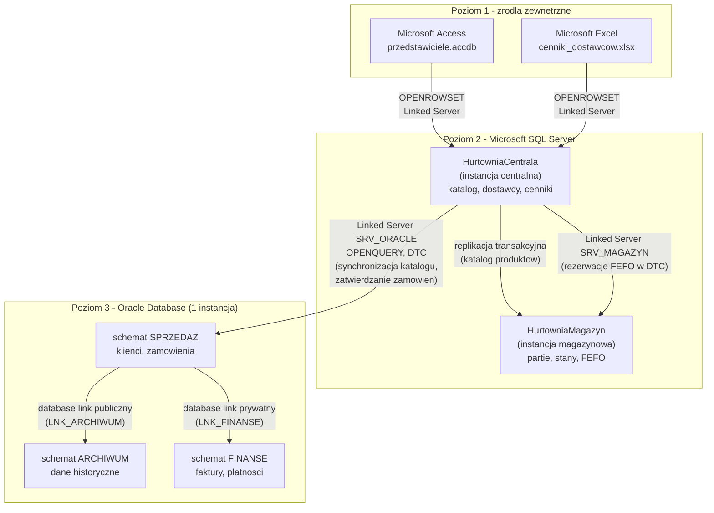
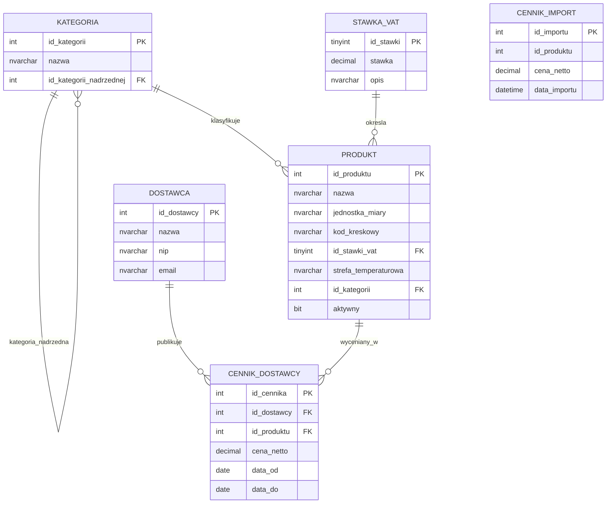
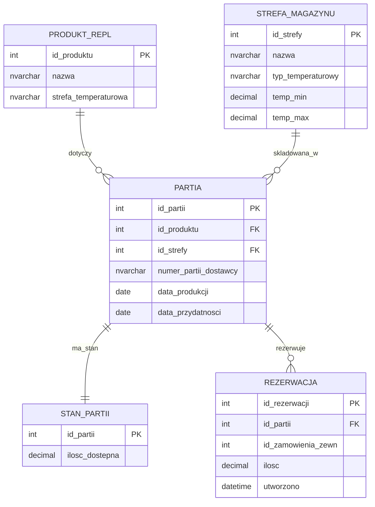
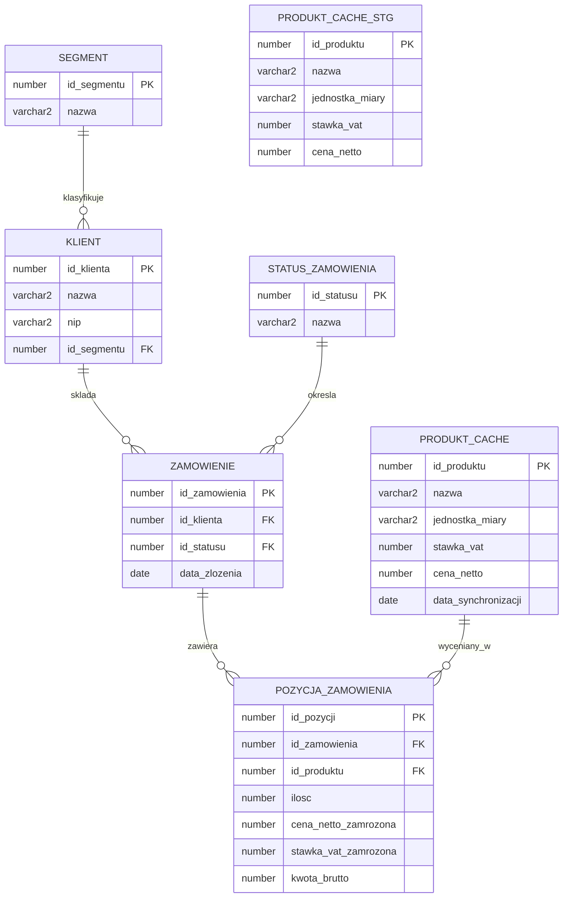
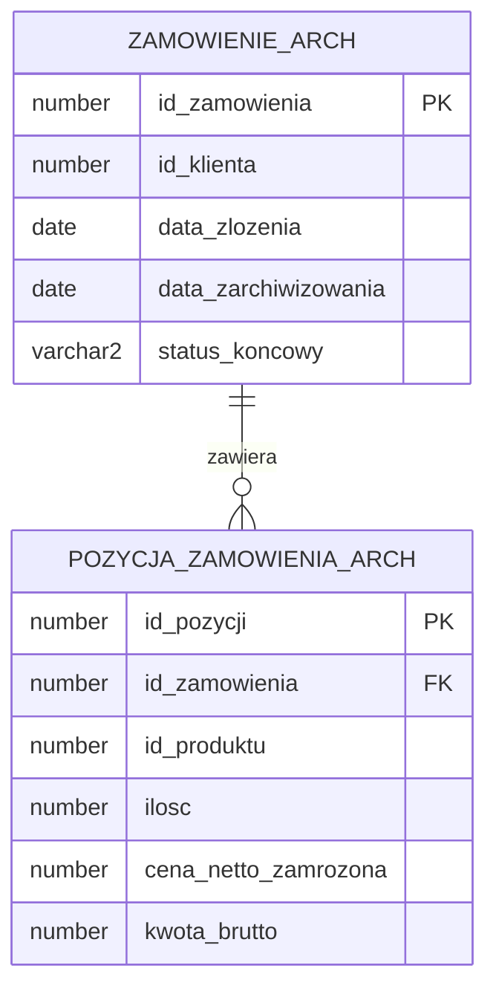
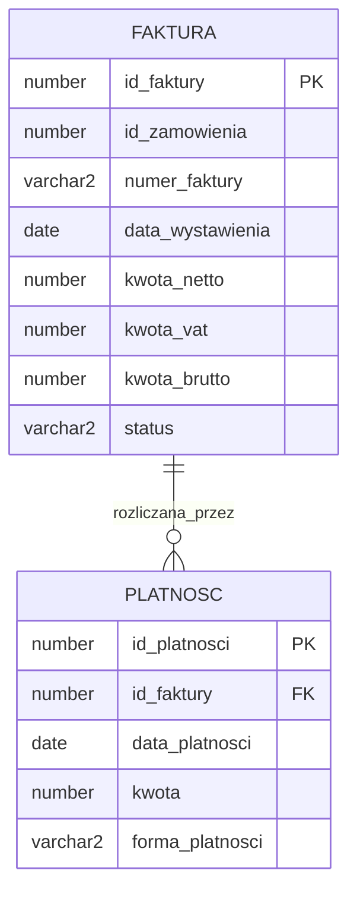

# Projekt rozproszonej bazy danych: Hurtownia POL-FOOD sp. z o.o.

**Politechnika Łódzka**, Wydział Elektrotechniki, Elektroniki, Informatyki i Automatyki
Przedmiot: Rozproszone Bazy Danych, semestr 6
Autorzy: Mateusz Mróz (251190), Maciej Górka (251143)
Łódź, 2026

---

## Spis treści

1. [Wprowadzenie](#1-wprowadzenie)
2. [Wymagania biznesowe](#2-wymagania-biznesowe)
3. [Architektura rozproszonej bazy danych](#3-architektura-rozproszonej-bazy-danych)
4. [Model danych](#4-model-danych)
5. [Realizacja mechanizmów rozproszonych](#5-realizacja-mechanizmow-rozproszonych)
6. [Wnioski, ograniczenia i podział pracy](#6-wnioski-ograniczenia-i-podzial-pracy)

---

## 1. Wprowadzenie

Niniejszy dokument opisuje **projekt rozproszonej bazy danych** przygotowany w ramach przedmiotu **Rozproszone Bazy Danych** na Wydziale Elektrotechniki, Elektroniki, Informatyki i Automatyki Politechniki Łódzkiej. Zadaniem projektowym było zaprojektowanie i zaimplementowanie **heterogenicznego środowiska bazodanowego** pokrywającego zagadnienia opisane w wymaganiach przedmiotu, między innymi: ustanowienie **serwerów połączonych**, **zapytań ad hoc**, **transakcji rozproszonych z koordynatorem MS DTC** (Microsoft Distributed Transaction Coordinator), **replikacji**, **łączy bazodanowych Oracle** (database links), **niemodyfikowalnych widoków rozproszonych z wyzwalaczami INSTEAD OF** oraz **pakietów PL/SQL**. Autorami projektu są **Mateusz Mróz (251190)** oraz **Maciej Górka (251143)**.

Domeną biznesową projektu jest **Hurtownia POL-FOOD sp. z o.o.**, polska hurtownia **przetworzonych produktów spożywczych** zaopatrująca sklepy detaliczne, restauracje i stołówki. Hurtownia prowadzi katalog produktów (konserwy, makarony, oleje, przyprawy, mrożonki) pochodzących od krajowych dostawców. Działalność firmy obejmuje **cztery powiązane obszary**:

- prowadzenie **katalogu produktów i współpracy z dostawcami** w centrali;
- fizyczne przyjmowanie i wydawanie partii towaru w magazynie z zachowaniem zasady **FEFO** (First Expired First Out) oraz kontrolą **stref temperaturowych** (chłodnia, mroźnia, suchy magazyn);
- obsługę **zamówień klientów** wraz z **zamrażaniem ceny** w momencie złożenia zamówienia;
- prowadzenie **ewidencji finansowej** (faktury, płatności) z **ograniczonym dostępem**.

Część danych historycznych jest **archiwizowana**, a część źródeł zewnętrznych pochodzi z plików **Microsoft Access** (kartoteka przedstawicieli pracujących w trybie offline) oraz arkuszy **Microsoft Excel** (cenniki dostawców). Taka różnorodność źródeł i wymagania biznesowe (rozdzielenie ról, kontrola dostępu do danych finansowych, synchronizacja katalogu, archiwizacja, sprzedaż prowadzona w środowisku Oracle) **naturalnie wymuszają architekturę rozproszoną w środowisku heterogenicznym**.

---

## 2. Wymagania biznesowe

W tej sekcji zebrano trzynaście wymagań biznesowych wynikających ze specyfiki działalności hurtowni POL-FOOD. Wymagania te są punktem wyjścia do projektu logicznego i fizycznego bazy danych. Każde z nich odpowiada na konkretną potrzebę operacyjną firmy.

1. Firma prowadzi **jeden wspólny katalog produktów** oraz **hierarchię kategorii** (kategorie i podkategorie), tak aby wszystkie działy posługiwały się tym samym słownikiem towarów.
2. Każdy produkt jest opisany podstawowymi atrybutami handlowymi (**nazwa, jednostka miary, kod kreskowy, stawka VAT, strefa temperaturowa**), a stawki VAT pochodzą z **zamkniętego słownika** zgodnego z polskim prawem podatkowym.
3. Firma współpracuje z **wieloma dostawcami**, każdy dostawca może oferować ten sam produkt w innej cenie, a **aktualnie obowiązujący cennik** musi być znany w każdym momencie.
4. Towar w magazynie jest przyjmowany w postaci **partii (lotów)** z datą produkcji, datą przydatności i numerem partii dostawcy, a wydawanie towaru zawsze następuje zgodnie z **zasadą FEFO** (najpierw towar o najkrótszej dacie przydatności).
5. Magazyn jest podzielony na **strefy temperaturowe** (chłodnia, mroźnia, suchy magazyn), a produkt o danej strefie wymaganej musi być składowany wyłącznie w strefie zgodnej (kontrola zgodna z zasadami **HACCP**, czyli Hazard Analysis and Critical Control Points).
6. Klienci hurtowni dzielą się na **segmenty** (sklep detaliczny, restauracja, stołówka), a od segmentu zależą warunki handlowe oraz raportowanie sprzedaży.
7. W momencie złożenia zamówienia **cena jednostkowa produktu zostaje zapamiętana (zamrożona)** w pozycji zamówienia, tak aby późniejsza zmiana cennika nie wpłynęła na zamówienia już złożone.
8. Zamówienie przechodzi przez **ustalone statusy** (nowe, zatwierdzone, anulowane, zrealizowane), a zmiana statusu jest możliwa tylko zgodnie z **dopuszczalnymi przejściami**.
9. Dane historyczne (zamówienia zakończone, zarchiwizowane partie) są przenoszone do **oddzielnego archiwum** dostępnego w **trybie tylko do odczytu** dla działu sprzedaży i raportowania.
10. Dane finansowe (**faktury, płatności, salda klientów**) są dostępne **wyłącznie dla działu finansowego** i nie powinny być widoczne ani dla magazynu, ani dla sprzedaży operacyjnej.
11. Przedstawiciele handlowi pracujący w terenie korzystają z **lokalnej kartoteki klientów w pliku Microsoft Access** i okresowo udostępniają ją centrali.
12. Dostawcy przesyłają aktualizacje cenników w formie **arkuszy Microsoft Excel**, a system musi umożliwiać ich odczyt bezpośrednio z poziomu centrali.
13. Katalog produktów prowadzony w centrali musi być **automatycznie i ciągle replikowany** do magazynu, tak aby personel magazynowy zawsze pracował na aktualnej liście towarów i **nie mógł jej modyfikować lokalnie**.

---

## 3. Architektura rozproszonej bazy danych

### 3.1 Uzasadnienie podziału

Architektura systemu jest heterogeniczna. Dane są podzielone pomiędzy dwie instancje Microsoft SQL Server oraz jedną instancję Oracle Database. Podział wynika z realnego rozdzielenia obszarów odpowiedzialności w firmie. Pomocniczo realizuje wymagania dydaktyczne projektu (środowisko heterogeniczne, OPENROWSET, serwery połączone, transakcje rozproszone, łącza bazodanowe Oracle).

Centrala odpowiada za katalog, dostawców i cenniki. Magazyn odpowiada za partie, stany i wydania zgodne z FEFO. Każdy z tych obszarów ma swoją bazę na osobnej instancji Microsoft SQL Server. Katalog jest modyfikowany tylko w centrali, magazyn dostaje go w trybie do odczytu przez replikację transakcyjną.

Sprzedaż, archiwum i finanse są w jednej instancji Oracle, w trzech osobnych schematach. Pozwala to pokazać łącza bazodanowe (publiczne i prywatne) oraz widoki rozproszone, a jednocześnie odzwierciedla biznesową potrzebę odseparowania danych finansowych.

Dwa zewnętrzne źródła (plik Microsoft Access z kartoteką przedstawicieli oraz arkusz Microsoft Excel z cennikami dostawców) są podłączone do centrali jako serwery połączone i wykorzystywane w zapytaniach ad hoc oraz widokach wielodostępnych.

### 3.2 Topologia

System składa się z trzech poziomów:

- **Poziom 1 - źródła zewnętrzne**: plik Microsoft Access (kartoteka przedstawicieli) oraz arkusz Microsoft Excel (cenniki dostawców).
- **Poziom 2 - Microsoft SQL Server**: dwie bazy danych na dwóch instancjach (`HurtowniaCentrala`, `HurtowniaMagazyn`), połączone serwerami połączonymi i replikacją transakcyjną.
- **Poziom 3 - Oracle Database**: jedna instancja z trzema schematami (`SPRZEDAZ`, `ARCHIWUM`, `FINANSE`), podłączona do centrali przez sterownik OLE DB i koordynator MS DTC.



### 3.3 Wykaz serwerów i serwerów połączonych

W projekcie skonfigurowano następujące serwery połączone po stronie Microsoft SQL Server oraz łącza bazodanowe po stronie Oracle:

| Nazwa | Typ | Źródło | Cel połączenia |
|---|---|---|---|
| `SRV_MAGAZYN` | Linked Server | SQL Server (instancja magazynowa) | dostęp z centrali do bazy `HurtowniaMagazyn` (rezerwacje FEFO w ramach DTC, modyfikacje stanów) |
| `SRV_ORACLE` | Linked Server | Oracle Database | dostęp z centrali do schematu `SPRZEDAZ` (synchronizacja katalogu, transakcje DTC) |
| `SRV_ACCESS` | Linked Server | plik `.accdb` Microsoft Access | dostęp z centrali do kartoteki przedstawicieli |
| `SRV_EXCEL` | Linked Server | plik `.xlsx` Microsoft Excel | dostęp z centrali do cennika dostawcy |
| `LNK_ARCHIWUM` | Database Link (publiczny) | Oracle, schemat `ARCHIWUM` | dostęp z `SPRZEDAZ` do danych historycznych dla wszystkich użytkowników |
| `LNK_FINANSE` | Database Link (prywatny) | Oracle, schemat `FINANSE` | dostęp z `SPRZEDAZ` do danych finansowych, wyłącznie dla uprawnionych użytkowników |

---

## 4. Model danych

Rozdział opisuje strukturę logiczną pięciu części składowych systemu. Każdy podrozdział zawiera krótkie omówienie zawartości oraz diagram związków encji (ERD).

### 4.1 Baza HurtowniaCentrala (Microsoft SQL Server)

Baza centralna przechowuje **słowniki i katalog produktów** oraz informacje handlowe o dostawcach i ich aktualnych cennikach. Jest jedynym miejscem, w którym katalog można modyfikować; pozostałe systemy otrzymują go w trybie tylko do odczytu poprzez replikację (do magazynu) lub poprzez push z procedury (do schematu sprzedaży w Oracle). Tabela `KATEGORIA` ma relację samozwrotną (`id_kategorii_nadrzednej`) modelującą hierarchię kategoria → podkategoria (np. `Mrożonki` → `Mrożone warzywa`).



Tabela `CENNIK_IMPORT` jest pomocniczą tabelą buforową (poza modelem domenowym), do której trafiają wiersze odczytane z arkusza Excel przez procedurę `sp_importuj_cennik_excel` (sekcja 5.2) przed dalszym przetwarzaniem.

### 4.2 Baza HurtowniaMagazyn (Microsoft SQL Server)

Baza magazynowa przechowuje informacje o **fizycznym stanie towaru**: strefy magazynu, partie z datami przydatności, stany ilościowe partii oraz rezerwacje zrealizowane na potrzeby zamówień. Replika katalogu produktów (`PRODUKT_REPL`) jest tu obecna jako tabela docelowa replikacji transakcyjnej, modyfikowana wyłącznie przez mechanizm replikacji.



### 4.3 Schemat SPRZEDAZ (Oracle Database)

Schemat sprzedaży przechowuje **klientów, ich segmenty, zamówienia i pozycje zamówień** wraz z zamrożoną ceną z momentu złożenia zamówienia. Zawiera również cache produktów odświeżany procedurą `sp_push_produkty_to_oracle` z centrali Microsoft SQL Server.



Tabela `PRODUKT_CACHE_STG` jest pomocniczą tabelą stagingową dla procedury `sp_push_produkty_to_oracle` (sekcja 5.13): centrala wypełnia ją przez notację czteroczęściową, a `MERGE` po stronie Oracle wykonuje upsert do docelowej `PRODUKT_CACHE`.

Słownik `STATUS_ZAMOWIENIA` zawiera cztery rekordy zgodne z dopuszczalnymi przejściami statusów opisanymi w wymaganiu 8: `1 = NOWE`, `2 = ZATWIERDZONE`, `3 = ANULOWANE`, `4 = ZREALIZOWANE`. Te wartości są używane przez procedury w sekcjach 5.6 i 5.13.

Kolumna `PRODUKT_CACHE.cena_netto` jest aktualizowana przez procedurę `dbo.sp_push_produkty_to_oracle` (sekcja 5.13) wraz z pozostałymi atrybutami katalogu i służy jako źródło ceny zamrażanej w pozycjach zamówienia.

### 4.4 Schemat ARCHIWUM (Oracle Database)

Schemat archiwum przechowuje **dane historyczne** zrealizowanych zamówień i wycofanych partii. Dane te są udostępniane z poziomu schematu `SPRZEDAZ` przez publiczny database link `LNK_ARCHIWUM` w widoku rozproszonym tylko do odczytu (sekcja 5.11).



### 4.5 Schemat FINANSE (Oracle Database)

Schemat finansów przechowuje **faktury i płatności** powiązane z zamówieniami sprzedaży. Dostęp do niego jest celowo ograniczony i odbywa się wyłącznie przez prywatny database link `LNK_FINANSE` dostępny tylko dla użytkownika finansowego.



---

## 4.6 Scenariusze użycia

Dla zrozumienia, jak zaprojektowane mechanizmy współpracują w realnej eksploatacji, poniżej zebrano cztery najważniejsze scenariusze biznesowe wraz ze wskazaniem zaangażowanych elementów systemu.

**Scenariusz 1 - złożenie nowego zamówienia.** Klient telefonuje do działu sprzedaży. Operator wywołuje procedurę `PKG_SPRZEDAZ.sp_zarejestruj_zamowienie` (status `NOWE`) i wielokrotnie `sp_dodaj_pozycje`. Każda pozycja czerpie aktualną cenę i stawkę VAT z `SPRZEDAZ.PRODUKT_CACHE` (zsynchronizowanej z centrali) i **zamraża** je w wierszu `POZYCJA_ZAMOWIENIA`. Zaangażowane wymagania: 1, 2, 7.

**Scenariusz 2 - zatwierdzenie zamówienia (FEFO + DTC).** Po skompletowaniu zamówienia operator wywołuje w centrali procedurę `dbo.sp_zatwierdz_zamowienie_dtc`. Procedura otwiera **transakcję rozproszoną** koordynowaną przez MS DTC, w jej ramach uruchamia `dbo.sp_rezerwuj_fefo` (rezerwacja partii w `HurtowniaMagazyn` przez `SRV_MAGAZYN` w kolejności daty przydatności), a następnie przez `SRV_ORACLE` zmienia status zamówienia na `ZATWIERDZONE`. Obie operacje zatwierdzają się razem albo wycofują razem. Zaangażowane wymagania: 4, 5, 6, 8.

**Scenariusz 3 - synchronizacja katalogu.** Pracownik centrali dodaje nowy produkt do tabeli `HurtowniaCentrala.dbo.PRODUKT`. **Replikacja transakcyjna** w ciągu sekund propaguje go do `HurtowniaMagazyn.dbo.PRODUKT_REPL` (tryb tylko do odczytu po stronie magazynu). Cyklicznie uruchamiana procedura `dbo.sp_push_produkty_to_oracle` synchronizuje również `SPRZEDAZ.PRODUKT_CACHE` w Oracle przez `SRV_ORACLE`. Zaangażowane wymagania: 1, 5, 7, 13.

**Scenariusz 4 - raport sprzedaży z danymi historycznymi.** Dział raportowania wybiera dane z `SPRZEDAZ.V_ZAMOWIENIA_PELNE`. Widok rozproszony łączy zamówienia bieżące z lokalnej tabeli `ZAMOWIENIE` z zamówieniami archiwalnymi pobranymi przez publiczny **database link** `LNK_ARCHIWUM`. Widok jest oznaczony `WITH READ ONLY` (modyfikacja archiwum przez widok jest zablokowana, a próba wywołania wyzwala `INSTEAD OF` zwracający błąd). Zaangażowane wymagania: 9, 10, 11, 12.

---

## 5. Realizacja mechanizmów rozproszonych

Rozdział ten szczegółowo opisuje realizację trzynastu wymagań technicznych projektu, zgodnie z kolejnością z karty przedmiotu. Każdy podrozdział zawiera krótkie omówienie problemu, decyzje projektowe oraz przykładowy kod.

### 5.1 Opracowanie struktury rozproszonej bazy i uzasadnienie podziału

Uzasadnienie podziału znajduje się w rozdziale 3.1. Każdy obiekt umieszczono w bazie, która jest jego właścicielem: katalog w `HurtowniaCentrala`, partie i stany w `HurtowniaMagazyn`, klienci i zamówienia w schemacie `SPRZEDAZ`, dane historyczne w `ARCHIWUM`, faktury i płatności w `FINANSE`. Procedury są umieszczone tam, gdzie ich główne tabele, co minimalizuje ruch sieciowy.

### 5.2 Zapytania ad hoc OPENROWSET

Funkcja `OPENROWSET` umożliwia dostęp do zdalnych źródeł danych bez stałej konfiguracji serwera połączonego. W projekcie zrealizowano cztery wymagane warianty oraz jeden widok wielodostępny łączący dwa różne źródła. Wszystkie zapytania pokazują **agregacje wykonywane po stronie zdalnej** (silnik źródła robi `SUM`/`COUNT`/`GROUP BY`, lokalny silnik dostaje tylko wynik) oraz **agregacje lokalne** nad wynikiem zdalnym, a także **jawne rzutowanie typów** przy łączeniu źródeł.

**SQL Server - SQL Server** (centrala odpytuje magazyn, agregacja zdalna `SUM` po stronie magazynu):

```sql
SELECT id_strefy, suma_dostepna
FROM OPENROWSET(
    'SQLNCLI',
    'Server=MAGAZYN-SRV;Database=HurtowniaMagazyn;Trusted_Connection=yes;',
    'SELECT p.id_strefy, SUM(s.ilosc_dostepna) AS suma_dostepna
     FROM dbo.PARTIA p
     JOIN dbo.STAN_PARTII s ON s.id_partii = p.id_partii
     GROUP BY p.id_strefy'
) AS stany_zdalne;
```

**SQL Server - Oracle** (centrala odpytuje sprzedaż, liczba zamówień per status):

```sql
SELECT *
FROM OPENROWSET(
    'OraOLEDB.Oracle',
    'ORADB';'SPRZEDAZ';'***',
    'SELECT s.NAZWA, COUNT(*) AS liczba
     FROM SPRZEDAZ.ZAMOWIENIE z
     JOIN SPRZEDAZ.STATUS_ZAMOWIENIA s ON s.ID_STATUSU = z.ID_STATUSU
     GROUP BY s.NAZWA'
) AS zamowienia_per_status;
```

**SQL Server - Access** (kartoteka przedstawicieli):

```sql
SELECT id_przedstawiciela, imie, nazwisko, region
FROM OPENROWSET(
    'Microsoft.ACE.OLEDB.16.0',
    'C:\dane\przedstawiciele.accdb';'admin';'',
    'SELECT id_przedstawiciela, imie, nazwisko, region FROM Przedstawiciele'
);
```

**SQL Server - Excel** (cennik dostawcy z arkusza `Cennik$`):

```sql
SELECT [id_produktu], [cena_netto], [data_od]
FROM OPENROWSET(
    'Microsoft.ACE.OLEDB.16.0',
    'Excel 12.0;Database=C:\dane\cenniki_dostawcow.xlsx;HDR=YES;',
    'SELECT * FROM [Cennik$]'
);
```

**Widok wielodostępny dwóch źródeł** (Oracle + Excel) z **jawnym rzutowaniem typów** i agregacją lokalną:

```sql
CREATE OR ALTER VIEW dbo.v_porownanie_cen AS
SELECT
    CAST(o.id_produktu AS INT) AS id_produktu,
    CAST(o.nazwa AS NVARCHAR(200)) AS nazwa_produktu,
    CAST(e.cena_netto AS DECIMAL(10,2)) AS cena_zewnetrzna,
    CAST(o.stawka_vat AS DECIMAL(5,2)) AS stawka_vat
FROM OPENROWSET(
    'OraOLEDB.Oracle',
    'ORADB';'SPRZEDAZ';'***',
    'SELECT ID_PRODUKTU, NAZWA, STAWKA_VAT FROM SPRZEDAZ.PRODUKT_CACHE'
) AS o
JOIN OPENROWSET(
    'Microsoft.ACE.OLEDB.16.0',
    'Excel 12.0;Database=C:\dane\cenniki_dostawcow.xlsx;HDR=YES;',
    'SELECT id_produktu, cena_netto FROM [Cennik$]'
) AS e ON e.id_produktu = o.id_produktu;
```

Agregację lokalną nad tym widokiem realizuje zapytanie:

```sql
SELECT AVG(cena_zewnetrzna) AS srednia, COUNT(*) AS liczba
FROM dbo.v_porownanie_cen;
```

Procedura składowana wykorzystująca `OPENROWSET` - import pozycji cennika z arkusza Excel do tabeli buforowej w centrali, z lokalną agregacją do raportu (realizuje wymóg "widoki **i procedury** rozproszone"):

```sql
CREATE OR ALTER PROCEDURE dbo.sp_importuj_cennik_excel
    @sciezka NVARCHAR(260)
AS
BEGIN
    SET NOCOUNT ON;
    DECLARE @sql NVARCHAR(MAX) = N'
        INSERT INTO dbo.CENNIK_IMPORT (id_produktu, cena_netto, data_importu)
        SELECT CAST([id_produktu] AS INT), CAST([cena_netto] AS DECIMAL(10,2)), SYSDATETIME()
        FROM OPENROWSET(
            ''Microsoft.ACE.OLEDB.16.0'',
            ''Excel 12.0;Database='' + @sciezka + '';HDR=YES;'',
            ''SELECT id_produktu, cena_netto FROM [Cennik$]'');';
    EXEC sp_executesql @sql, N'@sciezka NVARCHAR(260)', @sciezka;

    SELECT COUNT(*) AS pozycji_zaimportowano, AVG(cena_netto) AS srednia_cena
    FROM dbo.CENNIK_IMPORT
    WHERE data_importu >= DATEADD(MINUTE, -1, SYSDATETIME());
END;
```

### 5.3 Serwery połączone i mapowanie loginów

Wszystkie serwery połączone zostały skonfigurowane z jawnym mapowaniem loginu lokalnego na login zdalny, tak aby nie używać kont uprzywilejowanych. Dla połączenia z Oracle wykorzystano sterownik `OraOLEDB.Oracle`. Dla plików Access i Excel wykorzystano sterownik `Microsoft.ACE.OLEDB.16.0`.

Przykład rejestracji serwera połączonego do Oracle wraz z mapowaniem loginu:

```sql
EXEC sp_addlinkedserver
    @server = 'SRV_ORACLE',
    @srvproduct = 'Oracle',
    @provider = 'OraOLEDB.Oracle',
    @datasrc = 'ORADB';

EXEC sp_addlinkedsrvlogin
    @rmtsrvname = 'SRV_ORACLE',
    @useself = 'FALSE',
    @locallogin = 'CentralaApp',
    @rmtuser = 'SPRZEDAZ',
    @rmtpassword = '***';
```

Analogicznie zarejestrowano pozostałe trzy serwery połączone:

```sql
-- SQL Server -> SQL Server (centrala -> magazyn)
EXEC sp_addlinkedserver
    @server = 'SRV_MAGAZYN',
    @srvproduct = '',
    @provider = 'SQLNCLI',
    @datasrc = 'MAGAZYN-SRV',
    @catalog = 'HurtowniaMagazyn';

-- SQL Server -> Microsoft Access (.accdb)
EXEC sp_addlinkedserver
    @server = 'SRV_ACCESS',
    @srvproduct = 'ACE',
    @provider = 'Microsoft.ACE.OLEDB.16.0',
    @datasrc = 'C:\dane\przedstawiciele.accdb';

-- SQL Server -> Microsoft Excel (.xlsx)
EXEC sp_addlinkedserver
    @server = 'SRV_EXCEL',
    @srvproduct = 'ACE',
    @provider = 'Microsoft.ACE.OLEDB.16.0',
    @datasrc = 'C:\dane\cenniki_dostawcow.xlsx',
    @provstr = 'Excel 12.0;HDR=YES;';
```

Do diagnostyki konfiguracji wykorzystano następujące funkcje systemowe:

```sql
EXEC sp_linkedservers;
EXEC sp_helplinkedsrvlogin;
SELECT name, provider, data_source FROM sys.servers WHERE is_linked = 1;
EXEC sp_testlinkedserver 'SRV_ORACLE';
```

Funkcje te pozwalają zweryfikować, czy serwer jest poprawnie zarejestrowany, jakie ma mapowania loginów i czy faktycznie odpowiada.

### 5.4 Zapytania przekazujące OPENQUERY

Funkcja `OPENQUERY` przekazuje zapytanie w całości do silnika zdalnego, dzięki czemu agregacje, sortowanie i filtrowanie wykonują się po stronie zdalnej. To istotnie zmniejsza ilość przesyłanych danych w porównaniu z notacją czteroczęściową (`SRV.DB.SCHEMA.TABELA`), w której silnik lokalny często pobiera całe tabele i agreguje sam.

Przykład - dziesięciu klientów o największej wartości zamówień, agregacja po stronie Oracle:

```sql
SELECT *
FROM OPENQUERY(SRV_ORACLE,
    'SELECT k.NAZWA, SUM(p.KWOTA_BRUTTO) AS suma
     FROM SPRZEDAZ.KLIENT k
     JOIN SPRZEDAZ.ZAMOWIENIE z ON z.ID_KLIENTA = k.ID_KLIENTA
     JOIN SPRZEDAZ.POZYCJA_ZAMOWIENIA p ON p.ID_ZAMOWIENIA = z.ID_ZAMOWIENIA
     GROUP BY k.NAZWA
     ORDER BY suma DESC
     FETCH FIRST 10 ROWS ONLY');
```

Łączenie wyniku zdalnego z danymi lokalnymi w widoku rozproszonym (przetwarzanie lokalne nad wynikiem zdalnym):

```sql
CREATE OR ALTER VIEW dbo.v_klienci_z_stanami AS
SELECT q.NAZWA AS klient, q.suma AS wartosc_zamowien, sm.suma_dostepna
FROM OPENQUERY(SRV_ORACLE,
    'SELECT k.NAZWA, SUM(p.KWOTA_BRUTTO) AS suma
     FROM SPRZEDAZ.KLIENT k
     JOIN SPRZEDAZ.ZAMOWIENIE z ON z.ID_KLIENTA = k.ID_KLIENTA
     JOIN SPRZEDAZ.POZYCJA_ZAMOWIENIA p ON p.ID_ZAMOWIENIA = z.ID_ZAMOWIENIA
     GROUP BY k.NAZWA') AS q
CROSS JOIN (
    SELECT SUM(ilosc_dostepna) AS suma_dostepna
    FROM SRV_MAGAZYN.HurtowniaMagazyn.dbo.STAN_PARTII
) AS sm;
```

### 5.5 Wstawianie i modyfikowanie danych na zdalnych źródłach

Przez ustanowiony serwer połączony można zarówno czytać, jak i modyfikować dane zdalne. Operacje takie są wykonywane notacją czteroczęściową lub przez `EXECUTE ... AT`. Przykład - wstawienie nowego produktu do cache w Oracle bezpośrednio z centrali (operacja pomocnicza, normalnie wykonywana przez procedurę `sp_push_produkty_to_oracle`):

```sql
INSERT INTO SRV_ORACLE..SPRZEDAZ.PRODUKT_CACHE
    (id_produktu, nazwa, jednostka_miary, stawka_vat, data_synchronizacji)
VALUES (1001, N'Olej rzepakowy 1L', N'szt', 23, GETDATE());
```

Modyfikacja stanu partii w bazie magazynu z poziomu centrali:

```sql
UPDATE SRV_MAGAZYN.HurtowniaMagazyn.dbo.STAN_PARTII
SET ilosc_dostepna = ilosc_dostepna - 5
WHERE id_partii = 42;
```

Procedura serwerowa odpalana po stronie zdalnej (`EXECUTE ... AT`):

```sql
EXEC ('UPDATE SPRZEDAZ.PRODUKT_CACHE
       SET nazwa = ''Olej rzepakowy 1L premium''
       WHERE id_produktu = 1001') AT SRV_ORACLE;
```

### 5.6 Transakcje rozproszone z MS DTC

Najbardziej krytyczny scenariusz biznesowy to **zatwierdzenie zamówienia**, w którym jednocześnie należy:

- zarezerwować ilość w bazie magazynu (`HurtowniaMagazyn`) zgodnie z FEFO,
- zmienić status zamówienia w schemacie Oracle (`SPRZEDAZ.ZAMOWIENIE`).

Obie operacje muszą się wykonać razem albo nie wykonać wcale, co jest klasycznym zastosowaniem transakcji rozproszonej. Koordynatorem jest **MS DTC** (Microsoft Distributed Transaction Coordinator), który po stronie Oracle współpracuje z **OraMTS** (Oracle Services for Microsoft Transaction Server). MS DTC realizuje protokół zatwierdzania dwufazowego (two-phase commit, 2PC): w fazie pierwszej (`PREPARE`) wszyscy uczestnicy potwierdzają, że są gotowi zatwierdzić; w fazie drugiej (`COMMIT`) faktycznie zatwierdzają. Jeśli którykolwiek uczestnik odpowie negatywnie w fazie pierwszej, transakcja jest wycofywana u wszystkich.

Konfiguracja MS DTC po stronie systemu Windows obejmuje włączenie sieciowego dostępu DTC, uwierzytelniania (lub bez uwierzytelniania w środowisku laboratoryjnym), reguł zapory dla portu 135 oraz puli portów RPC. Po stronie Oracle konfiguruje się usługę OraMTS i wskazuje ją w łańcuchu połączenia OLE DB.

Procedura zatwierdzająca zamówienie:

```sql
CREATE OR ALTER PROCEDURE dbo.sp_zatwierdz_zamowienie_dtc
    @id_zamowienia INT
AS
BEGIN
    SET XACT_ABORT ON;
    BEGIN DISTRIBUTED TRANSACTION;
        EXEC dbo.sp_rezerwuj_fefo @id_zamowienia;

        EXEC ('UPDATE SPRZEDAZ.ZAMOWIENIE
               SET ID_STATUSU = 2
               WHERE ID_ZAMOWIENIA = ?',
              @id_zamowienia) AT SRV_ORACLE;
    COMMIT TRANSACTION;
END;
```

Procedura pomocnicza `dbo.sp_rezerwuj_fefo` wybiera partie do rezerwacji **kursorem** posortowanym po dacie przydatności (FEFO) i dekrementuje stan każdej partii do wyczerpania zamawianej ilości:

```sql
CREATE OR ALTER PROCEDURE dbo.sp_rezerwuj_fefo
    @id_zamowienia INT
AS
BEGIN
    SET NOCOUNT ON;
    DECLARE @id_produktu INT, @ilosc_pozycji DECIMAL(10,3);
    DECLARE @id_partii INT, @ilosc_partia DECIMAL(10,3), @do_rezerwacji DECIMAL(10,3);

    DECLARE cur_pozycje CURSOR LOCAL FAST_FORWARD FOR
        SELECT id_produktu, ilosc
        FROM SRV_ORACLE..SPRZEDAZ.POZYCJA_ZAMOWIENIA
        WHERE id_zamowienia = @id_zamowienia;

    OPEN cur_pozycje;
    FETCH NEXT FROM cur_pozycje INTO @id_produktu, @ilosc_pozycji;
    WHILE @@FETCH_STATUS = 0
    BEGIN
        DECLARE cur_partie CURSOR LOCAL FAST_FORWARD FOR
            SELECT p.id_partii, s.ilosc_dostepna
            FROM dbo.PARTIA p
            JOIN dbo.STAN_PARTII s ON s.id_partii = p.id_partii
            WHERE p.id_produktu = @id_produktu
              AND s.ilosc_dostepna > 0
            ORDER BY p.data_przydatnosci ASC;

        OPEN cur_partie;
        FETCH NEXT FROM cur_partie INTO @id_partii, @ilosc_partia;
        WHILE @@FETCH_STATUS = 0 AND @ilosc_pozycji > 0
        BEGIN
            SET @do_rezerwacji =
                CASE WHEN @ilosc_partia >= @ilosc_pozycji
                     THEN @ilosc_pozycji ELSE @ilosc_partia END;

            UPDATE dbo.STAN_PARTII
            SET ilosc_dostepna = ilosc_dostepna - @do_rezerwacji
            WHERE id_partii = @id_partii;

            INSERT INTO dbo.REZERWACJA
                (id_partii, id_zamowienia_zewn, ilosc, utworzono)
            VALUES (@id_partii, @id_zamowienia, @do_rezerwacji, SYSDATETIME());

            SET @ilosc_pozycji = @ilosc_pozycji - @do_rezerwacji;
            FETCH NEXT FROM cur_partie INTO @id_partii, @ilosc_partia;
        END;
        CLOSE cur_partie; DEALLOCATE cur_partie;

        IF @ilosc_pozycji > 0
            THROW 50010, 'Brak wystarczajacego stanu dla pozycji zamowienia.', 1;

        FETCH NEXT FROM cur_pozycje INTO @id_produktu, @ilosc_pozycji;
    END;
    CLOSE cur_pozycje; DEALLOCATE cur_pozycje;
END;
```

### 5.7 Replikacja

Spośród trzech rodzajów replikacji oferowanych przez Microsoft SQL Server (transakcyjna, migawkowa, uzgadniana) wybrano **replikację transakcyjną** dla katalogu produktów z bazy `HurtowniaCentrala` (publisher) do bazy `HurtowniaMagazyn` (subscriber). Wybór ten wynika z trzech przesłanek:

- katalog jest modyfikowany w jednym miejscu (centrala) i tylko czytany w drugim (magazyn), więc nie potrzeba dwukierunkowej replikacji uzgadniającej konflikty;
- magazyn musi pracować na aktualnym katalogu w trybie quasi-ciągłym (zmiana ceny VAT albo nowa pozycja powinna być widoczna w ciągu sekund), co eliminuje replikację migawkową, która kopiuje całe migawki w wybranych momentach;
- replikacja transakcyjna jest klasycznym, dobrze udokumentowanym mechanizmem do tego scenariusza i opiera się na czytaniu logu transakcji przez agenta `Log Reader`.

Publikacją objęto tabelę `PRODUKT` z centrali, która po stronie magazynu pojawia się jako `PRODUKT_REPL` w trybie tylko do odczytu (uprawnienia magazynu nie obejmują `INSERT`/`UPDATE`/`DELETE` na tej tabeli; ewentualne modyfikacje byłyby i tak nadpisane przez replikację). Po stronie publishera wykorzystywane są agenci `Snapshot Agent` (inicjalna migawka) i `Log Reader Agent`, po stronie subscribera - `Distribution Agent`.

### 5.8 Oracle - użytkownicy, prawa, role

W instancji Oracle utworzono trzech użytkowników (schematy: `SPRZEDAZ`, `ARCHIWUM`, `FINANSE`) oraz trzy role dziedzinowe pozwalające zarządzać uprawnieniami zbiorczo:

```sql
CREATE USER SPRZEDAZ IDENTIFIED BY "***"
    DEFAULT TABLESPACE USERS QUOTA UNLIMITED ON USERS;
CREATE USER ARCHIWUM IDENTIFIED BY "***"
    DEFAULT TABLESPACE USERS QUOTA UNLIMITED ON USERS;
CREATE USER FINANSE IDENTIFIED BY "***"
    DEFAULT TABLESPACE USERS QUOTA UNLIMITED ON USERS;

GRANT CREATE SESSION, CREATE TABLE, CREATE VIEW, CREATE PROCEDURE,
      CREATE TRIGGER, CREATE SEQUENCE, CREATE DATABASE LINK
    TO SPRZEDAZ, ARCHIWUM, FINANSE;

CREATE ROLE rola_sprzedaz;
CREATE ROLE rola_archiwum_ro;
CREATE ROLE rola_finanse;

GRANT SELECT, INSERT, UPDATE ON SPRZEDAZ.ZAMOWIENIE TO rola_sprzedaz;
GRANT SELECT, INSERT, UPDATE ON SPRZEDAZ.POZYCJA_ZAMOWIENIA TO rola_sprzedaz;
GRANT SELECT ON SPRZEDAZ.PRODUKT_CACHE TO rola_sprzedaz;
GRANT SELECT ON SPRZEDAZ.STATUS_ZAMOWIENIA TO rola_sprzedaz;
GRANT SELECT ON ARCHIWUM.ZAMOWIENIE_ARCH TO rola_archiwum_ro;
GRANT SELECT ON ARCHIWUM.POZYCJA_ZAMOWIENIA_ARCH TO rola_archiwum_ro;
GRANT SELECT, INSERT, UPDATE ON FINANSE.FAKTURA TO rola_finanse;
GRANT SELECT, INSERT ON FINANSE.PLATNOSC TO rola_finanse;

GRANT rola_sprzedaz, rola_archiwum_ro TO SPRZEDAZ;
```

Użytkownik `SPRZEDAZ` ma więc dostęp do swoich tabel i do archiwum w trybie tylko do odczytu (przez publiczny database link i widok rozproszony). Użytkownik `FINANSE` jest jedynym właścicielem dostępu do faktur i płatności. Użytkownik `ARCHIWUM` jest właścicielem schematu historycznego i nie wykonuje operacji biznesowych.

### 5.9 Database links - publiczny i prywatny

Po stronie Oracle utworzono dwa łącza bazodanowe ilustrujące różnicę między łączem publicznym a prywatnym:

```sql
-- Lacze publiczne: dostepne dla wszystkich uzytkownikow instancji
CREATE PUBLIC DATABASE LINK LNK_ARCHIWUM
    CONNECT TO ARCHIWUM IDENTIFIED BY "***"
    USING 'ORADB';

-- Lacze prywatne: nalezy do uzytkownika FINANSE, niewidoczne dla pozostalych
CREATE DATABASE LINK LNK_FINANSE
    CONNECT TO FINANSE IDENTIFIED BY "***"
    USING 'ORADB';
```

Łącze `LNK_ARCHIWUM` jest publiczne i służy do dostępu do schematu archiwum z dowolnego konta. Łącze `LNK_FINANSE` jest prywatne, należy do użytkownika `FINANSE` i nie pojawia się w `ALL_DB_LINKS` dla innych użytkowników. Dzięki temu schemat sprzedaży nie ma żadnej możliwości odpytania faktur ani płatności, nawet znając ich nazwy.

Przykład wykorzystania łącza prywatnego - raport sald płatności uruchamiany przez użytkownika `FINANSE`:

```sql
-- Z perspektywy uzytkownika FINANSE: wywolanie zwroci dane.
SELECT f.NUMER_FAKTURY, f.KWOTA_BRUTTO, NVL(SUM(p.KWOTA), 0) AS zaplacono
FROM FAKTURA@LNK_FINANSE f
LEFT JOIN PLATNOSC@LNK_FINANSE p ON p.ID_FAKTURY = f.ID_FAKTURY
GROUP BY f.NUMER_FAKTURY, f.KWOTA_BRUTTO;

-- Z perspektywy uzytkownika SPRZEDAZ: ta sama instrukcja zwroci
-- ORA-02019 (connection description for remote database not found),
-- poniewaz LNK_FINANSE nie istnieje w przestrzeni nazw tego uzytkownika.
```

### 5.10 Symulacja zdalnych źródeł przez wielu użytkowników Oracle

Wielu użytkowników w jednej instancji Oracle wraz z łączami bazodanowymi pozwala zasymulować pracę z danymi rozproszonymi. Z perspektywy schematu `SPRZEDAZ` schemat `ARCHIWUM` jest „zdalny" - dostęp do niego odbywa się przez `@LNK_ARCHIWUM`, tak jakby leżał na innym serwerze:

```sql
-- Z perspektywy uzytkownika SPRZEDAZ:
SELECT COUNT(*) FROM ZAMOWIENIE_ARCH@LNK_ARCHIWUM;

-- Polaczenie danych biezacych (lokalnych) z archiwalnymi (zdalnymi):
SELECT 'biezace' AS zrodlo, COUNT(*) AS liczba
FROM SPRZEDAZ.ZAMOWIENIE
UNION ALL
SELECT 'archiwum', COUNT(*)
FROM ZAMOWIENIE_ARCH@LNK_ARCHIWUM;
```

Konfiguracja taka realnie odzwierciedla rozproszenie logiczne (różne odpowiedzialności, różne uprawnienia), niezależnie od tego, że fizycznie wszystkie schematy znajdują się w jednej instancji.

### 5.11 Niemodyfikowalne widoki rozproszone w Oracle

Widok rozproszony łączący dane bieżące (lokalne) i archiwalne (zdalne) jest z definicji **niemodyfikowalny** - silnik Oracle nie pozwala na bezpośredni `INSERT`/`UPDATE`/`DELETE` przez widok zawierający `UNION ALL` ani przez widok korzystający z database linku. Dla pewności i czytelności widok jest jawnie oznaczony klauzulą `WITH READ ONLY`. Widok zawiera również **jawne rzutowanie typów** kolumn ze źródła zdalnego (`CAST`), aby uniknąć rozbieżności metadanych między instancjami.

```sql
CREATE OR REPLACE VIEW SPRZEDAZ.V_ZAMOWIENIA_PELNE AS
SELECT
    z.ID_ZAMOWIENIA,
    z.ID_KLIENTA,
    CAST(z.DATA_ZLOZENIA AS DATE) AS data_zlozenia,
    'biezace' AS zrodlo
FROM SPRZEDAZ.ZAMOWIENIE z
UNION ALL
SELECT
    a.ID_ZAMOWIENIA,
    a.ID_KLIENTA,
    CAST(a.DATA_ZLOZENIA AS DATE) AS data_zlozenia,
    'archiwum' AS zrodlo
FROM ZAMOWIENIE_ARCH@LNK_ARCHIWUM a
WITH READ ONLY;
```

Analogicznie zdefiniowano drugi widok rozproszony łączący pozycje zamówień bieżących i archiwalnych. Pokazuje to, że schemat sprzedaży może budować dowolnie wiele takich widoków, korzystając z tego samego publicznego łącza:

```sql
CREATE OR REPLACE VIEW SPRZEDAZ.V_POZYCJE_PELNE AS
SELECT
    p.ID_POZYCJI,
    p.ID_ZAMOWIENIA,
    p.ID_PRODUKTU,
    CAST(p.ILOSC AS NUMBER(10,3)) AS ilosc,
    CAST(p.KWOTA_BRUTTO AS NUMBER(12,2)) AS kwota_brutto,
    'biezace' AS zrodlo
FROM SPRZEDAZ.POZYCJA_ZAMOWIENIA p
UNION ALL
SELECT
    a.ID_POZYCJI,
    a.ID_ZAMOWIENIA,
    a.ID_PRODUKTU,
    CAST(a.ILOSC AS NUMBER(10,3)) AS ilosc,
    CAST(a.KWOTA_BRUTTO AS NUMBER(12,2)) AS kwota_brutto,
    'archiwum' AS zrodlo
FROM POZYCJA_ZAMOWIENIA_ARCH@LNK_ARCHIWUM a
WITH READ ONLY;
```

### 5.12 Wyzwalacze INSTEAD OF do widoków rozproszonych

Aby umożliwić wstawianie nowych zamówień przez widok `V_ZAMOWIENIA_PELNE` (uniezależniając aplikację od tego, w której bazie fizycznie kończą się dane), zdefiniowano wyzwalacz `INSTEAD OF INSERT`. Wyzwalacz **rozdziela ruch** w zależności od daty: zamówienia świeższe niż dwa lata trafiają do tabeli lokalnej, starsze - przez database link do archiwum. Dla operacji `UPDATE` i `DELETE` celowo zabroniono modyfikacji rekordów archiwalnych.

```sql
CREATE OR REPLACE TRIGGER SPRZEDAZ.trg_v_zamowienia_io
INSTEAD OF INSERT OR UPDATE OR DELETE ON SPRZEDAZ.V_ZAMOWIENIA_PELNE
FOR EACH ROW
BEGIN
    IF INSERTING THEN
        IF :NEW.data_zlozenia >= ADD_MONTHS(SYSDATE, -24) THEN
            INSERT INTO SPRZEDAZ.ZAMOWIENIE (ID_ZAMOWIENIA, ID_KLIENTA, DATA_ZLOZENIA, ID_STATUSU)
            VALUES (:NEW.ID_ZAMOWIENIA, :NEW.ID_KLIENTA, :NEW.data_zlozenia, 1);
        ELSE
            INSERT INTO ZAMOWIENIE_ARCH@LNK_ARCHIWUM
                (ID_ZAMOWIENIA, ID_KLIENTA, DATA_ZLOZENIA, DATA_ZARCHIWIZOWANIA, STATUS_KONCOWY)
            VALUES (:NEW.ID_ZAMOWIENIA, :NEW.ID_KLIENTA, :NEW.data_zlozenia, SYSDATE, 'ZARCHIWIZOWANE');
        END IF;
    ELSIF UPDATING THEN
        IF :OLD.zrodlo = 'archiwum' THEN
            RAISE_APPLICATION_ERROR(-20010, 'Rekordy archiwalne sa tylko do odczytu.');
        END IF;
        UPDATE SPRZEDAZ.ZAMOWIENIE
        SET ID_KLIENTA = :NEW.ID_KLIENTA, DATA_ZLOZENIA = :NEW.data_zlozenia
        WHERE ID_ZAMOWIENIA = :OLD.ID_ZAMOWIENIA;
    ELSIF DELETING THEN
        RAISE_APPLICATION_ERROR(-20011, 'Usuwanie zamowien przez widok jest zabronione.');
    END IF;
END;
```

### 5.13 Procedury składowane Oracle (PL/SQL)

Logika operacyjna sprzedaży została zapakowana w pakiet PL/SQL `PKG_SPRZEDAZ` ze schematu `SPRZEDAZ`. Pakiet udostępnia procedury rejestracji zamówienia, dodawania pozycji z zamrażaniem ceny, anulowania zamówienia z kontrolą statusu, raportu największych klientów (z użyciem kursora i agregacji) oraz pomocniczą funkcję pobrania aktualnej ceny.

```sql
CREATE OR REPLACE PACKAGE SPRZEDAZ.PKG_SPRZEDAZ AS
    PROCEDURE sp_zarejestruj_zamowienie(p_id_klienta IN NUMBER, p_id_zamowienia OUT NUMBER);
    PROCEDURE sp_dodaj_pozycje(p_id_zamowienia IN NUMBER, p_id_produktu IN NUMBER, p_ilosc IN NUMBER);
    PROCEDURE sp_anuluj_zamowienie(p_id_zamowienia IN NUMBER);
    PROCEDURE sp_raport_top_klienci(p_limit IN NUMBER DEFAULT 10);
    FUNCTION fn_pobierz_aktualna_cena(p_id_produktu IN NUMBER) RETURN NUMBER;
END PKG_SPRZEDAZ;
/

CREATE OR REPLACE PACKAGE BODY SPRZEDAZ.PKG_SPRZEDAZ AS

    PROCEDURE sp_zarejestruj_zamowienie(p_id_klienta IN NUMBER, p_id_zamowienia OUT NUMBER) IS
    BEGIN
        INSERT INTO SPRZEDAZ.ZAMOWIENIE (ID_KLIENTA, ID_STATUSU, DATA_ZLOZENIA)
        VALUES (p_id_klienta, 1, SYSDATE)
        RETURNING ID_ZAMOWIENIA INTO p_id_zamowienia;
    END;

    PROCEDURE sp_dodaj_pozycje(p_id_zamowienia IN NUMBER, p_id_produktu IN NUMBER, p_ilosc IN NUMBER) IS
        v_cena NUMBER;
        v_vat  NUMBER;
    BEGIN
        SELECT STAWKA_VAT INTO v_vat FROM SPRZEDAZ.PRODUKT_CACHE WHERE ID_PRODUKTU = p_id_produktu;
        v_cena := fn_pobierz_aktualna_cena(p_id_produktu);
        INSERT INTO SPRZEDAZ.POZYCJA_ZAMOWIENIA
            (ID_ZAMOWIENIA, ID_PRODUKTU, ILOSC, CENA_NETTO_ZAMROZONA, STAWKA_VAT_ZAMROZONA, KWOTA_BRUTTO)
        VALUES
            (p_id_zamowienia, p_id_produktu, p_ilosc, v_cena, v_vat,
             ROUND(p_ilosc * v_cena * (1 + v_vat/100), 2));
    END;

    PROCEDURE sp_anuluj_zamowienie(p_id_zamowienia IN NUMBER) IS
        v_status NUMBER;
    BEGIN
        SELECT ID_STATUSU INTO v_status FROM SPRZEDAZ.ZAMOWIENIE WHERE ID_ZAMOWIENIA = p_id_zamowienia;
        IF v_status IN (3, 4) THEN
            RAISE_APPLICATION_ERROR(-20020, 'Nie mozna anulowac zamowienia w tym statusie.');
        END IF;
        UPDATE SPRZEDAZ.ZAMOWIENIE SET ID_STATUSU = 3 WHERE ID_ZAMOWIENIA = p_id_zamowienia;
    END;

    PROCEDURE sp_raport_top_klienci(p_limit IN NUMBER DEFAULT 10) IS
        CURSOR c_top IS
            SELECT k.NAZWA, SUM(p.KWOTA_BRUTTO) AS suma
            FROM SPRZEDAZ.KLIENT k
            JOIN SPRZEDAZ.ZAMOWIENIE z ON z.ID_KLIENTA = k.ID_KLIENTA
            JOIN SPRZEDAZ.POZYCJA_ZAMOWIENIA p ON p.ID_ZAMOWIENIA = z.ID_ZAMOWIENIA
            GROUP BY k.NAZWA
            ORDER BY suma DESC
            FETCH FIRST p_limit ROWS ONLY;
    BEGIN
        FOR r IN c_top LOOP
            DBMS_OUTPUT.PUT_LINE(r.NAZWA || ' = ' || r.suma);
        END LOOP;
    END;

    FUNCTION fn_pobierz_aktualna_cena(p_id_produktu IN NUMBER) RETURN NUMBER IS
        v_cena NUMBER;
    BEGIN
        SELECT cena_netto INTO v_cena
        FROM (
            SELECT cena_netto
            FROM SPRZEDAZ.PRODUKT_CACHE
            WHERE ID_PRODUKTU = p_id_produktu
            ORDER BY data_synchronizacji DESC
        )
        WHERE ROWNUM = 1;
        RETURN v_cena;
    END;

END PKG_SPRZEDAZ;
/
```

Po stronie Microsoft SQL Server analogiczną logikę pełnią procedury `dbo.sp_rezerwuj_fefo` (pokazana w sekcji 5.6) oraz `dbo.sp_push_produkty_to_oracle`, która cyklicznie synchronizuje katalog do cache Oracle. Procedura korzysta z polecenia `MERGE` wykonywanego po stronie Oracle przez `EXECUTE ... AT SRV_ORACLE`:

```sql
CREATE OR ALTER PROCEDURE dbo.sp_push_produkty_to_oracle
AS
BEGIN
    SET NOCOUNT ON;
    DECLARE @merge NVARCHAR(MAX);

    -- Tabela tymczasowa w Oracle wypełniana wstawkami z notacji 4-czesciowej
    EXEC ('TRUNCATE TABLE SPRZEDAZ.PRODUKT_CACHE_STG') AT SRV_ORACLE;

    INSERT INTO SRV_ORACLE..SPRZEDAZ.PRODUKT_CACHE_STG
        (id_produktu, nazwa, jednostka_miary, stawka_vat, cena_netto)
    SELECT
        p.id_produktu,
        p.nazwa,
        p.jednostka_miary,
        v.stawka,
        c.cena_netto
    FROM dbo.PRODUKT p
    JOIN dbo.STAWKA_VAT v ON v.id_stawki = p.id_stawki_vat
    OUTER APPLY (
        SELECT TOP 1 cena_netto
        FROM dbo.CENNIK_DOSTAWCY
        WHERE id_produktu = p.id_produktu
          AND GETDATE() BETWEEN data_od AND ISNULL(data_do, '9999-12-31')
        ORDER BY data_od DESC
    ) c
    WHERE p.aktywny = 1;

    -- MERGE po stronie Oracle: upsert do PRODUKT_CACHE ze stagingu
    SET @merge = N'
        MERGE INTO SPRZEDAZ.PRODUKT_CACHE t
        USING SPRZEDAZ.PRODUKT_CACHE_STG s
        ON (t.ID_PRODUKTU = s.ID_PRODUKTU)
        WHEN MATCHED THEN UPDATE SET
            t.NAZWA = s.NAZWA,
            t.JEDNOSTKA_MIARY = s.JEDNOSTKA_MIARY,
            t.STAWKA_VAT = s.STAWKA_VAT,
            t.CENA_NETTO = s.CENA_NETTO,
            t.DATA_SYNCHRONIZACJI = SYSDATE
        WHEN NOT MATCHED THEN INSERT
            (ID_PRODUKTU, NAZWA, JEDNOSTKA_MIARY, STAWKA_VAT, CENA_NETTO, DATA_SYNCHRONIZACJI)
        VALUES
            (s.ID_PRODUKTU, s.NAZWA, s.JEDNOSTKA_MIARY, s.STAWKA_VAT, s.CENA_NETTO, SYSDATE)';
    EXEC (@merge) AT SRV_ORACLE;
END;
```

---

## 6. Wnioski, ograniczenia i podział pracy

### 6.1 Wnioski

Zaprojektowane środowisko realizuje wszystkie trzynaście wymagań technicznych projektu w sposób spójny ze scenariuszem biznesowym hurtowni POL-FOOD. Dzięki podziałowi na trzy obszary technologiczne (dwie instancje Microsoft SQL Server i jedna instancja Oracle Database z trzema schematami) udało się pokazać zarówno mechanizmy charakterystyczne dla świata Microsoft (serwery połączone, OPENROWSET, OPENQUERY, MS DTC, replikacja transakcyjna), jak i mechanizmy charakterystyczne dla świata Oracle (database links publiczne i prywatne, widoki rozproszone tylko do odczytu, wyzwalacze INSTEAD OF, pakiety PL/SQL). Najbardziej wartościowym dydaktycznie elementem okazała się transakcja rozproszona z koordynatorem MS DTC, ponieważ łączy ona wszystkie wcześniej skonfigurowane elementy w jeden realny scenariusz biznesowy (zatwierdzenie zamówienia z rezerwacją towaru).

### 6.2 Ograniczenia projektu

Projekt celowo upraszcza wybrane aspekty:

- hasła do serwerów połączonych i łączy bazodanowych są zastąpione symbolami `***`;
- replikacja transakcyjna obejmuje tylko katalog produktów (`PRODUKT`);
- wszystkie schematy Oracle leżą fizycznie na jednej instancji, a rozproszenie jest symulowane przez database links zgodnie z wymaganiem 10;
- pełna kontrola zgodności HACCP (strefa temperaturowa partii vs strefa magazynu) wymagałaby dodatkowych wyzwalaczy walidacyjnych.
