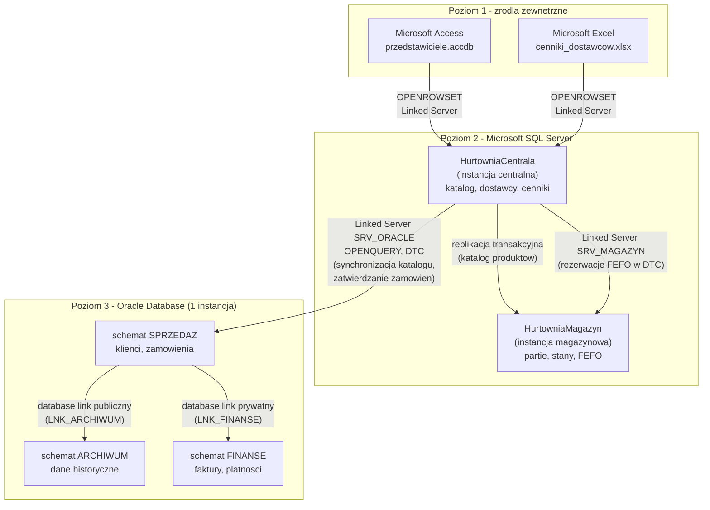
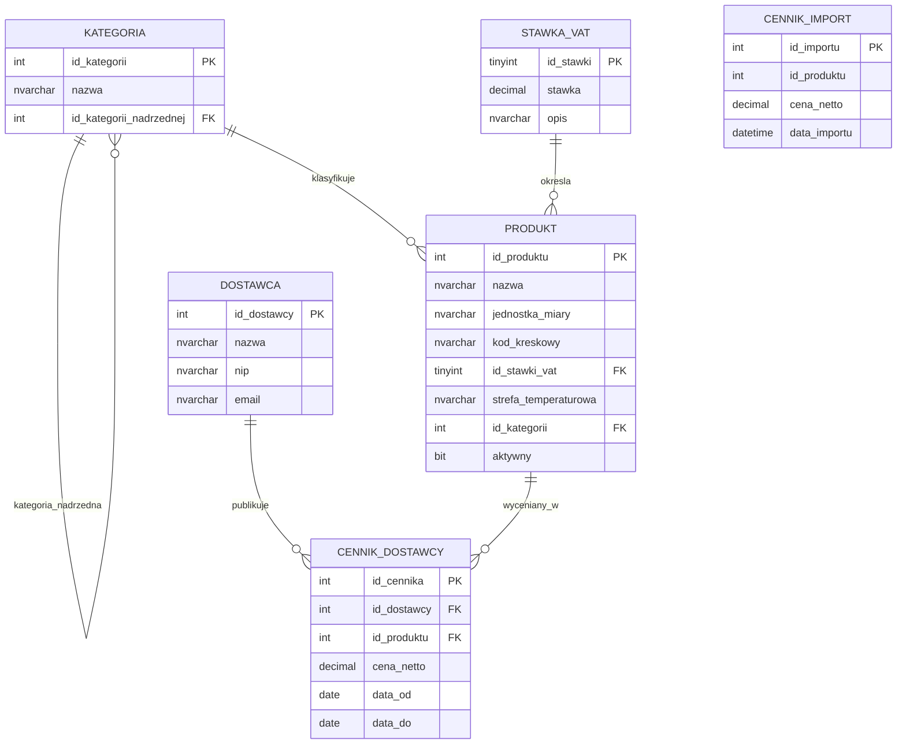
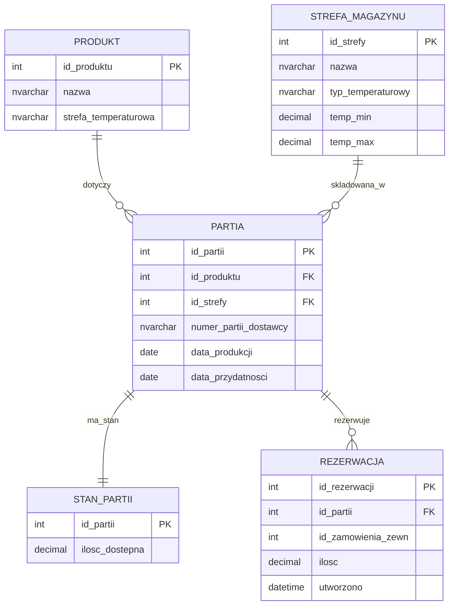
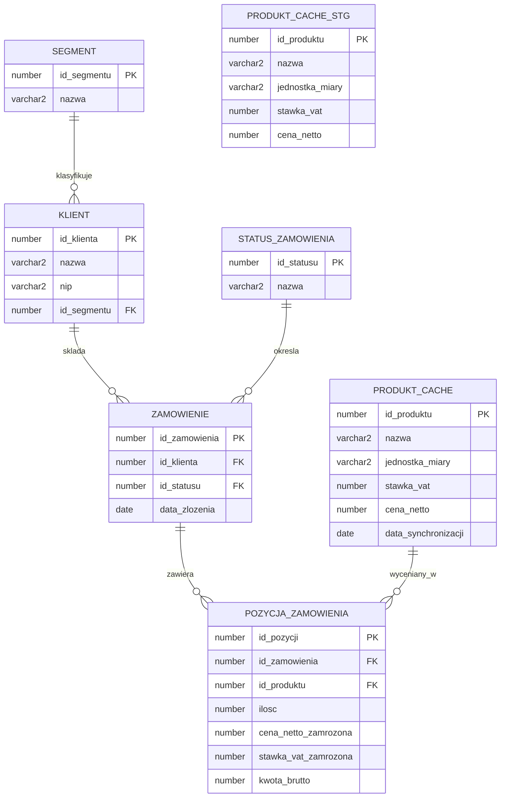
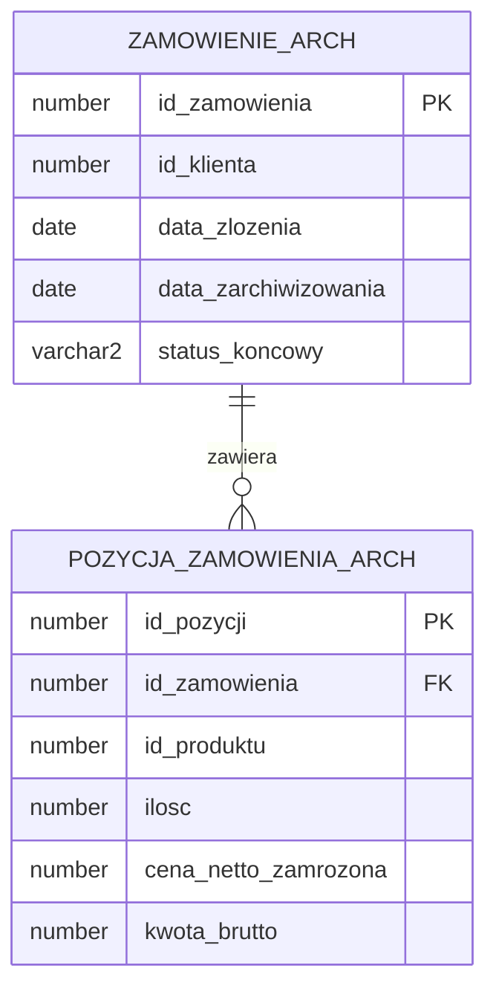
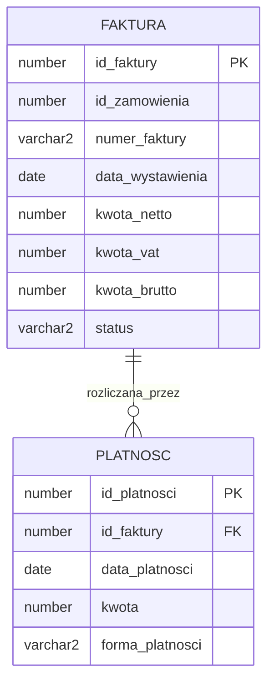
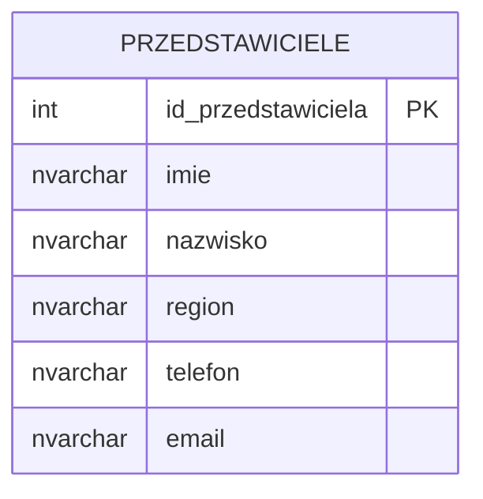
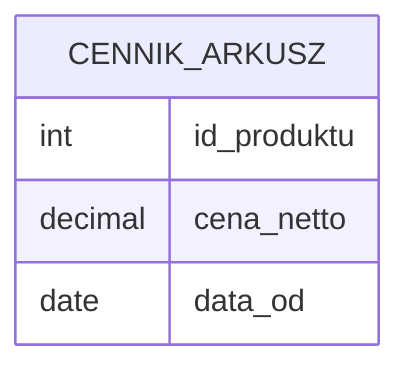

# Projekt rozproszonej bazy danych: Hurtownia POL-FOOD sp. z o.o.

**Politechnika Łódzka**, Wydział Elektrotechniki, Elektroniki, Informatyki i Automatyki  
Przedmiot: Rozproszone Bazy Danych, semestr 6  
Autorzy: Mateusz Mróz (251190), Maciej Górka (251143)  
Łódź, 2026

## Spis treści

1. [Wprowadzenie](#1-wprowadzenie)
2. [Wymagania biznesowe](#2-wymagania-biznesowe)
3. [Architektura rozproszonej bazy danych](#3-architektura-rozproszonej-bazy-danych)
4. [Model danych](#4-model-danych)
5. [Realizacja mechanizmów rozproszonych](#5-realizacja-mechanizmow-rozproszonych)
6. [Wnioski, ograniczenia i podział pracy](#6-wnioski-ograniczenia-i-podzial-pracy)

## 1. Wprowadzenie

Niniejszy dokument opisuje **projekt rozproszonej bazy danych** przygotowany w ramach przedmiotu **Rozproszone Bazy Danych**, pokrywającego poniższe zagadnienia: 
- ustanowienie serwerów połączonych, 
- zapytań ad hoc, 
- transakcji rozproszonych z koordynatorem MS DTC (Microsoft Distributed Transaction Coordinator), 
- replikacji, 
- łączy bazodanowych Oracle (database links), 
- niemodyfikowalnych widoków rozproszonych z wyzwalaczami INSTEAD OF
- pakietów PL/SQL.  

Domeną biznesową projektu jest **Hurtownia POL-FOOD sp. z o.o.**, polska hurtownia **przetworzonych produktów spożywczych** zaopatrująca sklepy detaliczne, restauracje i stołówki. Hurtownia prowadzi katalog produktów (konserwy, makarony, oleje, przyprawy, mrożonki) pochodzących od krajowych dostawców. Działalność firmy obejmuje **cztery powiązane obszary**:
- prowadzenie **katalogu produktów i współpracy z dostawcami** w centrali;
- fizyczne przyjmowanie i wydawanie partii towaru w magazynie z zachowaniem zasady **FEFO** (First Expired First Out) oraz kontrolą **stref temperaturowych** (chłodnia, mroźnia, suchy magazyn);
- obsługę **zamówień klientów** wraz z **zamrażaniem ceny** w momencie złożenia zamówienia;
- prowadzenie **ewidencji finansowej** (faktury, płatności) z **ograniczonym dostępem**.

Część danych historycznych jest **archiwizowana**, a część źródeł zewnętrznych pochodzi z plików **Microsoft Access** (kartoteka przedstawicieli pracujących w trybie offline) oraz arkuszy **Microsoft Excel** (cenniki dostawców).

## 2. Wymagania biznesowe

1. Firma prowadzi **jeden wspólny katalog produktów** oraz **hierarchię kategorii** (kategorie i podkategorie), tak aby wszystkie działy posługiwały się tym samym słownikiem towarów.
2. Każdy produkt jest opisany podstawowymi atrybutami handlowymi (**nazwa, jednostka miary, kod kreskowy, stawka VAT, strefa temperaturowa**), a stawki VAT pochodzą z **zamkniętego słownika** zgodnego z polskim prawem podatkowym.
3. Firma współpracuje z **wieloma dostawcami**, każdy dostawca może oferować ten sam produkt w innej cenie, a **aktualnie obowiązujący cennik** musi być znany w każdym momencie.
4. Towar w magazynie jest przyjmowany w postaci **partii (lotów)** z datą produkcji, datą przydatności i numerem partii dostawcy, a wydawanie towaru zawsze następuje zgodnie z **zasadą FEFO** (najpierw towar o najkrótszej dacie przydatności).
5. Magazyn jest podzielony na **strefy temperaturowe** (chłodnia, mroźnia, suchy magazyn), a produkt o danej strefie wymaganej musi być składowany wyłącznie w strefie zgodnej (kontrola zgodna z zasadami **HACCP**, czyli Hazard Analysis and Critical Control Points).
6. Klienci hurtowni dzielą się na **segmenty** (sklep detaliczny, restauracja, stołówka), a od segmentu zależą warunki handlowe oraz raportowanie sprzedaży.
7. W momencie złożenia zamówienia **cena jednostkowa produktu zostaje zapamiętana (zamrożona)** w pozycji zamówienia, tak aby późniejsza zmiana cennika nie wpłynęła na zamówienia już złożone.
8. Zamówienie przechodzi przez **ustalone statusy** (nowe, zatwierdzone, anulowane, zrealizowane), a zmiana statusu jest możliwa tylko zgodnie z **dopuszczalnymi przejściami**.
9. Dane historyczne (zamówienia zakończone, zarchiwizowane partie) są przenoszone do **oddzielnego archiwum** dostępnego w **trybie tylko do odczytu** dla działu sprzedaży i raportowania.
10. Dane finansowe (**faktury, płatności, salda klientów**) są dostępne **wyłącznie dla działu finansowego** i nie powinny być widoczne ani dla magazynu, ani dla sprzedaży operacyjnej.
11. Przedstawiciele handlowi pracujący w terenie korzystają z **lokalnej kartoteki klientów w pliku Microsoft Access** i okresowo udostępniają ją centrali.
12. Dostawcy przesyłają aktualizacje cenników w formie **arkuszy Microsoft Excel**, a system musi umożliwiać ich odczyt bezpośrednio z poziomu centrali.
13. Katalog produktów prowadzony w centrali musi być **automatycznie i ciągle replikowany** do magazynu, tak aby personel magazynowy zawsze pracował na aktualnej liście towarów i **nie mógł jej modyfikować lokalnie**.

## 3. Architektura rozproszonej bazy danych

### 3.1 Topologia

System składa się z trzech poziomów:

- **Poziom 1 - źródła zewnętrzne**: plik Microsoft Access (kartoteka przedstawicieli) oraz arkusz Microsoft Excel (cenniki dostawców).
- **Poziom 2 - Microsoft SQL Server**: dwie bazy danych na dwóch instancjach (`HurtowniaCentrala`, `HurtowniaMagazyn`), połączone serwerami połączonymi i replikacją transakcyjną.
- **Poziom 3 - Oracle Database**: jedna instancja z trzema schematami (`SPRZEDAZ`, `ARCHIWUM`, `FINANSE`), podłączona do centrali przez sterownik OLE DB i koordynator MS DTC.

### 3.2 Wykaz serwerów i serwerów połączonych

W projekcie skonfigurowano następujące serwery połączone po stronie Microsoft SQL Server oraz łącza bazodanowe po stronie Oracle:

| Nazwa | Typ | Źródło | Cel połączenia |
|---|---|---|---|
| `SRV_MAGAZYN` | Linked Server | SQL Server (instancja magazynowa) | dostęp z centrali do bazy `HurtowniaMagazyn` (rezerwacje FEFO w ramach DTC, modyfikacje stanów) |
| `SRV_ORACLE` | Linked Server | Oracle Database | dostęp z centrali do schematu `SPRZEDAZ` (synchronizacja katalogu, transakcje DTC) |
| `SRV_ACCESS` | Linked Server | plik `.accdb` Microsoft Access | dostęp z centrali do kartoteki przedstawicieli |
| `SRV_EXCEL` | Linked Server | plik `.xlsx` Microsoft Excel | dostęp z centrali do cennika dostawcy |
| `LNK_ARCHIWUM` | Database Link (publiczny) | Oracle, schemat `ARCHIWUM` | dostęp z `SPRZEDAZ` do danych historycznych dla wszystkich użytkowników |
| `LNK_FINANSE` | Database Link (prywatny) | Oracle, schemat `FINANSE` | dostęp z `SPRZEDAZ` do danych finansowych, wyłącznie dla uprawnionych użytkowników |

### 3.3 Całościowy diagram przepływu danych

Poniższy diagram przedstawia kompletny przepływ danych w systemie POL-FOOD pomiędzy trzema poziomami architektury (źródła zewnętrzne, MS SQL Server, Oracle Database), uwzględniając mechanizmy replikacji, transakcji rozproszonych DTC, bazodanowych łączy oraz izolacji schematów.

```mermaid
flowchart TD
    %% Nodes definition
    subgraph Poziom_1["Poziom 1: Źródła Zewnętrzne"]
        ACC[(Access File<br/>przedstawiciele.accdb)]
        XLS[(Excel File<br/>cenniki_dostawcow.xlsx)]
    end

    subgraph Poziom_2["Poziom 2: Microsoft SQL Server"]
        subgraph CEN["Baza: HurtowniaCentrala (Centrala)"]
            PROD[(PRODUKT)]
            CEN_IMP[(CENNIK_IMPORT)]
            DTC_PROC[sp_zatwierdz_zamowienie_dtc]
        end
        subgraph MAG["Baza: HurtowniaMagazyn (Magazyn)"]
            PROD_R[("PRODUKT (replika)")]
            PARTIA[(PARTIA_TOWARU)]
            REZ[(REZERWACJA)]
            FEFO_PROC[sp_rezerwuj_fefo]
        end
    end

    subgraph Poziom_3["Poziom 3: Oracle Database"]
        subgraph SCH_SPR["Schemat: SPRZEDAZ (Sprzedaż)"]
            P_CACHE[(PRODUKT_CACHE)]
            P_STG[(PRODUKT_CACHE_STG)]
            ZAM[(ZAMOWIENIE)]
            POZ[(POZYCJA_ZAMOWIENIA)]
            V_ZAM[V_ZAMOWIENIA_PELNE]
            PKG[PKG_SPRZEDAZ]
        end
        subgraph SCH_ARC["Schemat: ARCHIWUM (Archiwum)"]
            ZAM_A[(ZAMOWIENIE_ARCH)]
            POZ_A[(POZYCJA_ZAMOWIENIA_ARCH)]
        end
        subgraph SCH_FIN["Schemat: FINANSE (Finanse)"]
            FAK[(FAKTURA)]
            PLAT[(PLATNOSC)]
        end
        subgraph USERS["Użytkownicy Runtime"]
            SPR_U[SPRZEDAZ_USER]
            FIN_U[FINANSE_USER]
        end
    end

    %% Data Flows
    %% Poziom 1 to Poziom 2
    ACC -->|"[1] Odczyt przedstawicieli (OPENROWSET)"| CEN
    XLS -->|"[2] Import cenników dostawców (OPENROWSET)"| CEN_IMP

    %% Centrala to Magazyn
    PROD -->|"[3] Replikacja Transakcyjna"| PROD_R

    %% Centrala to Oracle (Synchronizacja katalogu)
    PROD -->|"[4] sp_push_produkty_to_oracle (OPENQUERY)"| P_STG
    P_STG -->|"[5] Upsert (MERGE)"| P_CACHE

    %% Sales Flow
    SPR_U -->|"[6] Złożenie zamówienia (sp_zarejestruj_zamowienie)"| PKG
    PKG -->|"[7] Mrożenie ceny z PRODUKT_CACHE"| P_CACHE
    PKG -->|"[8] Zapis"| ZAM
    PKG -->|"[8] Zapis"| POZ

    %% DTC Flow
    DTC_PROC -->|"[9] Otwarcie transakcji DTC"| CEN
    DTC_PROC -->|"[10] sp_rezerwuj_fefo (SRV_MAGAZYN)"| FEFO_PROC
    FEFO_PROC -->|"[11] Rezerwacja partii (FEFO)"| REZ
    FEFO_PROC -->|"[11] Zmniejszenie stanu"| PARTIA
    DTC_PROC -->|"[12] Aktualizacja statusu na ZATWIERDZONE (SRV_ORACLE)"| ZAM

    %% Archiwum Flow
    V_ZAM -->|"[13] UNION ALL (LNK_ARCHIWUM)"| ZAM_A
    V_ZAM -->|"[13] UNION ALL"| ZAM
    SPR_U -->|"[14] Odczyt pełnych danych"| V_ZAM
    
    %% INSTEAD OF Trigger Flow
    V_ZAM -.->|"[15] INSTEAD OF trigger"| TRG[trg_v_zamowienia_io]
    TRG -->|< 24 mies.| ZAM
    TRG -->|">= 24 mies. (LNK_ARCHIWUM)"| ZAM_A

    %% Finanse Isolation Flow
    FIN_U -->|"[16] Dostęp przez link prywatny LNK_FINANSE"| FAK
    FIN_U -->|"[16] Dostęp przez link prywatny LNK_FINANSE"| PLAT
    SPR_U -.->|"[17] Próba dostępu (BLOKADA - ORA-02019)"| FAK
```

## 4. Model danych

### 4.1 Baza HurtowniaCentrala (Microsoft SQL Server)

Baza centralna przechowuje **słowniki i katalog produktów** oraz **informacje handlowe o dostawcach i ich aktualnych cennikach**. Jest jedynym miejscem, w którym katalog można modyfikować; pozostałe systemy otrzymują go w trybie tylko do odczytu poprzez replikację (do magazynu) lub poprzez push z procedury (do schematu sprzedaży w Oracle).  

Tabela `CENNIK_IMPORT` jest pomocniczą tabelą buforową, do której trafiają wiersze odczytane z arkusza Excel przez procedurę `sp_importuj_cennik_excel`, zanim zmienione ceny zostaną naniesione na właściwy cennik `CENNIK_DOSTAWCY`.

### 4.2 Baza HurtowniaMagazyn (Microsoft SQL Server)

Baza magazynowa przechowuje informacje o **fizycznym stanie towaru**: strefy magazynu, partie z datami przydatności, stany ilościowe partii oraz rezerwacje zrealizowane na potrzeby zamówień. Replika katalogu produktów (`HurtowniaMagazyn.dbo.PRODUKT`) jest tu obecna jako tabela docelowa replikacji transakcyjnej, modyfikowana wyłącznie przez mechanizm replikacji.

### 4.3 Schemat SPRZEDAZ (Oracle Database)

Schemat sprzedaży przechowuje **klientów, ich segmenty, zamówienia i pozycje zamówień** wraz z zamrożoną ceną z momentu złożenia zamówienia. Zawiera również cache produktów odświeżany procedurą `sp_push_produkty_to_oracle` z centrali Microsoft SQL Server.

Tabela `PRODUKT_CACHE_STG` jest pomocniczą tabelą stagingową dla procedury `sp_push_produkty_to_oracle`: centrala wypełnia ją przez notację czteroczęściową, a `MERGE` po stronie Oracle wykonuje upsert do docelowej `PRODUKT_CACHE`.

Słownik `STATUS_ZAMOWIENIA` zawiera cztery rekordy zgodne z dopuszczalnymi przejściami statusów: `1 = NOWE`, `2 = ZATWIERDZONE`, `3 = ANULOWANE`, `4 = ZREALIZOWANE`.

Kolumna `PRODUKT_CACHE.cena_netto` jest aktualizowana przez procedurę `dbo.sp_push_produkty_to_oracle` wraz z pozostałymi atrybutami katalogu i służy jako źródło ceny zamrażanej w pozycjach zamówienia.

### 4.4 Schemat ARCHIWUM (Oracle Database)

Schemat archiwum przechowuje **dane historyczne** zrealizowanych zamówień i wycofanych partii. Dane te są udostępniane z poziomu schematu `SPRZEDAZ` przez publiczny database link `LNK_ARCHIWUM` w widoku rozproszonym tylko do odczytu.

### 4.5 Schemat FINANSE (Oracle Database)

Schemat finansów przechowuje **faktury i płatności** powiązane z zamówieniami sprzedaży. Dostęp do niego jest celowo ograniczony i odbywa się wyłącznie przez prywatny database link `LNK_FINANSE` dostępny tylko dla użytkownika finansowego.

---

### 4.6 Źródło zewnętrzne — Microsoft Access (`SRV_ACCESS`)

Plik `przedstawiciele.accdb` zawiera kartotekę przedstawicieli handlowych pracujących w terenie. Centrala odczytuje te dane przez serwer połączony `SRV_ACCESS`.

### 4.7 Źródło zewnętrzne — Microsoft Excel (`SRV_EXCEL`)

Plik `cenniki_dostawcow.xlsx` zawiera cennik przesłany przez dostawcę. Centrala wczytuje arkusz `Cennik$` przez serwer połączony `SRV_EXCEL` i ładuje dane do tabeli buforowej `CENNIK_IMPORT`.

## 4.8 Scenariusze użycia

**Złożenie nowego zamówienia.** 
Klient telefonuje do działu sprzedaży. Operator wywołuje procedurę `PKG_SPRZEDAZ.sp_zarejestruj_zamowienie` (status `NOWE`) i wielokrotnie `sp_dodaj_pozycje`. Każda pozycja czerpie aktualną cenę i stawkę VAT z `SPRZEDAZ.PRODUKT_CACHE` (zsynchronizowanej z centrali) i **zamraża** je w wierszu `POZYCJA_ZAMOWIENIA`.  

**Zatwierdzenie zamówienia (FEFO + DTC).** 
Po skompletowaniu zamówienia operator wywołuje w centrali procedurę `dbo.sp_zatwierdz_zamowienie_dtc`. Procedura otwiera **transakcję rozproszoną** koordynowaną przez MS DTC, w jej ramach uruchamia `dbo.sp_rezerwuj_fefo` (rezerwacja partii w `HurtowniaMagazyn` przez `SRV_MAGAZYN` w kolejności daty przydatności), a następnie przez `SRV_ORACLE` zmienia status zamówienia na `ZATWIERDZONE`. Obie operacje zatwierdzają się razem albo wycofują razem.

**Synchronizacja katalogu.**  
Pracownik centrali dodaje nowy produkt do tabeli `HurtowniaCentrala.dbo.PRODUKT`. **Replikacja transakcyjna** w ciągu sekund propaguje go do `HurtowniaMagazyn.dbo.PRODUKT` (tryb tylko do odczytu po stronie magazynu). Cyklicznie uruchamiana procedura `dbo.sp_push_produkty_to_oracle` synchronizuje również `SPRZEDAZ.PRODUKT_CACHE` w Oracle przez `SRV_ORACLE`.

**Raport sprzedaży z danymi historycznymi.** 
Dział raportowania wybiera dane z `SPRZEDAZ.V_ZAMOWIENIA_PELNE`. Widok rozproszony łączy zamówienia bieżące z lokalnej tabeli `ZAMOWIENIE` z zamówieniami archiwalnymi pobranymi przez publiczny **database link** `LNK_ARCHIWUM`. Widok jest oznaczony `WITH READ ONLY` (modyfikacja archiwum przez widok jest zablokowana, a próba wywołania wyzwala `INSTEAD OF` zwracający błąd).

## 5. Realizacja mechanizmów rozproszonych

### 5.1 Spis widoków i procedur

**Microsoft SQL Server — HurtowniaCentrala (`dbo`)**

| Obiekt | Typ | Co robi |
|---|---|---|
| `dbo.v_porownanie_cen` | widok rozproszony | Zestawia ceny produktów z dwóch różnych źródeł naraz — z bazy Oracle i z pliku Excel. Pozwala w jednym zapytaniu zobaczyć, czy cena w Excelu zgadza się z ceną zapisaną w systemie sprzedaży. |
| `dbo.v_produkty_sprzedaz_stan` | widok rozproszony | Zestawia dla każdego produktu łączną ilość zamówioną (z Oracle) z ilością dostępną w magazynie (z SQL Servera). Daje obraz: co się sprzedaje i ile jeszcze zostało na stanie. |
| `dbo.sp_importuj_cennik_excel` | procedura | Czyta plik Excel z cennikiem dostawcy i aktualizuje cennik z zachowaniem historii: dla zmienionych cen zamyka stary wpis (data_do) i dodaje nowy. Na końcu pokazuje, które ceny się zmieniły (stara → nowa). |
| `dbo.sp_zatwierdz_zamowienie_dtc` | procedura | Zatwierdza zamówienie w sposób bezpieczny: jednocześnie rezerwuje towar w magazynie i zmienia status zamówienia w Oracle. Jeśli cokolwiek się nie uda, obie zmiany są cofane razem. |
| `dbo.sp_rezerwuj_fefo` | procedura | Rezerwuje towar pod zamówienie. Zawsze sięga najpierw po partie z najkrótszą datą przydatności (zasada FEFO), żeby nic nie przeterminowało się w magazynie. |
| `dbo.sp_push_produkty_to_oracle` | procedura | Kopiuje aktualny katalog produktów z centrali do systemu sprzedaży w Oracle. Jeśli produkt już tam istnieje, aktualizuje jego dane; jeśli nie — dodaje go. |

**Oracle Database — schemat `SPRZEDAZ`**

| Obiekt | Typ | Co robi |
|---|---|---|
| `SPRZEDAZ.V_ZAMOWIENIA_PELNE` | widok rozproszony (RO) | Pokazuje wszystkie zamówienia — zarówno bieżące, jak i te historyczne z archiwum. Dane są tylko do odczytu; nic przez ten widok zmienić się nie da. |
| `SPRZEDAZ.V_POZYCJE_PELNE` | widok rozproszony (RO) | To samo co wyżej, ale dla pozycji zamówień (czyli konkretnych produktów i ilości). Łączy pozycje bieżące z historycznymi. Tylko do odczytu. |
| `SPRZEDAZ.trg_v_zamowienia_io` | wyzwalacz INSTEAD OF | Pilnuje, co się dzieje, gdy ktoś próbuje coś zapisać przez widok `V_ZAMOWIENIA_PELNE`. Nowe zamówienie trafi do bieżącej tabeli albo do archiwum zależnie od daty. Modyfikacja lub usunięcie danych archiwalnych jest blokowane z błędem. |
| `SPRZEDAZ.PKG_SPRZEDAZ` | pakiet PL/SQL | Zbiór procedur i funkcji obsługujących sprzedaż — zgrupowanych razem dla porządku. Zawiera wszystko, co potrzebne do przyjęcia i obsługi zamówienia. |
| `PKG_SPRZEDAZ.sp_zarejestruj_zamowienie` | procedura (pakiet) | Tworzy nowe zamówienie dla klienta ze statusem „NOWE" i zwraca jego numer. |
| `PKG_SPRZEDAZ.sp_dodaj_pozycje` | procedura (pakiet) | Dodaje produkt do zamówienia. W tym momencie zapisuje aktualną cenę i stawkę VAT, żeby późniejsza zmiana cennika nie wpłynęła na to zamówienie. |
| `PKG_SPRZEDAZ.sp_anuluj_zamowienie` | procedura (pakiet) | Anuluje zamówienie. Sprawdza najpierw, czy zamówienie w ogóle można anulować — już zrealizowanego lub wcześniej anulowanego anulować się nie da. |
| `PKG_SPRZEDAZ.sp_raport_top_klienci` | procedura (pakiet) | Wyświetla listę N największych klientów według łącznej wartości ich zamówień. Domyślnie pokazuje top 10. |
| `PKG_SPRZEDAZ.fn_pobierz_aktualna_cena` | funkcja (pakiet) | Zwraca aktualną cenę netto produktu. Używana przy dodawaniu pozycji do zamówienia, żeby zamrozić właściwą cenę. |

---

### 5.2 Zapytania ad hoc OPENROWSET

W projekcie zaimplementowano cztery warianty zapytań ad hoc przy użyciu funkcji `OPENROWSET` w celu jednorazowego dostępu do zdalnych źródeł danych bez konfigurowania trwałych połączeń:
* **SQL Server - SQL Server**: Centrala pobiera dane o stanach magazynowych bezpośrednio z instancji magazynowej, wywołując zdalne podsumowanie (agregację `SUM` ilości pogrupowaną po strefie magazynowej) bezpośrednio na silniku magazynu, aby zminimalizować transfer sieciowy.
* **SQL Server - Oracle**: Centrala pobiera liczbę zamówień pogrupowaną po statusach z systemu Oracle. Agregacja i złączenie ze słownikiem statusów wykonują się na zdalnym serwerze Oracle.
* **SQL Server - Access**: Centrala pobiera dane przedstawicieli handlowych z lokalnego pliku bazy danych Access (`.accdb`) przy użyciu sterownika ACE OLE DB.
* **SQL Server - Excel**: Centrala odczytuje arkusz cennika dostawcy z pliku Excel (`.xlsx`), pobierając identyfikatory produktów, ceny oraz daty obowiązywania.

Dodatkowo zdefiniowano:
* **Widok wielodostępny `dbo.v_porownanie_cen`**: Łączy on lokalny aktualny cennik z centrali z cenami pobranymi z Oracle oraz z pliku Excel — oba zdalne źródła pobierane są przez `OPENQUERY` przez serwery połączone `SRV_ORACLE` i `SRV_EXCEL` (we widoku nie można użyć ad hoc `OPENROWSET` ze zmienną ścieżką pliku). Aby zapewnić stabilność i poprawność złączeń, widok stosuje jawne rzutowanie typów (`CAST`) dla identyfikatorów, nazw i cen. Nad tym widokiem wykonywane są lokalne agregacje (średnia cena, liczba pozycji).
* **Procedurę `dbo.sp_importuj_cennik_excel`**: Przyjmuje ścieżkę do pliku jako parametr, wczytuje ceny z Excela do tabeli buforowej `CENNIK_IMPORT`, a następnie nanosi zmienione ceny na cennik `CENNIK_DOSTAWCY` z zachowaniem historii (zamknięcie starego wpisu przez `data_do` i dodanie nowego z `data_do IS NULL`). Na końcu zwraca raport pokazujący, które ceny się zmieniły (stara → nowa). Ceny zamrożone w już złożonych zamówieniach nie są naruszane.

### 5.3 Serwery połączone i mapowanie loginów

Dla stałych połączeń skonfigurowano cztery serwery połączone: `SRV_ORACLE` (do Oracle Database), `SRV_MAGAZYN` (do drugiej instancji SQL Server), `SRV_ACCESS` (dla bazy przedstawicieli) oraz `SRV_EXCEL` (dla arkuszy cenników).

Wszystkie połączenia skonfigurowano z jawnym mapowaniem kont: lokalny login aplikacji centrali (`CentralaApp`) jest mapowany na dedykowane, ograniczone konto zdalne (np. konto `SPRZEDAZ_USER` w Oracle). Zapobiega to korzystaniu z kont o zbyt wysokich uprawnieniach (takich jak `sa` lub `SYSTEM`).

Do diagnostyki i weryfikacji konfiguracji wykorzystywane są systemowe procedury składowane i widoki:
* `sp_linkedservers` – wyświetla listę zarejestrowanych serwerów połączonych.
* `sp_helplinkedsrvlogin` – listuje zdefiniowane mapowania loginów.
* Widok systemowy `sys.servers` – pozwala sprawdzić konfigurację serwerów.
* `sp_testlinkedserver` – testuje fizyczne połączenie ze wskazanym serwerem (np. z `SRV_ORACLE`).

### 5.4 Zapytania przekazujące OPENQUERY

W projekcie zastosowano funkcję `OPENQUERY` do pobierania danych ze schematu Oracle w celu przeniesienia ciężaru przetwarzania (złączeń tabel, filtrowania i agregacji) bezpośrednio na silnik zdalny (Oracle), co ogranicza ruch sieciowy. Zrealizowano następujące scenariusze:
* **Zdalny raport Top 10 klientów**: Zapytanie przekazane do Oracle łączy tabele klientów, zamówień i ich pozycji, sumuje wartość brutto per klient, sortuje malejąco i ogranicza wynik do 10 wierszy (`FETCH FIRST 10 ROWS ONLY`) bezpośrednio na serwerze Oracle.
* **Widok rozproszony `dbo.v_produkty_sprzedaz_stan`**: Łączy on zagregowaną per produkt ilość zamówioną pobraną z Oracle za pomocą `OPENQUERY` z ilością dostępną w magazynie pobraną z serwera magazynowego `SRV_MAGAZYN`, złączając oba źródła po `id_produktu`.

### 5.5 Wstawianie i modyfikowanie danych na zdalnych źródłach

Modyfikacja danych w systemie rozproszonym została zrealizowana w trzech scenariuszach:
* **Dodawanie produktu do Oracle**: Wstawianie nowego rekordu produktu bezpośrednio do tabeli cache w Oracle (`SRV_ORACLE..SPRZEDAZ.PRODUKT_CACHE`) przy użyciu notacji czteroczęściowej.
* **Aktualizacja stanów w magazynie**: Zmniejszanie ilości dostępnego towaru w tabeli stanów magazynowych na serwerze `SRV_MAGAZYN`.
* **Wykonanie instrukcji w Oracle**: Zdalna aktualizacja opisu produktu w cache Oracle realizowana za pomocą dynamicznego polecenia SQL przekazanego do wykonania bezpośrednio na serwerze `SRV_ORACLE`.

### 5.6 Transakcje rozproszone z MS DTC

Najważniejszy proces biznesowy – **zatwierdzenie zamówienia** – wymaga jednoczesnej zmiany statusu zamówienia w bazie Oracle (`SPRZEDAZ.ZAMOWIENIE`) oraz zarezerwowania towaru w bazie magazynowej na SQL Server (`HurtowniaMagazyn.dbo.STAN_PARTII`). Obie operacje muszą być atomowe.

Do ich koordynacji wykorzystano **MS DTC** (Microsoft Distributed Transaction Coordinator) współdziałający z **OraMTS** po stronie Oracle. Implementacja opiera się na:
* **Procedurze głównej `dbo.sp_zatwierdz_zamowienie_dtc`**: Uruchamia ona transakcję rozproszoną (`BEGIN DISTRIBUTED TRANSACTION`). W jej ramach najpierw wywoływana jest lokalna procedura rezerwacji FEFO, a następnie przez serwer połączony `SRV_ORACLE` modyfikowany jest status zamówienia w Oracle na `ZATWIERDZONE` (status 2). Całość zatwierdza się w protokole dwufazowym (2PC) lub wycofuje w przypadku jakiegokolwiek błędu.
* **Procedurze rezerwacji `dbo.sp_rezerwuj_fefo`**: Działa ona w oparciu o kursor przechodzący po pozycjach zamówienia. Dla każdego produktu otwiera kursor po partiach w magazynie, posortowanych według najkrótszej daty przydatności (zasada FEFO). Procedura sukcesywnie zmniejsza dostępną ilość w tabeli stanów partii i zapisuje rezerwacje, aż do pokrycia zapotrzebowania. Jeśli stan magazynowy jest niewystarczający, zgłasza błąd, co powoduje wycofanie całej transakcji rozproszonej.

### 5.7 Replikacja

Spośród trzech rodzajów replikacji oferowanych przez Microsoft SQL Server (transakcyjna, migawkowa, uzgadniana) wybrano **replikację transakcyjną** dla katalogu produktów z bazy `HurtowniaCentrala` (publisher) do bazy `HurtowniaMagazyn` (subscriber). Wybór ten wynika z trzech przesłanek:

- katalog jest modyfikowany w jednym miejscu (centrala) i tylko czytany w drugim (magazyn), więc nie potrzeba dwukierunkowej replikacji uzgadniającej konflikty;
- magazyn musi pracować na aktualnym katalogu w trybie quasi-ciągłym (zmiana ceny VAT albo nowa pozycja powinna być widoczna w ciągu sekund), co eliminuje replikację migawkową, która kopiuje całe migawki w wybranych momentach;
- replikacja transakcyjna jest klasycznym, dobrze udokumentowanym mechanizmem do tego scenariusza i opiera się na czytaniu logu transakcji przez agenta `Log Reader`.

Publikacją objęto tabelę `PRODUKT` z centrali, która po stronie magazynu pojawia się jako `HurtowniaMagazyn.dbo.PRODUKT` w trybie tylko do odczytu (uprawnienia magazynu nie obejmują `INSERT`/`UPDATE`/`DELETE` na tej tabeli; ewentualne modyfikacje byłyby i tak nadpisane przez replikację). Po stronie publishera wykorzystywane są agenci `Snapshot Agent` (inicjalna migawka) i `Log Reader Agent`, po stronie subscribera - `Distribution Agent`.

### 5.8 Oracle - użytkownicy, prawa, role

W bazie Oracle utworzono trzy niezależne schematy: `SPRZEDAZ`, `ARCHIWUM` oraz `FINANSE`. W celu bezpiecznego zarządzania uprawnieniami wdrożono role dziedzinowe:
* `rola_sprzedaz` – nadaje uprawnienia do odczytu i zapisu zamówień oraz odczytu cache produktów w schemacie `SPRZEDAZ`.
* `rola_archiwum_ro` – nadaje uprawnienia wyłącznie do odczytu tabel archiwum w schemacie `ARCHIWUM`.
* `rola_finanse` – nadaje pełne uprawnienia do faktur i płatności w schemacie `FINANSE`.

Role te zostały przypisane odpowiednim użytkownikom: 
* `SPRZEDAZ_USER` - posiada rolę do sprzedaży oraz rolę do odczytu archiwum, co pozwala mu na łączenie danych bieżących z historycznymi. Nie ma on jednak żadnego dostępu do danych finansowych. 
* `FINANSE_USER` - posiada rolę dającą dostęp do danych finansowych.

### 5.9 Database links - publiczny i prywatny

Do połączeń między schematami w Oracle zaimplementowano dwa rodzaje łączy bazodanowych:
* **Łącze publiczne `LNK_ARCHIWUM`**: Należy do przestrzeni publicznej bazy danych i wskazuje na schemat `ARCHIWUM`. Umożliwia każdemu użytkownikowi odczyt danych historycznych.
* **Łącze prywatne `LNK_FINANSE`**: Zostało utworzone wyłącznie w schemacie użytkownika `FINANSE_USER`. Jest niewidoczne dla innych użytkowników. Próba odpytania tabel przez to łącze z poziomu konta `SPRZEDAZ_USER` skutkuje błędem `ORA-02019` (brak opisu połączenia), co skutecznie izoluje dane finansowe.

### 5.10 Symulacja zdalnych źródeł przez wielu użytkowników Oracle

Architektura z wieloma schematami i łączami bazodanowymi w obrębie jednej instancji Oracle symuluje rozproszone środowisko bazodanowe. Z perspektywy schematu `SPRZEDAZ`, tabele w schemacie `ARCHIWUM` są traktowane jako tabele zdalne – dostęp do nich wymaga użycia przyrostka `@LNK_ARCHIWUM`.

Pozwala to na realizację zapytań łączących dane lokalne (bieżące zamówienia) ze zdalnymi (zamówienia archiwalne) za pomocą operatora `UNION ALL`, co odpowiada rzeczywistemu podziałowi danych w systemach rozproszonych.

### 5.11 Niemodyfikowalne widoki rozproszone w Oracle

W schemacie `SPRZEDAZ` utworzono dwa widoki łączący tabele lokalne ze zdalnymi przez database link:
* `V_ZAMOWIENIA_PELNE` – łączy bieżące zamówienia z historycznymi.
* `V_POZYCJE_PELNE` – łączy pozycje bieżących zamówień z pozycjami archiwalnymi.

Widoki te są z definicji strukturalnej niemodyfikowalne z powodu użycia operatora `UNION ALL` oraz łącza bazodanowego. Aby zagwarantować spójność metadanych, w zapytaniach tworzących widoki zastosowano jawne rzutowanie typów (`CAST`) dla kolumn pochodzących ze zdalnego archiwum. Dodatkowo oba widoki zostały zdefiniowane z klauzulą `WITH READ ONLY`, co blokuje jakiekolwiek próby bezpośrednich modyfikacji danych na poziomie silnika bazy danych.

### 5.12 Wyzwalacze INSTEAD OF do widoków rozproszonych

Aby umożliwić aplikacjom klienckim wykonywanie operacji zapisu i modyfikacji bezpośrednio na widoku rozproszonym `V_ZAMOWIENIA_PELNE` (ukrywając fizyczną lokalizację danych), zaimplementowano wyzwalacz typu `INSTEAD OF`.

Wyzwalacz przechwytuje operacje i wykonuje następującą logikę:
* **INSERT**: Sprawdza datę złożenia zamówienia. Jeśli zamówienie jest nowsze niż 24 miesiące, wstawia je do lokalnej tabeli zamówień bieżących ze statusem "NOWE". Jeśli jest starsze, przesyła je przez database link `LNK_ARCHIWUM` do zdalnej tabeli archiwum ze statusem "ZARCHIWIZOWANE".
* **UPDATE**: Modyfikuje dane w lokalnej tabeli zamówień bieżących. Jeśli próba modyfikacji dotyczy rekordu z archiwum (weryfikowane na podstawie flagi źródła danych), wyzwalacz blokuje operację i zgłasza dedykowany błąd aplikacji.
* **DELETE**: Usuwanie zamówień bezpośrednio przez widok jest całkowicie zablokowane i zawsze zwraca błąd, chroniąc integralność danych historycznych.

Wyzwalacz `SPRZEDAZ.TRG_V_ZAMOWIENIA_IO` jest zaimplementowany w pliku [oracle/10_create_triggers.sql](oracle/10_create_triggers.sql).

### 5.13 Procedury składowane Oracle (PL/SQL)

Logika biznesowa obsługi sprzedaży po stronie bazy Oracle została zgrupowana w pakiecie PL/SQL `PKG_SPRZEDAZ` w schemacie `SPRZEDAZ`. Pakiet ten zawiera:
* Procedurę rejestracji nowego zamówienia, która tworzy nagłówek zamówienia w statusie `NOWE` i zwraca jego wygenerowany identyfikator.
* Procedurę dodawania pozycji do zamówienia, która pobiera stawkę VAT i cenę z lokalnego cache produktów (`PRODUKT_CACHE`), wylicza wartość brutto i wstawia rekord do pozycji zamówienia, realizując wymóg zamrożenia ceny.
* Procedurę anulowania zamówienia sprawdzającą bieżący status zamówienia (anulowanie jest możliwe tylko dla zamówień, które nie zostały jeszcze zrealizowane ani wcześniej anulowane).
* Funkcję pobierania aktualnej ceny produktu na podstawie najświeższego wpisu w cache.
* Procedurę raportu Top Klientów, która za pomocą kursora pobiera i sumuje wartości zamówień dla największych kontrahentów.

Pakiet `SPRZEDAZ.PKG_SPRZEDAZ` (specyfikacja + ciało) wraz z powyższymi procedurami i funkcją jest zaimplementowany w pliku [oracle/11_create_packages.sql](oracle/11_create_packages.sql), a synonim `SPRZEDAZ_USER.PKG_SPRZEDAZ` tworzy [oracle/8_create_synonyms.sql](oracle/8_create_synonyms.sql).

Synchronizacja katalogu produktów i cennika z centrali SQL Server do cache Oracle realizowana jest przez procedurę po stronie SQL Server `dbo.sp_push_produkty_to_oracle`. Procedura ta najpierw czyści tymczasową tabelę stagingową w Oracle (`PRODUKT_CACHE_STG`), kopiuje do niej najnowsze dane produktów i cen z SQL Server przy użyciu notacji czteroczęściowej, a na koniec wywołuje po stronie Oracle polecenie `MERGE`, które w sposób atomowy aktualizuje docelową tabelę cache `PRODUKT_CACHE`.
