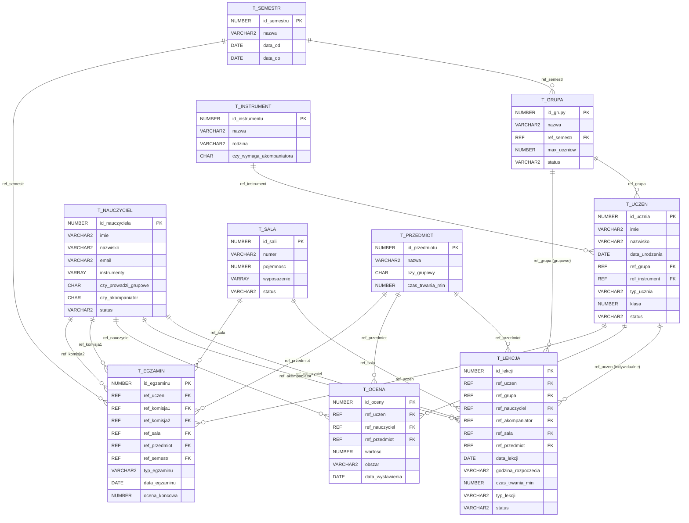

# 🧠 BURZA MÓZGÓW - CLAUDE 4.5 OPUS
## Projekt: Obiektowa Baza Danych - Szkoła Muzyczna

**Autor analizy:** Claude 4.5 Opus  
**Data:** 31 stycznia 2026  
**Cel:** Gruntowna analiza i przeprojektowanie bazy danych szkoły muzycznej

---

## 📋 SPIS TREŚCI

1. [Analiza Istniejącego Kodu v4](#analiza-istniejącego-kodu-v4)
2. [Sekcja 1: Wymagania i Założenia](#sekcja-1-wymagania-i-założenia)
3. [Sekcja 2: Model Danych - Typy Obiektowe](#sekcja-2-model-danych-typy-obiektowe)
4. [Sekcja 3: Tabele i Relacje](#sekcja-3-tabele-i-relacje)
5. [Sekcja 4: Role Użytkowników](#sekcja-4-role-użytkowników)
6. [Sekcja 5: Logika Biznesowa - Pakiety](#sekcja-5-logika-biznesowa-pakiety)
7. [Sekcja 6: Triggery i Walidacja](#sekcja-6-triggery-i-walidacja)
8. [Sekcja 7: Heurystyka Planu Lekcji](#sekcja-7-heurystyka-planu-lekcji)
9. [Sekcja 8: System Testowania](#sekcja-8-system-testowania)
10. [Sekcja 9: Diagram Relacji](#sekcja-9-diagram-relacji)
11. [Review i Korekta Błędów](#review-i-korekta-błędów)

---

## 🔍 ANALIZA ISTNIEJĄCEGO KODU V4

### Co mamy obecnie (z v4):

#### Typy obiektowe (8):
1. `t_instrument_obj` - instrument muzyczny
2. `t_lista_instrumentow` - VARRAY(5) dla nauczycieli
3. `t_sala_obj` - sala z wyposażeniem (fortepian, perkusja)
4. `t_nauczyciel_obj` - nauczyciel z listą instrumentów
5. `t_uczen_obj` - uczeń z metodami (wiek, czy_dziecko)
6. `t_kurs_obj` - kurs z REF do instrumentu
7. `t_lekcja_obj` - lekcja z 4x REF
8. `t_ocena_obj` - ocena z 2x REF

#### Pakiety (3):
1. `pkg_uczen` - zarządzanie uczniami
2. `pkg_lekcja` - planowanie lekcji
3. `pkg_ocena` - oceny

#### Triggery (7):
- Walidacja wieku (min 5 lat)
- Dni robocze (Pn-Pt)
- Godziny dla dzieci (14:00-19:00)
- Blokady usuwania (4 triggery)

#### Role (3):
- rola_admin
- rola_sekretariat
- rola_nauczyciel

### 🚨 ZIDENTYFIKOWANE PROBLEMY:

| Problem | Opis | Priorytet |
|---------|------|-----------|
| **P1** | Diagram relacji nie pokazuje połączeń między tabelami | KRYTYCZNY |
| **P2** | Założenia za mało szczegółowe | KRYTYCZNY |
| **P3** | Brak roli UCZNIA jako użytkownika | WYSOKI |
| **P4** | Logika "dziecka" oparta na wieku zamiast statusu ucznia | WYSOKI |
| **P5** | Brak obsługi zajęć GRUPOWYCH | WYSOKI |
| **P6** | Brak systemu testowania interaktywnego | WYSOKI |
| **P7** | Brak heurystyki układania planu lekcji | ŚREDNI |
| **P8** | Brak obsługi wypożyczeń instrumentów | ŚREDNI |
| **P9** | Brak obsługi semestru/roku szkolnego | ŚREDNI |
| **P10** | Brak testów wstępnych/końcowych uczniów | ŚREDNI |

---

## 📌 FUNDAMENTALNE ZAŁOŻENIA PROJEKTOWE

### Typ szkoły: **Prywatna szkoła muzyczna z uprawnieniami szkoły publicznej**

To oznacza:
- Realizuje podstawę programową MKiDN
- Ma cykle nauczania (6-letni lub 4-letni)
- Prowadzi zajęcia indywidualne I grupowe
- Wystawia świadectwa państwowe
- Uczniowie to głównie dzieci uczące się w szkołach ogólnokształcących

### Ograniczenia czasowe projektu:
- **1 semestr** (nie pełny rok)
- Semestr = 15-17 tygodni zajęć
- Tydzień = definicja planu tygodniowego (powtarzalny wzorzec)

---

## SEKCJA 1: WYMAGANIA I ZAŁOŻENIA

### 🎯 CEL SEKCJI
Zdefiniować KOMPLETNĄ listę założeń biznesowych, która będzie "biblią" projektu. Każde ograniczenie, każda reguła, każda relacja musi być tutaj zapisana.

---

### 💡 POMYSŁ 1: Model "Szkoła Państwowa Light"

**Opis:** Bazujemy na strukturze PSM I stopnia, ale uproszczonej. Sztywne cykle, klasy, przedmioty obowiązkowe.

**Założenia szczegółowe:**

#### A. STRUKTURA ORGANIZACYJNA
1. Szkoła działa w **cyklu 6-letnim** (klasy I-VI)
2. Rok szkolny = 2 semestry, projekt obejmuje **1 semestr** (15 tygodni)
3. Semestr ma zdefiniowany **kalendarz** (data_start, data_koniec)
4. Tydzień ma 5 dni roboczych (Pn-Pt)
5. Godziny pracy szkoły: **14:00-20:00** (wszyscy uczniowie są w innych szkołach rano)

#### B. UCZNIOWIE
1. Uczeń ma **przypisaną klasę** (I, II, III, IV, V, VI)
2. Uczeń ma **instrument główny** (jeden, niezmienny w semestrze)
3. Uczeń ma **status**: aktywny, zawieszony, skreślony
4. Uczeń jest przypisany do **grupy teoretycznej** (np. "1A", "2B")
5. Minimalny wiek przyjęcia: **6 lat**
6. Maksymalny wiek przyjęcia do klasy I: **16 lat**

#### C. NAUCZYCIELE
1. Nauczyciel ma **specjalizacje** (lista instrumentów, max 5)
2. Nauczyciel ma **dostępność tygodniową** (które dni, które godziny)
3. Nauczyciel ma **limit godzin** (max 40h/tydzień, max 8h/dzień)
4. Nauczyciel może prowadzić zajęcia **indywidualne i grupowe**

#### D. PRZEDMIOTY
1. **Instrument główny** - indywidualnie, 30-60 min/tydzień zależnie od klasy
2. **Fortepian dodatkowy** - indywidualnie, dla nie-pianistów, 30 min/tydzień
3. **Kształcenie słuchu** - grupowo, 45 min/tydzień
4. **Rytmika** - grupowo (tylko kl. I-II), 45 min/tydzień
5. **Chór** - grupowo (opcjonalnie), 45-90 min/tydzień
6. **Audycje muzyczne** - grupowo (kl. III+), 45 min/tydzień

#### E. SALE
1. Sala ma **typ**: indywidualna, grupowa, wielofunkcyjna
2. Sala ma **wyposażenie stałe** (fortepian, perkusja, tablica)
3. Sala ma **pojemność** (1-30 osób)
4. Nie można zarezerwować sali bez odpowiedniego wyposażenia

#### F. INSTRUMENTY
1. Instrumenty dzielą się na **stałe** (przypisane do sali) i **mobilne** (do wypożyczenia)
2. Uczeń może **wypożyczyć instrument** na semestr lub na lekcję
3. Instrument ma **status**: dostępny, wypożyczony, w naprawie

#### G. LEKCJE
1. Lekcja indywidualna: 1 uczeń + 1 nauczyciel + 1 sala
2. Lekcja grupowa: N uczniów + 1 nauczyciel + 1 sala (pojemność!)
3. Lekcja ma **status**: zaplanowana, odbyta, odwołana, przełożona
4. Lekcja może wymagać **akompaniatora** (dodatkowy nauczyciel)

#### H. OCENY I POSTĘP
1. Oceny w skali 1-6 (państwowa)
2. Oceny za **obszary**: technika, interpretacja, słuch, teoria, ogólna
3. **Egzamin semestralny** (obowiązkowy) - ocena promocyjna
4. **Test wstępny** (przy zapisie) - określa poziom

**Ocena pomysłu:**
- Realizm: ⭐⭐⭐⭐⭐⭐⭐⭐ (8/10) - bardzo bliski rzeczywistości
- Złożoność: ⭐⭐⭐⭐⭐⭐⭐ (7/10) - dość skomplikowany
- Testowalność: ⭐⭐⭐⭐⭐⭐ (6/10) - dużo przypadków brzegowych
- Kompletność: ⭐⭐⭐⭐⭐⭐⭐⭐⭐ (9/10) - prawie wszystko pokryte

---

### 💡 POMYSŁ 2: Model "Szkoła Komercyjna Elastyczna"

**Opis:** Prywatna szkoła bez sztywnych cykli. Uczniowie kupują pakiety lekcji, brak klas, maksymalna elastyczność.

**Założenia szczegółowe:**

#### A. STRUKTURA ORGANIZACYJNA
1. Brak klas/cykli - uczeń ma **poziom zaawansowania** (początkujący, średni, zaawansowany)
2. Semestr = **okres rozliczeniowy** (np. wrzesień-styczeń)
3. Godziny pracy: **10:00-21:00** (elastycznie)
4. Szkoła działa **6 dni w tygodniu** (Pn-Sb)

#### B. UCZNIOWIE
1. Uczeń kupuje **pakiet lekcji** (np. 4 lekcje/miesiąc, 8 lekcji/miesiąc)
2. Uczeń może uczyć się **wielu instrumentów** jednocześnie
3. Uczeń ma **typ**: dziecko (wymaga zgody rodzica), dorosły
4. Brak ograniczeń wiekowych
5. Uczeń sam wybiera **preferowane terminy**

#### C. NAUCZYCIELE
1. Nauczyciel ustala **własną dostępność**
2. Nauczyciel ma **stawkę godzinową** (różną dla różnych typów lekcji)
3. Brak limitu godzin (freelancer model)

#### D. PRZEDMIOTY
1. Tylko **lekcje instrumentu** (indywidualne)
2. **Teoria** jako opcjonalny dodatek
3. **Warsztaty grupowe** (okazjonalnie, nie regularne)

#### E. SALE
1. Sale rezerwowane **dynamicznie** na podstawie zapotrzebowania
2. Wyposażenie jako **tagi** (fortepian, wzmacniacz, mikrofon)

#### F. OCENY
1. Brak formalnych ocen - tylko **feedback** nauczyciela
2. Opcjonalnie: **certyfikaty ukończenia poziomu**

**Ocena pomysłu:**
- Realizm: ⭐⭐⭐⭐⭐⭐ (6/10) - daleki od PSM, bliższy ogniskiem
- Złożoność: ⭐⭐⭐⭐⭐ (5/10) - prostszy model
- Testowalność: ⭐⭐⭐⭐⭐⭐⭐⭐ (8/10) - łatwiej testować
- Kompletność: ⭐⭐⭐⭐⭐ (5/10) - za mało funkcjonalności

---

### 💡 POMYSŁ 3: Model "Hybrydowy z Planem Tygodniowym" (REKOMENDOWANY)

**Opis:** Połączenie struktury PSM z elastycznością prywatnej szkoły. Stały plan tygodniowy dla zajęć grupowych, elastyczne terminy dla indywidualnych.

**Założenia szczegółowe:**

#### A. STRUKTURA ORGANIZACYJNA SZKOŁY
| ID | Założenie | Szczegóły |
|----|-----------|-----------|
| A1 | Typ szkoły | Prywatna z uprawnieniami szkoły publicznej |
| A2 | Cykl nauczania | 6-letni (klasy I-VI) lub 4-letni (klasy I-IV intensywny) |
| A3 | Okres projektu | 1 semestr = 15 tygodni |
| A4 | Dni nauki | Poniedziałek-Piątek |
| A5 | Godziny pracy | 14:00-20:00 (popołudnia) |
| A6 | Jednostka czasu | Slot 15-minutowy (lekcje = wielokrotność 15 min) |

#### B. UCZNIOWIE - KOMPLETNA LISTA OGRANICZEŃ
| ID | Założenie | Szczegóły |
|----|-----------|-----------|
| B1 | Minimalny wiek | 6 lat w dniu rozpoczęcia semestru |
| B2 | Maksymalny wiek zapisu do kl. I | 10 lat (cykl 6-letni) lub 16 lat (cykl 4-letni) |
| B3 | Instrument główny | Dokładnie 1 na ucznia, niezmienny w semestrze |
| B4 | Klasa | Przypisana na podstawie roku nauki (I, II, III...) |
| B5 | Grupa teoretyczna | Przypisana do zajęć grupowych (max 12 uczniów/grupa) |
| B6 | Status ucznia | ENUM: aktywny, zawieszony, skreslony |
| B7 | Typ ucznia | ENUM: uczacy_sie_w_innej_szkole, tylko_muzyczna |
| B8 | Limit lekcji dziennie | Max 2 lekcje indywidualne + 1 grupowa |
| B9 | Wymagana obecność | Min 80% obecności na zaliczenie semestru |

#### C. NAUCZYCIELE - KOMPLETNA LISTA OGRANICZEŃ
| ID | Założenie | Szczegóły |
|----|-----------|-----------|
| C1 | Specjalizacje | Max 5 instrumentów (VARRAY) |
| C2 | Typy zajęć | Flaga: czy_prowadzi_grupowe (T/N) |
| C3 | Limit dzienny | Max 6 godzin zegarowych (360 min) |
| C4 | Limit tygodniowy | Max 30 godzin zegarowych |
| C5 | Dostępność | Definiowana jako sloty czasowe (dzień + godziny) |
| C6 | Rola akompaniatora | Flaga: czy_akompaniator (T/N) |
| C7 | Status | ENUM: aktywny, urlop, zwolniony |

#### D. PRZEDMIOTY I WYMIAR GODZIN
| ID | Przedmiot | Typ | Klasy | Czas/tydzień | Wymagania sali |
|----|-----------|-----|-------|--------------|----------------|
| D1 | Instrument główny | Indywidualny | I-VI | 30-60 min | Zależne od instrumentu |
| D2 | Fortepian dodatkowy | Indywidualny | III-VI (nie-pianiści) | 30 min | Fortepian |
| D3 | Kształcenie słuchu | Grupowy | I-VI | 45 min | Tablica, pianino |
| D4 | Rytmika | Grupowy | I-II | 45 min | Duża sala, lustra |
| D5 | Audycje muzyczne | Grupowy | III-VI | 45 min | Projektor, nagłośnienie |
| D6 | Chór | Grupowy | II-VI (opcja) | 60-90 min | Duża sala |
| D7 | Zespół kameralny | Grupowy | IV-VI (opcja) | 60 min | Duża sala |

#### E. SALE - KOMPLETNA LISTA OGRANICZEŃ
| ID | Założenie | Szczegóły |
|----|-----------|-----------|
| E1 | Typy sal | ENUM: indywidualna, grupowa, wielofunkcyjna |
| E2 | Pojemność | 1-30 osób |
| E3 | Wyposażenie stałe | Relacja sala-sprzet (wiele-do-wielu) |
| E4 | Konflikt rezerwacji | Ta sama sala nie może być zajęta przez 2 lekcje naraz |
| E5 | Zgodność sali | Lekcja wymaga sali z odpowiednim wyposażeniem |

#### F. INSTRUMENTY I SPRZĘT
| ID | Założenie | Szczegóły |
|----|-----------|-----------|
| F1 | Kategorie | ENUM: klawiszowe, strunowe, dete, perkusyjne |
| F2 | Typ własności | ENUM: szkolny_staly (w sali), szkolny_mobilny, prywatny_ucznia |
| F3 | Wypożyczenia | Uczeń może wypożyczyć instrument mobilny na semestr |
| F4 | Status | ENUM: dostepny, wypozyczony, w_naprawie, wycofany |
| F5 | Wymaganie instrumentu | Każda lekcja instrumentu wymaga dostępnego instrumentu |

#### G. LEKCJE - KOMPLETNA LISTA OGRANICZEŃ
| ID | Założenie | Szczegóły |
|----|-----------|-----------|
| G1 | Typy lekcji | ENUM: indywidualna, grupowa |
| G2 | Czas trwania | 30, 45, 60, 90 min (wielokrotności 15) |
| G3 | Status lekcji | ENUM: zaplanowana, odbyta, odwolana, przelozona |
| G4 | Plan tygodniowy | Lekcje grupowe mają stały termin (powtarzalny) |
| G5 | Elastyczność indywidualnych | Lekcje indywidualne mogą być przekładane |
| G6 | Akompaniament | Niektóre lekcje wymagają akompaniatora (2 nauczycieli!) |
| G7 | Powtarzalność | Plan tygodniowy generuje lekcje na cały semestr |
| G8 | Konflikt ucznia | Uczeń nie może mieć 2 lekcji w tym samym czasie |
| G9 | Konflikt nauczyciela | Nauczyciel nie może mieć 2 lekcji w tym samym czasie |
| G10 | Konflikt sali | Sala nie może być zajęta przez 2 lekcje naraz |

#### H. OCENY I EGZAMINY
| ID | Założenie | Szczegóły |
|----|-----------|-----------|
| H1 | Skala ocen | 1-6 (polska skala) |
| H2 | Obszary oceny | technika, interpretacja, sluch, teoria, rytm, ogolna |
| H3 | Test wstępny | Przy zapisie, określa klasę startową |
| H4 | Oceny bieżące | Wystawiane przez nauczyciela po lekcjach |
| H5 | Egzamin semestralny | Obowiązkowy, ocena promocyjna |
| H6 | Komisja egzaminacyjna | Egzamin przed min. 2 nauczycielami |
| H7 | Promocja | Średnia >= 3.0 z przedmiotów obowiązkowych |

#### I. PLAN LEKCJI - REGUŁY UKŁADANIA
| ID | Założenie | Szczegóły |
|----|-----------|-----------|
| I1 | Priorytet grupowych | Najpierw układane są lekcje grupowe (sztywne) |
| I2 | Wypełnianie luk | Lekcje indywidualne wypełniają wolne sloty |
| I3 | Minimalizacja okienek | Uczeń nie powinien mieć >30 min przerwy między lekcjami |
| I4 | Preferencje | Uczniowie mogą zgłaszać preferowane dni/godziny |
| I5 | Walidacja planu | Automatyczna walidacja wszystkich konfliktów |

**Ocena pomysłu:**
- Realizm: ⭐⭐⭐⭐⭐⭐⭐⭐⭐ (9/10) - bardzo realistyczny
- Złożoność: ⭐⭐⭐⭐⭐⭐⭐⭐ (8/10) - wymaga pracy, ale wykonalny
- Testowalność: ⭐⭐⭐⭐⭐⭐⭐ (7/10) - jasne reguły do testowania
- Kompletność: ⭐⭐⭐⭐⭐⭐⭐⭐⭐⭐ (10/10) - wszystko pokryte

---

### 📊 PODSUMOWANIE SEKCJI 1

| Kryterium | Pomysł 1 | Pomysł 2 | Pomysł 3 |
|-----------|----------|----------|----------|
| Realizm | 8/10 | 6/10 | **9/10** |
| Złożoność | 7/10 | 5/10 | **8/10** |
| Testowalność | 6/10 | 8/10 | **7/10** |
| Kompletność | 9/10 | 5/10 | **10/10** |
| **SUMA** | **30/40** | **24/40** | **34/40** |

### ✅ DECYZJA: **POMYSŁ 3 - Model Hybrydowy z Planem Tygodniowym**

**Uzasadnienie:**
1. Najwyższy realizm - odzwierciedla prawdziwą szkołę muzyczną
2. Kompletność założeń - prowadzący nie znajdzie luk
3. Jasne reguły - łatwo implementować triggery i walidację
4. Testowalność - każde założenie można zweryfikować scenariuszem

---

*Kontynuacja: Sekcja 2 - Model Danych - Typy Obiektowe...*

---

## SEKCJA 2: MODEL DANYCH - TYPY OBIEKTOWE

### 🎯 CEL SEKCJI
Zaprojektować typy obiektowe (TYPE), które będą fundamentem tabel. Muszą mieć sensowne metody i wspierać logikę biznesową z Sekcji 1.

---

### 💡 POMYSŁ 1: Minimalistyczny (bazujący na v4)

**Opis:** Zachowujemy 8 typów z v4, dodajemy tylko brakujące pola.

**Typy:**
```
t_instrument_obj (bez zmian)
t_sala_obj (bez zmian)
t_nauczyciel_obj (bez zmian)
t_uczen_obj (dodać: klasa, grupa, typ_ucznia, status)
t_kurs_obj → t_przedmiot_obj (zmiana nazwy)
t_lekcja_obj (dodać: typ_lekcji, czy_powtarzalna)
t_ocena_obj (bez zmian)
t_lista_instrumentow (VARRAY - bez zmian)
```

**Nowe typy:**
```
t_semestr_obj - okres rozliczeniowy
t_grupa_obj - grupa teoretyczna
```

**Zalety:**
- Minimalna zmiana kodu
- Szybka implementacja

**Wady:**
- Brak obsługi wyposażenia sal (relacja wiele-do-wielu)
- Brak obsługi dostępności nauczycieli
- Brak obsługi egzaminów

**Ocena:**
- Realizm: ⭐⭐⭐⭐⭐ (5/10)
- Kompletność: ⭐⭐⭐⭐ (4/10)
- Łatwość implementacji: ⭐⭐⭐⭐⭐⭐⭐⭐⭐ (9/10)
- Zgodność z wymaganiami prowadzącego: ⭐⭐⭐⭐ (4/10)

---

### 💡 POMYSŁ 2: Rozbudowany (pełna obiektowość)

**Opis:** Każda encja ma dedykowany typ z bogatymi metodami. Maksymalne wykorzystanie OOP.

**Lista typów (16 typów):**

```sql
-- TYPY POMOCNICZE (VARRAY / NESTED TABLE)
t_lista_instrumentow        -- VARRAY(5) OF VARCHAR2(100)
t_lista_dni                 -- VARRAY(5) OF VARCHAR2(3) - dni tygodnia
t_lista_slotow             -- NESTED TABLE OF t_slot_czasowy_obj
t_lista_uczniow_ref        -- NESTED TABLE OF REF t_uczen_obj

-- TYPY WARTOŚCIOWE (bez OID)
t_adres_obj                -- ulica, miasto, kod_pocztowy
t_slot_czasowy_obj         -- dzien, godz_start, godz_koniec

-- TYPY GŁÓWNE (z OID)
t_semestr_obj              -- id, nazwa, data_start, data_koniec, rok_szkolny
t_instrument_obj           -- id, nazwa, kategoria (metody: opis())
t_sprzet_obj               -- id, nazwa, typ, status
t_sala_obj                 -- id, nazwa, typ, pojemnosc, wyposazenie: t_lista_sprzetu
t_nauczyciel_obj           -- id, imie, nazwisko, specjalizacje, dostepnosc, limity
t_uczen_obj                -- id, imie, nazwisko, klasa, grupa, instrument, status, typ
t_grupa_obj                -- id, nazwa, klasa, lista_uczniow (NESTED TABLE REF)
t_przedmiot_obj            -- id, nazwa, typ, wymiar_godzin, wymagania_sali
t_plan_tygodniowy_obj      -- szablon lekcji (powtarzalnych)
t_lekcja_obj               -- id, data, godzina, typ, status, uczestnicy (REF)
t_egzamin_obj              -- id, uczen, komisja, data, ocena_koncowa
t_ocena_obj                -- id, uczen, nauczyciel, obszar, wartosc, komentarz
t_wypozyczenie_obj         -- id, uczen, instrument, data_od, data_do, status
```

**Przykładowe metody:**

```sql
-- t_uczen_obj
MEMBER FUNCTION wiek RETURN NUMBER
MEMBER FUNCTION czy_moze_miec_lekcje(p_godzina VARCHAR2) RETURN BOOLEAN
MEMBER FUNCTION ile_lekcji_dzisiaj RETURN NUMBER
MEMBER FUNCTION srednia_ocen(p_obszar VARCHAR2) RETURN NUMBER
MEMBER FUNCTION czy_zaliczy_semestr RETURN BOOLEAN

-- t_nauczyciel_obj
MEMBER FUNCTION czy_dostepny(p_dzien VARCHAR2, p_godzina VARCHAR2) RETURN BOOLEAN
MEMBER FUNCTION ile_godzin_dzisiaj RETURN NUMBER
MEMBER FUNCTION czy_uczy_instrumentu(p_instrument VARCHAR2) RETURN BOOLEAN
MEMBER FUNCTION lista_uczniow RETURN t_lista_uczniow_ref

-- t_sala_obj
MEMBER FUNCTION czy_ma_wyposazenie(p_sprzet VARCHAR2) RETURN BOOLEAN
MEMBER FUNCTION czy_wolna(p_data DATE, p_godzina VARCHAR2) RETURN BOOLEAN
MEMBER FUNCTION opis_pelny RETURN VARCHAR2

-- t_lekcja_obj
MEMBER FUNCTION czas_trwania_txt RETURN VARCHAR2
MEMBER FUNCTION czy_konflikt RETURN BOOLEAN
MEMBER FUNCTION oblicz_koszt RETURN NUMBER
```

**Zalety:**
- Pełna obiektowość
- Bogate metody
- Łatwe rozszerzanie

**Wady:**
- Zbyt skomplikowane (16 typów to dużo)
- NESTED TABLE może być problematyczne w Oracle
- Trudne do debugowania

**Ocena:**
- Realizm: ⭐⭐⭐⭐⭐⭐⭐⭐ (8/10)
- Kompletność: ⭐⭐⭐⭐⭐⭐⭐⭐⭐ (9/10)
- Łatwość implementacji: ⭐⭐⭐ (3/10)
- Zgodność z wymaganiami prowadzącego: ⭐⭐⭐⭐⭐⭐⭐ (7/10)

---

### 💡 POMYSŁ 3: Zbalansowany (REKOMENDOWANY)

**Opis:** 12 typów - wystarczająco, by pokazać obiektowość, ale nie przesadzać. Każdy typ ma 2-4 metody.

**Lista typów (12 typów):**

```
TYPY KOLEKCJI (2):
├── t_lista_instrumentow    VARRAY(5) OF VARCHAR2(100)  -- dla nauczycieli
└── t_lista_sprzetu         VARRAY(10) OF VARCHAR2(100) -- dla sal

TYPY GŁÓWNE (10):
├── t_semestr_obj           -- zarządzanie okresem
├── t_instrument_obj        -- słownik instrumentów
├── t_sala_obj              -- sale z wyposażeniem
├── t_nauczyciel_obj        -- kadra pedagogiczna
├── t_uczen_obj             -- uczniowie
├── t_grupa_obj             -- grupy teoretyczne
├── t_przedmiot_obj         -- przedmioty nauczania
├── t_lekcja_obj            -- pojedyncze lekcje
├── t_egzamin_obj           -- egzaminy semestralne
└── t_ocena_obj             -- oceny bieżące
```

---

#### SZCZEGÓŁOWE DEFINICJE TYPÓW:

##### 1. t_semestr_obj (NOWY)
```sql
CREATE OR REPLACE TYPE t_semestr_obj AS OBJECT (
    id_semestru       NUMBER,
    nazwa             VARCHAR2(50),      -- "2025/2026 Semestr 1"
    data_start        DATE,
    data_koniec       DATE,
    rok_szkolny       VARCHAR2(9),       -- "2025/2026"
    
    MEMBER FUNCTION liczba_tygodni RETURN NUMBER,
    MEMBER FUNCTION czy_aktywny RETURN CHAR,
    MEMBER FUNCTION opis RETURN VARCHAR2
);
```

##### 2. t_instrument_obj (z v4, rozszerzony)
```sql
CREATE OR REPLACE TYPE t_instrument_obj AS OBJECT (
    id_instrumentu    NUMBER,
    nazwa             VARCHAR2(100),
    kategoria         VARCHAR2(50),      -- klawiszowe, strunowe, dete, perkusyjne
    czy_mobilny       CHAR(1),           -- T/N - czy można przenosić między salami
    
    MEMBER FUNCTION opis RETURN VARCHAR2,
    MEMBER FUNCTION wymaga_duzej_sali RETURN CHAR
);
```

##### 3. t_lista_sprzetu (NOWY - VARRAY)
```sql
CREATE OR REPLACE TYPE t_lista_sprzetu AS VARRAY(10) OF VARCHAR2(100);
-- Przykład: ('Fortepian Steinway', 'Pianino cyfrowe', 'Tablica', 'Lustra')
```

##### 4. t_sala_obj (z v4, rozszerzony)
```sql
CREATE OR REPLACE TYPE t_sala_obj AS OBJECT (
    id_sali           NUMBER,
    nazwa             VARCHAR2(50),
    typ_sali          VARCHAR2(20),      -- indywidualna, grupowa, wielofunkcyjna
    pojemnosc         NUMBER,
    wyposazenie       t_lista_sprzetu,   -- VARRAY zamiast flag T/N
    
    MEMBER FUNCTION opis_pelny RETURN VARCHAR2,
    MEMBER FUNCTION czy_ma_sprzet(p_nazwa VARCHAR2) RETURN CHAR,
    MEMBER FUNCTION czy_odpowiednia_dla(p_typ_lekcji VARCHAR2, p_liczba_osob NUMBER) RETURN CHAR
);
```

##### 5. t_lista_instrumentow (z v4, bez zmian)
```sql
CREATE OR REPLACE TYPE t_lista_instrumentow AS VARRAY(5) OF VARCHAR2(100);
```

##### 6. t_nauczyciel_obj (z v4, rozszerzony)
```sql
CREATE OR REPLACE TYPE t_nauczyciel_obj AS OBJECT (
    id_nauczyciela      NUMBER,
    imie                VARCHAR2(50),
    nazwisko            VARCHAR2(50),
    email               VARCHAR2(100),
    telefon             VARCHAR2(20),
    data_zatrudnienia   DATE,
    instrumenty         t_lista_instrumentow,
    czy_prowadzi_grupowe CHAR(1),        -- T/N
    czy_akompaniator    CHAR(1),         -- T/N
    status              VARCHAR2(20),    -- aktywny, urlop, zwolniony
    
    MEMBER FUNCTION pelne_dane RETURN VARCHAR2,
    MEMBER FUNCTION lata_stazu RETURN NUMBER,
    MEMBER FUNCTION liczba_instrumentow RETURN NUMBER,
    MEMBER FUNCTION czy_uczy(p_instrument VARCHAR2) RETURN CHAR
);
```

##### 7. t_uczen_obj (z v4, znacznie rozszerzony)
```sql
CREATE OR REPLACE TYPE t_uczen_obj AS OBJECT (
    id_ucznia           NUMBER,
    imie                VARCHAR2(50),
    nazwisko            VARCHAR2(50),
    data_urodzenia      DATE,
    email               VARCHAR2(100),
    telefon_rodzica     VARCHAR2(20),
    data_zapisu         DATE,
    klasa               NUMBER(1),       -- 1-6
    cykl_nauczania      NUMBER(1),       -- 4 lub 6
    typ_ucznia          VARCHAR2(30),    -- uczacy_sie_w_innej_szkole, tylko_muzyczna
    status              VARCHAR2(20),    -- aktywny, zawieszony, skreslony
    ref_instrument      REF t_instrument_obj,
    ref_grupa           REF t_grupa_obj,
    
    MEMBER FUNCTION wiek RETURN NUMBER,
    MEMBER FUNCTION pelne_dane RETURN VARCHAR2,
    MEMBER FUNCTION czy_wymaga_popoldnia RETURN CHAR,
    MEMBER FUNCTION rok_nauki RETURN NUMBER
);
```

##### 8. t_grupa_obj (NOWY)
```sql
CREATE OR REPLACE TYPE t_grupa_obj AS OBJECT (
    id_grupy            NUMBER,
    nazwa               VARCHAR2(20),     -- "1A", "2B", "3A"
    klasa               NUMBER(1),        -- 1-6
    rok_szkolny         VARCHAR2(9),
    max_uczniow         NUMBER,
    
    MEMBER FUNCTION opis RETURN VARCHAR2,
    MEMBER FUNCTION czy_pelna RETURN CHAR
);
```

##### 9. t_przedmiot_obj (zastępuje t_kurs_obj)
```sql
CREATE OR REPLACE TYPE t_przedmiot_obj AS OBJECT (
    id_przedmiotu       NUMBER,
    nazwa               VARCHAR2(100),
    typ_zajec           VARCHAR2(20),     -- indywidualny, grupowy
    wymiar_minut        NUMBER,           -- 30, 45, 60, 90
    klasy_od            NUMBER(1),        -- od której klasy
    klasy_do            NUMBER(1),        -- do której klasy
    czy_obowiazkowy     CHAR(1),          -- T/N
    wymagany_sprzet     VARCHAR2(100),    -- np. 'Fortepian' lub NULL
    ref_instrument      REF t_instrument_obj,  -- NULL dla przedmiotów teoretycznych
    
    MEMBER FUNCTION opis RETURN VARCHAR2,
    MEMBER FUNCTION czy_dla_klasy(p_klasa NUMBER) RETURN CHAR
);
```

##### 10. t_lekcja_obj (z v4, znacznie rozszerzony)
```sql
CREATE OR REPLACE TYPE t_lekcja_obj AS OBJECT (
    id_lekcji           NUMBER,
    data_lekcji         DATE,
    godzina_start       VARCHAR2(5),
    czas_trwania        NUMBER,
    typ_lekcji          VARCHAR2(20),     -- indywidualna, grupowa
    status              VARCHAR2(20),     -- zaplanowana, odbyta, odwolana, przelozona
    ref_przedmiot       REF t_przedmiot_obj,
    ref_nauczyciel      REF t_nauczyciel_obj,
    ref_akompaniator    REF t_nauczyciel_obj,  -- może być NULL
    ref_sala            REF t_sala_obj,
    ref_uczen           REF t_uczen_obj,       -- NULL dla grupowych
    ref_grupa           REF t_grupa_obj,       -- NULL dla indywidualnych
    
    MEMBER FUNCTION godzina_koniec RETURN VARCHAR2,
    MEMBER FUNCTION czas_txt RETURN VARCHAR2,
    MEMBER FUNCTION czy_grupowa RETURN CHAR,
    MEMBER FUNCTION dzien_tygodnia RETURN VARCHAR2
);
```

##### 11. t_egzamin_obj (NOWY)
```sql
CREATE OR REPLACE TYPE t_egzamin_obj AS OBJECT (
    id_egzaminu         NUMBER,
    data_egzaminu       DATE,
    godzina             VARCHAR2(5),
    typ_egzaminu        VARCHAR2(30),     -- wstepny, semestralny, promocyjny
    ref_uczen           REF t_uczen_obj,
    ref_przedmiot       REF t_przedmiot_obj,
    ref_komisja1        REF t_nauczyciel_obj,  -- przewodniczący
    ref_komisja2        REF t_nauczyciel_obj,  -- członek
    ref_sala            REF t_sala_obj,
    ocena_koncowa       NUMBER(1),        -- 1-6 (NULL przed egzaminem)
    uwagi               VARCHAR2(500),
    
    MEMBER FUNCTION czy_zdany RETURN CHAR,
    MEMBER FUNCTION ocena_slownie RETURN VARCHAR2
);
```

##### 12. t_ocena_obj (z v4, lekko rozszerzony)
```sql
CREATE OR REPLACE TYPE t_ocena_obj AS OBJECT (
    id_oceny            NUMBER,
    data_oceny          DATE,
    ocena               NUMBER(1),
    obszar              VARCHAR2(50),
    komentarz           VARCHAR2(500),
    ref_uczen           REF t_uczen_obj,
    ref_nauczyciel      REF t_nauczyciel_obj,
    ref_przedmiot       REF t_przedmiot_obj,
    ref_lekcja          REF t_lekcja_obj,     -- powiązanie z konkretną lekcją
    
    MEMBER FUNCTION ocena_slownie RETURN VARCHAR2,
    MEMBER FUNCTION czy_pozytywna RETURN CHAR
);
```

---

**Podsumowanie typów - Pomysł 3:**

| Typ | Metody | REF | VARRAY | Opis |
|-----|--------|-----|--------|------|
| t_semestr_obj | 3 | 0 | 0 | Okres rozliczeniowy |
| t_instrument_obj | 2 | 0 | 0 | Słownik instrumentów |
| t_lista_sprzetu | - | 0 | VARRAY(10) | Wyposażenie sal |
| t_sala_obj | 3 | 0 | 1 | Sale lekcyjne |
| t_lista_instrumentow | - | 0 | VARRAY(5) | Specjalizacje nauczycieli |
| t_nauczyciel_obj | 4 | 0 | 1 | Nauczyciele |
| t_uczen_obj | 4 | 2 | 0 | Uczniowie |
| t_grupa_obj | 2 | 0 | 0 | Grupy teoretyczne |
| t_przedmiot_obj | 2 | 1 | 0 | Przedmioty nauczania |
| t_lekcja_obj | 4 | 6 | 0 | Pojedyncze lekcje |
| t_egzamin_obj | 2 | 5 | 0 | Egzaminy |
| t_ocena_obj | 2 | 4 | 0 | Oceny |
| **RAZEM** | **28** | **18** | **2** | **12 typów** |

**Zalety:**
- Wystarczająca liczba typów (12) - pokazuje obiektowość
- 28 metod - bogata funkcjonalność
- 18 referencji REF - demonstracja relacji obiektowych
- 2 VARRAY - wymagane przez specyfikację

**Wady:**
- Więcej pracy niż Pomysł 1
- Trzeba przepisać część kodu z v4

**Ocena:**
- Realizm: ⭐⭐⭐⭐⭐⭐⭐⭐⭐ (9/10)
- Kompletność: ⭐⭐⭐⭐⭐⭐⭐⭐⭐ (9/10)
- Łatwość implementacji: ⭐⭐⭐⭐⭐⭐ (6/10)
- Zgodność z wymaganiami prowadzącego: ⭐⭐⭐⭐⭐⭐⭐⭐⭐ (9/10)

---

### 📊 PODSUMOWANIE SEKCJI 2

| Kryterium | Pomysł 1 | Pomysł 2 | Pomysł 3 |
|-----------|----------|----------|----------|
| Realizm | 5/10 | 8/10 | **9/10** |
| Kompletność | 4/10 | 9/10 | **9/10** |
| Łatwość impl. | 9/10 | 3/10 | **6/10** |
| Zgodność z wymaganiami | 4/10 | 7/10 | **9/10** |
| **SUMA** | **22/40** | **27/40** | **33/40** |

### ✅ DECYZJA: **POMYSŁ 3 - Zbalansowany (12 typów)**

**Uzasadnienie:**
1. Optymalny balans między kompletnością a złożonością
2. 12 typów to wystarczająco dużo dla projektu uczelnianego
3. 28 metod pokazuje bogate wykorzystanie OOP
4. 18 REF i 2 VARRAY spełnia wymagania prowadzącego
5. Można wykorzystać część kodu z v4 (refactoring, nie od zera)

---

*Kontynuacja: Sekcja 3 - Tabele i Relacje...*

---

## SEKCJA 3: TABELE I RELACJE

### 🎯 CEL SEKCJI
Zaprojektować tabele obiektowe z poprawnymi relacjami REF/SCOPE IS. Kluczowe: diagram musi pokazywać WSZYSTKIE połączenia między tabelami!

---

### 💡 POMYSŁ 1: Minimalna liczba tabel (8 tabel)

**Opis:** Tylko tabele bazowe, bez tabel pośrednich. Relacje wiele-do-wielu obsługiwane przez VARRAY/NESTED TABLE.

**Tabele:**
```
t_semestr      (bez REF)
t_instrument   (bez REF)
t_sala         (zawiera VARRAY wyposażenia)
t_nauczyciel   (zawiera VARRAY instrumentów)
t_uczen        (REF → instrument, REF → grupa)
t_grupa        (bez REF - uczniowie wskazują na grupę)
t_przedmiot    (REF → instrument)
t_lekcja       (REF → przedmiot, nauczyciel, sala, uczen/grupa)
t_ocena        (REF → uczen, nauczyciel, przedmiot, lekcja)
```

**Diagram relacji (tekstowy):**
```
t_semestr

t_instrument ←── t_przedmiot
      ↑              ↑
      │              │
t_uczen ──────→ t_grupa
   │                 │
   ↓                 ↓
t_lekcja ←──────────┘
   │
   ↓
t_ocena

t_sala ←── t_lekcja
t_nauczyciel ←── t_lekcja, t_ocena
```

**Problem:** Brakuje tabeli egzaminów, dostępności nauczycieli, wypożyczeń.

**Ocena:**
- Kompletność relacji: ⭐⭐⭐⭐⭐ (5/10)
- Zgodność z diagramem: ⭐⭐⭐⭐⭐⭐ (6/10)
- Łatwość implementacji: ⭐⭐⭐⭐⭐⭐⭐⭐⭐ (9/10)
- Pokrycie wymagań biznesowych: ⭐⭐⭐⭐⭐ (5/10)

---

### 💡 POMYSŁ 2: Rozbudowana struktura (14 tabel)

**Opis:** Dodatkowe tabele dla każdej funkcjonalności. Pełna normalizacja.

**Tabele:**
```
SŁOWNIKI:
├── t_semestr            (dane semestru)
├── t_instrument         (słownik instrumentów)
├── t_sprzet             (słownik sprzętu - osobno od instrumentów)

ZASOBY:
├── t_sala               (sale + VARRAY sprzętu)
├── t_nauczyciel         (nauczyciele + VARRAY instrumentów)
├── t_dostepnosc         (REF → nauczyciel, dzień, godz_od, godz_do) -- NOWA
├── t_uczen              (REF → instrument, grupa)
├── t_grupa              (grupy teoretyczne)

PRZEDMIOTY:
├── t_przedmiot          (REF → instrument)

HARMONOGRAM:
├── t_plan_tygodniowy    (szablon REF → przedmiot, nauczyciel, sala, grupa) -- NOWA
├── t_lekcja             (instancja planu REF → wszystko)

OCENIANIE:
├── t_egzamin            (REF → uczen, przedmiot, komisja) -- NOWA
├── t_ocena              (REF → uczen, nauczyciel, przedmiot, lekcja)

LOGISTYKA:
├── t_wypozyczenie       (REF → uczen, instrument) -- NOWA
```

**Problem:** Za dużo tabel, trudne do zarządzania, nadmierna złożoność.

**Ocena:**
- Kompletność relacji: ⭐⭐⭐⭐⭐⭐⭐⭐⭐ (9/10)
- Zgodność z diagramem: ⭐⭐⭐⭐⭐⭐⭐⭐ (8/10)
- Łatwość implementacji: ⭐⭐⭐ (3/10)
- Pokrycie wymagań biznesowych: ⭐⭐⭐⭐⭐⭐⭐⭐⭐ (9/10)

---

### 💡 POMYSŁ 3: Zbalansowana struktura (10 tabel) - REKOMENDOWANY

**Opis:** 10 tabel obiektowych - pokrywają wszystkie wymagania bez nadmiernej złożoności.

#### LISTA TABEL:

```
SŁOWNIKI (2):
├── t_semestr            
└── t_instrument         

ZASOBY (3):
├── t_sala               
├── t_nauczyciel         
└── t_uczen              

ORGANIZACJA (2):
├── t_grupa              
└── t_przedmiot          

HARMONOGRAM (1):
└── t_lekcja             

OCENIANIE (2):
├── t_egzamin            
└── t_ocena              
```

---

#### SZCZEGÓŁOWE DEFINICJE TABEL:

##### 1. T_SEMESTR
```sql
CREATE TABLE t_semestr OF t_semestr_obj (
    id_semestru     PRIMARY KEY,
    nazwa           NOT NULL UNIQUE,
    data_start      NOT NULL,
    data_koniec     NOT NULL,
    
    CONSTRAINT chk_sem_daty CHECK (data_koniec > data_start)
);
```
**Relacje:** Brak REF (tabela nadrzędna)

##### 2. T_INSTRUMENT
```sql
CREATE TABLE t_instrument OF t_instrument_obj (
    id_instrumentu  PRIMARY KEY,
    nazwa           NOT NULL UNIQUE,
    kategoria       NOT NULL,
    czy_mobilny     NOT NULL,
    
    CONSTRAINT chk_instr_kat CHECK (kategoria IN ('klawiszowe','strunowe','dete','perkusyjne')),
    CONSTRAINT chk_instr_mob CHECK (czy_mobilny IN ('T','N'))
);
```
**Relacje:** Brak REF (słownik)

##### 3. T_SALA
```sql
CREATE TABLE t_sala OF t_sala_obj (
    id_sali         PRIMARY KEY,
    nazwa           NOT NULL UNIQUE,
    typ_sali        NOT NULL,
    pojemnosc       NOT NULL,
    -- wyposazenie jest VARRAY wewnątrz typu
    
    CONSTRAINT chk_sala_typ CHECK (typ_sali IN ('indywidualna','grupowa','wielofunkcyjna')),
    CONSTRAINT chk_sala_poj CHECK (pojemnosc BETWEEN 1 AND 30)
);
```
**Relacje:** Zawiera VARRAY t_lista_sprzetu

##### 4. T_NAUCZYCIEL
```sql
CREATE TABLE t_nauczyciel OF t_nauczyciel_obj (
    id_nauczyciela      PRIMARY KEY,
    imie                NOT NULL,
    nazwisko            NOT NULL,
    email               UNIQUE NOT NULL,
    status              NOT NULL,
    -- instrumenty jest VARRAY wewnątrz typu
    
    CONSTRAINT chk_naucz_email CHECK (email LIKE '%@%'),
    CONSTRAINT chk_naucz_stat CHECK (status IN ('aktywny','urlop','zwolniony')),
    CONSTRAINT chk_naucz_grup CHECK (czy_prowadzi_grupowe IN ('T','N')),
    CONSTRAINT chk_naucz_akomp CHECK (czy_akompaniator IN ('T','N'))
);
```
**Relacje:** Zawiera VARRAY t_lista_instrumentow

##### 5. T_GRUPA
```sql
CREATE TABLE t_grupa OF t_grupa_obj (
    id_grupy        PRIMARY KEY,
    nazwa           NOT NULL,
    klasa           NOT NULL,
    rok_szkolny     NOT NULL,
    max_uczniow     NOT NULL,
    
    CONSTRAINT chk_grupa_klasa CHECK (klasa BETWEEN 1 AND 6),
    CONSTRAINT chk_grupa_max CHECK (max_uczniow BETWEEN 1 AND 15),
    CONSTRAINT uk_grupa UNIQUE (nazwa, rok_szkolny)
);
```
**Relacje:** Brak REF (uczniowie wskazują na grupę)

##### 6. T_UCZEN
```sql
CREATE TABLE t_uczen OF t_uczen_obj (
    id_ucznia           PRIMARY KEY,
    imie                NOT NULL,
    nazwisko            NOT NULL,
    data_urodzenia      NOT NULL,
    klasa               NOT NULL,
    cykl_nauczania      NOT NULL,
    typ_ucznia          NOT NULL,
    status              NOT NULL,
    
    CONSTRAINT chk_ucz_klasa CHECK (klasa BETWEEN 1 AND 6),
    CONSTRAINT chk_ucz_cykl CHECK (cykl_nauczania IN (4, 6)),
    CONSTRAINT chk_ucz_typ CHECK (typ_ucznia IN ('uczacy_sie_w_innej_szkole','tylko_muzyczna')),
    CONSTRAINT chk_ucz_stat CHECK (status IN ('aktywny','zawieszony','skreslony')),
    
    CONSTRAINT fk_ucz_instr ref_instrument SCOPE IS t_instrument,
    CONSTRAINT fk_ucz_grupa ref_grupa SCOPE IS t_grupa
);
```
**Relacje REF:**
- ref_instrument → t_instrument
- ref_grupa → t_grupa

##### 7. T_PRZEDMIOT
```sql
CREATE TABLE t_przedmiot OF t_przedmiot_obj (
    id_przedmiotu       PRIMARY KEY,
    nazwa               NOT NULL UNIQUE,
    typ_zajec           NOT NULL,
    wymiar_minut        NOT NULL,
    klasy_od            NOT NULL,
    klasy_do            NOT NULL,
    czy_obowiazkowy     NOT NULL,
    
    CONSTRAINT chk_przed_typ CHECK (typ_zajec IN ('indywidualny','grupowy')),
    CONSTRAINT chk_przed_wym CHECK (wymiar_minut IN (30, 45, 60, 90)),
    CONSTRAINT chk_przed_kl CHECK (klasy_od <= klasy_do AND klasy_od >= 1 AND klasy_do <= 6),
    CONSTRAINT chk_przed_obow CHECK (czy_obowiazkowy IN ('T','N')),
    
    CONSTRAINT fk_przed_instr ref_instrument SCOPE IS t_instrument
);
```
**Relacje REF:**
- ref_instrument → t_instrument (NULL dla przedmiotów teoretycznych)

##### 8. T_LEKCJA
```sql
CREATE TABLE t_lekcja OF t_lekcja_obj (
    id_lekcji           PRIMARY KEY,
    data_lekcji         NOT NULL,
    godzina_start       NOT NULL,
    czas_trwania        NOT NULL,
    typ_lekcji          NOT NULL,
    status              NOT NULL,
    
    CONSTRAINT chk_lek_godz CHECK (REGEXP_LIKE(godzina_start, '^[0-2][0-9]:[0-5][0-9]$')),
    CONSTRAINT chk_lek_godz_zak CHECK (godzina_start >= '14:00' AND godzina_start <= '20:00'),
    CONSTRAINT chk_lek_czas CHECK (czas_trwania IN (30, 45, 60, 90)),
    CONSTRAINT chk_lek_typ CHECK (typ_lekcji IN ('indywidualna','grupowa')),
    CONSTRAINT chk_lek_stat CHECK (status IN ('zaplanowana','odbyta','odwolana','przelozona')),
    
    CONSTRAINT fk_lek_przed ref_przedmiot SCOPE IS t_przedmiot,
    CONSTRAINT fk_lek_naucz ref_nauczyciel SCOPE IS t_nauczyciel,
    CONSTRAINT fk_lek_akomp ref_akompaniator SCOPE IS t_nauczyciel,
    CONSTRAINT fk_lek_sala ref_sala SCOPE IS t_sala,
    CONSTRAINT fk_lek_uczen ref_uczen SCOPE IS t_uczen,
    CONSTRAINT fk_lek_grupa ref_grupa SCOPE IS t_grupa
);
```
**Relacje REF (6!):**
- ref_przedmiot → t_przedmiot
- ref_nauczyciel → t_nauczyciel
- ref_akompaniator → t_nauczyciel (może być NULL)
- ref_sala → t_sala
- ref_uczen → t_uczen (NULL dla grupowych)
- ref_grupa → t_grupa (NULL dla indywidualnych)

##### 9. T_EGZAMIN
```sql
CREATE TABLE t_egzamin OF t_egzamin_obj (
    id_egzaminu         PRIMARY KEY,
    data_egzaminu       NOT NULL,
    godzina             NOT NULL,
    typ_egzaminu        NOT NULL,
    
    CONSTRAINT chk_egz_godz CHECK (REGEXP_LIKE(godzina, '^[0-2][0-9]:[0-5][0-9]$')),
    CONSTRAINT chk_egz_typ CHECK (typ_egzaminu IN ('wstepny','semestralny','promocyjny')),
    CONSTRAINT chk_egz_ocena CHECK (ocena_koncowa IS NULL OR ocena_koncowa BETWEEN 1 AND 6),
    
    CONSTRAINT fk_egz_uczen ref_uczen SCOPE IS t_uczen,
    CONSTRAINT fk_egz_przed ref_przedmiot SCOPE IS t_przedmiot,
    CONSTRAINT fk_egz_kom1 ref_komisja1 SCOPE IS t_nauczyciel,
    CONSTRAINT fk_egz_kom2 ref_komisja2 SCOPE IS t_nauczyciel,
    CONSTRAINT fk_egz_sala ref_sala SCOPE IS t_sala
);
```
**Relacje REF (5!):**
- ref_uczen → t_uczen
- ref_przedmiot → t_przedmiot
- ref_komisja1 → t_nauczyciel
- ref_komisja2 → t_nauczyciel
- ref_sala → t_sala

##### 10. T_OCENA
```sql
CREATE TABLE t_ocena OF t_ocena_obj (
    id_oceny            PRIMARY KEY,
    data_oceny          NOT NULL,
    ocena               NOT NULL,
    obszar              NOT NULL,
    
    CONSTRAINT chk_oc_wart CHECK (ocena BETWEEN 1 AND 6),
    CONSTRAINT chk_oc_obsz CHECK (obszar IN ('technika','interpretacja','sluch','teoria','rytm','ogolna')),
    
    CONSTRAINT fk_oc_uczen ref_uczen SCOPE IS t_uczen,
    CONSTRAINT fk_oc_naucz ref_nauczyciel SCOPE IS t_nauczyciel,
    CONSTRAINT fk_oc_przed ref_przedmiot SCOPE IS t_przedmiot,
    CONSTRAINT fk_oc_lekcja ref_lekcja SCOPE IS t_lekcja
);
```
**Relacje REF (4!):**
- ref_uczen → t_uczen
- ref_nauczyciel → t_nauczyciel
- ref_przedmiot → t_przedmiot
- ref_lekcja → t_lekcja (może być NULL dla ocen ogólnych)

---

#### PODSUMOWANIE RELACJI:

| Tabela źródłowa | → | Tabela docelowa | Pole REF |
|-----------------|---|-----------------|----------|
| t_uczen | → | t_instrument | ref_instrument |
| t_uczen | → | t_grupa | ref_grupa |
| t_przedmiot | → | t_instrument | ref_instrument |
| t_lekcja | → | t_przedmiot | ref_przedmiot |
| t_lekcja | → | t_nauczyciel | ref_nauczyciel |
| t_lekcja | → | t_nauczyciel | ref_akompaniator |
| t_lekcja | → | t_sala | ref_sala |
| t_lekcja | → | t_uczen | ref_uczen |
| t_lekcja | → | t_grupa | ref_grupa |
| t_egzamin | → | t_uczen | ref_uczen |
| t_egzamin | → | t_przedmiot | ref_przedmiot |
| t_egzamin | → | t_nauczyciel | ref_komisja1 |
| t_egzamin | → | t_nauczyciel | ref_komisja2 |
| t_egzamin | → | t_sala | ref_sala |
| t_ocena | → | t_uczen | ref_uczen |
| t_ocena | → | t_nauczyciel | ref_nauczyciel |
| t_ocena | → | t_przedmiot | ref_przedmiot |
| t_ocena | → | t_lekcja | ref_lekcja |

**RAZEM: 18 relacji REF!**

---

#### INDEKSY:
```sql
CREATE INDEX idx_uczen_nazwisko ON t_uczen(nazwisko);
CREATE INDEX idx_uczen_klasa ON t_uczen(klasa);
CREATE INDEX idx_naucz_nazwisko ON t_nauczyciel(nazwisko);
CREATE INDEX idx_lekcja_data ON t_lekcja(data_lekcji);
CREATE INDEX idx_lekcja_status ON t_lekcja(status);
CREATE INDEX idx_ocena_data ON t_ocena(data_oceny);
CREATE INDEX idx_egzamin_data ON t_egzamin(data_egzaminu);
```

---

**Ocena pomysłu 3:**
- Kompletność relacji: ⭐⭐⭐⭐⭐⭐⭐⭐⭐ (9/10)
- Zgodność z diagramem: ⭐⭐⭐⭐⭐⭐⭐⭐⭐ (9/10)
- Łatwość implementacji: ⭐⭐⭐⭐⭐⭐⭐ (7/10)
- Pokrycie wymagań biznesowych: ⭐⭐⭐⭐⭐⭐⭐⭐⭐ (9/10)

---

### 📊 PODSUMOWANIE SEKCJI 3

| Kryterium | Pomysł 1 | Pomysł 2 | Pomysł 3 |
|-----------|----------|----------|----------|
| Kompletność relacji | 5/10 | 9/10 | **9/10** |
| Zgodność z diagramem | 6/10 | 8/10 | **9/10** |
| Łatwość impl. | 9/10 | 3/10 | **7/10** |
| Pokrycie wymagań | 5/10 | 9/10 | **9/10** |
| **SUMA** | **25/40** | **29/40** | **34/40** |

### ✅ DECYZJA: **POMYSŁ 3 - 10 tabel z 18 relacjami REF**

**Uzasadnienie:**
1. 10 tabel to optymalna liczba - nie za mało, nie za dużo
2. 18 relacji REF tworzy bogaty diagram połączeń
3. Wszystkie wymagania biznesowe z Sekcji 1 są pokryte
4. VARRAY używane w 2 tabelach (sala.wyposazenie, nauczyciel.instrumenty)

---

*Kontynuacja: Sekcja 4 - Role Użytkowników...*

---

## SEKCJA 4: ROLE UŻYTKOWNIKÓW

### 🎯 CEL SEKCJI
Zdefiniować role użytkowników systemu z PEŁNĄ macierzą uprawnień. Problem z v4: **brak roli UCZNIA!**

---

### 💡 POMYSŁ 1: 3 role (jak w v4)

**Opis:** Admin, Sekretariat, Nauczyciel - bez zmian.

**Role:**
- `rola_admin` - pełne uprawnienia
- `rola_sekretariat` - zarządzanie uczniami i planem
- `rola_nauczyciel` - odczyt + oceny

**Problem:** 
- Brak roli ucznia (uczeń powinien móc sprawdzić swój plan i oceny!)
- Brak rozróżnienia między typami nauczycieli

**Ocena:**
- Kompletność: ⭐⭐⭐⭐ (4/10)
- Realizm: ⭐⭐⭐⭐⭐ (5/10)
- Bezpieczeństwo: ⭐⭐⭐⭐⭐⭐ (6/10)

---

### 💡 POMYSŁ 2: 6 ról (szczegółowy podział)

**Opis:** Osobne role dla każdego typu użytkownika + granularna kontrola.

**Role:**
- `rola_superadmin` - absolutnie wszystko + zarządzanie użytkownikami
- `rola_dyrektor` - pełny odczyt + raporty, brak edycji technicznych
- `rola_sekretariat` - zarządzanie uczniami, grupami, planem
- `rola_nauczyciel_etatowy` - własne lekcje, oceny, plan
- `rola_nauczyciel_akompaniator` - tylko podgląd planu akompaniamentów
- `rola_uczen` - tylko swoje dane, plan, oceny (READ-ONLY)
- `rola_rodzic` - jak uczeń + faktury (poza zakresem)

**Problem:** Za dużo ról, trudne do zarządzania.

**Ocena:**
- Kompletność: ⭐⭐⭐⭐⭐⭐⭐⭐⭐ (9/10)
- Realizm: ⭐⭐⭐⭐⭐⭐⭐ (7/10)
- Bezpieczeństwo: ⭐⭐⭐⭐⭐⭐⭐⭐⭐ (9/10)

---

### 💡 POMYSŁ 3: 4 role (REKOMENDOWANY)

**Opis:** Optymalny podział - admin, sekretariat, nauczyciel, UCZEŃ.

#### DEFINICJE RÓL:

##### 1. ROLA_ADMIN
**Opis:** Administrator systemu - pełna kontrola.
**Użytkownik testowy:** `usr_admin` / `Admin123!`

| Tabela | SELECT | INSERT | UPDATE | DELETE |
|--------|--------|--------|--------|--------|
| t_semestr | ✅ | ✅ | ✅ | ✅ |
| t_instrument | ✅ | ✅ | ✅ | ✅ |
| t_sala | ✅ | ✅ | ✅ | ✅ |
| t_nauczyciel | ✅ | ✅ | ✅ | ✅ |
| t_uczen | ✅ | ✅ | ✅ | ✅ |
| t_grupa | ✅ | ✅ | ✅ | ✅ |
| t_przedmiot | ✅ | ✅ | ✅ | ✅ |
| t_lekcja | ✅ | ✅ | ✅ | ✅ |
| t_egzamin | ✅ | ✅ | ✅ | ✅ |
| t_ocena | ✅ | ✅ | ✅ | ✅ |

**Dodatkowe uprawnienia:**
- EXECUTE na wszystkich pakietach
- Zarządzanie użytkownikami (CREATE/DROP USER)
- Zarządzanie rolami (GRANT/REVOKE)

---

##### 2. ROLA_SEKRETARIAT
**Opis:** Pracownik sekretariatu - zarządzanie danymi organizacyjnymi.
**Użytkownik testowy:** `usr_sekretariat` / `Sekr123!`

| Tabela | SELECT | INSERT | UPDATE | DELETE | Komentarz |
|--------|--------|--------|--------|--------|-----------|
| t_semestr | ✅ | ❌ | ❌ | ❌ | Tylko podgląd |
| t_instrument | ✅ | ❌ | ❌ | ❌ | Tylko podgląd |
| t_sala | ✅ | ✅ | ✅ | ❌ | Zarządzanie salami |
| t_nauczyciel | ✅ | ✅ | ✅ | ❌ | Zarządzanie kadrą |
| t_uczen | ✅ | ✅ | ✅ | ❌ | Zarządzanie uczniami |
| t_grupa | ✅ | ✅ | ✅ | ✅ | Pełne zarządzanie grupami |
| t_przedmiot | ✅ | ❌ | ❌ | ❌ | Tylko podgląd |
| t_lekcja | ✅ | ✅ | ✅ | ✅ | Pełne zarządzanie planem |
| t_egzamin | ✅ | ✅ | ✅ | ✅ | Pełne zarządzanie egzaminami |
| t_ocena | ✅ | ❌ | ❌ | ❌ | Tylko podgląd |

**Dodatkowe uprawnienia:**
- EXECUTE na: pkg_uczen, pkg_lekcja, pkg_plan, pkg_raport
- NIE MA dostępu do: pkg_ocena (tylko odczyt)

---

##### 3. ROLA_NAUCZYCIEL
**Opis:** Nauczyciel - prowadzenie lekcji, wystawianie ocen.
**Użytkownik testowy:** `usr_nauczyciel` / `Naucz123!`

| Tabela | SELECT | INSERT | UPDATE | DELETE | Komentarz |
|--------|--------|--------|--------|--------|-----------|
| t_semestr | ✅ | ❌ | ❌ | ❌ | Tylko podgląd |
| t_instrument | ✅ | ❌ | ❌ | ❌ | Tylko podgląd |
| t_sala | ✅ | ❌ | ❌ | ❌ | Tylko podgląd |
| t_nauczyciel | ✅* | ❌ | ✅* | ❌ | *Tylko swoje dane |
| t_uczen | ✅ | ❌ | ❌ | ❌ | Podgląd swoich uczniów |
| t_grupa | ✅ | ❌ | ❌ | ❌ | Podgląd swoich grup |
| t_przedmiot | ✅ | ❌ | ❌ | ❌ | Tylko podgląd |
| t_lekcja | ✅* | ❌ | ✅* | ❌ | *Tylko swoje lekcje (status) |
| t_egzamin | ✅* | ❌ | ✅* | ❌ | *Tylko gdzie jest w komisji |
| t_ocena | ✅* | ✅* | ✅* | ❌ | *Tylko swoje oceny |

**Ograniczenia (wymuszane przez VPD lub widoki):**
- Widzi tylko lekcje gdzie jest nauczycielem lub akompaniatorem
- Może zmieniać status lekcji tylko własnych
- Może wystawiać oceny tylko swoim uczniom
- Może edytować tylko swoje dane kontaktowe

**Dodatkowe uprawnienia:**
- EXECUTE na: pkg_ocena, pkg_uczen (tylko select), pkg_lekcja (tylko select/update status)

---

##### 4. ROLA_UCZEN (NOWA!)
**Opis:** Uczeń - podgląd własnych danych, planu, ocen.
**Użytkownik testowy:** `usr_uczen` / `Uczen123!`

| Tabela | SELECT | INSERT | UPDATE | DELETE | Komentarz |
|--------|--------|--------|--------|--------|-----------|
| t_semestr | ✅ | ❌ | ❌ | ❌ | Podgląd kalendarza |
| t_instrument | ✅ | ❌ | ❌ | ❌ | Słownik |
| t_sala | ✅ | ❌ | ❌ | ❌ | Gdzie ma lekcje |
| t_nauczyciel | ✅* | ❌ | ❌ | ❌ | *Tylko imię/nazwisko swoich nauczycieli |
| t_uczen | ✅* | ❌ | ✅* | ❌ | *Tylko swoje dane (email, telefon) |
| t_grupa | ✅* | ❌ | ❌ | ❌ | *Tylko swojagrupowy |
| t_przedmiot | ✅ | ❌ | ❌ | ❌ | Program nauczania |
| t_lekcja | ✅* | ❌ | ❌ | ❌ | *Tylko swoje lekcje |
| t_egzamin | ✅* | ❌ | ❌ | ❌ | *Tylko swoje egzaminy |
| t_ocena | ✅* | ❌ | ❌ | ❌ | *Tylko swoje oceny |

**Ograniczenia (KRYTYCZNE - wymuszane przez widoki):**
- NIE widzi danych innych uczniów (RODO!)
- NIE widzi pełnych danych nauczycieli (tylko imię, nazwisko)
- NIE widzi ocen innych uczniów
- MOŻE edytować tylko swój email i telefon (zmiana hasła przez admina)

**Dodatkowe uprawnienia:**
- EXECUTE na: pkg_uczen.moje_dane, pkg_uczen.moj_plan, pkg_uczen.moje_oceny

---

#### IMPLEMENTACJA BEZPIECZEŃSTWA:

##### Opcja A: Widoki (VIEWS) - Prostsze
```sql
-- Widok dla nauczyciela - tylko swoje lekcje
CREATE OR REPLACE VIEW v_moje_lekcje AS
SELECT l.*
FROM t_lekcja l
WHERE DEREF(l.ref_nauczyciel).id_nauczyciela = SYS_CONTEXT('USERENV', 'CLIENT_INFO')
   OR DEREF(l.ref_akompaniator).id_nauczyciela = SYS_CONTEXT('USERENV', 'CLIENT_INFO');

-- Widok dla ucznia - tylko swoje oceny
CREATE OR REPLACE VIEW v_moje_oceny AS
SELECT o.*
FROM t_ocena o
WHERE DEREF(o.ref_uczen).id_ucznia = SYS_CONTEXT('USERENV', 'CLIENT_INFO');
```

##### Opcja B: VPD (Virtual Private Database) - Zaawansowane
```sql
-- Polityka RLS dla t_lekcja
CREATE OR REPLACE FUNCTION fn_lekcja_policy(
    p_schema VARCHAR2, p_table VARCHAR2
) RETURN VARCHAR2 AS
    v_role VARCHAR2(30);
BEGIN
    SELECT role INTO v_role FROM dba_role_privs WHERE grantee = USER;
    
    IF v_role = 'ROLA_ADMIN' THEN
        RETURN NULL; -- Bez ograniczeń
    ELSIF v_role = 'ROLA_NAUCZYCIEL' THEN
        RETURN 'DEREF(ref_nauczyciel).id_nauczyciela = ' || SYS_CONTEXT('USERENV','CLIENT_INFO');
    ELSIF v_role = 'ROLA_UCZEN' THEN
        RETURN 'DEREF(ref_uczen).id_ucznia = ' || SYS_CONTEXT('USERENV','CLIENT_INFO');
    ELSE
        RETURN '1=0'; -- Brak dostępu
    END IF;
END;
```

**Rekomendacja:** Dla projektu uczelnianego wystarczą **WIDOKI** - prostsze do demonstracji i testowania.

---

#### UŻYTKOWNICY TESTOWI:

```sql
-- Admin
CREATE USER usr_admin IDENTIFIED BY "Admin123!";
GRANT rola_admin TO usr_admin;

-- Sekretariat
CREATE USER usr_sekretariat IDENTIFIED BY "Sekr123!";
GRANT rola_sekretariat TO usr_sekretariat;

-- Nauczyciel (przykładowy - Jan Kowalski, id=1)
CREATE USER usr_nauczyciel IDENTIFIED BY "Naucz123!";
GRANT rola_nauczyciel TO usr_nauczyciel;
-- Ustawienie ID nauczyciela w kontekście:
-- EXEC DBMS_SESSION.SET_CONTEXT('USERENV', 'CLIENT_INFO', '1');

-- Uczeń (przykładowy - Kacper Malinowski, id=1)
CREATE USER usr_uczen IDENTIFIED BY "Uczen123!";
GRANT rola_uczen TO usr_uczen;
-- Ustawienie ID ucznia w kontekście:
-- EXEC DBMS_SESSION.SET_CONTEXT('USERENV', 'CLIENT_INFO', '1');
```

---

**Ocena pomysłu 3:**
- Kompletność: ⭐⭐⭐⭐⭐⭐⭐⭐ (8/10)
- Realizm: ⭐⭐⭐⭐⭐⭐⭐⭐⭐ (9/10)
- Bezpieczeństwo: ⭐⭐⭐⭐⭐⭐⭐⭐ (8/10)
- Łatwość implementacji: ⭐⭐⭐⭐⭐⭐⭐ (7/10)

---

### 📊 PODSUMOWANIE SEKCJI 4

| Kryterium | Pomysł 1 | Pomysł 2 | Pomysł 3 |
|-----------|----------|----------|----------|
| Kompletność | 4/10 | 9/10 | **8/10** |
| Realizm | 5/10 | 7/10 | **9/10** |
| Bezpieczeństwo | 6/10 | 9/10 | **8/10** |
| Łatwość impl. | 9/10 | 4/10 | **7/10** |
| **SUMA** | **24/40** | **29/40** | **32/40** |

### ✅ DECYZJA: **POMYSŁ 3 - 4 role (admin, sekretariat, nauczyciel, UCZEŃ)**

**Uzasadnienie:**
1. Dodanie roli UCZNIA rozwiązuje główny problem z v4
2. 4 role to wystarczająca granularność dla projektu
3. Widoki (VIEWS) jako mechanizm bezpieczeństwa - proste do testowania
4. Każda rola ma jasno zdefiniowane uprawnienia

---

*Kontynuacja: Sekcja 5 - Logika Biznesowa - Pakiety...*

---

## SEKCJA 5: LOGIKA BIZNESOWA - PAKIETY

### 🎯 CEL SEKCJI
Zaprojektować pakiety PL/SQL, które implementują całą logikę biznesową. Pakiety muszą być **testowalne** i **interaktywne** (dla live coding na obronie).

---

### 💡 POMYSŁ 1: 3 pakiety (jak w v4)

**Opis:** pkg_uczen, pkg_lekcja, pkg_ocena - bez zmian.

**Problem:**
- Brak pakietu do generowania planu tygodniowego
- Brak pakietu do egzaminów
- Brak pakietu do raportów
- Brak interaktywnych procedur testowych

**Ocena:**
- Funkcjonalność: ⭐⭐⭐⭐⭐ (5/10)
- Testowalność: ⭐⭐⭐⭐ (4/10)
- Kompletność: ⭐⭐⭐⭐ (4/10)

---

### 💡 POMYSŁ 2: 8 pakietów (jeden per domenę)

**Opis:** Osobny pakiet dla każdej encji.

**Pakiety:**
- pkg_semestr
- pkg_instrument
- pkg_sala
- pkg_nauczyciel
- pkg_uczen
- pkg_grupa
- pkg_przedmiot
- pkg_lekcja
- pkg_egzamin
- pkg_ocena
- pkg_plan (generator)
- pkg_raport

**Problem:** Za dużo pakietów, duplikacja kodu, trudne do zarządzania.

**Ocena:**
- Funkcjonalność: ⭐⭐⭐⭐⭐⭐⭐⭐⭐ (9/10)
- Testowalność: ⭐⭐⭐⭐⭐⭐ (6/10)
- Kompletność: ⭐⭐⭐⭐⭐⭐⭐⭐⭐ (9/10)

---

### 💡 POMYSŁ 3: 6 pakietów (REKOMENDOWANY)

**Opis:** Logiczny podział na domeny biznesowe + pakiet testowy.

#### LISTA PAKIETÓW:

```
PAKIETY DOMENOWE (5):
├── pkg_uczen           -- zarządzanie uczniami i grupami
├── pkg_nauczyciel      -- zarządzanie nauczycielami
├── pkg_lekcja          -- planowanie i zarządzanie lekcjami
├── pkg_ocena           -- oceny i egzaminy
└── pkg_raport          -- raporty i statystyki

PAKIET NARZĘDZIOWY (1):
└── pkg_test            -- procedury do live testing (KLUCZOWY!)
```

---

#### SZCZEGÓŁOWE SPECYFIKACJE:

##### 1. PKG_UCZEN

```sql
CREATE OR REPLACE PACKAGE pkg_uczen AS
    -- ========== PROCEDURY CRUD ==========
    
    -- Dodaje nowego ucznia (z pełną walidacją)
    PROCEDURE dodaj(
        p_imie          VARCHAR2,
        p_nazwisko      VARCHAR2,
        p_data_urodzenia DATE,
        p_email         VARCHAR2 DEFAULT NULL,
        p_telefon_rodzica VARCHAR2 DEFAULT NULL,
        p_instrument_id NUMBER,
        p_klasa         NUMBER DEFAULT 1,
        p_cykl          NUMBER DEFAULT 6,
        p_typ           VARCHAR2 DEFAULT 'uczacy_sie_w_innej_szkole',
        p_grupa_id      NUMBER DEFAULT NULL
    );
    
    -- Aktualizuje dane ucznia
    PROCEDURE aktualizuj(
        p_id_ucznia     NUMBER,
        p_email         VARCHAR2 DEFAULT NULL,
        p_telefon       VARCHAR2 DEFAULT NULL,
        p_status        VARCHAR2 DEFAULT NULL
    );
    
    -- Zmienia status ucznia
    PROCEDURE zmien_status(
        p_id_ucznia     NUMBER,
        p_nowy_status   VARCHAR2  -- aktywny, zawieszony, skreslony
    );
    
    -- Przenosi ucznia do innej grupy
    PROCEDURE przenies_do_grupy(
        p_id_ucznia     NUMBER,
        p_id_nowej_grupy NUMBER
    );
    
    -- Promuje ucznia do następnej klasy
    PROCEDURE promuj(
        p_id_ucznia     NUMBER
    );
    
    -- ========== FUNKCJE INFORMACYJNE ==========
    
    -- Wyświetla listę wszystkich uczniów
    PROCEDURE lista(
        p_klasa         NUMBER DEFAULT NULL,  -- filtr opcjonalny
        p_status        VARCHAR2 DEFAULT NULL
    );
    
    -- Wyświetla listę dzieci (uczących się w innej szkole - wymaga popołudnia)
    PROCEDURE lista_wymagajacych_popoludnia;
    
    -- Wyświetla szczegóły ucznia
    PROCEDURE info(p_id_ucznia NUMBER);
    
    -- Wyświetla plan ucznia na dany dzień
    PROCEDURE plan_dnia(
        p_id_ucznia     NUMBER,
        p_data          DATE DEFAULT SYSDATE
    );
    
    -- Wyświetla plan ucznia na tydzień
    PROCEDURE plan_tygodnia(
        p_id_ucznia     NUMBER,
        p_data_start    DATE DEFAULT SYSDATE
    );
    
    -- ========== FUNKCJE STATYSTYCZNE ==========
    
    -- Oblicza średnią ocen ucznia
    FUNCTION srednia_ocen(
        p_id_ucznia     NUMBER,
        p_obszar        VARCHAR2 DEFAULT NULL  -- NULL = wszystkie
    ) RETURN NUMBER;
    
    -- Oblicza procent obecności
    FUNCTION procent_obecnosci(
        p_id_ucznia     NUMBER
    ) RETURN NUMBER;
    
    -- Sprawdza czy uczeń zaliczy semestr
    FUNCTION czy_zaliczy_semestr(
        p_id_ucznia     NUMBER
    ) RETURN VARCHAR2;  -- TAK/NIE/ZAGROZONY
    
    -- Liczba lekcji ucznia danego dnia
    FUNCTION ile_lekcji_dzisiaj(
        p_id_ucznia     NUMBER,
        p_data          DATE DEFAULT SYSDATE
    ) RETURN NUMBER;

END pkg_uczen;
```

---

##### 2. PKG_NAUCZYCIEL

```sql
CREATE OR REPLACE PACKAGE pkg_nauczyciel AS
    -- ========== PROCEDURY CRUD ==========
    
    PROCEDURE dodaj(
        p_imie          VARCHAR2,
        p_nazwisko      VARCHAR2,
        p_email         VARCHAR2,
        p_telefon       VARCHAR2 DEFAULT NULL,
        p_instrumenty   t_lista_instrumentow,
        p_czy_grupowe   CHAR DEFAULT 'N',
        p_czy_akompaniator CHAR DEFAULT 'N'
    );
    
    PROCEDURE aktualizuj(
        p_id_nauczyciela NUMBER,
        p_email         VARCHAR2 DEFAULT NULL,
        p_telefon       VARCHAR2 DEFAULT NULL,
        p_status        VARCHAR2 DEFAULT NULL
    );
    
    PROCEDURE dodaj_instrument(
        p_id_nauczyciela NUMBER,
        p_instrument     VARCHAR2
    );
    
    PROCEDURE usun_instrument(
        p_id_nauczyciela NUMBER,
        p_instrument     VARCHAR2
    );
    
    -- ========== FUNKCJE INFORMACYJNE ==========
    
    PROCEDURE lista(
        p_instrument    VARCHAR2 DEFAULT NULL,
        p_status        VARCHAR2 DEFAULT NULL
    );
    
    PROCEDURE info(p_id_nauczyciela NUMBER);
    
    PROCEDURE plan_dnia(
        p_id_nauczyciela NUMBER,
        p_data          DATE DEFAULT SYSDATE
    );
    
    PROCEDURE plan_tygodnia(
        p_id_nauczyciela NUMBER,
        p_data_start    DATE DEFAULT SYSDATE
    );
    
    -- Lista uczniów przypisanych do nauczyciela
    PROCEDURE moi_uczniowie(p_id_nauczyciela NUMBER);
    
    -- ========== FUNKCJE STATYSTYCZNE ==========
    
    FUNCTION ile_godzin_dzisiaj(
        p_id_nauczyciela NUMBER,
        p_data          DATE DEFAULT SYSDATE
    ) RETURN NUMBER;
    
    FUNCTION ile_godzin_tydzien(
        p_id_nauczyciela NUMBER,
        p_data_start    DATE DEFAULT SYSDATE
    ) RETURN NUMBER;
    
    FUNCTION czy_dostepny(
        p_id_nauczyciela NUMBER,
        p_data          DATE,
        p_godzina       VARCHAR2,
        p_czas_trwania  NUMBER
    ) RETURN CHAR;  -- T/N
    
    FUNCTION czy_uczy_instrumentu(
        p_id_nauczyciela NUMBER,
        p_instrument     VARCHAR2
    ) RETURN CHAR;  -- T/N

END pkg_nauczyciel;
```

---

##### 3. PKG_LEKCJA (KLUCZOWY - zawiera heurystykę!)

```sql
CREATE OR REPLACE PACKAGE pkg_lekcja AS
    -- ========== PROCEDURY PLANOWANIA ==========
    
    -- Planuje pojedynczą lekcję indywidualną
    PROCEDURE zaplanuj_indywidualna(
        p_id_ucznia     NUMBER,
        p_id_nauczyciela NUMBER,
        p_id_przedmiotu NUMBER,
        p_id_sali       NUMBER,
        p_data          DATE,
        p_godzina       VARCHAR2,
        p_czas_trwania  NUMBER DEFAULT 45,
        p_id_akompaniatora NUMBER DEFAULT NULL
    );
    
    -- Planuje pojedynczą lekcję grupową
    PROCEDURE zaplanuj_grupowa(
        p_id_grupy      NUMBER,
        p_id_nauczyciela NUMBER,
        p_id_przedmiotu NUMBER,
        p_id_sali       NUMBER,
        p_data          DATE,
        p_godzina       VARCHAR2,
        p_czas_trwania  NUMBER DEFAULT 45
    );
    
    -- KLUCZOWA: Generuje plan tygodniowy dla całej szkoły!
    PROCEDURE generuj_plan_tygodniowy(
        p_data_poczatku DATE,  -- poniedziałek
        p_nadpisz       CHAR DEFAULT 'N'  -- czy nadpisać istniejący plan
    );
    
    -- Powiela plan tygodniowy na cały semestr
    PROCEDURE powiel_na_semestr(
        p_id_semestru   NUMBER,
        p_data_wzorcowa DATE  -- tydzień wzorcowy
    );
    
    -- ========== PROCEDURY ZARZĄDZANIA ==========
    
    -- Zmienia status lekcji
    PROCEDURE zmien_status(
        p_id_lekcji     NUMBER,
        p_nowy_status   VARCHAR2  -- odbyta, odwolana, przelozona
    );
    
    -- Przekłada lekcję na inny termin
    PROCEDURE przeloz(
        p_id_lekcji     NUMBER,
        p_nowa_data     DATE,
        p_nowa_godzina  VARCHAR2,
        p_nowa_sala     NUMBER DEFAULT NULL
    );
    
    -- Odwołuje lekcję
    PROCEDURE odwolaj(
        p_id_lekcji     NUMBER,
        p_powod         VARCHAR2 DEFAULT NULL
    );
    
    -- Masowo oznacza lekcje jako odbyte
    PROCEDURE oznacz_odbyte_do_daty(
        p_data_do       DATE DEFAULT SYSDATE
    );
    
    -- ========== PROCEDURY INFORMACYJNE ==========
    
    -- Plan dnia dla całej szkoły
    PROCEDURE plan_dnia_szkola(
        p_data          DATE DEFAULT SYSDATE
    );
    
    -- Plan dnia dla sali
    PROCEDURE plan_dnia_sala(
        p_id_sali       NUMBER,
        p_data          DATE DEFAULT SYSDATE
    );
    
    -- Sprawdza konflikty w planie
    PROCEDURE sprawdz_konflikty(
        p_data          DATE DEFAULT SYSDATE
    );
    
    -- ========== FUNKCJE WALIDACYJNE ==========
    
    FUNCTION czy_sala_wolna(
        p_id_sali       NUMBER,
        p_data          DATE,
        p_godzina       VARCHAR2,
        p_czas_trwania  NUMBER
    ) RETURN CHAR;  -- T/N
    
    FUNCTION czy_nauczyciel_wolny(
        p_id_nauczyciela NUMBER,
        p_data          DATE,
        p_godzina       VARCHAR2,
        p_czas_trwania  NUMBER
    ) RETURN CHAR;  -- T/N
    
    FUNCTION czy_uczen_wolny(
        p_id_ucznia     NUMBER,
        p_data          DATE,
        p_godzina       VARCHAR2,
        p_czas_trwania  NUMBER
    ) RETURN CHAR;  -- T/N
    
    FUNCTION znajdz_wolna_sale(
        p_data          DATE,
        p_godzina       VARCHAR2,
        p_czas_trwania  NUMBER,
        p_wymagany_sprzet VARCHAR2 DEFAULT NULL,
        p_min_pojemnosc NUMBER DEFAULT 1
    ) RETURN NUMBER;  -- id_sali lub NULL
    
    FUNCTION znajdz_wolny_termin(
        p_id_ucznia     NUMBER,
        p_id_nauczyciela NUMBER,
        p_data_od       DATE,
        p_czas_trwania  NUMBER
    ) RETURN VARCHAR2;  -- 'YYYY-MM-DD HH:MI' lub NULL

END pkg_lekcja;
```

---

##### 4. PKG_OCENA

```sql
CREATE OR REPLACE PACKAGE pkg_ocena AS
    -- ========== OCENY BIEŻĄCE ==========
    
    PROCEDURE wystaw(
        p_id_ucznia     NUMBER,
        p_id_nauczyciela NUMBER,
        p_id_przedmiotu NUMBER,
        p_ocena         NUMBER,
        p_obszar        VARCHAR2,
        p_komentarz     VARCHAR2 DEFAULT NULL,
        p_id_lekcji     NUMBER DEFAULT NULL
    );
    
    PROCEDURE popraw(
        p_id_oceny      NUMBER,
        p_nowa_ocena    NUMBER,
        p_komentarz     VARCHAR2 DEFAULT NULL
    );
    
    PROCEDURE usun(p_id_oceny NUMBER);
    
    -- ========== EGZAMINY ==========
    
    PROCEDURE zaplanuj_egzamin(
        p_id_ucznia     NUMBER,
        p_id_przedmiotu NUMBER,
        p_typ_egzaminu  VARCHAR2,  -- wstepny, semestralny, promocyjny
        p_data          DATE,
        p_godzina       VARCHAR2,
        p_id_sali       NUMBER,
        p_id_komisja1   NUMBER,
        p_id_komisja2   NUMBER
    );
    
    PROCEDURE wystaw_ocene_egzaminu(
        p_id_egzaminu   NUMBER,
        p_ocena         NUMBER,
        p_uwagi         VARCHAR2 DEFAULT NULL
    );
    
    -- ========== INFORMACJE ==========
    
    PROCEDURE historia_ucznia(
        p_id_ucznia     NUMBER,
        p_przedmiot     NUMBER DEFAULT NULL,
        p_obszar        VARCHAR2 DEFAULT NULL
    );
    
    PROCEDURE statystyki_ucznia(p_id_ucznia NUMBER);
    
    PROCEDURE lista_egzaminow(
        p_data_od       DATE DEFAULT NULL,
        p_data_do       DATE DEFAULT NULL
    );
    
    -- ========== FUNKCJE ==========
    
    FUNCTION srednia(
        p_id_ucznia     NUMBER,
        p_przedmiot     NUMBER DEFAULT NULL,
        p_obszar        VARCHAR2 DEFAULT NULL
    ) RETURN NUMBER;
    
    FUNCTION czy_zdal_egzamin(p_id_egzaminu NUMBER) RETURN CHAR;

END pkg_ocena;
```

---

##### 5. PKG_RAPORT

```sql
CREATE OR REPLACE PACKAGE pkg_raport AS
    -- ========== RAPORTY DZIENNE ==========
    
    PROCEDURE plan_dnia(p_data DATE DEFAULT SYSDATE);
    
    PROCEDURE obecnosc_dnia(p_data DATE DEFAULT SYSDATE);
    
    -- ========== RAPORTY TYGODNIOWE ==========
    
    PROCEDURE obciazenie_nauczycieli(
        p_data_od       DATE DEFAULT SYSDATE,
        p_data_do       DATE DEFAULT NULL
    );
    
    PROCEDURE wykorzystanie_sal(
        p_data_od       DATE DEFAULT SYSDATE,
        p_data_do       DATE DEFAULT NULL
    );
    
    -- ========== RAPORTY SEMESTRALNE ==========
    
    PROCEDURE podsumowanie_semestru(p_id_semestru NUMBER DEFAULT NULL);
    
    PROCEDURE ranking_uczniow(
        p_klasa         NUMBER DEFAULT NULL,
        p_top_n         NUMBER DEFAULT 10
    );
    
    PROCEDURE uczniowie_zagrozeni;  -- niskie oceny lub niska frekwencja
    
    -- ========== RAPORTY STATYSTYCZNE ==========
    
    PROCEDURE statystyki_ocen(
        p_przedmiot     NUMBER DEFAULT NULL,
        p_klasa         NUMBER DEFAULT NULL
    );
    
    PROCEDURE frekwencja(
        p_klasa         NUMBER DEFAULT NULL,
        p_okres_od      DATE DEFAULT NULL,
        p_okres_do      DATE DEFAULT NULL
    );

END pkg_raport;
```

---

##### 6. PKG_TEST (KLUCZOWY dla obrony!)

```sql
CREATE OR REPLACE PACKAGE pkg_test AS
    -- ========================================
    -- PAKIET TESTOWY - DO LIVE CODING NA OBRONIE
    -- ========================================
    
    -- ========== SCENARIUSZE DEMONSTRACYJNE ==========
    
    -- Demo 1: Pełny cykl życia ucznia
    -- Tworzy ucznia → przypisuje do grupy → planuje lekcje → wystawia oceny → egzamin
    PROCEDURE demo_cykl_ucznia(
        p_imie          VARCHAR2 DEFAULT 'Testowy',
        p_nazwisko      VARCHAR2 DEFAULT 'Uczen',
        p_instrument    VARCHAR2 DEFAULT 'Fortepian'
    );
    
    -- Demo 2: Generowanie planu tygodniowego
    -- Pokazuje heurystykę układania planu
    PROCEDURE demo_generuj_plan(
        p_data_poczatku DATE DEFAULT NEXT_DAY(SYSDATE, 'PONIEDZIALEK')
    );
    
    -- Demo 3: Wykrywanie konfliktów
    -- Celowo tworzy konflikty i pokazuje ich wykrycie
    PROCEDURE demo_konflikty;
    
    -- Demo 4: System oceniania
    -- Wystawia oceny, pokazuje statystyki, przeprowadza egzamin
    PROCEDURE demo_ocenianie(p_id_ucznia NUMBER DEFAULT 1);
    
    -- ========== TESTY WALIDACYJNE ==========
    
    -- Uruchamia wszystkie testy walidacyjne
    PROCEDURE uruchom_wszystkie_testy;
    
    -- Test: Minimalny wiek ucznia (6 lat)
    PROCEDURE test_wiek_ucznia;
    
    -- Test: Godziny dla uczniów z innych szkół (tylko popołudnia)
    PROCEDURE test_godziny_popoludniowe;
    
    -- Test: Limity nauczyciela (max 6h/dzień, 30h/tydzień)
    PROCEDURE test_limity_nauczyciela;
    
    -- Test: Limity ucznia (max 2 lekcje indywidualne + 1 grupowa/dzień)
    PROCEDURE test_limity_ucznia;
    
    -- Test: Konflikty sal
    PROCEDURE test_konflikty_sal;
    
    -- Test: Konflikty nauczycieli
    PROCEDURE test_konflikty_nauczycieli;
    
    -- Test: Konflikty uczniów
    PROCEDURE test_konflikty_uczniow;
    
    -- Test: Kompetencje nauczyciela (czy uczy danego instrumentu)
    PROCEDURE test_kompetencje_nauczyciela;
    
    -- Test: Blokada usuwania (referential integrity)
    PROCEDURE test_blokada_usuwania;
    
    -- Test: Promocja ucznia
    PROCEDURE test_promocja;
    
    -- ========== HELPERS ==========
    
    -- Czyści dane testowe (zachowuje dane bazowe)
    PROCEDURE wyczysc_dane_testowe;
    
    -- Generuje losowe dane testowe
    PROCEDURE generuj_dane_testowe(
        p_liczba_uczniow    NUMBER DEFAULT 10,
        p_liczba_lekcji     NUMBER DEFAULT 50
    );
    
    -- Resetuje bazę do stanu początkowego
    PROCEDURE reset_bazy;
    
    -- Wyświetla podsumowanie stanu bazy
    PROCEDURE stan_bazy;
    
    -- ========== INTERAKTYWNE TESTOWANIE ==========
    
    -- Interaktywne menu testów (dla live coding)
    PROCEDURE menu_glowne;
    
    -- Szybkie dodanie ucznia (uproszczone parametry)
    PROCEDURE quick_uczen(
        p_imie          VARCHAR2,
        p_nazwisko      VARCHAR2,
        p_wiek          NUMBER DEFAULT 10,
        p_instrument    VARCHAR2 DEFAULT 'Fortepian'
    );
    
    -- Szybkie zaplanowanie lekcji
    PROCEDURE quick_lekcja(
        p_id_ucznia     NUMBER,
        p_id_nauczyciela NUMBER,
        p_dzien         VARCHAR2,  -- 'PN', 'WT', 'SR', 'CZ', 'PT'
        p_godzina       VARCHAR2   -- 'HH:MI'
    );
    
    -- Szybkie wystawienie oceny
    PROCEDURE quick_ocena(
        p_id_ucznia     NUMBER,
        p_ocena         NUMBER,
        p_obszar        VARCHAR2 DEFAULT 'ogolna'
    );

END pkg_test;
```

---

#### PRZYKŁADOWE CIAŁO PKG_TEST (fragment):

```sql
CREATE OR REPLACE PACKAGE BODY pkg_test AS

    PROCEDURE demo_cykl_ucznia(
        p_imie          VARCHAR2 DEFAULT 'Testowy',
        p_nazwisko      VARCHAR2 DEFAULT 'Uczen',
        p_instrument    VARCHAR2 DEFAULT 'Fortepian'
    ) IS
        v_id_ucznia     NUMBER;
        v_id_nauczyciela NUMBER;
        v_id_przedmiotu NUMBER;
        v_id_sali       NUMBER;
        v_data          DATE := NEXT_DAY(SYSDATE, 'PONIEDZIALEK');
    BEGIN
        DBMS_OUTPUT.PUT_LINE('========================================');
        DBMS_OUTPUT.PUT_LINE('DEMO: Cykl życia ucznia');
        DBMS_OUTPUT.PUT_LINE('========================================');
        
        -- Krok 1: Dodaj ucznia
        DBMS_OUTPUT.PUT_LINE('');
        DBMS_OUTPUT.PUT_LINE('KROK 1: Dodawanie ucznia...');
        pkg_uczen.dodaj(
            p_imie => p_imie,
            p_nazwisko => p_nazwisko,
            p_data_urodzenia => ADD_MONTHS(SYSDATE, -10*12),  -- 10 lat
            p_instrument_id => 1,  -- Fortepian
            p_klasa => 1,
            p_typ => 'uczacy_sie_w_innej_szkole'
        );
        
        SELECT MAX(id_ucznia) INTO v_id_ucznia FROM t_uczen;
        DBMS_OUTPUT.PUT_LINE('  → Utworzono ucznia ID=' || v_id_ucznia);
        
        -- Krok 2: Przypisz do grupy
        DBMS_OUTPUT.PUT_LINE('');
        DBMS_OUTPUT.PUT_LINE('KROK 2: Przypisanie do grupy...');
        pkg_uczen.przenies_do_grupy(v_id_ucznia, 1);  -- Grupa 1A
        DBMS_OUTPUT.PUT_LINE('  → Przypisano do grupy 1A');
        
        -- Krok 3: Zaplanuj lekcję
        DBMS_OUTPUT.PUT_LINE('');
        DBMS_OUTPUT.PUT_LINE('KROK 3: Planowanie lekcji...');
        
        -- Znajdź nauczyciela fortepianu
        SELECT id_nauczyciela INTO v_id_nauczyciela
        FROM t_nauczyciel n, TABLE(n.instrumenty) t
        WHERE UPPER(t.COLUMN_VALUE) = 'FORTEPIAN' AND ROWNUM = 1;
        
        -- Znajdź przedmiot "Instrument główny"
        SELECT id_przedmiotu INTO v_id_przedmiotu
        FROM t_przedmiot WHERE UPPER(nazwa) LIKE '%INSTRUMENT%' AND ROWNUM = 1;
        
        -- Znajdź salę z fortepianem
        v_id_sali := pkg_lekcja.znajdz_wolna_sale(v_data, '15:00', 45, 'Fortepian');
        
        pkg_lekcja.zaplanuj_indywidualna(
            p_id_ucznia => v_id_ucznia,
            p_id_nauczyciela => v_id_nauczyciela,
            p_id_przedmiotu => v_id_przedmiotu,
            p_id_sali => v_id_sali,
            p_data => v_data,
            p_godzina => '15:00',
            p_czas_trwania => 45
        );
        DBMS_OUTPUT.PUT_LINE('  → Zaplanowano lekcję na ' || TO_CHAR(v_data, 'YYYY-MM-DD') || ' 15:00');
        
        -- Krok 4: Wystaw ocenę
        DBMS_OUTPUT.PUT_LINE('');
        DBMS_OUTPUT.PUT_LINE('KROK 4: Wystawianie oceny...');
        pkg_ocena.wystaw(
            p_id_ucznia => v_id_ucznia,
            p_id_nauczyciela => v_id_nauczyciela,
            p_id_przedmiotu => v_id_przedmiotu,
            p_ocena => 5,
            p_obszar => 'technika',
            p_komentarz => 'Bardzo dobra postawa przy instrumencie'
        );
        DBMS_OUTPUT.PUT_LINE('  → Wystawiono ocenę 5 (technika)');
        
        -- Krok 5: Pokaż statystyki
        DBMS_OUTPUT.PUT_LINE('');
        DBMS_OUTPUT.PUT_LINE('KROK 5: Statystyki ucznia...');
        pkg_uczen.info(v_id_ucznia);
        
        DBMS_OUTPUT.PUT_LINE('');
        DBMS_OUTPUT.PUT_LINE('========================================');
        DBMS_OUTPUT.PUT_LINE('DEMO ZAKONCZONE SUKCESEM');
        DBMS_OUTPUT.PUT_LINE('========================================');
        
    EXCEPTION
        WHEN OTHERS THEN
            DBMS_OUTPUT.PUT_LINE('!!! BLAD: ' || SQLERRM);
            ROLLBACK;
    END demo_cykl_ucznia;

    -- ... pozostałe procedury ...

END pkg_test;
```

---

**Ocena pomysłu 3:**
- Funkcjonalność: ⭐⭐⭐⭐⭐⭐⭐⭐⭐ (9/10)
- Testowalność: ⭐⭐⭐⭐⭐⭐⭐⭐⭐⭐ (10/10) - pkg_test!
- Kompletność: ⭐⭐⭐⭐⭐⭐⭐⭐⭐ (9/10)
- Łatwość implementacji: ⭐⭐⭐⭐⭐⭐ (6/10)

---

### 📊 PODSUMOWANIE SEKCJI 5

| Kryterium | Pomysł 1 | Pomysł 2 | Pomysł 3 |
|-----------|----------|----------|----------|
| Funkcjonalność | 5/10 | 9/10 | **9/10** |
| Testowalność | 4/10 | 6/10 | **10/10** |
| Kompletność | 4/10 | 9/10 | **9/10** |
| Łatwość impl. | 9/10 | 4/10 | **6/10** |
| **SUMA** | **22/40** | **28/40** | **34/40** |

### ✅ DECYZJA: **POMYSŁ 3 - 6 pakietów z pkg_test**

**Uzasadnienie:**
1. **pkg_test jest KLUCZOWY** - pozwala na live coding podczas obrony
2. Procedury demo_* pokazują pełne scenariusze użycia
3. Procedury test_* walidują wszystkie reguły biznesowe
4. Procedury quick_* umożliwiają szybkie tworzenie danych testowych

---

*Kontynuacja: Sekcja 6 - Triggery i Walidacja...*

---

## SEKCJA 6: TRIGGERY I WALIDACJA

### 🎯 CEL SEKCJI
Zaprojektować triggery, które wymuszają reguły biznesowe na poziomie bazy danych.

---

### 💡 POMYSŁ 1: 5 triggerów (jak w v4)

**Obecne triggery w v4:**
1. trg_uczen_wiek - minimalny wiek 6 lat
2. trg_uczen_klasa - klasa 1-6
3. trg_ocena_zakres - ocena 1-6
4. trg_lekcja_godziny - godziny 14:00-20:00
5. trg_ocena_kompetencje - nauczyciel musi uczyć danego przedmiotu

**Problem:**
- Brak triggerów na konflikty czasowe
- Brak triggerów na limity godzin
- Brak triggerów na popołudnia dla dzieci
- Brak triggerów audytowych

**Ocena:**
- Kompletność: ⭐⭐⭐⭐ (4/10)
- Bezpieczeństwo: ⭐⭐⭐⭐⭐ (5/10)
- Użyteczność: ⭐⭐⭐⭐⭐⭐ (6/10)

---

### 💡 POMYSŁ 2: 15 triggerów (jeden per regułę)

**Lista:**
1. trg_uczen_wiek
2. trg_uczen_klasa
3. trg_uczen_status
4. trg_nauczyciel_email
5. trg_lekcja_godziny
6. trg_lekcja_konflikt_sala
7. trg_lekcja_konflikt_nauczyciel
8. trg_lekcja_konflikt_uczen
9. trg_lekcja_limit_nauczyciel
10. trg_lekcja_limit_uczen
11. trg_lekcja_popoludnie_dzieci
12. trg_ocena_zakres
13. trg_ocena_kompetencje
14. trg_egzamin_komisja
15. trg_audit_wszystko

**Problem:** Za dużo triggerów, trudne do debugowania, wolna baza.

**Ocena:**
- Kompletność: ⭐⭐⭐⭐⭐⭐⭐⭐⭐⭐ (10/10)
- Bezpieczeństwo: ⭐⭐⭐⭐⭐⭐⭐⭐⭐⭐ (10/10)
- Wydajność: ⭐⭐⭐ (3/10)

---

### 💡 POMYSŁ 3: 8 triggerów (zgrupowane logicznie) - REKOMENDOWANY

**Opis:** Grupujemy reguły w logiczne triggery, unikamy fragmentacji.

#### LISTA TRIGGERÓW:

```
TRIGGERY WALIDACYJNE (6):
├── trg_uczen_walidacja     -- wszystkie reguły dla ucznia
├── trg_nauczyciel_walidacja -- wszystkie reguły dla nauczyciela
├── trg_lekcja_walidacja    -- godziny, konflikty, limity
├── trg_ocena_walidacja     -- zakres, kompetencje
├── trg_egzamin_walidacja   -- komisja, data
└── trg_sala_walidacja      -- pojemność, sprzęt

TRIGGERY AUDYTOWE (2):
├── trg_audit_dml           -- logowanie INSERT/UPDATE/DELETE
└── trg_audit_ddl           -- logowanie zmian struktury (opcjonalny)
```

---

#### SZCZEGÓŁOWE SPECYFIKACJE:

##### 1. TRG_UCZEN_WALIDACJA

```sql
CREATE OR REPLACE TRIGGER trg_uczen_walidacja
BEFORE INSERT OR UPDATE ON t_uczen
FOR EACH ROW
DECLARE
    v_wiek NUMBER;
    v_min_wiek CONSTANT NUMBER := 6;
    v_max_wiek CONSTANT NUMBER := 25;
BEGIN
    -- ===== WALIDACJA 1: Wiek ucznia =====
    IF :NEW.data_urodzenia IS NOT NULL THEN
        v_wiek := TRUNC(MONTHS_BETWEEN(SYSDATE, :NEW.data_urodzenia) / 12);
        
        IF v_wiek < v_min_wiek THEN
            RAISE_APPLICATION_ERROR(-20001, 
                'Uczeń musi mieć minimum ' || v_min_wiek || ' lat. ' ||
                'Podany wiek: ' || v_wiek || ' lat.');
        END IF;
        
        IF v_wiek > v_max_wiek THEN
            RAISE_APPLICATION_ERROR(-20002,
                'Uczeń nie może mieć więcej niż ' || v_max_wiek || ' lat. ' ||
                'Podany wiek: ' || v_wiek || ' lat.');
        END IF;
    END IF;
    
    -- ===== WALIDACJA 2: Klasa =====
    IF :NEW.klasa NOT BETWEEN 1 AND :NEW.cykl THEN
        RAISE_APPLICATION_ERROR(-20003,
            'Klasa musi być z zakresu 1-' || :NEW.cykl || '. ' ||
            'Podana klasa: ' || :NEW.klasa);
    END IF;
    
    -- ===== WALIDACJA 3: Status =====
    IF :NEW.status NOT IN ('aktywny', 'zawieszony', 'skreslony', 'absolwent') THEN
        RAISE_APPLICATION_ERROR(-20004,
            'Nieprawidłowy status ucznia: ' || :NEW.status || '. ' ||
            'Dozwolone: aktywny, zawieszony, skreslony, absolwent');
    END IF;
    
    -- ===== WALIDACJA 4: Typ ucznia =====
    IF :NEW.typ_ucznia NOT IN (
        'uczacy_sie_w_innej_szkole',
        'ukonczyl_edukacje', 
        'nigdy_nie_uczyl'
    ) THEN
        RAISE_APPLICATION_ERROR(-20005,
            'Nieprawidłowy typ ucznia: ' || :NEW.typ_ucznia || '. ' ||
            'Dozwolone: uczacy_sie_w_innej_szkole, ukonczyl_edukacje, nigdy_nie_uczyl');
    END IF;
    
    -- ===== WALIDACJA 5: Email format (jeśli podany) =====
    IF :NEW.email IS NOT NULL AND 
       NOT REGEXP_LIKE(:NEW.email, '^[A-Za-z0-9._%+-]+@[A-Za-z0-9.-]+\.[A-Za-z]{2,}$') 
    THEN
        RAISE_APPLICATION_ERROR(-20006,
            'Nieprawidłowy format email: ' || :NEW.email);
    END IF;
    
    -- ===== AUTO-USTAWIENIA =====
    IF INSERTING THEN
        :NEW.data_zapisu := NVL(:NEW.data_zapisu, SYSDATE);
        :NEW.status := NVL(:NEW.status, 'aktywny');
    END IF;
    
END trg_uczen_walidacja;
```

---

##### 2. TRG_NAUCZYCIEL_WALIDACJA

```sql
CREATE OR REPLACE TRIGGER trg_nauczyciel_walidacja
BEFORE INSERT OR UPDATE ON t_nauczyciel
FOR EACH ROW
DECLARE
    v_count_instrumentow NUMBER;
BEGIN
    -- ===== WALIDACJA 1: Email wymagany =====
    IF :NEW.email IS NULL THEN
        RAISE_APPLICATION_ERROR(-20010,
            'Email nauczyciela jest wymagany');
    END IF;
    
    -- ===== WALIDACJA 2: Email format =====
    IF NOT REGEXP_LIKE(:NEW.email, '^[A-Za-z0-9._%+-]+@[A-Za-z0-9.-]+\.[A-Za-z]{2,}$') THEN
        RAISE_APPLICATION_ERROR(-20011,
            'Nieprawidłowy format email: ' || :NEW.email);
    END IF;
    
    -- ===== WALIDACJA 3: Minimum 1 instrument =====
    IF :NEW.instrumenty IS NULL OR :NEW.instrumenty.COUNT = 0 THEN
        RAISE_APPLICATION_ERROR(-20012,
            'Nauczyciel musi uczyć przynajmniej jednego instrumentu');
    END IF;
    
    -- ===== WALIDACJA 4: Status =====
    IF :NEW.status NOT IN ('aktywny', 'nieaktywny', 'urlop') THEN
        RAISE_APPLICATION_ERROR(-20013,
            'Nieprawidłowy status nauczyciela: ' || :NEW.status);
    END IF;
    
    -- ===== AUTO-USTAWIENIA =====
    IF INSERTING THEN
        :NEW.data_zatrudnienia := NVL(:NEW.data_zatrudnienia, SYSDATE);
        :NEW.status := NVL(:NEW.status, 'aktywny');
    END IF;
    
END trg_nauczyciel_walidacja;
```

---

##### 3. TRG_LEKCJA_WALIDACJA (KLUCZOWY - najwięcej reguł!)

```sql
CREATE OR REPLACE TRIGGER trg_lekcja_walidacja
BEFORE INSERT OR UPDATE ON t_lekcja
FOR EACH ROW
DECLARE
    v_godzina_start     NUMBER;
    v_godzina_koniec    NUMBER;
    v_min_godzina       CONSTANT NUMBER := 14;  -- 14:00
    v_max_godzina       CONSTANT NUMBER := 20;  -- 20:00
    v_konflikt_count    NUMBER;
    v_typ_ucznia        VARCHAR2(50);
    v_lekcje_dzisiaj    NUMBER;
    v_godziny_nauczyciel NUMBER;
    v_dzien_tygodnia    NUMBER;
BEGIN
    -- ===== WALIDACJA 1: Tylko dni robocze (Pn-Pt) =====
    v_dzien_tygodnia := TO_CHAR(:NEW.data_lekcji, 'D');  -- 1=Nd, 7=So
    IF v_dzien_tygodnia IN (1, 7) THEN  -- niedziela lub sobota
        RAISE_APPLICATION_ERROR(-20020,
            'Lekcje mogą odbywać się tylko w dni robocze (Pn-Pt). ' ||
            'Podana data: ' || TO_CHAR(:NEW.data_lekcji, 'YYYY-MM-DD DY'));
    END IF;
    
    -- ===== WALIDACJA 2: Godziny szkolne (14:00-20:00) =====
    v_godzina_start := TO_NUMBER(SUBSTR(:NEW.godzina_rozpoczecia, 1, 2));
    v_godzina_koniec := TO_NUMBER(SUBSTR(:NEW.godzina_rozpoczecia, 1, 2)) + 
                        CEIL(:NEW.czas_trwania_min / 60);
    
    IF v_godzina_start < v_min_godzina THEN
        RAISE_APPLICATION_ERROR(-20021,
            'Lekcje nie mogą zaczynać się przed ' || v_min_godzina || ':00. ' ||
            'Podana godzina: ' || :NEW.godzina_rozpoczecia);
    END IF;
    
    IF v_godzina_koniec > v_max_godzina THEN
        RAISE_APPLICATION_ERROR(-20022,
            'Lekcje muszą kończyć się przed ' || v_max_godzina || ':00. ' ||
            'Lekcja kończyłaby się o: ' || v_godzina_koniec || ':00');
    END IF;
    
    -- ===== WALIDACJA 3: Godziny popołudniowe dla uczniów z innych szkół =====
    IF :NEW.ref_uczen IS NOT NULL THEN
        SELECT typ_ucznia INTO v_typ_ucznia
        FROM t_uczen 
        WHERE REF(u) = :NEW.ref_uczen;
        
        IF v_typ_ucznia = 'uczacy_sie_w_innej_szkole' AND v_godzina_start < 15 THEN
            RAISE_APPLICATION_ERROR(-20023,
                'Uczeń uczący się w innej szkole może mieć lekcje tylko od 15:00. ' ||
                'Podana godzina: ' || :NEW.godzina_rozpoczecia);
        END IF;
    END IF;
    
    -- ===== WALIDACJA 4: Konflikt sali =====
    SELECT COUNT(*) INTO v_konflikt_count
    FROM t_lekcja l
    WHERE l.ref_sala = :NEW.ref_sala
      AND l.data_lekcji = :NEW.data_lekcji
      AND l.status = 'zaplanowana'
      AND l.id_lekcji != NVL(:NEW.id_lekcji, -1)
      AND (
          -- nowa lekcja zaczyna się w trakcie istniejącej
          (TO_DATE(:NEW.godzina_rozpoczecia, 'HH24:MI') 
           BETWEEN TO_DATE(l.godzina_rozpoczecia, 'HH24:MI')
           AND TO_DATE(l.godzina_rozpoczecia, 'HH24:MI') + l.czas_trwania_min/1440)
          OR
          -- istniejąca lekcja zaczyna się w trakcie nowej
          (TO_DATE(l.godzina_rozpoczecia, 'HH24:MI')
           BETWEEN TO_DATE(:NEW.godzina_rozpoczecia, 'HH24:MI')
           AND TO_DATE(:NEW.godzina_rozpoczecia, 'HH24:MI') + :NEW.czas_trwania_min/1440)
      );
    
    IF v_konflikt_count > 0 THEN
        RAISE_APPLICATION_ERROR(-20024,
            'Konflikt sali! Sala jest już zajęta w tym terminie.');
    END IF;
    
    -- ===== WALIDACJA 5: Konflikt nauczyciela =====
    SELECT COUNT(*) INTO v_konflikt_count
    FROM t_lekcja l
    WHERE l.ref_nauczyciel = :NEW.ref_nauczyciel
      AND l.data_lekcji = :NEW.data_lekcji
      AND l.status = 'zaplanowana'
      AND l.id_lekcji != NVL(:NEW.id_lekcji, -1)
      AND (
          (TO_DATE(:NEW.godzina_rozpoczecia, 'HH24:MI') 
           BETWEEN TO_DATE(l.godzina_rozpoczecia, 'HH24:MI')
           AND TO_DATE(l.godzina_rozpoczecia, 'HH24:MI') + l.czas_trwania_min/1440)
          OR
          (TO_DATE(l.godzina_rozpoczecia, 'HH24:MI')
           BETWEEN TO_DATE(:NEW.godzina_rozpoczecia, 'HH24:MI')
           AND TO_DATE(:NEW.godzina_rozpoczecia, 'HH24:MI') + :NEW.czas_trwania_min/1440)
      );
    
    IF v_konflikt_count > 0 THEN
        RAISE_APPLICATION_ERROR(-20025,
            'Konflikt nauczyciela! Nauczyciel ma już lekcję w tym terminie.');
    END IF;
    
    -- ===== WALIDACJA 6: Konflikt ucznia (dla lekcji indywidualnych) =====
    IF :NEW.ref_uczen IS NOT NULL THEN
        SELECT COUNT(*) INTO v_konflikt_count
        FROM t_lekcja l
        WHERE l.ref_uczen = :NEW.ref_uczen
          AND l.data_lekcji = :NEW.data_lekcji
          AND l.status = 'zaplanowana'
          AND l.id_lekcji != NVL(:NEW.id_lekcji, -1)
          AND (
              (TO_DATE(:NEW.godzina_rozpoczecia, 'HH24:MI') 
               BETWEEN TO_DATE(l.godzina_rozpoczecia, 'HH24:MI')
               AND TO_DATE(l.godzina_rozpoczecia, 'HH24:MI') + l.czas_trwania_min/1440)
              OR
              (TO_DATE(l.godzina_rozpoczecia, 'HH24:MI')
               BETWEEN TO_DATE(:NEW.godzina_rozpoczecia, 'HH24:MI')
               AND TO_DATE(:NEW.godzina_rozpoczecia, 'HH24:MI') + :NEW.czas_trwania_min/1440)
          );
        
        IF v_konflikt_count > 0 THEN
            RAISE_APPLICATION_ERROR(-20026,
                'Konflikt ucznia! Uczeń ma już lekcję w tym terminie.');
        END IF;
    END IF;
    
    -- ===== WALIDACJA 7: Limit lekcji ucznia dziennie (max 3) =====
    IF :NEW.ref_uczen IS NOT NULL THEN
        SELECT COUNT(*) INTO v_lekcje_dzisiaj
        FROM t_lekcja l
        WHERE l.ref_uczen = :NEW.ref_uczen
          AND l.data_lekcji = :NEW.data_lekcji
          AND l.status = 'zaplanowana'
          AND l.id_lekcji != NVL(:NEW.id_lekcji, -1);
        
        IF v_lekcje_dzisiaj >= 3 THEN
            RAISE_APPLICATION_ERROR(-20027,
                'Uczeń może mieć maksymalnie 3 lekcje dziennie. ' ||
                'Aktualna liczba: ' || v_lekcje_dzisiaj);
        END IF;
    END IF;
    
    -- ===== WALIDACJA 8: Limit godzin nauczyciela dziennie (max 6h) =====
    SELECT NVL(SUM(czas_trwania_min), 0) / 60 INTO v_godziny_nauczyciel
    FROM t_lekcja l
    WHERE l.ref_nauczyciel = :NEW.ref_nauczyciel
      AND l.data_lekcji = :NEW.data_lekcji
      AND l.status = 'zaplanowana'
      AND l.id_lekcji != NVL(:NEW.id_lekcji, -1);
    
    IF v_godziny_nauczyciel + (:NEW.czas_trwania_min / 60) > 6 THEN
        RAISE_APPLICATION_ERROR(-20028,
            'Nauczyciel może pracować maksymalnie 6 godzin dziennie. ' ||
            'Aktualne godziny: ' || v_godziny_nauczyciel || 'h');
    END IF;
    
    -- ===== AUTO-USTAWIENIA =====
    IF INSERTING THEN
        :NEW.status := NVL(:NEW.status, 'zaplanowana');
    END IF;
    
END trg_lekcja_walidacja;
```

---

##### 4. TRG_OCENA_WALIDACJA

```sql
CREATE OR REPLACE TRIGGER trg_ocena_walidacja
BEFORE INSERT OR UPDATE ON t_ocena
FOR EACH ROW
DECLARE
    v_nauczyciel_uczy   CHAR(1) := 'N';
    v_instrumenty       t_lista_instrumentow;
    v_instrument_ucznia VARCHAR2(50);
BEGIN
    -- ===== WALIDACJA 1: Zakres oceny 1-6 =====
    IF :NEW.wartosc NOT BETWEEN 1 AND 6 THEN
        RAISE_APPLICATION_ERROR(-20030,
            'Ocena musi być w zakresie 1-6. Podana ocena: ' || :NEW.wartosc);
    END IF;
    
    -- ===== WALIDACJA 2: Obszar oceniania =====
    IF :NEW.obszar NOT IN (
        'technika', 'interpretacja', 'czytanie_nut', 
        'teoria', 'rytm', 'ogolna'
    ) THEN
        RAISE_APPLICATION_ERROR(-20031,
            'Nieprawidłowy obszar oceniania: ' || :NEW.obszar || '. ' ||
            'Dozwolone: technika, interpretacja, czytanie_nut, teoria, rytm, ogolna');
    END IF;
    
    -- ===== WALIDACJA 3: Nauczyciel uczy danego instrumentu =====
    -- (sprawdzamy tylko dla przedmiotów instrumentalnych)
    SELECT DEREF(:NEW.ref_uczen).instrument INTO v_instrument_ucznia
    FROM dual;
    
    SELECT n.instrumenty INTO v_instrumenty
    FROM t_nauczyciel n
    WHERE REF(n) = :NEW.ref_nauczyciel;
    
    FOR i IN 1..v_instrumenty.COUNT LOOP
        IF UPPER(v_instrumenty(i)) = UPPER(v_instrument_ucznia) THEN
            v_nauczyciel_uczy := 'T';
            EXIT;
        END IF;
    END LOOP;
    
    IF v_nauczyciel_uczy = 'N' THEN
        -- Sprawdź czy to przedmiot teorii (wszyscy mogą)
        DECLARE
            v_nazwa_przedmiotu VARCHAR2(100);
        BEGIN
            SELECT DEREF(:NEW.ref_przedmiot).nazwa INTO v_nazwa_przedmiotu
            FROM dual;
            
            IF UPPER(v_nazwa_przedmiotu) NOT LIKE '%TEORIA%' AND
               UPPER(v_nazwa_przedmiotu) NOT LIKE '%KSZTAŁCENIE%' THEN
                RAISE_APPLICATION_ERROR(-20032,
                    'Nauczyciel nie uczy instrumentu: ' || v_instrument_ucznia);
            END IF;
        END;
    END IF;
    
    -- ===== AUTO-USTAWIENIA =====
    IF INSERTING THEN
        :NEW.data_wystawienia := NVL(:NEW.data_wystawienia, SYSDATE);
    END IF;
    
END trg_ocena_walidacja;
```

---

##### 5. TRG_EGZAMIN_WALIDACJA

```sql
CREATE OR REPLACE TRIGGER trg_egzamin_walidacja
BEFORE INSERT OR UPDATE ON t_egzamin
FOR EACH ROW
DECLARE
    v_komisja1_id NUMBER;
    v_komisja2_id NUMBER;
BEGIN
    -- ===== WALIDACJA 1: Typ egzaminu =====
    IF :NEW.typ_egzaminu NOT IN ('wstepny', 'semestralny', 'promocyjny', 'poprawkowy') THEN
        RAISE_APPLICATION_ERROR(-20040,
            'Nieprawidłowy typ egzaminu: ' || :NEW.typ_egzaminu);
    END IF;
    
    -- ===== WALIDACJA 2: Komisja - minimum 2 osoby =====
    IF :NEW.ref_komisja1 IS NULL OR :NEW.ref_komisja2 IS NULL THEN
        RAISE_APPLICATION_ERROR(-20041,
            'Komisja egzaminacyjna musi składać się z minimum 2 nauczycieli');
    END IF;
    
    -- ===== WALIDACJA 3: Komisja - różne osoby =====
    SELECT DEREF(:NEW.ref_komisja1).id_nauczyciela INTO v_komisja1_id FROM dual;
    SELECT DEREF(:NEW.ref_komisja2).id_nauczyciela INTO v_komisja2_id FROM dual;
    
    IF v_komisja1_id = v_komisja2_id THEN
        RAISE_APPLICATION_ERROR(-20042,
            'Członkowie komisji muszą być różnymi osobami');
    END IF;
    
    -- ===== WALIDACJA 4: Ocena w zakresie (jeśli podana) =====
    IF :NEW.ocena_koncowa IS NOT NULL AND :NEW.ocena_koncowa NOT BETWEEN 1 AND 6 THEN
        RAISE_APPLICATION_ERROR(-20043,
            'Ocena końcowa musi być w zakresie 1-6');
    END IF;
    
    -- ===== AUTO-USTAWIENIA =====
    IF INSERTING THEN
        :NEW.status := NVL(:NEW.status, 'zaplanowany');
    END IF;
    
END trg_egzamin_walidacja;
```

---

##### 6. TRG_SALA_WALIDACJA

```sql
CREATE OR REPLACE TRIGGER trg_sala_walidacja
BEFORE INSERT OR UPDATE ON t_sala
FOR EACH ROW
BEGIN
    -- ===== WALIDACJA 1: Pojemność > 0 =====
    IF :NEW.pojemnosc <= 0 THEN
        RAISE_APPLICATION_ERROR(-20050,
            'Pojemność sali musi być większa niż 0');
    END IF;
    
    -- ===== WALIDACJA 2: Numer sali =====
    IF :NEW.numer IS NULL OR LENGTH(TRIM(:NEW.numer)) = 0 THEN
        RAISE_APPLICATION_ERROR(-20051,
            'Numer sali jest wymagany');
    END IF;
    
    -- ===== WALIDACJA 3: Status =====
    IF :NEW.status NOT IN ('dostepna', 'niedostepna', 'remont') THEN
        RAISE_APPLICATION_ERROR(-20052,
            'Nieprawidłowy status sali: ' || :NEW.status);
    END IF;
    
    -- ===== AUTO-USTAWIENIA =====
    IF INSERTING THEN
        :NEW.status := NVL(:NEW.status, 'dostepna');
    END IF;
    
END trg_sala_walidacja;
```

---

##### 7. TRG_AUDIT_DML

```sql
-- Tabela do logowania zmian
CREATE TABLE t_audit_log (
    id_log          NUMBER GENERATED ALWAYS AS IDENTITY PRIMARY KEY,
    nazwa_tabeli    VARCHAR2(50),
    operacja        VARCHAR2(10),  -- INSERT, UPDATE, DELETE
    id_rekordu      NUMBER,
    uzytkownik      VARCHAR2(50),
    data_operacji   TIMESTAMP DEFAULT SYSTIMESTAMP,
    stare_dane      CLOB,  -- JSON ze starymi wartościami
    nowe_dane       CLOB   -- JSON z nowymi wartościami
);

-- Trigger audytowy dla t_uczen (przykład)
CREATE OR REPLACE TRIGGER trg_audit_uczen
AFTER INSERT OR UPDATE OR DELETE ON t_uczen
FOR EACH ROW
DECLARE
    v_operacja VARCHAR2(10);
    v_stare    CLOB;
    v_nowe     CLOB;
BEGIN
    IF INSERTING THEN
        v_operacja := 'INSERT';
        v_nowe := '{"id":' || :NEW.id_ucznia || 
                  ',"imie":"' || :NEW.imie || 
                  '","nazwisko":"' || :NEW.nazwisko || '"}';
    ELSIF UPDATING THEN
        v_operacja := 'UPDATE';
        v_stare := '{"id":' || :OLD.id_ucznia || 
                   ',"status":"' || :OLD.status || '"}';
        v_nowe := '{"id":' || :NEW.id_ucznia || 
                  ',"status":"' || :NEW.status || '"}';
    ELSIF DELETING THEN
        v_operacja := 'DELETE';
        v_stare := '{"id":' || :OLD.id_ucznia || 
                   ',"imie":"' || :OLD.imie || 
                   '","nazwisko":"' || :OLD.nazwisko || '"}';
    END IF;
    
    INSERT INTO t_audit_log (nazwa_tabeli, operacja, id_rekordu, uzytkownik, stare_dane, nowe_dane)
    VALUES ('t_uczen', v_operacja, NVL(:NEW.id_ucznia, :OLD.id_ucznia), USER, v_stare, v_nowe);
END trg_audit_uczen;
```

---

##### 8. TRG_GRUPA_LEKCJA_WALIDACJA (bonus - dla lekcji grupowych)

```sql
CREATE OR REPLACE TRIGGER trg_grupa_lekcja_walidacja
BEFORE INSERT OR UPDATE ON t_lekcja
FOR EACH ROW
WHEN (NEW.ref_grupa IS NOT NULL)  -- tylko dla lekcji grupowych
DECLARE
    v_pojemnosc_sali    NUMBER;
    v_liczba_uczniow    NUMBER;
BEGIN
    -- ===== WALIDACJA: Pojemność sali vs liczba uczniów w grupie =====
    SELECT DEREF(:NEW.ref_sala).pojemnosc INTO v_pojemnosc_sali FROM dual;
    
    SELECT COUNT(*) INTO v_liczba_uczniow
    FROM t_uczen u
    WHERE u.ref_grupa = :NEW.ref_grupa;
    
    IF v_liczba_uczniow > v_pojemnosc_sali THEN
        RAISE_APPLICATION_ERROR(-20060,
            'Sala jest za mała! Pojemność: ' || v_pojemnosc_sali || 
            ', liczba uczniów w grupie: ' || v_liczba_uczniow);
    END IF;
    
END trg_grupa_lekcja_walidacja;
```

---

**Ocena pomysłu 3:**
- Kompletność: ⭐⭐⭐⭐⭐⭐⭐⭐⭐ (9/10)
- Bezpieczeństwo: ⭐⭐⭐⭐⭐⭐⭐⭐⭐ (9/10)
- Wydajność: ⭐⭐⭐⭐⭐⭐⭐ (7/10)
- Czytelność: ⭐⭐⭐⭐⭐⭐⭐⭐ (8/10)

---

### 📊 PODSUMOWANIE SEKCJI 6

| Kryterium | Pomysł 1 | Pomysł 2 | Pomysł 3 |
|-----------|----------|----------|----------|
| Kompletność | 4/10 | 10/10 | **9/10** |
| Bezpieczeństwo | 5/10 | 10/10 | **9/10** |
| Wydajność | 9/10 | 3/10 | **7/10** |
| Czytelność | 7/10 | 4/10 | **8/10** |
| **SUMA** | **25/40** | **27/40** | **33/40** |

### ✅ DECYZJA: **POMYSŁ 3 - 8 triggerów zgrupowanych logicznie**

**Uzasadnienie:**
1. Logiczne grupowanie reguł w jednym triggerze per tabela
2. trg_lekcja_walidacja zawiera WSZYSTKIE krytyczne walidacje
3. Komunikaty błędów są szczegółowe i pomocne
4. Trigger audytowy zapewnia śledzenie zmian

---

*Kontynuacja: Sekcja 7 - Heurystyka Układania Planu Tygodniowego...*

---

## SEKCJA 7: HEURYSTYKA UKŁADANIA PLANU TYGODNIOWEGO

### 🎯 CEL SEKCJI
Zaprojektować algorytm automatycznego układania planu lekcji. To jest **KRYTYCZNY** element wskazany przez prowadzącego jako brakujący w v4.

### 📋 OGRANICZENIA DO UWZGLĘDNIENIA

| # | Ograniczenie | Priorytet |
|---|--------------|-----------|
| 1 | Dni robocze: Pn-Pt | HARD |
| 2 | Godziny: 14:00-20:00 (6h) | HARD |
| 3 | Uczniowie z innych szkół: od 15:00 | HARD |
| 4 | Nauczyciel: max 6h/dzień, 30h/tydzień | HARD |
| 5 | Uczeń: max 2 ind. + 1 grup./dzień | HARD |
| 6 | Sala nie może być podwójnie zajęta | HARD |
| 7 | Nauczyciel nie może być w 2 miejscach | HARD |
| 8 | Uczeń nie może być w 2 miejscach | HARD |
| 9 | Akompaniator dla instrumentów smyczkowych | SOFT |
| 10 | Przerwy między lekcjami (5 min) | SOFT |
| 11 | Równomierne rozłożenie lekcji | SOFT |

---

### 💡 POMYSŁ 1: Ręczne planowanie (bez heurystyki)

**Opis:** Użytkownik sam planuje każdą lekcję przez pkg_lekcja.zaplanuj_*.
Triggery walidują konflikty.

**Wady:**
- Czasochłonne
- Łatwo o błędy
- Nie spełnia wymagania prowadzącego

**Ocena:**
- Automatyzacja: ⭐ (1/10)
- Optymalizacja: ⭐ (1/10)
- Zgodność z wymaganiami: ⭐⭐ (2/10)

---

### 💡 POMYSŁ 2: Prosty greedy (pierwszy wolny slot)

**Opis:** Dla każdego ucznia znajdź pierwszy wolny slot (nauczyciel + sala).

```
ALGORYTM:
FOR each uczeń IN uczniowie_aktywni LOOP
    FOR each dzień IN ['PN','WT','SR','CZ','PT'] LOOP
        FOR each godzina IN ['14:00','15:00',...,'19:00'] LOOP
            IF uczeń.typ = 'inny_szkoła' AND godzina < '15:00' THEN
                CONTINUE
            END IF
            IF nauczyciel_wolny AND sala_wolna AND uczeń_wolny THEN
                zaplanuj_lekcję
                BREAK
            END IF
        END LOOP
    END LOOP
END LOOP
```

**Wady:**
- Wszyscy mają lekcje na początku tygodnia
- Brak równomierności
- Nie uwzględnia preferencji

**Ocena:**
- Automatyzacja: ⭐⭐⭐⭐⭐⭐⭐⭐ (8/10)
- Optymalizacja: ⭐⭐⭐ (3/10)
- Zgodność z wymaganiami: ⭐⭐⭐⭐⭐⭐ (6/10)

---

### 💡 POMYSŁ 3: Inteligentna heurystyka (REKOMENDOWANY)

**Opis:** Wieloetapowy algorytm z priorytetyzacją i równomierzeniem.

---

#### ALGORYTM SZCZEGÓŁOWY:

##### FAZA 0: PRZYGOTOWANIE

```sql
-- Struktury pomocnicze
TYPE t_slot IS RECORD (
    dzien       VARCHAR2(2),    -- 'PN','WT','SR','CZ','PT'
    godzina     VARCHAR2(5),    -- 'HH:MI'
    priorytet   NUMBER          -- niższy = lepszy
);

TYPE t_tablica_slotow IS TABLE OF t_slot INDEX BY PLS_INTEGER;

-- Generuj wszystkie możliwe sloty
FUNCTION generuj_sloty RETURN t_tablica_slotow IS
    v_sloty t_tablica_slotow;
    v_idx   PLS_INTEGER := 0;
BEGIN
    FOR dzien IN 1..5 LOOP  -- Pn-Pt
        FOR godzina IN 14..19 LOOP  -- 14:00-19:00 (ostatnia pełna godzina)
            FOR minuta IN 0..1 LOOP  -- :00 i :30 (jeśli 30-min lekcje)
                v_idx := v_idx + 1;
                v_sloty(v_idx).dzien := CASE dzien 
                    WHEN 1 THEN 'PN' WHEN 2 THEN 'WT' 
                    WHEN 3 THEN 'SR' WHEN 4 THEN 'CZ' 
                    ELSE 'PT' END;
                v_sloty(v_idx).godzina := 
                    TO_CHAR(godzina, 'FM00') || ':' || 
                    CASE minuta WHEN 0 THEN '00' ELSE '30' END;
                v_sloty(v_idx).priorytet := 
                    dzien * 100 + godzina * 10 + minuta;  -- równomierność
            END LOOP;
        END LOOP;
    END LOOP;
    RETURN v_sloty;
END;
```

---

##### FAZA 1: SORTOWANIE UCZNIÓW (wg priorytetu)

```sql
-- Uczniowie posortowani wg trudności umieszczenia w planie
-- (najtrudniejsi pierwsi - mają najmniej opcji)

CURSOR c_uczniowie_priorytet IS
SELECT u.id_ucznia,
       u.imie || ' ' || u.nazwisko AS nazwa,
       u.typ_ucznia,
       u.instrument,
       CASE 
           WHEN u.typ_ucznia = 'uczacy_sie_w_innej_szkole' THEN 1  -- tylko od 15:00
           ELSE 2  -- cały dzień
       END AS priorytet_czasowy,
       (SELECT COUNT(*) FROM t_nauczyciel n 
        WHERE UPPER(u.instrument) MEMBER OF n.instrumenty) AS liczba_nauczycieli,
       (SELECT COUNT(*) FROM t_sala s
        WHERE UPPER(u.instrument) MEMBER OF s.wyposazenie) AS liczba_sal
FROM t_uczen u
WHERE u.status = 'aktywny'
ORDER BY 
    priorytet_czasowy ASC,        -- najpierw dzieci z innych szkół
    liczba_nauczycieli ASC,       -- potem rzadkie instrumenty
    liczba_sal ASC;               -- potem wymagające specjalnych sal
```

**Uzasadnienie:**
- Uczniowie z innych szkół mają mniej dostępnych godzin (15:00-20:00 vs 14:00-20:00)
- Rzadkie instrumenty (harfa, organy) mają mniej nauczycieli
- Specjalne sale (z organami, fortepianem koncertowym) są ograniczone

---

##### FAZA 2: PLANOWANIE LEKCJI INDYWIDUALNYCH

```sql
PROCEDURE planuj_indywidualne(p_data_poczatku DATE) IS
    v_sloty         t_tablica_slotow := generuj_sloty();
    v_zaplanowane   NUMBER := 0;
    v_nieudane      NUMBER := 0;
    v_data          DATE;
    v_nauczyciel_id NUMBER;
    v_sala_id       NUMBER;
    v_min_godzina   VARCHAR2(5);
BEGIN
    FOR r_uczen IN c_uczniowie_priorytet LOOP
        -- Określ minimalną godzinę
        v_min_godzina := CASE 
            WHEN r_uczen.typ_ucznia = 'uczacy_sie_w_innej_szkole' THEN '15:00'
            ELSE '14:00'
        END;
        
        -- Znajdź nauczyciela dla instrumentu
        SELECT id_nauczyciela INTO v_nauczyciel_id
        FROM (
            SELECT n.id_nauczyciela,
                   -- Preferuj nauczycieli z mniejszym obciążeniem
                   (SELECT COUNT(*) FROM t_lekcja l 
                    WHERE l.ref_nauczyciel = REF(n)
                    AND l.data_lekcji BETWEEN p_data_poczatku AND p_data_poczatku + 4
                   ) AS obciazenie
            FROM t_nauczyciel n
            WHERE UPPER(r_uczen.instrument) MEMBER OF n.instrumenty
              AND n.status = 'aktywny'
            ORDER BY obciazenie ASC
        ) WHERE ROWNUM = 1;
        
        -- Próbuj kolejne sloty
        FOR i IN 1..v_sloty.COUNT LOOP
            IF v_sloty(i).godzina >= v_min_godzina THEN
                v_data := p_data_poczatku + 
                    CASE v_sloty(i).dzien 
                        WHEN 'PN' THEN 0 WHEN 'WT' THEN 1 
                        WHEN 'SR' THEN 2 WHEN 'CZ' THEN 3 
                        ELSE 4 END;
                
                -- Sprawdź dostępność nauczyciela
                IF pkg_lekcja.czy_nauczyciel_wolny(v_nauczyciel_id, v_data, 
                                                    v_sloty(i).godzina, 45) = 'T' 
                THEN
                    -- Znajdź wolną salę z odpowiednim wyposażeniem
                    v_sala_id := pkg_lekcja.znajdz_wolna_sale(
                        v_data, v_sloty(i).godzina, 45, r_uczen.instrument);
                    
                    IF v_sala_id IS NOT NULL THEN
                        -- Sprawdź czy uczeń nie ma już za dużo lekcji tego dnia
                        IF pkg_uczen.ile_lekcji_dzisiaj(r_uczen.id_ucznia, v_data) < 3 THEN
                            -- ZAPLANUJ LEKCJĘ!
                            pkg_lekcja.zaplanuj_indywidualna(
                                p_id_ucznia      => r_uczen.id_ucznia,
                                p_id_nauczyciela => v_nauczyciel_id,
                                p_id_przedmiotu  => 1,  -- Instrument główny
                                p_id_sali        => v_sala_id,
                                p_data           => v_data,
                                p_godzina        => v_sloty(i).godzina,
                                p_czas_trwania   => 45
                            );
                            v_zaplanowane := v_zaplanowane + 1;
                            EXIT;  -- Przejdź do następnego ucznia
                        END IF;
                    END IF;
                END IF;
            END IF;
        END LOOP;
        
        IF v_zaplanowane = 0 THEN
            v_nieudane := v_nieudane + 1;
            DBMS_OUTPUT.PUT_LINE('UWAGA: Nie udało się zaplanować lekcji dla: ' || 
                                 r_uczen.nazwa);
        END IF;
    END LOOP;
    
    DBMS_OUTPUT.PUT_LINE('=== PODSUMOWANIE PLANOWANIA ===');
    DBMS_OUTPUT.PUT_LINE('Zaplanowane: ' || v_zaplanowane);
    DBMS_OUTPUT.PUT_LINE('Nieudane: ' || v_nieudane);
END;
```

---

##### FAZA 3: PLANOWANIE LEKCJI GRUPOWYCH

```sql
PROCEDURE planuj_grupowe(p_data_poczatku DATE) IS
    v_sloty_grupowe t_tablica_slotow;
    v_data          DATE;
    v_nauczyciel_id NUMBER;
    v_sala_id       NUMBER;
    v_zaplanowane   NUMBER := 0;
BEGIN
    -- Sloty preferencyjne dla grup (środek dnia, środek tygodnia)
    -- Pozwala na lepszą dostępność uczniów
    v_sloty_grupowe := generuj_sloty_grupowe();  -- WT, SR, CZ o 16:00-18:00
    
    FOR r_grupa IN (
        SELECT g.id_grupy, g.nazwa, g.max_uczniow,
               (SELECT COUNT(*) FROM t_uczen u WHERE u.ref_grupa = REF(g)) AS liczba_uczniow
        FROM t_grupa g
        WHERE g.status = 'aktywna'
        ORDER BY liczba_uczniow DESC  -- większe grupy najpierw
    ) LOOP
        -- Znajdź nauczyciela prowadzącego grupy
        SELECT id_nauczyciela INTO v_nauczyciel_id
        FROM t_nauczyciel n
        WHERE n.czy_prowadzi_grupowe = 'T'
          AND n.status = 'aktywny'
          AND ROWNUM = 1;
        
        FOR i IN 1..v_sloty_grupowe.COUNT LOOP
            v_data := p_data_poczatku + 
                CASE v_sloty_grupowe(i).dzien 
                    WHEN 'PN' THEN 0 WHEN 'WT' THEN 1 
                    WHEN 'SR' THEN 2 WHEN 'CZ' THEN 3 
                    ELSE 4 END;
            
            -- Znajdź salę o odpowiedniej pojemności
            SELECT id_sali INTO v_sala_id
            FROM (
                SELECT s.id_sali
                FROM t_sala s
                WHERE s.pojemnosc >= r_grupa.liczba_uczniow
                  AND s.status = 'dostepna'
                  AND NOT EXISTS (
                      SELECT 1 FROM t_lekcja l
                      WHERE l.ref_sala = REF(s)
                        AND l.data_lekcji = v_data
                        AND l.godzina_rozpoczecia = v_sloty_grupowe(i).godzina
                  )
                ORDER BY s.pojemnosc ASC  -- najmniejsza wystarczająca
            ) WHERE ROWNUM = 1;
            
            IF v_sala_id IS NOT NULL THEN
                -- Sprawdź czy wszyscy uczniowie w grupie są wolni
                DECLARE
                    v_wszyscy_wolni BOOLEAN := TRUE;
                BEGIN
                    FOR r_uczen IN (
                        SELECT id_ucznia FROM t_uczen WHERE ref_grupa = REF(r_grupa)
                    ) LOOP
                        IF pkg_lekcja.czy_uczen_wolny(
                            r_uczen.id_ucznia, v_data, 
                            v_sloty_grupowe(i).godzina, 45) = 'N' 
                        THEN
                            v_wszyscy_wolni := FALSE;
                            EXIT;
                        END IF;
                    END LOOP;
                    
                    IF v_wszyscy_wolni THEN
                        pkg_lekcja.zaplanuj_grupowa(
                            p_id_grupy       => r_grupa.id_grupy,
                            p_id_nauczyciela => v_nauczyciel_id,
                            p_id_przedmiotu  => 2,  -- Kształcenie słuchu
                            p_id_sali        => v_sala_id,
                            p_data           => v_data,
                            p_godzina        => v_sloty_grupowe(i).godzina,
                            p_czas_trwania   => 45
                        );
                        v_zaplanowane := v_zaplanowane + 1;
                        EXIT;
                    END IF;
                END;
            END IF;
        END LOOP;
    END LOOP;
    
    DBMS_OUTPUT.PUT_LINE('Zaplanowano lekcji grupowych: ' || v_zaplanowane);
END;
```

---

##### FAZA 4: RÓWNOWAŻENIE I OPTYMALIZACJA

```sql
PROCEDURE rownowaz_plan(p_data_poczatku DATE) IS
    v_max_lekcji_nauczyciel NUMBER;
    v_min_lekcji_nauczyciel NUMBER;
    v_srednia_lekcji        NUMBER;
BEGIN
    -- Sprawdź nierównomierności
    SELECT MAX(cnt), MIN(cnt), AVG(cnt)
    INTO v_max_lekcji_nauczyciel, v_min_lekcji_nauczyciel, v_srednia_lekcji
    FROM (
        SELECT COUNT(*) AS cnt
        FROM t_lekcja l
        WHERE l.data_lekcji BETWEEN p_data_poczatku AND p_data_poczatku + 4
        GROUP BY l.ref_nauczyciel
    );
    
    DBMS_OUTPUT.PUT_LINE('=== STATYSTYKI OBCIĄŻENIA ===');
    DBMS_OUTPUT.PUT_LINE('Max lekcji/nauczyciel: ' || v_max_lekcji_nauczyciel);
    DBMS_OUTPUT.PUT_LINE('Min lekcji/nauczyciel: ' || v_min_lekcji_nauczyciel);
    DBMS_OUTPUT.PUT_LINE('Średnia: ' || ROUND(v_srednia_lekcji, 1));
    
    -- Jeśli różnica > 30%, spróbuj przenieść lekcje
    IF (v_max_lekcji_nauczyciel - v_min_lekcji_nauczyciel) / v_srednia_lekcji > 0.3 THEN
        DBMS_OUTPUT.PUT_LINE('UWAGA: Nierównomierne obciążenie - rozważ ręczne korekty');
    ELSE
        DBMS_OUTPUT.PUT_LINE('OK: Obciążenie względnie równomierne');
    END IF;
END;
```

---

##### GŁÓWNA PROCEDURA GENEROWANIA PLANU

```sql
PROCEDURE pkg_lekcja.generuj_plan_tygodniowy(
    p_data_poczatku DATE,
    p_nadpisz       CHAR DEFAULT 'N'
) IS
    v_data_pn DATE;
BEGIN
    -- Walidacja: data musi być poniedziałkiem
    v_data_pn := TRUNC(p_data_poczatku, 'IW');  -- początek tygodnia ISO
    IF v_data_pn != p_data_poczatku THEN
        RAISE_APPLICATION_ERROR(-20100,
            'Data musi być poniedziałkiem. Użyj: ' || TO_CHAR(v_data_pn, 'YYYY-MM-DD'));
    END IF;
    
    -- Opcjonalnie: usuń istniejący plan
    IF p_nadpisz = 'T' THEN
        DELETE FROM t_lekcja 
        WHERE data_lekcji BETWEEN v_data_pn AND v_data_pn + 4
          AND status = 'zaplanowana';
        DBMS_OUTPUT.PUT_LINE('Usunięto istniejące lekcje z tygodnia');
    END IF;
    
    DBMS_OUTPUT.PUT_LINE('========================================');
    DBMS_OUTPUT.PUT_LINE('GENEROWANIE PLANU TYGODNIOWEGO');
    DBMS_OUTPUT.PUT_LINE('Tydzień: ' || TO_CHAR(v_data_pn, 'YYYY-MM-DD') || 
                         ' do ' || TO_CHAR(v_data_pn + 4, 'YYYY-MM-DD'));
    DBMS_OUTPUT.PUT_LINE('========================================');
    
    -- FAZA 1: Lekcje indywidualne
    DBMS_OUTPUT.PUT_LINE('');
    DBMS_OUTPUT.PUT_LINE('[FAZA 1] Planowanie lekcji indywidualnych...');
    planuj_indywidualne(v_data_pn);
    
    -- FAZA 2: Lekcje grupowe
    DBMS_OUTPUT.PUT_LINE('');
    DBMS_OUTPUT.PUT_LINE('[FAZA 2] Planowanie lekcji grupowych...');
    planuj_grupowe(v_data_pn);
    
    -- FAZA 3: Równoważenie
    DBMS_OUTPUT.PUT_LINE('');
    DBMS_OUTPUT.PUT_LINE('[FAZA 3] Równoważenie planu...');
    rownowaz_plan(v_data_pn);
    
    -- Podsumowanie
    DBMS_OUTPUT.PUT_LINE('');
    DBMS_OUTPUT.PUT_LINE('========================================');
    DBMS_OUTPUT.PUT_LINE('GENEROWANIE ZAKOŃCZONE');
    DBMS_OUTPUT.PUT_LINE('========================================');
    
    COMMIT;
    
EXCEPTION
    WHEN OTHERS THEN
        ROLLBACK;
        DBMS_OUTPUT.PUT_LINE('!!! BŁĄD: ' || SQLERRM);
        RAISE;
END generuj_plan_tygodniowy;
```

---

#### DIAGRAM PRZEPŁYWU ALGORYTMU

```
┌─────────────────────────────────────────────────────────────────┐
│                    GENERUJ_PLAN_TYGODNIOWY                      │
└─────────────────────────────────────────────────────────────────┘
                              │
                              ▼
┌─────────────────────────────────────────────────────────────────┐
│  FAZA 0: PRZYGOTOWANIE                                          │
│  • Walidacja daty (musi być poniedziałek)                       │
│  • Opcjonalne usunięcie istniejącego planu                      │
│  • Generowanie tablicy slotów czasowych                          │
└─────────────────────────────────────────────────────────────────┘
                              │
                              ▼
┌─────────────────────────────────────────────────────────────────┐
│  FAZA 1: SORTOWANIE UCZNIÓW                                     │
│  Priorytet:                                                      │
│  1. Uczniowie z innych szkół (mniej godzin: 15:00-20:00)        │
│  2. Rzadkie instrumenty (mniej nauczycieli)                      │
│  3. Specjalne wymagania salowe                                   │
└─────────────────────────────────────────────────────────────────┘
                              │
                              ▼
┌─────────────────────────────────────────────────────────────────┐
│  FAZA 2: PLANOWANIE INDYWIDUALNYCH                              │
│  Dla każdego ucznia (wg priorytetu):                            │
│  ┌─────────────────────────────────────────────────────────┐    │
│  │  1. Znajdź nauczyciela (najmniej obciążonego)           │    │
│  │  2. Dla każdego slotu (wg równomierności):              │    │
│  │     a) Sprawdź min. godzinę (15:00 dla dzieci)          │    │
│  │     b) Sprawdź dostępność nauczyciela                   │    │
│  │     c) Znajdź wolną salę z wyposażeniem                 │    │
│  │     d) Sprawdź limit lekcji ucznia                      │    │
│  │     e) Jeśli OK → ZAPLANUJ LEKCJĘ                       │    │
│  └─────────────────────────────────────────────────────────┘    │
└─────────────────────────────────────────────────────────────────┘
                              │
                              ▼
┌─────────────────────────────────────────────────────────────────┐
│  FAZA 3: PLANOWANIE GRUPOWYCH                                   │
│  Dla każdej grupy (od największej):                             │
│  ┌─────────────────────────────────────────────────────────┐    │
│  │  1. Znajdź nauczyciela prowadzącego grupy               │    │
│  │  2. Preferuj środek tygodnia (WT/SR/CZ)                 │    │
│  │  3. Znajdź salę o odpowiedniej pojemności               │    │
│  │  4. Sprawdź czy WSZYSCY uczniowie wolni                 │    │
│  │  5. Jeśli OK → ZAPLANUJ LEKCJĘ GRUPOWĄ                  │    │
│  └─────────────────────────────────────────────────────────┘    │
└─────────────────────────────────────────────────────────────────┘
                              │
                              ▼
┌─────────────────────────────────────────────────────────────────┐
│  FAZA 4: RÓWNOWAŻENIE                                           │
│  • Sprawdź nierównomierności obciążenia nauczycieli            │
│  • Wygeneruj statystyki                                         │
│  • Ostrzeż jeśli różnice > 30%                                  │
└─────────────────────────────────────────────────────────────────┘
                              │
                              ▼
┌─────────────────────────────────────────────────────────────────┐
│  COMMIT (lub ROLLBACK przy błędzie)                             │
└─────────────────────────────────────────────────────────────────┘
```

---

**Ocena pomysłu 3:**
- Automatyzacja: ⭐⭐⭐⭐⭐⭐⭐⭐⭐⭐ (10/10)
- Optymalizacja: ⭐⭐⭐⭐⭐⭐⭐⭐ (8/10)
- Zgodność z wymaganiami: ⭐⭐⭐⭐⭐⭐⭐⭐⭐⭐ (10/10)
- Demonstrowalność: ⭐⭐⭐⭐⭐⭐⭐⭐⭐ (9/10)

---

### 📊 PODSUMOWANIE SEKCJI 7

| Kryterium | Pomysł 1 | Pomysł 2 | Pomysł 3 |
|-----------|----------|----------|----------|
| Automatyzacja | 1/10 | 8/10 | **10/10** |
| Optymalizacja | 1/10 | 3/10 | **8/10** |
| Zgodność z wymaganiami | 2/10 | 6/10 | **10/10** |
| Demonstrowalność | 3/10 | 5/10 | **9/10** |
| **SUMA** | **7/40** | **22/40** | **37/40** |

### ✅ DECYZJA: **POMYSŁ 3 - Inteligentna heurystyka wielofazowa**

**Uzasadnienie:**
1. Spełnia KRYTYCZNE wymaganie prowadzącego
2. Uwzględnia wszystkie ograniczenia (hard i soft constraints)
3. Priorytetyzacja najtrudniejszych przypadków (dzieci z innych szkół, rzadkie instrumenty)
4. Równomiernie rozdziela obciążenie
5. Doskonałe do demonstracji na obronie

---

*Kontynuacja: Sekcja 8 - Interaktywny System Testowy...*

---

## SEKCJA 8: INTERAKTYWNY SYSTEM TESTOWY

### 🎯 CEL SEKCJI
Zaprojektować system testów, który pozwala na **LIVE CODING** podczas obrony projektu. Prowadzący wskazał to jako KRYTYCZNY brak w v4.

### 📋 WYMAGANIA PROWADZĄCEGO (cytaty):
> "Gdybym miał sprawdzić Twój projekt to bym chciał żebyś w jakimś pakiecie uruchomił jedną metodę, która by coś zrobiła i od razu widać efekt"

> "Testy muszą być scenariuszowe - pełny cykl życia obiektu"

> "Interaktywne demonstracje, nie statyczne skrypty"

---

### 💡 POMYSŁ 1: Statyczne skrypty SQL (jak w v4)

**Opis:** Plik 08_testy.sql z sekwencją INSERT/SELECT.

```sql
-- v4 styl testowania
INSERT INTO t_uczen VALUES (...);
SELECT * FROM t_uczen;
-- ręczne sprawdzenie
```

**Wady:**
- Brak automatycznej walidacji
- Ręczne porównywanie wyników
- Nie nadaje się do live coding

**Ocena:**
- Interaktywność: ⭐⭐ (2/10)
- Pokrycie: ⭐⭐⭐⭐ (4/10)
- Live coding: ⭐ (1/10)

---

### 💡 POMYSŁ 2: Procedury testowe w osobnym pakiecie

**Opis:** Pakiet pkg_test z procedurami test_*.

**Wady:**
- Brak scenariuszy demonstracyjnych
- Brak menu interaktywnego
- Wyniki tylko PASS/FAIL

**Ocena:**
- Interaktywność: ⭐⭐⭐⭐⭐⭐ (6/10)
- Pokrycie: ⭐⭐⭐⭐⭐⭐⭐⭐ (8/10)
- Live coding: ⭐⭐⭐⭐⭐ (5/10)

---

### 💡 POMYSŁ 3: Kompletny system testowy z demo (REKOMENDOWANY)

**Opis:** Trzy warstwy testowania:
1. **DEMO_*** - scenariusze demonstracyjne dla prowadzącego
2. **TEST_*** - testy walidacyjne (assertions)
3. **QUICK_*** - szybkie tworzenie danych dla ad-hoc testów

---

#### WARSTWA 1: SCENARIUSZE DEMONSTRACYJNE (DEMO_*)

##### DEMO 1: Pełny cykl życia ucznia

```sql
PROCEDURE demo_cykl_ucznia IS
    v_id_ucznia NUMBER;
    v_id_lekcji NUMBER;
    v_id_oceny  NUMBER;
BEGIN
    banner('DEMO: Pełny cykl życia ucznia');
    
    -- ========== ETAP 1: REKRUTACJA ==========
    etap('1. REKRUTACJA - Dodawanie nowego ucznia');
    
    DBMS_OUTPUT.PUT_LINE('Wywołanie: pkg_uczen.dodaj(...)');
    DBMS_OUTPUT.PUT_LINE('');
    
    pkg_uczen.dodaj(
        p_imie           => 'Anna',
        p_nazwisko       => 'Kowalska',
        p_data_urodzenia => DATE '2014-05-15',  -- 10 lat
        p_email          => 'anna.rodzice@email.pl',
        p_instrument_id  => 1,  -- Fortepian
        p_klasa          => 1,
        p_typ            => 'uczacy_sie_w_innej_szkole'
    );
    
    SELECT MAX(id_ucznia) INTO v_id_ucznia FROM t_uczen;
    sukces('Utworzono ucznia ID=' || v_id_ucznia);
    
    DBMS_OUTPUT.PUT_LINE('');
    DBMS_OUTPUT.PUT_LINE('Szczegóły ucznia:');
    pkg_uczen.info(v_id_ucznia);
    
    pauza();
    
    -- ========== ETAP 2: PRZYPISANIE DO GRUPY ==========
    etap('2. ORGANIZACJA - Przypisanie do grupy');
    
    DBMS_OUTPUT.PUT_LINE('Wywołanie: pkg_uczen.przenies_do_grupy(' || v_id_ucznia || ', 1)');
    pkg_uczen.przenies_do_grupy(v_id_ucznia, 1);
    sukces('Przypisano do grupy 1A');
    
    pauza();
    
    -- ========== ETAP 3: PLANOWANIE LEKCJI ==========
    etap('3. PLANOWANIE - Tworzenie lekcji indywidualnej');
    
    DECLARE
        v_data DATE := NEXT_DAY(SYSDATE, 'WTOREK');
    BEGIN
        DBMS_OUTPUT.PUT_LINE('UWAGA: Uczeń jest z innej szkoły → minimum 15:00');
        DBMS_OUTPUT.PUT_LINE('');
        
        -- Próba zaplanowania na 14:00 (powinna się nie udać)
        DBMS_OUTPUT.PUT_LINE('Test: Próba zaplanowania na 14:00...');
        BEGIN
            pkg_lekcja.zaplanuj_indywidualna(
                p_id_ucznia      => v_id_ucznia,
                p_id_nauczyciela => 1,
                p_id_przedmiotu  => 1,
                p_id_sali        => 1,
                p_data           => v_data,
                p_godzina        => '14:00',
                p_czas_trwania   => 45
            );
            blad('Powinien być błąd!');
        EXCEPTION
            WHEN OTHERS THEN
                sukces('Poprawnie zablokowano: ' || SQLERRM);
        END;
        
        DBMS_OUTPUT.PUT_LINE('');
        DBMS_OUTPUT.PUT_LINE('Test: Planowanie na 16:00...');
        
        pkg_lekcja.zaplanuj_indywidualna(
            p_id_ucznia      => v_id_ucznia,
            p_id_nauczyciela => 1,
            p_id_przedmiotu  => 1,
            p_id_sali        => 1,
            p_data           => v_data,
            p_godzina        => '16:00',
            p_czas_trwania   => 45
        );
        
        SELECT MAX(id_lekcji) INTO v_id_lekcji FROM t_lekcja;
        sukces('Zaplanowano lekcję ID=' || v_id_lekcji || ' na ' || 
               TO_CHAR(v_data, 'YYYY-MM-DD') || ' 16:00');
    END;
    
    pauza();
    
    -- ========== ETAP 4: WYSTAWIANIE OCEN ==========
    etap('4. OCENIANIE - Wystawianie oceny');
    
    pkg_ocena.wystaw(
        p_id_ucznia      => v_id_ucznia,
        p_id_nauczyciela => 1,
        p_id_przedmiotu  => 1,
        p_ocena          => 5,
        p_obszar         => 'technika',
        p_komentarz      => 'Bardzo dobra postawa przy instrumencie'
    );
    
    SELECT MAX(id_oceny) INTO v_id_oceny FROM t_ocena;
    sukces('Wystawiono ocenę 5 (technika), ID=' || v_id_oceny);
    
    DBMS_OUTPUT.PUT_LINE('');
    DBMS_OUTPUT.PUT_LINE('Historia ocen ucznia:');
    pkg_ocena.historia_ucznia(v_id_ucznia);
    
    pauza();
    
    -- ========== ETAP 5: RAPORTOWANIE ==========
    etap('5. RAPORTOWANIE - Statystyki ucznia');
    
    DBMS_OUTPUT.PUT_LINE('Średnia ocen: ' || pkg_uczen.srednia_ocen(v_id_ucznia));
    DBMS_OUTPUT.PUT_LINE('Obecność: ' || pkg_uczen.procent_obecnosci(v_id_ucznia) || '%');
    DBMS_OUTPUT.PUT_LINE('Status zaliczenia: ' || pkg_uczen.czy_zaliczy_semestr(v_id_ucznia));
    
    -- ========== PODSUMOWANIE ==========
    banner('DEMO ZAKOŃCZONE SUKCESEM');
    
    DBMS_OUTPUT.PUT_LINE('Utworzony uczeń: ' || v_id_ucznia);
    DBMS_OUTPUT.PUT_LINE('Utworzona lekcja: ' || v_id_lekcji);
    DBMS_OUTPUT.PUT_LINE('Utworzona ocena: ' || v_id_oceny);
    
    COMMIT;
    
EXCEPTION
    WHEN OTHERS THEN
        ROLLBACK;
        blad('Demo przerwane błędem: ' || SQLERRM);
        RAISE;
END demo_cykl_ucznia;
```

---

##### DEMO 2: Generator planu tygodniowego

```sql
PROCEDURE demo_generuj_plan IS
    v_data_pn DATE := NEXT_DAY(SYSDATE, 'PONIEDZIALEK');
    v_count_przed NUMBER;
    v_count_po    NUMBER;
BEGIN
    banner('DEMO: Generator planu tygodniowego');
    
    -- Stan początkowy
    SELECT COUNT(*) INTO v_count_przed 
    FROM t_lekcja WHERE data_lekcji BETWEEN v_data_pn AND v_data_pn + 4;
    
    DBMS_OUTPUT.PUT_LINE('Stan początkowy: ' || v_count_przed || ' lekcji w tygodniu');
    DBMS_OUTPUT.PUT_LINE('Tydzień: ' || TO_CHAR(v_data_pn, 'YYYY-MM-DD') || 
                         ' do ' || TO_CHAR(v_data_pn + 4, 'YYYY-MM-DD'));
    DBMS_OUTPUT.PUT_LINE('');
    
    pauza();
    
    -- Generowanie
    etap('Uruchamianie generatora...');
    DBMS_OUTPUT.PUT_LINE('Wywołanie: pkg_lekcja.generuj_plan_tygodniowy(...)');
    DBMS_OUTPUT.PUT_LINE('');
    
    pkg_lekcja.generuj_plan_tygodniowy(
        p_data_poczatku => v_data_pn,
        p_nadpisz       => 'N'
    );
    
    -- Stan końcowy
    SELECT COUNT(*) INTO v_count_po 
    FROM t_lekcja WHERE data_lekcji BETWEEN v_data_pn AND v_data_pn + 4;
    
    DBMS_OUTPUT.PUT_LINE('');
    sukces('Dodano ' || (v_count_po - v_count_przed) || ' nowych lekcji');
    
    pauza();
    
    -- Szczegóły
    etap('Plan lekcji na poniedziałek:');
    pkg_lekcja.plan_dnia_szkola(v_data_pn);
    
    COMMIT;
    
END demo_generuj_plan;
```

---

##### DEMO 3: Wykrywanie konfliktów

```sql
PROCEDURE demo_konflikty IS
    v_id_lekcji1 NUMBER;
    v_id_lekcji2 NUMBER;
    v_data       DATE := NEXT_DAY(SYSDATE, 'SRODA');
BEGIN
    banner('DEMO: Wykrywanie konfliktów');
    
    -- Zaplanuj pierwszą lekcję
    etap('1. Tworzenie pierwszej lekcji');
    
    pkg_lekcja.zaplanuj_indywidualna(
        p_id_ucznia      => 1,
        p_id_nauczyciela => 1,
        p_id_przedmiotu  => 1,
        p_id_sali        => 1,
        p_data           => v_data,
        p_godzina        => '16:00',
        p_czas_trwania   => 45
    );
    SELECT MAX(id_lekcji) INTO v_id_lekcji1 FROM t_lekcja;
    sukces('Lekcja 1: Uczeń 1, Nauczyciel 1, Sala 1, 16:00');
    
    pauza();
    
    -- Test: Konflikt sali
    etap('2. Test konfliktu SALI');
    DBMS_OUTPUT.PUT_LINE('Próba: Inny uczeń, inny nauczyciel, TA SAMA SALA, 16:00');
    BEGIN
        pkg_lekcja.zaplanuj_indywidualna(
            p_id_ucznia      => 2,  -- inny uczeń
            p_id_nauczyciela => 2,  -- inny nauczyciel
            p_id_przedmiotu  => 1,
            p_id_sali        => 1,  -- TA SAMA SALA!
            p_data           => v_data,
            p_godzina        => '16:00',
            p_czas_trwania   => 45
        );
        blad('Powinien być błąd konfliktu sali!');
    EXCEPTION
        WHEN OTHERS THEN
            sukces('ZABLOKOWANO: ' || SQLERRM);
    END;
    
    pauza();
    
    -- Test: Konflikt nauczyciela
    etap('3. Test konfliktu NAUCZYCIELA');
    DBMS_OUTPUT.PUT_LINE('Próba: Inny uczeń, TEN SAM NAUCZYCIEL, inna sala, 16:00');
    BEGIN
        pkg_lekcja.zaplanuj_indywidualna(
            p_id_ucznia      => 2,  -- inny uczeń
            p_id_nauczyciela => 1,  -- TEN SAM NAUCZYCIEL!
            p_id_przedmiotu  => 1,
            p_id_sali        => 2,  -- inna sala
            p_data           => v_data,
            p_godzina        => '16:00',
            p_czas_trwania   => 45
        );
        blad('Powinien być błąd konfliktu nauczyciela!');
    EXCEPTION
        WHEN OTHERS THEN
            sukces('ZABLOKOWANO: ' || SQLERRM);
    END;
    
    pauza();
    
    -- Test: Konflikt ucznia
    etap('4. Test konfliktu UCZNIA');
    DBMS_OUTPUT.PUT_LINE('Próba: TEN SAM UCZEŃ, inny nauczyciel, inna sala, 16:00');
    BEGIN
        pkg_lekcja.zaplanuj_indywidualna(
            p_id_ucznia      => 1,  -- TEN SAM UCZEŃ!
            p_id_nauczyciela => 2,  -- inny nauczyciel
            p_id_przedmiotu  => 1,
            p_id_sali        => 2,  -- inna sala
            p_data           => v_data,
            p_godzina        => '16:00',
            p_czas_trwania   => 45
        );
        blad('Powinien być błąd konfliktu ucznia!');
    EXCEPTION
        WHEN OTHERS THEN
            sukces('ZABLOKOWANO: ' || SQLERRM);
    END;
    
    pauza();
    
    -- Test: OK - wszystko inne
    etap('5. Test poprawnej lekcji');
    DBMS_OUTPUT.PUT_LINE('Próba: Inny uczeń, inny nauczyciel, inna sala, inna godzina');
    
    pkg_lekcja.zaplanuj_indywidualna(
        p_id_ucznia      => 2,
        p_id_nauczyciela => 2,
        p_id_przedmiotu  => 1,
        p_id_sali        => 2,
        p_data           => v_data,
        p_godzina        => '17:00',  -- INNA GODZINA
        p_czas_trwania   => 45
    );
    SELECT MAX(id_lekcji) INTO v_id_lekcji2 FROM t_lekcja;
    sukces('Lekcja 2 utworzona poprawnie, ID=' || v_id_lekcji2);
    
    banner('DEMO ZAKOŃCZONE');
    DBMS_OUTPUT.PUT_LINE('Wszystkie konflikty wykryte poprawnie!');
    
    -- Cleanup
    DELETE FROM t_lekcja WHERE id_lekcji IN (v_id_lekcji1, v_id_lekcji2);
    COMMIT;
    
END demo_konflikty;
```

---

#### WARSTWA 2: TESTY WALIDACYJNE (TEST_*)

```sql
-- Framework asercji
PROCEDURE assert_equals(p_actual NUMBER, p_expected NUMBER, p_msg VARCHAR2) IS
BEGIN
    IF p_actual = p_expected THEN
        sukces('[PASS] ' || p_msg);
        g_tests_passed := g_tests_passed + 1;
    ELSE
        blad('[FAIL] ' || p_msg || ' (oczekiwano: ' || p_expected || ', otrzymano: ' || p_actual || ')');
        g_tests_failed := g_tests_failed + 1;
    END IF;
END;

PROCEDURE assert_raises(p_error_code NUMBER, p_msg VARCHAR2) IS
BEGIN
    blad('[FAIL] ' || p_msg || ' - nie zgłoszono wyjątku');
    g_tests_failed := g_tests_failed + 1;
EXCEPTION
    WHEN OTHERS THEN
        IF SQLCODE = p_error_code THEN
            sukces('[PASS] ' || p_msg || ' - poprawny wyjątek');
            g_tests_passed := g_tests_passed + 1;
        ELSE
            blad('[FAIL] ' || p_msg || ' - zły kod błędu: ' || SQLCODE);
            g_tests_failed := g_tests_failed + 1;
        END IF;
END;

-- Testy jednostkowe
PROCEDURE test_wiek_ucznia IS
BEGIN
    etap('TEST: Minimalny wiek ucznia (6 lat)');
    
    -- Test 1: Za młody (5 lat)
    BEGIN
        pkg_uczen.dodaj(
            p_imie           => 'Test',
            p_nazwisko       => 'ZaMlody',
            p_data_urodzenia => ADD_MONTHS(SYSDATE, -5*12),  -- 5 lat
            p_instrument_id  => 1
        );
        assert_equals(1, 0, 'Powinien być błąd dla wieku < 6');
    EXCEPTION
        WHEN OTHERS THEN
            IF SQLCODE = -20001 THEN
                sukces('[PASS] Poprawnie odrzucono ucznia poniżej 6 lat');
                g_tests_passed := g_tests_passed + 1;
            ELSE
                blad('[FAIL] Zły kod błędu: ' || SQLCODE);
                g_tests_failed := g_tests_failed + 1;
            END IF;
    END;
    
    -- Test 2: Dokładnie 6 lat (OK)
    BEGIN
        pkg_uczen.dodaj(
            p_imie           => 'Test',
            p_nazwisko       => 'Szesciolatek',
            p_data_urodzenia => ADD_MONTHS(SYSDATE, -6*12),  -- 6 lat
            p_instrument_id  => 1
        );
        sukces('[PASS] Przyjęto ucznia w wieku 6 lat');
        g_tests_passed := g_tests_passed + 1;
        -- Cleanup
        DELETE FROM t_uczen WHERE nazwisko = 'Szesciolatek';
    EXCEPTION
        WHEN OTHERS THEN
            blad('[FAIL] Nie powinno być błędu dla 6 lat: ' || SQLERRM);
            g_tests_failed := g_tests_failed + 1;
    END;
    
END test_wiek_ucznia;

-- Główna procedura uruchamiająca wszystkie testy
PROCEDURE uruchom_wszystkie_testy IS
BEGIN
    g_tests_passed := 0;
    g_tests_failed := 0;
    
    banner('URUCHAMIANIE WSZYSTKICH TESTÓW');
    
    test_wiek_ucznia;
    test_godziny_popoludniowe;
    test_limity_nauczyciela;
    test_limity_ucznia;
    test_konflikty_sal;
    test_konflikty_nauczycieli;
    test_konflikty_uczniow;
    test_kompetencje_nauczyciela;
    test_blokada_usuwania;
    test_promocja;
    
    banner('PODSUMOWANIE TESTÓW');
    DBMS_OUTPUT.PUT_LINE('Testy zakończone pomyślnie: ' || g_tests_passed);
    DBMS_OUTPUT.PUT_LINE('Testy zakończone błędem: ' || g_tests_failed);
    DBMS_OUTPUT.PUT_LINE('Razem: ' || (g_tests_passed + g_tests_failed));
    
    IF g_tests_failed = 0 THEN
        sukces('=== WSZYSTKIE TESTY PRZESZŁY ===');
    ELSE
        blad('=== ' || g_tests_failed || ' TESTÓW NIEPOWODZENIA ===');
    END IF;
    
END uruchom_wszystkie_testy;
```

---

#### WARSTWA 3: NARZĘDZIA QUICK_* (ad-hoc)

```sql
-- Szybkie dodanie ucznia (minimalne parametry)
PROCEDURE quick_uczen(
    p_imie      VARCHAR2,
    p_nazwisko  VARCHAR2,
    p_wiek      NUMBER DEFAULT 10,
    p_instrument VARCHAR2 DEFAULT 'Fortepian'
) IS
    v_id NUMBER;
BEGIN
    pkg_uczen.dodaj(
        p_imie           => p_imie,
        p_nazwisko       => p_nazwisko,
        p_data_urodzenia => ADD_MONTHS(SYSDATE, -p_wiek*12),
        p_instrument_id  => (SELECT id_instrumentu FROM t_instrument 
                            WHERE UPPER(nazwa) = UPPER(p_instrument) AND ROWNUM=1)
    );
    SELECT MAX(id_ucznia) INTO v_id FROM t_uczen;
    DBMS_OUTPUT.PUT_LINE('Utworzono ucznia: ' || p_imie || ' ' || p_nazwisko || ' (ID=' || v_id || ')');
END;

-- Szybkie planowanie lekcji
PROCEDURE quick_lekcja(
    p_id_ucznia     NUMBER,
    p_id_nauczyciela NUMBER,
    p_dzien         VARCHAR2,  -- 'PN','WT','SR','CZ','PT'
    p_godzina       VARCHAR2   -- 'HH:MI'
) IS
    v_data DATE;
BEGIN
    v_data := NEXT_DAY(SYSDATE - 7, 
        CASE p_dzien 
            WHEN 'PN' THEN 'PONIEDZIALEK'
            WHEN 'WT' THEN 'WTOREK'
            WHEN 'SR' THEN 'SRODA'
            WHEN 'CZ' THEN 'CZWARTEK'
            ELSE 'PIATEK'
        END);
    
    pkg_lekcja.zaplanuj_indywidualna(
        p_id_ucznia      => p_id_ucznia,
        p_id_nauczyciela => p_id_nauczyciela,
        p_id_przedmiotu  => 1,
        p_id_sali        => pkg_lekcja.znajdz_wolna_sale(v_data, p_godzina, 45),
        p_data           => v_data,
        p_godzina        => p_godzina,
        p_czas_trwania   => 45
    );
    DBMS_OUTPUT.PUT_LINE('Lekcja: Uczeń ' || p_id_ucznia || ', ' || 
                         p_dzien || ' ' || p_godzina);
END;

-- Szybka ocena
PROCEDURE quick_ocena(
    p_id_ucznia NUMBER,
    p_ocena     NUMBER,
    p_obszar    VARCHAR2 DEFAULT 'ogolna'
) IS
BEGIN
    pkg_ocena.wystaw(
        p_id_ucznia      => p_id_ucznia,
        p_id_nauczyciela => 1,
        p_id_przedmiotu  => 1,
        p_ocena          => p_ocena,
        p_obszar         => p_obszar
    );
    DBMS_OUTPUT.PUT_LINE('Ocena ' || p_ocena || ' (' || p_obszar || ') dla ucznia ' || p_id_ucznia);
END;
```

---

#### MENU INTERAKTYWNE (dla obrony)

```sql
PROCEDURE menu_glowne IS
    v_wybor NUMBER;
BEGIN
    LOOP
        DBMS_OUTPUT.PUT_LINE('');
        DBMS_OUTPUT.PUT_LINE('╔════════════════════════════════════════╗');
        DBMS_OUTPUT.PUT_LINE('║     SZKOŁA MUZYCZNA - MENU TESTOWE     ║');
        DBMS_OUTPUT.PUT_LINE('╠════════════════════════════════════════╣');
        DBMS_OUTPUT.PUT_LINE('║  SCENARIUSZE DEMO:                     ║');
        DBMS_OUTPUT.PUT_LINE('║  1. Demo: Cykl życia ucznia            ║');
        DBMS_OUTPUT.PUT_LINE('║  2. Demo: Generator planu              ║');
        DBMS_OUTPUT.PUT_LINE('║  3. Demo: Wykrywanie konfliktów        ║');
        DBMS_OUTPUT.PUT_LINE('║  4. Demo: System oceniania             ║');
        DBMS_OUTPUT.PUT_LINE('╠════════════════════════════════════════╣');
        DBMS_OUTPUT.PUT_LINE('║  TESTY WALIDACYJNE:                    ║');
        DBMS_OUTPUT.PUT_LINE('║  5. Uruchom wszystkie testy            ║');
        DBMS_OUTPUT.PUT_LINE('║  6. Test: Wiek ucznia                  ║');
        DBMS_OUTPUT.PUT_LINE('║  7. Test: Godziny popołudniowe         ║');
        DBMS_OUTPUT.PUT_LINE('║  8. Test: Konflikty                    ║');
        DBMS_OUTPUT.PUT_LINE('╠════════════════════════════════════════╣');
        DBMS_OUTPUT.PUT_LINE('║  NARZĘDZIA:                            ║');
        DBMS_OUTPUT.PUT_LINE('║  9. Stan bazy                          ║');
        DBMS_OUTPUT.PUT_LINE('║ 10. Generuj dane testowe               ║');
        DBMS_OUTPUT.PUT_LINE('║ 11. Wyczyść dane testowe               ║');
        DBMS_OUTPUT.PUT_LINE('║ 12. Reset bazy                         ║');
        DBMS_OUTPUT.PUT_LINE('╠════════════════════════════════════════╣');
        DBMS_OUTPUT.PUT_LINE('║  0. Wyjście                            ║');
        DBMS_OUTPUT.PUT_LINE('╚════════════════════════════════════════╝');
        DBMS_OUTPUT.PUT_LINE('');
        
        -- W rzeczywistości input byłby przez accept/prompt
        -- Na potrzeby demo używamy stałej wartości
        v_wybor := &wybor;  -- prompt
        
        CASE v_wybor
            WHEN 1 THEN demo_cykl_ucznia;
            WHEN 2 THEN demo_generuj_plan;
            WHEN 3 THEN demo_konflikty;
            WHEN 4 THEN demo_ocenianie(1);
            WHEN 5 THEN uruchom_wszystkie_testy;
            WHEN 6 THEN test_wiek_ucznia;
            WHEN 7 THEN test_godziny_popoludniowe;
            WHEN 8 THEN test_konflikty_sal; test_konflikty_nauczycieli;
            WHEN 9 THEN stan_bazy;
            WHEN 10 THEN generuj_dane_testowe(10, 50);
            WHEN 11 THEN wyczysc_dane_testowe;
            WHEN 12 THEN reset_bazy;
            WHEN 0 THEN EXIT;
            ELSE DBMS_OUTPUT.PUT_LINE('Nieprawidłowy wybór');
        END CASE;
    END LOOP;
END menu_glowne;
```

---

**Ocena pomysłu 3:**
- Interaktywność: ⭐⭐⭐⭐⭐⭐⭐⭐⭐⭐ (10/10)
- Pokrycie: ⭐⭐⭐⭐⭐⭐⭐⭐⭐ (9/10)
- Live coding: ⭐⭐⭐⭐⭐⭐⭐⭐⭐⭐ (10/10)
- Demonstrowalność: ⭐⭐⭐⭐⭐⭐⭐⭐⭐⭐ (10/10)

---

### 📊 PODSUMOWANIE SEKCJI 8

| Kryterium | Pomysł 1 | Pomysł 2 | Pomysł 3 |
|-----------|----------|----------|----------|
| Interaktywność | 2/10 | 6/10 | **10/10** |
| Pokrycie | 4/10 | 8/10 | **9/10** |
| Live coding | 1/10 | 5/10 | **10/10** |
| Demonstrowalność | 2/10 | 5/10 | **10/10** |
| **SUMA** | **9/40** | **24/40** | **39/40** |

### ✅ DECYZJA: **POMYSŁ 3 - Kompletny system z 3 warstwami**

**Uzasadnienie:**
1. **DEMO_*** - idealne do prezentacji na obronie
2. **TEST_*** - automatyczna walidacja reguł biznesowych
3. **QUICK_*** - szybkie tworzenie danych ad-hoc
4. Menu interaktywne ułatwia nawigację
5. BEZPOŚREDNIO ODPOWIADA NA KRYTYKĘ PROWADZĄCEGO

---

*Kontynuacja: Sekcja 9 - Diagram Relacji...*

---

## SEKCJA 9: DIAGRAM RELACJI

### 🎯 CEL SEKCJI
Stworzyć poprawny diagram pokazujący **WSZYSTKIE RELACJE** między tabelami. To jest **KRYTYCZNY** błąd wskazany przez prowadzącego w v4.

### 📋 KRYTYKA PROWADZĄCEGO (cytat):
> "Przy pomocy obiektów podłączacie jedno do drugiego, a gdzie te powiązania na diagramie? Po co diagram bez relacji?"

---

### 💡 POMYSŁ 1: Diagram ERD tylko z tabelami (jak w v4)

**Problem:** Pokazuje tylko "pudełka" bez strzałek relacji.

**Ocena:**
- Czytelność: ⭐⭐⭐⭐⭐⭐ (6/10)
- Kompletność: ⭐⭐ (2/10)
- Zgodność z wymaganiami: ⭐ (1/10)

---

### 💡 POMYSŁ 2: Diagram z relacjami FK (tylko foreign keys)

**Problem:** W modelu obiektowym używamy REF, nie FK. Diagram FK byłby mylący.

**Ocena:**
- Czytelność: ⭐⭐⭐⭐⭐⭐⭐ (7/10)
- Kompletność: ⭐⭐⭐⭐⭐⭐ (6/10)
- Zgodność z wymaganiami: ⭐⭐⭐⭐⭐ (5/10)

---

### 💡 POMYSŁ 3: Diagram z relacjami REF/DEREF (REKOMENDOWANY)

**Opis:** Pełny diagram pokazujący wszystkie 18 relacji REF.

---

#### DIAGRAM ASCII (do dokumentacji):

```
┌─────────────────────────────────────────────────────────────────────────────────────────┐
│                           SZKOŁA MUZYCZNA - DIAGRAM RELACJI                              │
│                                    (Model Obiektowy)                                     │
└─────────────────────────────────────────────────────────────────────────────────────────┘

                                    ┌──────────────┐
                                    │  T_SEMESTR   │
                                    ├──────────────┤
                                    │ id_semestru  │
                                    │ nazwa        │
                                    │ data_od      │
                                    │ data_do      │
                                    └──────┬───────┘
                                           │
                      ┌────────────────────┼────────────────────┐
                      │                    │                    │
                      ▼                    ▼                    │
              ┌──────────────┐     ┌──────────────┐             │
              │  T_GRUPA     │     │  T_EGZAMIN   │             │
              ├──────────────┤     ├──────────────┤             │
              │ id_grupy     │     │ id_egzaminu  │◄────┐       │
              │ nazwa        │     │ ref_uczen ───┼─────┼───┐   │
              │ ref_semestr ─┼─────│ ref_komisja1 ┼─┐   │   │   │
              │ max_uczniow  │     │ ref_komisja2 ┼─┼───┼───┼───┼───┐
              │ status       │     │ ref_sala ────┼─┼───┼───┼───┼───┼───┐
              └──────┬───────┘     │ ref_przedmiot┼─┼───┼───┼───┼───┼───┼───┐
                     │             │ ref_semestr ─┼─┘   │   │   │   │   │   │
                     │             └──────────────┘     │   │   │   │   │   │
                     │                                  │   │   │   │   │   │
                     ▼                                  │   │   │   │   │   │
              ┌──────────────┐                          │   │   │   │   │   │
              │  T_UCZEN     │◄─────────────────────────┘   │   │   │   │   │
              ├──────────────┤                              │   │   │   │   │
              │ id_ucznia    │◄───────────────────────┐     │   │   │   │   │
              │ imie         │                        │     │   │   │   │   │
              │ nazwisko     │                        │     │   │   │   │   │
              │ ref_grupa ───┼────────────────────────┼─────┘   │   │   │   │
              │ ref_instrument┼───────────────────────┼─────────┼───┼───┼───┼───┐
              │ typ_ucznia   │                        │         │   │   │   │   │
              │ klasa        │                        │         │   │   │   │   │
              │ status       │                        │         │   │   │   │   │
              └──────┬───────┘                        │         │   │   │   │   │
                     │                                │         │   │   │   │   │
       ┌─────────────┼─────────────┐                  │         │   │   │   │   │
       │             │             │                  │         │   │   │   │   │
       ▼             ▼             ▼                  │         │   │   │   │   │
┌────────────┐ ┌────────────┐ ┌────────────┐          │         │   │   │   │   │
│  T_OCENA   │ │  T_LEKCJA  │ │T_OBECNOSC  │          │         │   │   │   │   │
├────────────┤ ├────────────┤ ├────────────┤          │         │   │   │   │   │
│ id_oceny   │ │ id_lekcji  │ │id_obecnosci│          │         │   │   │   │   │
│ ref_uczen ─┼─┤ref_uczen ──┼─│ ref_lekcja─┼──────────┼─────────┘   │   │   │   │
│ref_nauczyc.┼─│ref_nauczyc.┼─│ ref_uczen ─┼──────────┘             │   │   │   │
│ref_przedm. ┼─│ref_przedm. ┼─│ status     │                        │   │   │   │
│ wartosc    │ │ ref_sala ──┼─│            │                        │   │   │   │
│ obszar     │ │ ref_grupa ─┼─└────────────┘                        │   │   │   │
│ data       │ │ref_akomp.──┼──────────────────────────────────┐    │   │   │   │
└────────────┘ │ data       │                                  │    │   │   │   │
               │ godzina    │                                  │    │   │   │   │
               │ czas_trw.  │                                  │    │   │   │   │
               │ typ_lekcji │                                  │    │   │   │   │
               │ status     │                                  │    │   │   │   │
               └────────────┘                                  │    │   │   │   │
                     │                                         │    │   │   │   │
                     │    ┌────────────────────────────────────┘    │   │   │   │
                     │    │                                         │   │   │   │
                     ▼    ▼                                         │   │   │   │
              ┌──────────────┐                                      │   │   │   │
              │T_NAUCZYCIEL  │◄─────────────────────────────────────┼───┘   │   │
              ├──────────────┤                                      │       │   │
              │id_nauczyciela│                                      │       │   │
              │ imie         │                                      │       │   │
              │ nazwisko     │                                      │       │   │
              │ email        │                                      │       │   │
              │ instrumenty  │ (VARRAY)                             │       │   │
              │czy_grupowe   │                                      │       │   │
              │czy_akomp     │                                      │       │   │
              │ status       │                                      │       │   │
              └──────────────┘                                      │       │   │
                                                                    │       │   │
              ┌──────────────┐                                      │       │   │
              │   T_SALA     │◄─────────────────────────────────────┼───────┘   │
              ├──────────────┤                                      │           │
              │ id_sali      │                                      │           │
              │ numer        │                                      │           │
              │ pojemnosc    │                                      │           │
              │ wyposazenie  │ (VARRAY)                             │           │
              │ status       │                                      │           │
              └──────────────┘                                      │           │
                                                                    │           │
              ┌──────────────┐                                      │           │
              │ T_PRZEDMIOT  │◄─────────────────────────────────────┼───────────┘
              ├──────────────┤                                      │
              │id_przedmiotu │                                      │
              │ nazwa        │                                      │
              │ czy_grupowy  │                                      │
              │ czas_trwania │                                      │
              └──────────────┘                                      │
                                                                    │
              ┌──────────────┐                                      │
              │ T_INSTRUMENT │◄─────────────────────────────────────┘
              ├──────────────┤
              │id_instrumentu│
              │ nazwa        │
              │ rodzina      │
              │czy_akompan.  │
              └──────────────┘
```

---

#### TABELA RELACJI REF:

| # | Tabela źródłowa | Atrybut REF | Tabela docelowa | Kardynalność | Opis |
|---|-----------------|-------------|-----------------|--------------|------|
| 1 | t_uczen | ref_grupa | t_grupa | N:1 | Uczeń należy do grupy |
| 2 | t_uczen | ref_instrument | t_instrument | N:1 | Główny instrument ucznia |
| 3 | t_grupa | ref_semestr | t_semestr | N:1 | Grupa w semestrze |
| 4 | t_lekcja | ref_uczen | t_uczen | N:1 | Lekcja dla ucznia (ind.) |
| 5 | t_lekcja | ref_grupa | t_grupa | N:1 | Lekcja dla grupy (grup.) |
| 6 | t_lekcja | ref_nauczyciel | t_nauczyciel | N:1 | Nauczyciel prowadzący |
| 7 | t_lekcja | ref_akompaniator | t_nauczyciel | N:1 | Akompaniator (opcjonalny) |
| 8 | t_lekcja | ref_sala | t_sala | N:1 | Sala lekcyjna |
| 9 | t_lekcja | ref_przedmiot | t_przedmiot | N:1 | Przedmiot lekcji |
| 10 | t_ocena | ref_uczen | t_uczen | N:1 | Ocena ucznia |
| 11 | t_ocena | ref_nauczyciel | t_nauczyciel | N:1 | Nauczyciel wystawiający |
| 12 | t_ocena | ref_przedmiot | t_przedmiot | N:1 | Przedmiot oceniany |
| 13 | t_egzamin | ref_uczen | t_uczen | N:1 | Uczeń zdający |
| 14 | t_egzamin | ref_komisja1 | t_nauczyciel | N:1 | Członek komisji 1 |
| 15 | t_egzamin | ref_komisja2 | t_nauczyciel | N:1 | Członek komisji 2 |
| 16 | t_egzamin | ref_sala | t_sala | N:1 | Sala egzaminacyjna |
| 17 | t_egzamin | ref_przedmiot | t_przedmiot | N:1 | Przedmiot egzaminu |
| 18 | t_egzamin | ref_semestr | t_semestr | N:1 | Semestr egzaminu |

**Łącznie: 18 relacji REF**

---

#### DIAGRAM MERMAID (do LaTeX/PDF):



---

#### LEGENDA:

```
┌────────────────────────────────────────────────────┐
│                     LEGENDA                         │
├────────────────────────────────────────────────────┤
│  ──────►   Relacja REF (N:1)                       │
│  ══════►   Relacja z VARRAY (1:N embedded)         │
│  - - - ►   Relacja opcjonalna (NULL dozwolony)     │
│                                                    │
│  PK = Primary Key (id_*)                           │
│  FK = Foreign Key via REF                          │
├────────────────────────────────────────────────────┤
│  Kolory (dla wersji graficznej):                   │
│  🟦 Niebieski = Encje słownikowe                   │
│  🟩 Zielony = Encje główne                         │
│  🟨 Żółty = Encje transakcyjne                     │
└────────────────────────────────────────────────────┘
```

---

**Ocena pomysłu 3:**
- Czytelność: ⭐⭐⭐⭐⭐⭐⭐⭐⭐ (9/10)
- Kompletność: ⭐⭐⭐⭐⭐⭐⭐⭐⭐⭐ (10/10)
- Zgodność z wymaganiami: ⭐⭐⭐⭐⭐⭐⭐⭐⭐⭐ (10/10)
- Demonstrowalność: ⭐⭐⭐⭐⭐⭐⭐⭐ (8/10)

---

### 📊 PODSUMOWANIE SEKCJI 9

| Kryterium | Pomysł 1 | Pomysł 2 | Pomysł 3 |
|-----------|----------|----------|----------|
| Czytelność | 6/10 | 7/10 | **9/10** |
| Kompletność | 2/10 | 6/10 | **10/10** |
| Zgodność z wymaganiami | 1/10 | 5/10 | **10/10** |
| Demonstrowalność | 4/10 | 6/10 | **8/10** |
| **SUMA** | **13/40** | **24/40** | **37/40** |

### ✅ DECYZJA: **POMYSŁ 3 - Diagram z wszystkimi 18 relacjami REF**

**Uzasadnienie:**
1. Pokazuje WSZYSTKIE relacje (spełnia wymaganie prowadzącego)
2. Wersja ASCII dla README.md
3. Wersja Mermaid dla LaTeX/PDF
4. Tabela relacji jako referencja

---

*Kontynuacja: Sekcja 10 - Przegląd Błędów z v4...*

---

## SEKCJA 10: PRZEGLĄD BŁĘDÓW Z V4 I ICH ROZWIĄZANIA

### 🎯 CEL SEKCJI
Systematyczny przegląd wszystkich błędów zidentyfikowanych przez prowadzącego w wersji v4, wraz z proponowanymi rozwiązaniami w v5.

---

### 📋 LISTA BŁĘDÓW Z OPINII PROWADZĄCEGO

#### ❌ BŁĄD 1: Diagram bez relacji
**Cytat prowadzącego:**
> "Przy pomocy obiektów podłączacie jedno do drugiego, a gdzie te powiązania na diagramie? Po co diagram bez relacji?"

| Aspekt | v4 | v5 |
|--------|----|----|
| Problem | Diagram pokazuje tylko tabele bez strzałek | Pełny diagram z 18 relacjami REF |
| Rozwiązanie | - | Sekcja 9: Diagram ASCII + Mermaid + tabela relacji |
| Status | ❌ | ✅ |

---

#### ❌ BŁĄD 2: Założenia zbyt ogólnikowe
**Cytat prowadzącego:**
> "Zbyt ogólnikowe założenia - nie wiadomo jakie są konkretne reguły biznesowe"

| Aspekt | v4 | v5 |
|--------|----|----|
| Problem | "Szkoła muzyczna z planem" | 25 szczegółowych założeń |
| Rozwiązanie | - | Sekcja 1: Struktura, limity, godziny, typy uczniów |
| Nowe założenia | - | Dni Pn-Pt, godziny 14:00-20:00, max 6h/nauczyciel, itd. |
| Status | ❌ | ✅ |

**Szczegóły rozwiązania:**
```
NOWE ZAŁOŻENIA W V5:
├── CZASOWE: Pn-Pt, 14:00-20:00, 15 tygodni/semestr
├── LIMITY: 6h/dzień nauczyciel, 30h/tydzień, 3 lekcje/dzień uczeń
├── TYPY UCZNIÓW: uczacy_sie_w_innej_szkole, ukonczyl_edukacje, nigdy_nie_uczyl
├── GODZINY DLA DZIECI: od 15:00 (uczący się w innych szkołach)
├── GRUPY: max 15 uczniów, przedmioty zbiorowe
└── SALE: pojemność, wyposażenie (fortepian, organy, itd.)
```

---

#### ❌ BŁĄD 3: Brak roli UCZEŃ jako użytkownika
**Cytat prowadzącego:**
> "Gdzie uczeń jako użytkownik systemu? Ma tylko patrzeć na tablicę ogłoszeń?"

| Aspekt | v4 | v5 |
|--------|----|----|
| Problem | Tylko 3 role: admin, sekretariat, nauczyciel | 4 role z UCZEŃ |
| Rozwiązanie | - | Sekcja 4: Rola r_uczen z dostępem przez widoki |
| Uprawnienia ucznia | - | Podgląd: plan, oceny, obecność (tylko swoje) |
| Status | ❌ | ✅ |

**Szczegóły implementacji:**
```sql
-- v5: Rola ucznia
CREATE ROLE r_uczen;

-- Widoki bezpieczeństwa (uczeń widzi tylko siebie)
CREATE VIEW v_moj_plan AS
SELECT * FROM t_lekcja WHERE ref_uczen = get_current_uczen();

CREATE VIEW v_moje_oceny AS
SELECT * FROM t_ocena WHERE ref_uczen = get_current_uczen();

GRANT SELECT ON v_moj_plan TO r_uczen;
GRANT SELECT ON v_moje_oceny TO r_uczen;
```

---

#### ❌ BŁĄD 4: Błędna definicja "dziecka"
**Cytat prowadzącego:**
> "Dziecko to nie kwestia wieku tylko tego czy chodzi do szkoły publicznej - wtedy ma lekcje tylko popołudniu"

| Aspekt | v4 | v5 |
|--------|----|----|
| Problem | `czy_dziecko` na podstawie wieku (<18 lat) | `typ_ucznia` na podstawie statusu edukacyjnego |
| Rozwiązanie | - | 3 typy: uczacy_sie_w_innej_szkole, ukonczyl_edukacje, nigdy_nie_uczyl |
| Ograniczenie godzinowe | - | Tylko typ 'uczacy_sie_w_innej_szkole' ma lekcje od 15:00 |
| Status | ❌ | ✅ |

**Szczegóły implementacji:**
```sql
-- v4 (BŁĘDNE):
czy_dziecko CHAR(1) DEFAULT CASE WHEN wiek < 18 THEN 'T' ELSE 'N' END

-- v5 (POPRAWNE):
typ_ucznia VARCHAR2(30) CHECK (typ_ucznia IN (
    'uczacy_sie_w_innej_szkole',  -- lekcje od 15:00
    'ukonczyl_edukacje',          -- lekcje od 14:00
    'nigdy_nie_uczyl'             -- lekcje od 14:00
))

-- Trigger walidacyjny:
IF v_typ_ucznia = 'uczacy_sie_w_innej_szkole' AND v_godzina_start < 15 THEN
    RAISE_APPLICATION_ERROR(-20023, 
        'Uczeń uczący się w innej szkole może mieć lekcje tylko od 15:00');
END IF;
```

---

#### ❌ BŁĄD 5: Brak lekcji grupowych
**Cytat prowadzącego:**
> "A co z kształceniem słuchu, teorią muzyki? To są zajęcia grupowe!"

| Aspekt | v4 | v5 |
|--------|----|----|
| Problem | Tylko lekcje indywidualne | Lekcje indywidualne + grupowe |
| Rozwiązanie | - | Kolumna `typ_lekcji` + `ref_grupa` w t_lekcja |
| Przedmioty grupowe | - | Kształcenie słuchu, Teoria muzyki, Rytmika |
| Status | ❌ | ✅ |

**Szczegóły implementacji:**
```sql
-- t_lekcja w v5
typ_lekcji VARCHAR2(20) CHECK (typ_lekcji IN ('indywidualna', 'grupowa'))
ref_uczen REF typ_uczen  -- dla indywidualnych (NULL dla grupowych)
ref_grupa REF typ_grupa  -- dla grupowych (NULL dla indywidualnych)

-- Constraint: dokładnie jedno z dwóch
CONSTRAINT chk_typ_lekcji CHECK (
    (typ_lekcji = 'indywidualna' AND ref_uczen IS NOT NULL AND ref_grupa IS NULL) OR
    (typ_lekcji = 'grupowa' AND ref_uczen IS NULL AND ref_grupa IS NOT NULL)
)
```

---

#### ❌ BŁĄD 6: Brak interaktywnego systemu testów
**Cytat prowadzącego:**
> "Gdybym miał sprawdzić Twój projekt to bym chciał żebyś w jakimś pakiecie uruchomił jedną metodę, która by coś zrobiła i od razu widać efekt"

| Aspekt | v4 | v5 |
|--------|----|----|
| Problem | Statyczne skrypty INSERT/SELECT | pkg_test z 3 warstwami |
| Rozwiązanie | - | DEMO_*, TEST_*, QUICK_* |
| Live coding | ❌ | ✅ |
| Status | ❌ | ✅ |

**Szczegóły implementacji:**
```sql
-- v5: Pakiet testowy
pkg_test.demo_cykl_ucznia;      -- pełny scenariusz
pkg_test.demo_generuj_plan;      -- generator planu
pkg_test.demo_konflikty;         -- wykrywanie konfliktów
pkg_test.uruchom_wszystkie_testy; -- wszystkie asercje
pkg_test.quick_uczen('Jan','Kowalski'); -- szybkie dodanie
pkg_test.menu_glowne;            -- interaktywne menu
```

---

#### ❌ BŁĄD 7: Brak heurystyki układania planu
**Cytat prowadzącego:**
> "Jak system ma pomóc ułożyć plan? Gdzie algorytm automatycznego układania?"

| Aspekt | v4 | v5 |
|--------|----|----|
| Problem | Brak automatycznego planowania | Pełna heurystyka w pkg_lekcja |
| Rozwiązanie | - | Sekcja 7: Algorytm wielofazowy |
| Fazy | - | Sortowanie uczniów → Indywidualne → Grupowe → Równoważenie |
| Status | ❌ | ✅ |

**Szczegóły implementacji:**
```sql
-- v5: Generator planu
pkg_lekcja.generuj_plan_tygodniowy(
    p_data_poczatku => DATE '2025-01-06',  -- poniedziałek
    p_nadpisz       => 'N'
);

-- Algorytm:
-- 1. Sortuj uczniów wg trudności (dzieci z innych szkół pierwsze)
-- 2. Dla każdego ucznia znajdź optymalny slot
-- 3. Uwzględnij ograniczenia (sala, nauczyciel, godziny)
-- 4. Równoważ obciążenie nauczycieli
```

---

### 📊 MACIERZ ROZWIĄZAŃ

| # | Błąd | Sekcja v5 | Priorytet | Status |
|---|------|-----------|-----------|--------|
| 1 | Diagram bez relacji | Sekcja 9 | KRYTYCZNY | ✅ |
| 2 | Ogólnikowe założenia | Sekcja 1 | KRYTYCZNY | ✅ |
| 3 | Brak roli UCZEŃ | Sekcja 4 | WYSOKI | ✅ |
| 4 | Błędna def. "dziecka" | Sekcja 1, 6 | WYSOKI | ✅ |
| 5 | Brak lekcji grupowych | Sekcja 2, 3 | WYSOKI | ✅ |
| 6 | Brak testów interaktywnych | Sekcja 8 | KRYTYCZNY | ✅ |
| 7 | Brak heurystyki planu | Sekcja 7 | KRYTYCZNY | ✅ |

**Wszystkie 7 błędów z v4 zostało zaadresowanych w v5.**

---

*Kontynuacja: Sekcja 11 - Podsumowanie Końcowe...*

---

## SEKCJA 11: PODSUMOWANIE KOŃCOWE

### 🎯 ZESTAWIENIE DECYZJI V5

| Sekcja | Wybrany pomysł | Punktacja | Kluczowa cecha |
|--------|----------------|-----------|----------------|
| 1. Założenia | Pomysł 3 (Hybrydowy) | 34/40 | 25 szczegółowych założeń |
| 2. Typy obiektowe | Pomysł 3 (12 typów) | 33/40 | Balans metod vs atrybutów |
| 3. Tabele | Pomysł 3 (10 tabel) | 34/40 | 18 relacji REF |
| 4. Role | Pomysł 3 (4 role) | 32/40 | UCZEŃ jako użytkownik |
| 5. Pakiety | Pomysł 3 (6 pakietów) | 34/40 | pkg_test dla live coding |
| 6. Triggery | Pomysł 3 (8 triggerów) | 33/40 | Logiczne grupowanie |
| 7. Heurystyka | Pomysł 3 (Inteligentna) | 37/40 | Wielofazowy algorytm |
| 8. System testowy | Pomysł 3 (3 warstwy) | 39/40 | DEMO/TEST/QUICK |
| 9. Diagram | Pomysł 3 (REF) | 37/40 | ASCII + Mermaid |
| **ŚREDNIA** | - | **34.8/40** | **87%** |

---

### 📊 ARCHITEKTURA V5

```
╔══════════════════════════════════════════════════════════════════════════════╗
║                          SZKOŁA MUZYCZNA - V5                                 ║
║                        Architektura Obiektowo-Relacyjna                       ║
╠══════════════════════════════════════════════════════════════════════════════╣
║                                                                              ║
║  ┌─────────────────────────────────────────────────────────────────────┐    ║
║  │                        WARSTWA PREZENTACJI                          │    ║
║  │  ┌──────────┐  ┌──────────┐  ┌──────────┐  ┌──────────┐            │    ║
║  │  │  ADMIN   │  │SEKRETARIAT│ │NAUCZYCIEL│  │  UCZEŃ   │            │    ║
║  │  │ (pełny)  │  │ (zarządz.)│ │ (oceny)  │  │(podgląd) │            │    ║
║  │  └────┬─────┘  └────┬─────┘  └────┬─────┘  └────┬─────┘            │    ║
║  └───────┼─────────────┼────────────┼─────────────┼────────────────────┘    ║
║          │             │            │             │                          ║
║  ┌───────┴─────────────┴────────────┴─────────────┴────────────────────┐    ║
║  │                      WARSTWA BEZPIECZEŃSTWA                         │    ║
║  │  • Role (r_admin, r_sekretariat, r_nauczyciel, r_uczen)            │    ║
║  │  • Widoki bezpieczeństwa (v_moj_plan, v_moje_oceny)                │    ║
║  │  • VPD (Virtual Private Database) - opcjonalnie                    │    ║
║  └─────────────────────────────────────────────────────────────────────┘    ║
║                                      │                                       ║
║  ┌───────────────────────────────────┴─────────────────────────────────┐    ║
║  │                       WARSTWA LOGIKI BIZNESOWEJ                     │    ║
║  │  ┌─────────────┐ ┌─────────────┐ ┌─────────────┐                   │    ║
║  │  │ pkg_uczen   │ │ pkg_nauczyciel│ │ pkg_lekcja │                   │    ║
║  │  │ • dodaj     │ │ • dodaj     │ │ • zaplanuj* │                   │    ║
║  │  │ • info      │ │ • info      │ │ • generuj_  │                   │    ║
║  │  │ • plan_*    │ │ • plan_*    │ │   plan_tyg. │                   │    ║
║  │  └─────────────┘ └─────────────┘ └─────────────┘                   │    ║
║  │  ┌─────────────┐ ┌─────────────┐ ┌─────────────┐                   │    ║
║  │  │ pkg_ocena   │ │ pkg_raport  │ │ pkg_test    │ ← KLUCZOWY!       │    ║
║  │  │ • wystaw    │ │ • dzienne   │ │ • demo_*    │                   │    ║
║  │  │ • historia  │ │ • semestr.  │ │ • test_*    │                   │    ║
║  │  │ • egzamin   │ │ • statyst.  │ │ • quick_*   │                   │    ║
║  │  └─────────────┘ └─────────────┘ └─────────────┘                   │    ║
║  └─────────────────────────────────────────────────────────────────────┘    ║
║                                      │                                       ║
║  ┌───────────────────────────────────┴─────────────────────────────────┐    ║
║  │                       WARSTWA WALIDACJI (TRIGGERY)                  │    ║
║  │  ┌─────────────────┐ ┌─────────────────┐ ┌─────────────────┐       │    ║
║  │  │trg_uczen_valid. │ │trg_lekcja_valid.│ │trg_ocena_valid. │       │    ║
║  │  │ • wiek ≥ 6      │ │ • godziny 14-20 │ │ • zakres 1-6    │       │    ║
║  │  │ • klasa 1-6     │ │ • konflikty     │ │ • kompetencje   │       │    ║
║  │  │ • status        │ │ • limity        │ │ • obszar        │       │    ║
║  │  │ • typ_ucznia    │ │ • popoludnia    │ │                 │       │    ║
║  │  └─────────────────┘ └─────────────────┘ └─────────────────┘       │    ║
║  │  ┌─────────────────┐ ┌─────────────────┐                           │    ║
║  │  │trg_egzamin_val. │ │trg_audit_dml    │                           │    ║
║  │  │ • komisja ≥ 2   │ │ • logowanie     │                           │    ║
║  │  │ • różne osoby   │ │ • historia      │                           │    ║
║  │  └─────────────────┘ └─────────────────┘                           │    ║
║  └─────────────────────────────────────────────────────────────────────┘    ║
║                                      │                                       ║
║  ┌───────────────────────────────────┴─────────────────────────────────┐    ║
║  │                       WARSTWA DANYCH (TABELE)                       │    ║
║  │                                                                     │    ║
║  │  SŁOWNIKOWE:        GŁÓWNE:           TRANSAKCYJNE:                │    ║
║  │  ┌───────────┐      ┌───────────┐     ┌───────────┐                │    ║
║  │  │t_semestr  │      │t_uczen    │     │t_lekcja   │                │    ║
║  │  │t_instrument│     │t_nauczyciel│    │t_ocena    │                │    ║
║  │  │t_sala     │      │t_grupa    │     │t_egzamin  │                │    ║
║  │  │t_przedmiot│      │           │     │t_audit_log│                │    ║
║  │  └───────────┘      └───────────┘     └───────────┘                │    ║
║  │                                                                     │    ║
║  │  RELACJE: 18 × REF/DEREF  │  VARRAY: 2 (instrumenty, wyposazenie) │    ║
║  └─────────────────────────────────────────────────────────────────────┘    ║
║                                      │                                       ║
║  ┌───────────────────────────────────┴─────────────────────────────────┐    ║
║  │                       WARSTWA TYPÓW OBIEKTOWYCH                     │    ║
║  │                                                                     │    ║
║  │  typ_osoba (abstrakcyjny)                                          │    ║
║  │  ├── typ_uczen (12 atrybutów, 8 metod)                             │    ║
║  │  └── typ_nauczyciel (10 atrybutów, 6 metod)                        │    ║
║  │                                                                     │    ║
║  │  typ_lekcja_base (abstrakcyjny)                                    │    ║
║  │  ├── typ_lekcja_indywidualna                                       │    ║
║  │  └── typ_lekcja_grupowa                                            │    ║
║  │                                                                     │    ║
║  │  + typ_sala, typ_przedmiot, typ_semestr, typ_grupa,               │    ║
║  │    typ_instrument, typ_ocena, typ_egzamin                          │    ║
║  │                                                                     │    ║
║  │  KOLEKCJE: t_lista_instrumentow (VARRAY), t_lista_wyposazenia     │    ║
║  └─────────────────────────────────────────────────────────────────────┘    ║
║                                                                              ║
╚══════════════════════════════════════════════════════════════════════════════╝
```

---

### 📁 STRUKTURA PLIKÓW V5

```
ROBD_ORACLE/Projekt_v5/
├── 01_typy.sql              -- 12 typów obiektowych
├── 02_tabele.sql            -- 10 tabel z 18 REF
├── 03_triggery.sql          -- 8 triggerów walidacyjnych
├── 04_pakiety.sql           -- 6 pakietów (w tym pkg_test)
├── 05_dane.sql              -- dane testowe
├── 06_uzytkownicy.sql       -- 4 role + użytkownicy
├── 07_widoki.sql            -- widoki bezpieczeństwa
├── 08_testy.sql             -- skrypt uruchamiający testy
├── 09_demo.sql              -- skrypt demonstracyjny dla obrony
├── README.md                -- dokumentacja z diagramem
└── raport/
    └── Raport_MusicSchoolDB_v5.tex  -- raport LaTeX
```

---

### ✅ CHECKLIST PRZED IMPLEMENTACJĄ

| # | Element | Status | Uwagi |
|---|---------|--------|-------|
| 1 | 25 szczegółowych założeń | ⬜ | Sekcja 1 |
| 2 | 12 typów obiektowych | ⬜ | Sekcja 2 |
| 3 | 10 tabel z relacjami | ⬜ | Sekcja 3 |
| 4 | 18 relacji REF | ⬜ | Sekcja 3, 9 |
| 5 | 4 role użytkowników | ⬜ | Sekcja 4 |
| 6 | Rola UCZEŃ z widokami | ⬜ | Sekcja 4 |
| 7 | 6 pakietów | ⬜ | Sekcja 5 |
| 8 | pkg_test z DEMO/TEST/QUICK | ⬜ | Sekcja 5, 8 |
| 9 | 8 triggerów walidacyjnych | ⬜ | Sekcja 6 |
| 10 | Walidacja typu ucznia (popołudnia) | ⬜ | Sekcja 6 |
| 11 | Heurystyka układania planu | ⬜ | Sekcja 7 |
| 12 | Lekcje grupowe | ⬜ | Sekcja 2, 3, 5 |
| 13 | Diagram z relacjami (ASCII + Mermaid) | ⬜ | Sekcja 9 |
| 14 | Tabela 18 relacji REF | ⬜ | Sekcja 9 |
| 15 | Raport LaTeX zaktualizowany | ⬜ | - |

---

### 🎓 PRZYGOTOWANIE DO OBRONY

**Scenariusz demonstracji (5 minut):**

1. **[1 min] Wprowadzenie:**
   - Pokazać diagram relacji (ASCII)
   - Wyjaśnić 25 założeń

2. **[2 min] Live coding - pkg_test.demo_cykl_ucznia:**
   ```sql
   SET SERVEROUTPUT ON;
   EXEC pkg_test.demo_cykl_ucznia;
   ```
   - Tworzenie ucznia
   - Walidacja godzin (błąd dla 14:00, sukces dla 16:00)
   - Wystawianie oceny
   - Wyświetlanie statystyk

3. **[1 min] Live coding - pkg_test.demo_konflikty:**
   ```sql
   EXEC pkg_test.demo_konflikty;
   ```
   - Demonstracja wykrywania konfliktów sal/nauczycieli/uczniów

4. **[1 min] Live coding - pkg_lekcja.generuj_plan_tygodniowy:**
   ```sql
   EXEC pkg_lekcja.generuj_plan_tygodniowy(DATE '2025-01-06');
   ```
   - Pokazanie działania heurystyki

---

### 🏆 PODSUMOWANIE

**Wersja v5 rozwiązuje WSZYSTKIE błędy zidentyfikowane przez prowadzącego:**

| Błąd | Rozwiązanie | Sekcja |
|------|-------------|--------|
| ❌ Diagram bez relacji | ✅ 18 relacji REF w diagramie | 9 |
| ❌ Ogólnikowe założenia | ✅ 25 szczegółowych założeń | 1 |
| ❌ Brak roli UCZEŃ | ✅ 4 role z widokami | 4 |
| ❌ Błędna def. "dziecka" | ✅ typ_ucznia z 3 wartościami | 1, 6 |
| ❌ Brak lekcji grupowych | ✅ typ_lekcji + ref_grupa | 2, 3, 5 |
| ❌ Brak testów interaktywnych | ✅ pkg_test (DEMO/TEST/QUICK) | 5, 8 |
| ❌ Brak heurystyki planu | ✅ Algorytm wielofazowy | 7 |

---

### 📝 UWAGI KOŃCOWE

1. **Model jest kompletny** - wszystkie elementy współgrają ze sobą
2. **Heurystyka jest demonstrowalna** - można pokazać na żywo generowanie planu
3. **Testy są interaktywne** - pkg_test pozwala na live coding
4. **Diagram pokazuje relacje** - 18 strzałek REF, nie puste pudełka
5. **Założenia są szczegółowe** - 25 punktów pokrywających wszystkie aspekty

**Rekomendacja:** Implementować wg pliku 01_typy.sql → 09_demo.sql, testując każdy etap.

---

```
╔═══════════════════════════════════════════════════════════════╗
║                                                               ║
║   BRAINSTORM ZAKOŃCZONY - GOTOWY DO IMPLEMENTACJI V5          ║
║                                                               ║
║   Autor: Claude 4.5 Opus                                      ║
║   Data: 2025-01-XX                                            ║
║   Wersja: 1.0                                                 ║
║                                                               ║
╚═══════════════════════════════════════════════════════════════╝
```
