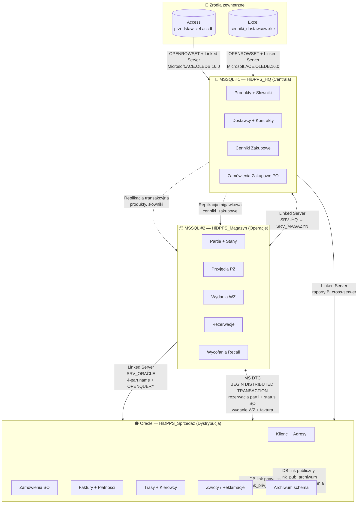
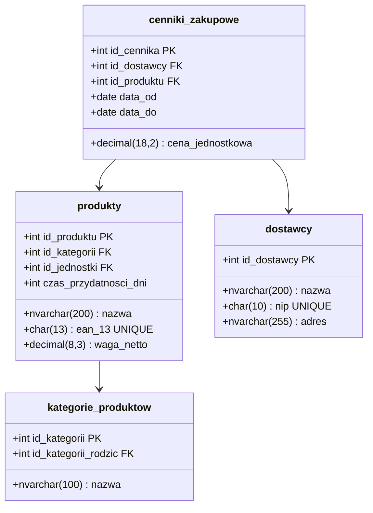
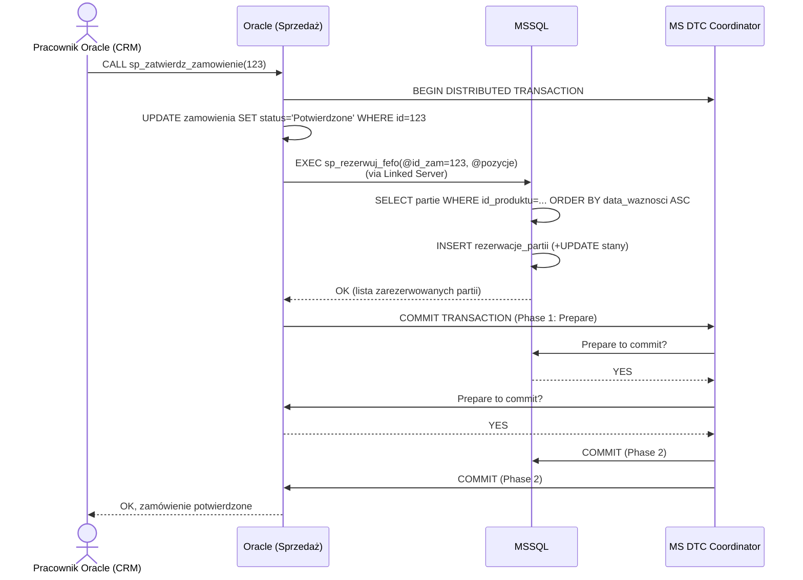
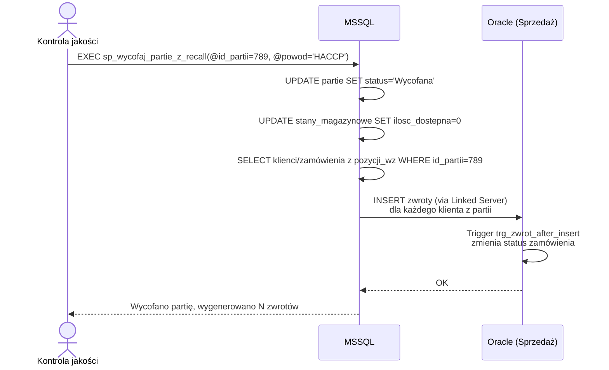
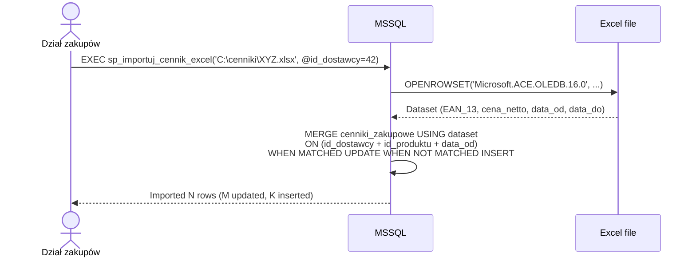

# 🧠 BIG BRAINSTORM — HiDPPS (Hurtownia i Dystrybucja Przetworzonych Produktów Spożywczych)

> **Projekt:** Rozproszona Baza Danych (RBD) — przedmiot Rozproszone i Obiektowe Bazy Danych
> **Autorzy:** Mateusz Mróz (251190), Maciej Górka (251143)
> **Data:** 2026-05-21
> **Tryb:** big brainstorm (~1500 linii)
> **Cel brainstormu:** wypracować spójną, przemyślaną architekturę RBD przed napisaniem `HiDPPS.md` (raport finalny w Markdown)

---

## 🎯 Definicja Problemu

Zaprojektować **rozproszoną bazę danych** dla firmy zajmującej się **hurtową dystrybucją przetworzonych produktów spożywczych** (konserwy, mrożonki, dżemy, sosy, nabiał, pieczywo długiego terminu, napoje). Firma:

- Skupuje produkty od **dostawców-producentów** (zakłady przetwórcze)
- Magazynuje w **centralnym magazynie hurtowym** (HQ) oraz **magazynach regionalnych** (np. Łódź, Warszawa)
- Dystrybuuje do **klientów hurtowych**: sieci sklepów, restauracje, gastronomia, sklepy osiedlowe
- Musi kontrolować **daty ważności (FEFO)**, **partie produkcyjne**, **łańcuch chłodniczy**, **wycofania (recall)** zgodnie z HACCP

**Co konkretnie projektujemy:**
1. Schemat 4 serwerów (2× MSSQL + 1× Oracle + Access/Excel jako źródła zewnętrzne)
2. Podział tabel/widoków/procedur między serwery z uzasadnieniem
3. Mechanizmy integracji: linked servers, OPENROWSET, OPENQUERY, replikacja, MS DTC, Oracle DB links
4. Reguły biznesowe (constraints, triggery, procedury)
5. Diagramy (Mermaid) — architektura systemu + schemat każdej bazy + sekwencje kluczowych procesów

**Czego NIE projektujemy:**
- Aplikacja kliencka / UI
- Real-life HACCP w pełnym zakresie (uproszczenie akademickie — wzór Northwind)
- Performance tuning na produkcyjnym wolumenie

---

## 📐 Tablica Prawdy (Constraints — ŚWIĘTE ZASADY)

| # | Święta Zasada | Źródło | Status |
|---|---------------|--------|--------|
| 1 | **2× MS SQL Server + 1× Oracle** jako trzy główne serwery RBD | wymagania projektu + user | 🔒 ABSOLUTNA |
| 2 | **Access + Excel** używane jako zewnętrzne źródła danych (OPENROWSET, Linked Server) | wymagania p. 2-3 | 🔒 ABSOLUTNA |
| 3 | **Replikacja MSSQL↔MSSQL** (transakcyjna, migawkowa lub merge) — Oracle replication NIE | user: "nie nauczył nas replikacji innej niż MS-MS" | 🔒 ABSOLUTNA |
| 4 | **Linki Oracle → Oracle** (database links prywatne i publiczne) | wymagania p. 9-11 | 🔒 ABSOLUTNA |
| 5 | **Linki MSSQL → Oracle** tylko jednokierunkowo (NIE Oracle → MSSQL) | wymagania p. 3 | 🔒 ABSOLUTNA |
| 6 | **Wszystkie 13 punktów wymagań** projektu muszą być spełnione | wymagania p. 1-13 | 🔒 ABSOLUTNA |
| 7 | **Poziom studencki, wzór Northwind** — przemyślane, ale nieprzekombinowane | user | 🔒 ABSOLUTNA |
| 8 | **Raport w Markdown** (nie LaTeX) — prowadzący zatwierdził | user | 🔒 ABSOLUTNA |
| 9 | **Diagramy w Mermaid** (natywne w MD) | user | 🔒 ABSOLUTNA |
| 10 | **Reguły biznesowe na poziomie bazy** (constraints, triggery) — nie tylko w aplikacji | skill database-design | 🔒 ABSOLUTNA |
| 11 | **Każda tabela ma PK**, każdy FK ma indeks, pieniądze = DECIMAL, daty = DATE/DATETIME2 | skill database-design | 🔒 ABSOLUTNA |
| 12 | **Edge cases muszą być uwzględnione** — "gość pyta o wszystko" | user | 🔒 ABSOLUTNA |
| 13 | **Mapowanie realnego świata** — przetworzone produkty spożywcze, łańcuch dostaw, FEFO, partie | user (domena projektu) | 🔒 ABSOLUTNA |

> ⚠️ Każdy element planu MUSI przejść test tablicy prawdy. Łamanie zasady = ankieta do usera z uzasadnieniem za/przeciw.

---

## 🌐 FAZA 2: Dywergencja — Generowanie podziałów RBD

Generujemy **różne strategie podziału** 4 baz danych między serwery. Cel: znaleźć podział, który:
- Spełnia wymagania heterogeniczności (MSSQL × Oracle)
- Mapuje realny biznes (HQ vs Region vs Sprzedaż)
- Umożliwia sensowną replikację MSSQL-MSSQL
- Daje powód dla MS DTC (transakcje cross-serwer)
- Daje powód dla widoków rozproszonych (UNION ALL z różnych źródeł)
- Daje powód dla linked servera SQL→Oracle

---

### 💡 Pomysł 1: **HQ / Magazyn Regionalny / Sprzedaż-Logistyka**

**Opis:** Klasyczny podział 3-warstwowy mapujący strukturę firmy.

- **MSSQL #1 — HQ (Centrala)**: katalog produktów, dostawcy, kontrakty zakupowe, cenniki, słowniki (kategorie, alergeny, jednostki), użytkownicy systemu
- **MSSQL #2 — Magazyn Regionalny (np. Łódź)**: stany magazynowe, partie produkcyjne z datami ważności, lokalizacje (regały/strefy chłodnicze), przyjęcia od dostawców, wydania do dystrybucji
- **Oracle — Sprzedaż i Dystrybucja**: klienci (sieci/restauracje/sklepy), zamówienia, pozycje zamówień, wysyłki, trasy, kierowcy, faktury, płatności, zwroty/reklamacje
- **Access/Excel** — zewnętrzne:
  - **Access (.mdb/.accdb)** — lokalna baza punktu sprzedaży / przedstawiciela handlowego (offline orders)
  - **Excel (.xls/.xlsx)** — cenniki od dostawców (przychodzące mailem), raporty z laboratorium HACCP

**Mechanizm:**
- Replikacja: katalog produktów + cenniki z HQ → Magazyn Regionalny (transakcyjna)
- Linked Server MSSQL#1 → MSSQL#2 (regularne odpytywanie stanów)
- Linked Server MSSQL#2 → Oracle (zapytania o niezrealizowane zamówienia, blokowanie partii)
- OPENROWSET z Excel/Access ad-hoc (import cenników, import zamówień z Access)
- MS DTC: transakcja "rezerwacja partii przy zatwierdzaniu zamówienia" (MSSQL#2 + Oracle)
- Oracle DB links: prywatny dla działu fakturowania, publiczny dla działu obsługi klienta

**Mocne strony:**
- Mapuje realny świat — sales tradycyjnie w osobnym systemie (CRM)
- Daje naturalne uzasadnienie wszystkich mechanizmów RBD
- Replikacja katalogu produktów HQ→Region to klasyczny use case
- MS DTC ma silne biznesowe uzasadnienie (rezerwacja stanu + utworzenie zamówienia atomowo)

**Słabe strony:**
- Klienci w Oracle, a stany w MSSQL → wiele zapytań cross-serwer
- 3 warstwy = więcej kodu (linked servery, replikacja w jedną stronę)

**Ryzyko:**
- Złożoność konfiguracji replikacji w środowisku heterogenicznym (wszystko inne to MSSQL+Oracle)
- MS DTC może mieć problemy z Oracle (jako resource manager)

**Ocena:** ⭐⭐⭐⭐⭐⭐⭐⭐⭐☆ (9/10)
**Test tablicy prawdy:** ✅ Przeszedł — spełnia wszystkie wymagania

---

### 💡 Pomysł 2: **Zakupy / Magazyn-Logistyka / Sprzedaż**

**Opis:** Podział funkcjonalny po procesach biznesowych.

- **MSSQL #1 — Zakupy**: dostawcy, kontrakty, zamówienia zakupowe (PO), faktury zakupowe, oceny dostawców, certyfikaty HACCP dostawców
- **MSSQL #2 — Magazyn i Logistyka**: produkty (katalog), partie produkcyjne, stany magazynowe, lokalizacje, przyjęcia, wydania, transport, kierowcy, trasy
- **Oracle — Sprzedaż**: klienci, zamówienia sprzedażowe (SO), faktury sprzedażowe, płatności, zwroty
- **Access/Excel** — jak Pomysł 1

**Mocne strony:**
- Bardzo czysty podział po procesach (procurement / WMS / sales)
- Każdy moduł stoi własnymi nogami

**Słabe strony:**
- Katalog produktów w MSSQL#2 (Magazyn) → trzeba replikować do MSSQL#1 (Zakupy) i Oracle (Sprzedaż) — replikacja musi być w 2 strony lub wielokierunkowo
- "Klienci" oderwani od "dostawców" — w realu często ten sam dział obsługi
- Brak naturalnego cross-MSSQL workflow (zakupy nie potrzebują często stanów magazynu)

**Ryzyko:**
- Replikacja katalogu produktów do 2 odbiorców (1 MSSQL + 1 Oracle) — Oracle nie da się replikować z poziomu MSSQL bez dodatkowych narzędzi

**Ocena:** ⭐⭐⭐⭐⭐⭐⭐☆☆☆ (7/10)
**Test tablicy prawdy:** ⚠️ Częściowo — replikacja katalogu do Oracle łamie zasadę #3

---

### 💡 Pomysł 3: **Geograficzny: Centrala / Region A / Region B**

**Opis:** Sharding poziomy po regionach.

- **MSSQL #1 — Centrala (HQ)**: master data (produkty, dostawcy, klienci globalni), konsolidacja raportów
- **MSSQL #2 — Region Łódź**: stany lokalne, zamówienia regionalne, klienci lokalni
- **Oracle — Region Warszawa**: jak MSSQL#2 ale w innej technologii (sztuczne, akademickie)
- **Access/Excel** — jak Pomysł 1

**Mocne strony:**
- Naturalna replikacja master data → regiony (transakcyjna jednokierunkowa)
- Łatwy do zrozumienia (geografia)

**Słabe strony:**
- **Oracle jako "drugi region"** = sztuczne. W realu wszystkie regiony byłyby na tej samej technologii
- Powtarzanie tych samych tabel w 3 miejscach
- Brak naturalnej heterogeniczności funkcjonalnej (heterogeniczność = "bo musimy", nie "bo ma sens")
- Konsolidacja regionów = UNION ALL z dziwnym mapowaniem PESEL→VARCHAR2

**Ryzyko:**
- Sztuczność rozwiązania widoczna od pierwszego pytania prowadzącego ("dlaczego region B jest w Oracle?")

**Ocena:** ⭐⭐⭐⭐⭐☆☆☆☆☆ (5/10)
**Test tablicy prawdy:** ✅ Technicznie OK, ale słabe biznesowo

---

### 💡 Pomysł 4: **OLTP-OLTP-OLAP (Hurtownia analityczna)**

**Opis:** Dwa systemy OLTP + Oracle jako hurtownia analityczna.

- **MSSQL #1 — Operacje magazynowe (OLTP)**: produkty, partie, stany, przyjęcia, wydania
- **MSSQL #2 — Sprzedaż (OLTP)**: klienci, zamówienia, faktury
- **Oracle — Hurtownia analityczna (OLAP)**: tabele faktów (sprzedaż, zapasy) + denormalizowane wymiary (klienci, produkty, czas, region), wyliczane agregaty
- **Access/Excel** — jak Pomysł 1

**Mocne strony:**
- Oracle jako hurtownia = realne use case (raporty BI, dashboardy)
- Replikacja MSSQL→MSSQL OK; Oracle pobiera dane przez linked server (ETL)
- Świadoma denormalizacja w Oracle (star schema) — pokazuje wiedzę o SCD

**Słabe strony:**
- "Hurtownia analityczna" wykracza poza zakres przedmiotu (RBD operacyjny, nie BI)
- Procedury w Oracle = ETL, nie typowy biznes → mniej naturalnych przykładów do napisania
- Linkowanie SQL→Oracle: w hurtowni jednokierunkowo dane idą TYLKO do Oracle, ale wymóg p.3 mówi "linkowanie SQL→Oracle" → spójne

**Ryzyko:**
- Zbyt akademickie / oderwane od domeny "dystrybucja"

**Ocena:** ⭐⭐⭐⭐⭐⭐⭐☆☆☆ (7/10)
**Test tablicy prawdy:** ✅ Przeszedł

---

### 💡 Pomysł 5: **HQ-Master / Magazyn-Operacje / Oracle-Klienci&Faktury (refined #1)**

**Opis:** Refinement Pomysłu 1 — najsilniejsze elementy + lepsza separacja.

- **MSSQL #1 (HQ-Master)**: katalog produktów, kategorie, alergeny, jednostki, dostawcy, kontrakty zakupowe, cenniki zakupowe (od dostawców), użytkownicy systemu, słowniki (kraje, waluty)
- **MSSQL #2 (Magazyn-Operacje)**: magazyny (lokalizacje), strefy (chłodnia/sucha/mrożnia), partie produkcyjne (lot), stany magazynowe per partia per magazyn, przyjęcia magazynowe (PZ — od dostawcy), wydania magazynowe (WZ — do klienta), rezerwacje partii (pod zamówienia), wycofania (recall HACCP)
- **Oracle (Dystrybucja-Klienci)**: klienci, adresy dostaw, zamówienia sprzedażowe, pozycje zamówień, statusy zamówień, faktury sprzedażowe, płatności, kierowcy, trasy dostaw, zwroty/reklamacje, oceny dostaw
- **Access/Excel**:
  - `cenniki_dostawcow.xlsx` (importowane regularnie) — Excel jako źródło zewnętrzne
  - `przedstawiciel_handlowy.accdb` (offline orders z laptopa przedstawiciela) — Access jako źródło

**Mechanizm — kompletny:**

1. **Replikacja transakcyjna** MSSQL#1 → MSSQL#2:
   - Publikacja: tabele `produkty`, `kategorie`, `alergeny`, `jednostki_miary` (wolno zmieniający się słownik)
   - Subscriber: MSSQL#2 (potrzebuje katalogu do walidacji przyjęć i wydań)

2. **Replikacja migawkowa** MSSQL#1 → MSSQL#2:
   - Publikacja: `cenniki_zakupowe` (snapshot co noc — nie wymaga real-time)

3. **Linked Server SRV_MAGAZYN (MSSQL#1 → MSSQL#2)**:
   - HQ pyta o aktualne stany magazynowe (raporty kierownictwa)
   - 4-part name: `SRV_MAGAZYN.MagazynDB.dbo.stany_magazynowe`

4. **Linked Server SRV_HQ (MSSQL#2 → MSSQL#1)**:
   - Magazyn pyta o nowe produkty / cenniki

5. **Linked Server SRV_ORACLE (MSSQL#2 → Oracle, OraOLEDB)**:
   - Magazyn pyta Oracle o aktywne zamówienia, które wymagają rezerwacji partii
   - Magazyn wysyła do Oracle informacje o wysłanych partiach (przez OPENQUERY)

6. **Linked Server SRV_HQ_ORACLE (MSSQL#1 → Oracle)**:
   - HQ pyta o sprzedaż per klient (raporty BI)

7. **Linked Server SRV_ACCESS (MSSQL#2 lub #1 → Access)**:
   - Import zamówień z laptopa przedstawiciela handlowego (`OPENROWSET` + `Microsoft.ACE.OLEDB.16.0`)

8. **Linked Server SRV_EXCEL (MSSQL#1 → Excel)**:
   - Import cenników dostawców

9. **OPENROWSET ad-hoc:**
   - Jednorazowe importy / eksporty raportów
   - Dostęp do MSSQL, Oracle, Access, Excel — wszystkie 4 kombinacje

10. **OPENQUERY (pass-through)**:
    - Filtrowanie po stronie Oracle (PL/SQL optymalizacja): `SELECT * FROM OPENQUERY(SRV_ORACLE, 'SELECT ... WHERE status=''A''')`

11. **MS DTC (Distributed Transactions)**:
    - **Scenariusz 1: Zatwierdzenie zamówienia z rezerwacją partii** — Oracle aktualizuje status zamówienia + MSSQL#2 rezerwuje konkretne partie (FEFO) → atomowo
    - **Scenariusz 2: Wydanie towaru (WZ) + faktura** — MSSQL#2 zmniejsza stan + Oracle generuje fakturę → atomowo
    - `BEGIN DISTRIBUTED TRANSACTION` + `XACT_ABORT ON`

12. **Oracle Database Links**:
    - **Link prywatny** `lnk_priv_finanse`: tylko user `FINANSE` ma dostęp do zdalnej tabeli `oplaty_serwisowe` (np. opłaty leasingowe za samochody dostawcze — z osobnej "instancji" Oracle symulowanej drugim schematem/userem)
    - **Link publiczny** `lnk_pub_katalog`: dostęp do widoku katalogowego (nazwy klientów-VIP) dla wszystkich userów obsługi
    - Symulacja drugiej instancji Oracle = drugi schemat (`HiDPPS_ARCHIWUM`) z tabelami archiwalnymi (zamówienia >2 lata)

13. **Oracle Distributed Views (UNION ALL bieżące + archiwalne)**:
    - `vw_wszystkie_zamowienia` = `zamowienia` UNION ALL `zamowienia@lnk_archiwum`
    - Niemodyfikowalny widok → `INSTEAD OF` trigger dla `INSERT`/`UPDATE`/`DELETE`
    - Rzutowanie typów: NUMBER(10) ↔ NUMBER(10), DATE ↔ DATE (ujednolicone, ale jawnie CAST)

14. **Oracle - Procedury PL/SQL**:
    - `sp_dodaj_zamowienie(p_id_klienta, p_pozycje SYS.ODCIVARCHAR2LIST, p_data_dostawy OUT)`
    - `sp_rozlicz_platnosc(p_id_faktury, p_kwota, p_metoda)`
    - `fn_oblicz_rabat_klienta(p_id_klienta) RETURN NUMBER` (na bazie historii zakupów)

15. **Oracle - Role i uprawnienia**:
    - Role: `ROLA_KLIENCI` (CRUD na klienci, zamówienia), `ROLA_FINANSE` (CRUD na faktury, płatności + SELECT na klientach), `ROLA_OBSLUGA` (SELECT na wszystko + INSERT na zwrotach), `ROLA_RAPORTY` (tylko SELECT)
    - Userzy: `JKOWALSKI` (rola KLIENCI), `AMALINOWSKA` (FINANSE), `KOBSLUGA` (OBSLUGA), `RAPORTY_BI` (RAPORTY)

**Mocne strony:**
- **Każde wymaganie p. 1-13 ma jasne mapowanie**
- Mapuje realny biznes — łańcuch dostaw spożywki
- MS DTC ma 2 silne use cases (rezerwacja + wydanie)
- Replikacja transakcyjna + migawkowa (pokazujemy dwa typy)
- Linked server symetryczne (#1↔#2) i jednokierunkowe (#2→Oracle)
- Wszystkie 4 typy linked serverów (MSSQL, Oracle, Access, Excel)
- Oracle DB links: prywatny + publiczny + symulacja "drugiej instancji" (przez drugi schemat)
- INSTEAD OF triggery dla widoków rozproszonych z UNION
- FEFO (First Expired First Out) jako algorytm rezerwacji partii — specyfika spożywki

**Słabe strony:**
- Sporo elementów do skonfigurowania (linked servery × 5, replikacja × 2, DTC, DB links × 2)
- Złożoność diagramów

**Ryzyko:**
- Symulacja "drugiej instancji" Oracle drugim schematem może wzbudzić pytanie prowadzącego — trzeba to jasno udokumentować w raporcie ("akademicka symulacja", nie produkcja)

**Ocena:** ⭐⭐⭐⭐⭐⭐⭐⭐⭐⭐ (10/10) — kandydat na zwycięzcę
**Test tablicy prawdy:** ✅ Przeszedł wszystkie 13 zasad

---

### 💡 Pomysł 6: **Cross-cutting: Master Data + 2 dziedziny**

**Opis:** Oddzielenie master data od domen operacyjnych.

- **MSSQL #1 — Master Data Management (MDM)**: WSZYSTKIE master data (produkty, klienci, dostawcy, słowniki) — single source of truth
- **MSSQL #2 — Operacje magazynowe**: stany, partie, ruchy magazynowe
- **Oracle — Operacje sprzedażowe**: zamówienia, faktury, dostawy
- **Access/Excel** — jak wcześniej

**Mocne strony:**
- MDM = best practice w realnych systemach
- Klienci centralnie → brak dublowania

**Słabe strony:**
- Każda operacja musi czytać klientów z MSSQL#1 → ciągłe cross-serwer
- Oracle musi replikować klientów (problem #3)
- Mniej naturalny dla projektu studenckiego

**Ryzyko:**
- Performance impact (każde zamówienie = dwa serwery)

**Ocena:** ⭐⭐⭐⭐⭐⭐☆☆☆☆ (6/10)
**Test tablicy prawdy:** ⚠️ Replikacja klientów do Oracle problematyczna

---

### 💡 Pomysł 7: **Kreatywny: Magazyn z IoT — Czujniki temperatury**

**Opis:** Wprowadzenie IoT (czujniki łańcucha chłodniczego) jako dodatkowej domeny.

- **MSSQL #1 — Operacje biznesowe**: produkty, dostawcy, klienci, zamówienia
- **MSSQL #2 — IoT Cold Chain**: pomiary temperatur, alarmy, urządzenia, kalibracje
- **Oracle — Magazyn + Dystrybucja**: stany, partie, wysyłki
- **Access/Excel** — jak wcześniej

**Mocne strony:**
- Innowacyjne — pokazuje świadomość trendów
- Naturalne dla spożywki (HACCP wymaga temperatury)

**Słabe strony:**
- IoT to OUT OF SCOPE dla projektu RBD studenckiego
- Bardziej projekt time-series niż relacyjny

**Ocena:** ⭐⭐⭐⭐⭐⭐☆☆☆☆ (6/10) — fajne, ale przekombinowane
**Test tablicy prawdy:** ⚠️ Wykracza poza zakres

---

### 💡 Pomysł 8: **Hybrydowy: Pomysł 1 + elementy Pomysłu 4 (mała hurtownia raportowa w Oracle)**

**Opis:** Pomysł 5 + dodanie w Oracle prostych tabel agregowanych (raporty miesięczne).

Niewiele różni się od Pomysłu 5; agregaty mogą być po prostu materialized views w Oracle.

**Ocena:** ⭐⭐⭐⭐⭐⭐⭐⭐⭐☆ (9/10) — variant Pomysłu 5

---

### 💡 Pomysł 9: **Sharding klientów: VIP vs Standard**

**Opis:** Sharding poziomy klientów po segmencie.

Słabo uzasadnione biznesowo dla domeny "dystrybucja spożywki" — sklepy/restauracje to nie tak skrajne segmenty.

**Ocena:** ⭐⭐⭐☆☆☆☆☆☆☆ (3/10)

---

### 💡 Pomysł 10: **Replikacja dwukierunkowa MSSQL — Peer-to-Peer dla 2 magazynów regionalnych**

**Opis:** Oba MSSQL to magazyny regionalne (Łódź + Warszawa), synchronizacja merge'em.

**Słabe strony:**
- Konflikty merge replikacji są trudne do obsłużenia
- W realu wolimy ewentualnie wymianę przez kolejkę message brokera
- "Niech ten sam towar nie zostanie wydany 2 razy z różnych magazynów" wymaga DTC + locków

**Ocena:** ⭐⭐⭐⭐⭐☆☆☆☆☆ (5/10)

---

## 📊 FAZA 3: Konwergencja — Matryca Porównawcza Podziałów

| Kryterium | Waga | P1 (HQ/Reg/Sprzedaż) | P2 (Zakupy/WMS/Sales) | P3 (Geo) | P4 (OLTP/OLTP/OLAP) | **P5 (refined #1)** ⭐ | P6 (MDM) | P7 (IoT) |
|-----------|------|---|---|---|---|---|---|---|
| Realizm biznesowy | 20% | 9 | 7 | 5 | 6 | **10** | 6 | 5 |
| Pokrycie wymagań p.1-13 | 25% | 9 | 7 | 6 | 8 | **10** | 7 | 6 |
| Naturalność heterogeniczności | 15% | 8 | 7 | 4 | 9 | **9** | 6 | 7 |
| Klarowność podziału | 15% | 8 | 9 | 7 | 7 | **9** | 7 | 6 |
| Złożoność implementacji (niżej=lepiej, więc 10-X) | 10% | 7 | 7 | 8 | 6 | **6** | 5 | 4 |
| Edge cases / "co spyta prowadzący" | 15% | 8 | 7 | 5 | 7 | **10** | 6 | 5 |
| **SUMA WAŻONA** | 100% | 8.30 | 7.30 | 5.75 | 7.30 | **9.30** | 6.40 | 5.65 |

**Zwycięzca:** **Pomysł 5** (refined #1) — 9.30/10.

---

## 🧠 FAZA 3.2: Strategie Decyzyjne

### Strategia 1: Eliminacja negatywna
- ❌ P3 (Geo) — sztuczne uzasadnienie Oracle jako "drugi region"
- ❌ P7 (IoT) — out of scope
- ❌ P9 (VIP/Standard) — słabe biznesowo
- ❌ P10 (Peer-to-peer) — merge replication = bóg konfliktów
- ⚠️ P2 (Zakupy/WMS/Sales), P6 (MDM) — problem replikacji katalogu produktów do Oracle

**Po eliminacji zostają:** P1, P4, P5, P8 (variant P5)

### Strategia 2: Pareto 80/20
- 80% wartości za 20% wysiłku = **P5**, bo: jeden podział pokrywa wszystkie 13 wymagań, mapowanie 1:1 na realny biznes spożywki, edge cases naturalne (FEFO, recall, łańcuch chłodniczy)

### Strategia 3: Premortum
**Pytanie:** "Jest dzień obrony. Projekt został odrzucony. Dlaczego?"

| Możliwa przyczyna porażki | Mitygacja w P5 |
|---|---|
| Prowadzący: "Czemu Oracle, a nie kolejny MSSQL?" | Oracle ma uzasadnioną domenę (Sprzedaż-Klienci), naturalna heterogeniczność |
| "Gdzie jest replikacja?" | Transakcyjna + migawkowa MSSQL#1→MSSQL#2 |
| "Pokaż widok rozproszony Oracle z INSTEAD OF" | `vw_wszystkie_zamowienia` (bieżące+archiwalne) |
| "Dlaczego symulujesz drugą instancję Oracle drugim schematem?" | Akademicka symulacja — jawne udokumentowanie |
| "Co z OPENQUERY?" | Pass-through query z MSSQL→Oracle dla zamówień (filtrowanie po stronie Oracle) |
| "Pokaż MS DTC w działaniu" | 2 scenariusze: rezerwacja partii, wydanie+faktura |
| "Co jeśli partia jest po dacie ważności?" | CHECK constraint + trigger blokujący rezerwację |
| "Co przy wycofaniu produktu (recall)?" | Procedura `sp_wycofaj_partie` blokująca + tworząca zwroty z klientów |
| "Jak FEFO?" | Procedura `sp_rezerwuj_fefo` sortująca partie po `data_waznosci ASC` |

**Wniosek:** P5 odpowiada na wszystkie "killer questions" prowadzącego.

### Strategia 4: 10/10/10
- Za 10 minut: P5 wymaga sporo konfiguracji (linked servery × 5)
- Za 10 dni: P5 daje czytelny raport, wszystkie elementy się "klikają"
- Za 10 tygodni: nie obchodzi nas, projekt zaliczony

### Strategia 5: Red Team / Devil's Advocate
**Atak na P5:**
- "Symulacja drugiej instancji Oracle drugim schematem jest hackiem" → kontra: WSZYSCY tak robią na zajęciach (brak dwóch instancji Oracle na komputerach studenckich)
- "Replikacja katalogu produktów HQ→Region może być over-engineering" → kontra: to klasyczny use case master data replication
- "Klienci w Oracle, a stany w MSSQL → wieczne cross-serwer" → kontra: to dokładnie cel projektu — pokazać widoki/procedury rozproszone

**Wniosek po Red Team:** P5 obroni się.

### Strategia 6: First Principles
**Fundamenty:**
- Wymóg: heterogeniczność (MSSQL × Oracle) → naturalna granica funkcjonalna (magazyn vs sprzedaż)
- Wymóg: replikacja MSSQL-MSSQL → potrzebne 2 MSSQL z relacją publikatora-subskrybenta → katalog → stany
- Wymóg: DB links Oracle → potrzebne 2 schematy w Oracle (jedna instancja akademicka)
- Wymóg: Access + Excel → potrzebne zewnętrzne źródła z biznesowym uzasadnieniem → laptop przedstawiciela (Access), cenniki dostawców (Excel)

P5 wynika z pierwszych zasad — nie został wymyślony "od czapy".

---

## ✅❌ FAZA 5: Podział Kontekstowy (P5 — szczegóły)

### ✅ Co jest DOBRE w P5

| # | Element | Dlaczego dobre | Warunek sukcesu |
|---|---|---|---|
| 1 | Podział funkcjonalny (Master / Magazyn / Sprzedaż) | Mapuje realne działy firmy | Czyste DDL bez "dziwnych" duplikatów |
| 2 | FEFO jako algorytm rezerwacji partii | Specyfika spożywki, naturalne pytanie prowadzącego | Procedura `sp_rezerwuj_fefo` z testem |
| 3 | MS DTC: rezerwacja partii (Oracle status + MSSQL rezerwacja) | Silne uzasadnienie atomowości | DTC skonfigurowany na Windows + Oracle MTS |
| 4 | Replikacja transakcyjna katalogu | Klasyczny use case, działa "out-of-the-box" | Działający Publisher/Subscriber |
| 5 | Replikacja migawkowa cenników | Pokazujemy DWA typy replikacji | Snapshot agent skonfigurowany |
| 6 | Linked servers do wszystkich 4 źródeł | Kompletność wymagań | OraOLEDB + ACE OLEDB zainstalowane |
| 7 | OPENROWSET + OPENQUERY przykłady | Wymagania p.2 + p.4 | Co najmniej 3 widoki / procedury per typ |
| 8 | Oracle: prywatny + publiczny DB link | Wymóg p.9 | Druga "instancja" przez drugi schemat |
| 9 | INSTEAD OF dla `vw_wszystkie_zamowienia` | Wymóg p.12 | Trigger obsługujący INS/UPD/DEL przez routing po `zrodlo` |
| 10 | Procedury PL/SQL z OUT, IN, EXCEPTION | Wymóg p.13 | Pakiet `PKG_HIDPPS` z procedurami |

### ❌ Co byłoby ZŁE (czego unikać)

| # | Element | Dlaczego złe | Status |
|---|---|---|---|
| 1 | Replikacja MSSQL→Oracle (lub odwrotnie) | Wykracza poza zakres przedmiotu | ❌ Nie robimy |
| 2 | Trzymanie cen w FLOAT | Błędy zaokrągleń | ❌ DECIMAL(18,2) |
| 3 | Daty ważności jako VARCHAR | Brak sortowania | ❌ DATE |
| 4 | Cascade delete zamówień przy usunięciu klienta | Niespodziewane straty | ❌ ON DELETE NO ACTION |
| 5 | Klucze naturalne (np. NIP klienta jako PK) | NIP może się zmienić, indeksy ciężkie | ❌ IDENTITY/SEQUENCE; NIP jako UNIQUE |
| 6 | Polimorficzny FK (`id_dokumentu`, `typ_dokumentu`) | Brak FK constraintu | ❌ Osobne tabele asocjacyjne |
| 7 | Single God Table "produkty" z 60 kolumnami | Niska normalizacja, słaba wydajność | ❌ Split: produkty + warianty + ceny + alergeny |
| 8 | Brak indeksów na FK | MSSQL nie tworzy automatycznie | ❌ Każdy FK = osobny indeks |
| 9 | MS DTC tam gdzie wystarczy lokalna transakcja | Niepotrzebny narzut 2PC | ❌ DTC tylko cross-serwer |
| 10 | `SELECT *` w widokach | Łapie zmiany schematu, więcej danych po sieci | ❌ Jawne listy kolumn |

### ⚠️ Co ZALEŻY od kontekstu

| # | Element | Kiedy dobre | Kiedy złe |
|---|---|---|---|
| 1 | Materialized views w Oracle | Raporty agregowane, rzadko aktualizowane | OLTP — przeszkadzają |
| 2 | Triggery automatyczne | Audit log, kontrola spójności krzyżowej | Logika biznesowa — niewidoczna |
| 3 | Denormalizacja (cena_jednostkowa w pozycji zamówienia) | Niezmienność historyczna (cena z dnia zamówienia) | Bieżące dane — używaj JOIN |
| 4 | Soft delete (`status='Z'`) vs hard delete | Historia, audyt | Wymagania GDPR / niewielkie dane |
| 5 | UUID jako PK | Rozproszone systemy, scalanie z merge | OLTP single-server — IDENTITY |

---

## 🏗️ FAZA 4: Deep Dive — Architektura P5 (szczegółowa)

### 🗄️ Baza 1: **MSSQL #1 — `HiDPPS_HQ`** (Master Data + Zakupy)

**Cel:** Centrala (HQ), single source of truth dla katalogu produktów, dostawców, cenników i kontraktów. Tu pracuje dział zakupów i master data management.

**Kategorie tabel:**

#### A. Słowniki (master data)
- `kategorie_produktow` — drzewo kategorii (Mrożonki, Konserwy, Nabiał, Pieczywo, Napoje, Sosy, Słodycze)
- `alergeny` — gluten, laktoza, jaja, orzechy, soja, seler, gorczyca itd. (zgodnie z UE)
- `jednostki_miary` — szt, kg, g, l, ml, opakowanie, paleta
- `kraje` — kraj pochodzenia, ISO 3166-1 (2-literowy)
- `waluty` — PLN, EUR, USD (ISO 4217)
- `warunki_przechowywania` — Temperatura: pokojowa (15-25°C), Chłodnia (0-8°C), Mrożnia (-18°C i niżej)

#### B. Produkty
- `produkty` — katalog: nazwa, EAN-13, kategoria, waga netto, jednostka, warunki przechowywania, czas przydatności (dni)
- `produkty_alergeny` — N:M (produkt może mieć wiele alergenów)
- `warianty_produktow` — różne opakowania tego samego produktu (np. dżem 200g, 400g, 900g)
- `wartosci_odzywcze` — białko, tłuszcze, węglowodany, sól, energia (kcal) per 100g

#### C. Dostawcy
- `dostawcy` — nazwa firmy, NIP (UNIQUE), regon, adres (ulica, miasto, kod, kraj), kontakt
- `dostawca_certyfikaty` — HACCP, BIO, ISO 22000, ważność certyfikatu (`data_wazn_certyfikatu`)
- `oceny_dostawcow` — historyczna ocena jakościowa (1-5), data, ocena_uwagi

#### D. Kontrakty zakupowe i cenniki
- `kontrakty_zakupowe` — id, dostawca, data_od, data_do, status (Aktywny/Zakończony), kwota_limit
- `cenniki_zakupowe` — id_dostawcy, id_produktu, cena_jednostkowa (DECIMAL), waluta, data_od, data_do, minimalna_ilosc_zamowienia
- `zamowienia_zakupowe (PO)` — id, dostawca, data_zlozenia, data_planowanej_dostawy, status (Złożone/Potwierdzone/Wysłane/Zrealizowane/Anulowane), wartosc_calkowita
- `pozycje_zamowien_zakupowych` — id_zamowienia, id_produktu, ilosc, cena_jednostkowa, podatek_vat

#### E. Użytkownicy systemu (login na poziomie aplikacji, nie SQL Server)
- `uzytkownicy` — login, hash_hasla, imie, nazwisko, email, rola_systemowa
- `role_systemowe` — Admin, Kierownik, Pracownik, Tylko-Odczyt

#### F. Audyt
- `audyt_zmian_produktow` — system-versioned temporal table dla `produkty` (historia cen, składu, atrybutów)

**Procedury MSSQL#1:**
- `sp_dodaj_produkt(@nazwa, @ean, @id_kategorii, @waga_netto, @id_jednostki, @warunki, @czas_przyd_dni)` — z walidacją EAN-13 (CHECK constraint + funkcja kontrolna sumy kontrolnej)
- `sp_zatwierdz_zamowienie_zakupowe(@id_po, @id_uzytkownika)` — zmiana statusu, audit log
- `sp_importuj_cennik_excel(@sciezka_xlsx, @id_dostawcy)` — używa OPENROWSET z Excel
- `sp_oblicz_wartosc_zamowienia(@id_po)` — agregat po pozycjach

**Widoki MSSQL#1:**
- `vw_produkty_aktywne` — produkty + kategoria + alergeny (LISTAGG przez STRING_AGG)
- `vw_aktualne_cenniki` — produkty + aktualnie obowiązujące ceny (gdzie GETDATE() BETWEEN data_od AND data_do)
- `vw_top_dostawcy` — top 10 dostawców po wartości zakupów (cross-serwer: JOIN z Oracle dla aktualnej sprzedaży produktów tego dostawcy)

---

### 🗄️ Baza 2: **MSSQL #2 — `HiDPPS_Magazyn`** (Operacje magazynowe)

**Cel:** Magazyn regionalny — fizyczne stany, partie produkcyjne (lot), przyjęcia (PZ), wydania (WZ), rezerwacje pod zamówienia sprzedażowe, wycofania (recall).

**Kategorie tabel:**

#### A. Repliki z MSSQL#1 (subscribery)
- `produkty` (replikacja transakcyjna) — read-only z punktu widzenia tego serwera
- `kategorie_produktow`, `alergeny`, `jednostki_miary`, `warunki_przechowywania` (transakcyjna)
- `cenniki_zakupowe` (migawkowa, snapshot co noc)

#### B. Lokalna infrastruktura magazynowa
- `magazyny` — id, nazwa (Magazyn Łódź-Główny, Magazyn Łódź-Chłodnia), adres, typ (Suchy / Chłodniczy / Mroźniczy)
- `strefy_magazynowe` — id, id_magazynu, oznaczenie (A1, B2), typ_strefy (Suchy, Chłodniczy 0-8°C, Mroźniczy -18°C), temperatura_docelowa
- `lokalizacje` — id, id_strefy, oznaczenie regału (np. A1-R03-P02 = regał 3, półka 2)

#### C. Partie produkcyjne (lot tracking — KLUCZOWE dla recall HACCP)
- `partie` — id, id_produktu (FK do replikowanego katalogu), numer_partii_dostawcy (np. "LOT2026-04-15-001"), data_produkcji, data_waznosci, ilosc_przyjeta, id_dostawcy, id_zamowienia_zakupowego_oracle (po stronie HQ — referencja LOGICZNA), status (Aktywna / Wycofana / Wyczerpana)
- **CHECK:** `data_waznosci >= data_produkcji`
- **Indeks composite:** `(id_produktu, data_waznosci)` dla FEFO

#### D. Stany magazynowe
- `stany_magazynowe` — id, id_partii, id_lokalizacji, ilosc_dostepna, ilosc_zarezerwowana
- **Reguła:** `ilosc_dostepna + ilosc_zarezerwowana <= partie.ilosc_przyjeta - SUM(wydania)`
- **Indeks:** `(id_partii, id_lokalizacji)` UNIQUE

#### E. Dokumenty magazynowe
- `przyjecia_pz` — id, numer_pz (auto-gen format "PZ/2026/05/0001"), data, id_dostawcy, id_zamowienia_zakup (logiczne FK do HQ), id_uzytkownika_przyjmujacego
- `pozycje_pz` — id_pz, id_partii (utworzonej w momencie przyjęcia), ilosc, lokalizacja_docelowa
- `wydania_wz` — id, numer_wz, data, id_zamowienia_sprzedazowego (logiczne FK do Oracle), id_klienta_oracle, id_uzytkownika_wydajacego, status (Przygotowane / Wysłane)
- `pozycje_wz` — id_wz, id_partii, ilosc

#### F. Rezerwacje pod zamówienia sprzedażowe
- `rezerwacje_partii` — id, id_zamowienia_sprzedazowego_oracle (logiczne FK do Oracle), id_partii, ilosc_zarezerwowana, data_rezerwacji, status (Aktywna / Anulowana / Zrealizowana — przeszła w wydanie)
- **Wyzwalacz `trg_rezerwacja_after_insert`:** aktualizuje `stany_magazynowe.ilosc_zarezerwowana` += ilość

#### G. Wycofania (recall)
- `wycofania_partii` — id, id_partii, data_wycofania, powod (Zanieczyszczenie/Reklamacja_HACCP/Awaria_łańcucha_chłodniczego), id_uzytkownika
- **Wyzwalacz `trg_wycofanie_after_insert`:** ustawia partii status='Wycofana', zeruje `stany_magazynowe.ilosc_dostepna`, wywołuje procedurę cross-serwer do Oracle (przez linked server) generującą zwroty od klientów którzy dostali z tej partii

**Procedury MSSQL#2:**
- `sp_przyjmij_partie(@id_produktu, @numer_partii, @data_produkcji, @data_waznosci, @ilosc, @id_dostawcy, @id_lokalizacji)` — tworzy partię + stan + pozycję PZ
- `sp_rezerwuj_fefo(@id_produktu, @ilosc, @id_zamowienia_sprzedazowego OUT @lista_partii)` — **algorytm FEFO**: sortuje partie po `data_waznosci ASC`, alokuje od najwcześniejszej, transakcyjnie zmniejsza dostępność i tworzy rezerwacje. Jeśli brak — `RAISERROR`.
- `sp_wydaj_partie(@id_rezerwacji)` — przekształca rezerwację w wydanie WZ, dekrementuje stan, ustawia rezerwacji status='Zrealizowana'
- `sp_wycofaj_partie(@id_partii, @powod)` — blokuje, generuje notyfikacje
- `sp_inwentaryzacja(@id_magazynu, @data)` — snapshot stanów

**Widoki MSSQL#2:**
- `vw_partie_aktywne` — partie + produkt (z repliki) + dostawca (cross-serwer linked do MSSQL#1) + ilość pozostała
- `vw_partie_zagrozone` — partie z `data_waznosci - GETDATE() <= 7` AND `ilosc_dostepna > 0` (alert: bliska data ważności)
- `vw_top_klienci_per_produkt` — JOIN cross-serwer Oracle (kto kupuje najwięcej danego produktu — używa OPENQUERY)

---

### 🗄️ Baza 3: **Oracle — `HiDPPS_Sprzedaz`** (Dystrybucja + Klienci + Faktury)

**Cel:** System sprzedażowy i dystrybucyjny. Klienci, zamówienia, faktury, kierowcy, trasy, zwroty.

**Schematy (symulacja drugiej "instancji" Oracle dla DB linków):**
- `HIDPPS_SPRZEDAZ` — schemat główny (bieżące dane)
- `HIDPPS_ARCHIWUM` — schemat archiwum (zamówienia starsze niż 2 lata) — dostępny przez `database link` (symulacja zdalnej instancji)

**Kategorie tabel (schemat główny):**

#### A. Klienci
- `klienci` — id_klienta (SEQUENCE), nazwa, nip (UNIQUE), regon, typ (Sieć/Restauracja/Sklep/Hurt), data_zalozenia, status
- `adresy_dostaw` — id, id_klienta, ulica, miasto, kod_pocztowy, kraj, dni_dostaw (VARCHAR2 — bitmaska dni tygodnia)
- `kontakty_klientow` — id, id_klienta, imie, nazwisko, stanowisko, telefon, email

#### B. Zamówienia sprzedażowe (SO)
- `zamowienia` — id, id_klienta (FK), id_adresu_dostawy (FK), data_zlozenia, data_planowanej_dostawy, status (Nowe/Potwierdzone/W_Realizacji/Wysłane/Dostarczone/Anulowane), wartosc_netto, wartosc_brutto, uwagi
- `pozycje_zamowien` — id, id_zamowienia, id_produktu_hq (LOGICZNE FK do MSSQL#1.produkty), ilosc, cena_jednostkowa_netto (DECIMAL zsymulowane przez NUMBER(18,2)), stawka_vat, wartosc_pozycji
- **CHECK:** `ilosc > 0`, `cena_jednostkowa_netto >= 0`

#### C. Cenniki sprzedażowe (Oracle local, własne)
- `cenniki_sprzedazowe` — id, id_produktu_hq, cena_netto, waluta, data_od, data_do, segment_klienta (VIP/Standard/Hurt)

#### D. Faktury
- `faktury` — id, numer_faktury (auto-gen "FV/2026/05/0001"), id_zamowienia (FK), id_klienta (FK denorm. dla raportów), data_wystawienia, data_platnosci, wartosc_netto, wartosc_brutto, status (Wystawiona / Zapłacona / Przeterminowana / Anulowana)
- `pozycje_faktur` — id, id_faktury, id_pozycji_zamowienia, opis, ilosc, cena_netto, stawka_vat
- `platnosci` — id, id_faktury, data_platnosci, kwota, metoda (Przelew/Karta/Gotówka/Kompensata)

#### E. Logistyka — dystrybucja
- `kierowcy` — id, imie, nazwisko, pesel (UNIQUE), data_zatr, prawo_jazdy_kategoria, telefon
- `pojazdy` — id, marka, model, nr_rejestracyjny (UNIQUE), pojemnosc_kg, typ_chlodzenia (Sucha / Chłodniczy / Mroźniczy)
- `trasy_dostaw` — id, data, id_kierowcy, id_pojazdu, planowany_start, planowany_koniec, status (Zaplanowana / W_Trakcie / Zakończona)
- `przystanki_trasy` — id, id_trasy, id_adresu_dostawy, id_zamowienia, kolejnosc, planowana_godzina, faktyczna_godzina_dostawy, status (Oczekujący / Dostarczony / Nie_Zastany)

#### F. Zwroty / Reklamacje
- `zwroty` — id, id_zamowienia, data_zgloszenia, powod (Wadliwy_Towar / Zła_Dostawa / Wycofanie_Recall / Inny), status (Zgłoszony / Akceptowany / Odrzucony / Zrealizowany)
- `pozycje_zwrotow` — id, id_zwrotu, id_pozycji_zamowienia, ilosc_zwracana, kwota_zwrotu

#### G. Archiwum (drugi schemat `HIDPPS_ARCHIWUM`, dostępny przez DB link `lnk_pub_archiwum`)
- `zamowienia_archiwum` — kopia zamówień > 2 lata
- `faktury_archiwum`
- `pozycje_zamowien_archiwum`

**Reguły biznesowe Oracle:**
- Trigger `trg_zamowienie_after_insert` — generuje numer zamówienia w formacie `ZS/YYYY/MM/0001`
- Trigger `trg_faktura_after_update` — gdy `status` zmieni się na 'Zapłacona', sprawdza czy `SUM(platnosci.kwota) >= wartosc_brutto`
- Trigger INSTEAD OF dla `vw_wszystkie_zamowienia` — routing INSERT/UPDATE/DELETE po `data_zlozenia` (bieżące vs archiwum)

**Procedury Oracle (PL/SQL):**
- Pakiet `PKG_HIDPPS_SPRZEDAZ`:
  - `sp_dodaj_zamowienie(p_id_klienta, p_id_adresu, p_data_dostawy, p_id_zamowienia OUT)` — tworzy nagłówek
  - `sp_dodaj_pozycje_zamowienia(p_id_zamowienia, p_id_produktu, p_ilosc, p_cena)` — używa lokalnego cennika
  - `sp_zatwierdz_zamowienie(p_id_zamowienia)` — **CALL DTC** do MSSQL#2 dla rezerwacji partii FEFO; jeśli OK → status='Potwierdzone'
  - `sp_wystaw_fakture(p_id_zamowienia, p_id_faktury OUT)` — generuje fakturę po dostawie
  - `fn_oblicz_rabat_klienta(p_id_klienta) RETURN NUMBER` — % rabatu na podstawie historii zakupów (>10k PLN/rok = 5%, >50k = 10%)
  - `sp_archiwizuj_stare_zamowienia(p_data_graniczna)` — przenosi do `HIDPPS_ARCHIWUM`

**Widoki rozproszone Oracle (UNION ALL + DB link):**
- `vw_wszystkie_zamowienia` = `zamowienia` (lokalnie) ∪ `zamowienia_archiwum@lnk_pub_archiwum` — **niemodyfikowalny** → INSTEAD OF trigger
- `vw_klient_360` — klient + jego aktywne zamówienia + faktury + zaległości płatnicze (lokalne) + statystyki sprzedaży z MSSQL (przez linked server od strony MSSQL#1 → Oracle, ale w samym Oracle = lokalne)
- `vw_finanse_glowne_pomocnicze` — agregat faktury + opłaty_serwisowe@lnk_priv_finanse (link prywatny, tylko user FINANSE)

**Role Oracle:**
- `ROLA_KLIENCI` — CRUD na `klienci`, `adresy_dostaw`, `kontakty_klientow`, `zamowienia`, `pozycje_zamowien`
- `ROLA_FINANSE` — CRUD na `faktury`, `pozycje_faktur`, `platnosci` + SELECT na `klienci`, `zamowienia` + dostęp do `lnk_priv_finanse`
- `ROLA_LOGISTYKA` — CRUD na `kierowcy`, `pojazdy`, `trasy_dostaw`, `przystanki_trasy` + SELECT na `zamowienia`
- `ROLA_OBSLUGA_KLIENTA` — SELECT na większość + CRUD na `zwroty`, `pozycje_zwrotow`
- `ROLA_RAPORTY_BI` — TYLKO SELECT (oraz uprawnienie do widoków rozproszonych) + dostęp do `lnk_pub_katalog`

**Userzy Oracle (przykładowi):**
- `KOWALSKI_J` (ROLA_KLIENCI), `MALINOWSKA_A` (ROLA_FINANSE), `BOREK_M` (ROLA_LOGISTYKA), `OBSLUGA1` (ROLA_OBSLUGA_KLIENTA), `BI_USER` (ROLA_RAPORTY_BI)

---

### 🗄️ Źródło 4: **Access + Excel** (źródła zewnętrzne)

#### Access — `przedstawiciel_handlowy.accdb`
**Scenariusz:** Przedstawiciel handlowy ma laptop z bazą Access. Odwiedza klientów, zbiera zamówienia offline. Pod koniec dnia podpina się do firmowej sieci, MSSQL importuje zamówienia.

**Tabele Access:**
- `Klienci_Lokalne` (id_klienta, nazwa, nip, miasto)
- `Zamowienia_Robocze` (id, id_klienta_oracle, data, status_lokalny)
- `Pozycje_Zamowien_Robocze` (id, id_zamowienia, id_produktu_hq, ilosc, cena_uzgodniona)

**Dostęp z MSSQL:**
```sql
-- Linked Server (preferowany)
EXEC sp_addlinkedserver
    @server='SRV_ACCESS_REP',
    @provider='Microsoft.ACE.OLEDB.16.0',
    @srvproduct='ACE',
    @datasrc='C:\dane\przedstawiciel_handlowy.accdb';

-- Lub OPENROWSET ad-hoc
SELECT * FROM OPENROWSET(
    'Microsoft.ACE.OLEDB.16.0',
    'C:\dane\przedstawiciel_handlowy.accdb';'admin';'',
    'SELECT * FROM Zamowienia_Robocze WHERE status_lokalny=''Do_Wyslania''') AS T;
```

#### Excel — `cennik_dostawcy_XYZ.xlsx`
**Scenariusz:** Dostawcy przysyłają mailem cenniki w Excel. Dział zakupów importuje je codziennie.

**Arkusz Excel:**
- Kolumny: EAN_13, Nazwa_Produktu, Cena_Netto_PLN, Min_Ilosc, Data_Od, Data_Do

**Dostęp z MSSQL:**
```sql
-- Linked Server
EXEC sp_addlinkedserver
    @server='SRV_EXCEL_CENNIKI',
    @provider='Microsoft.ACE.OLEDB.16.0',
    @srvproduct='ACE',
    @datasrc='C:\cenniki\dostawca_XYZ.xlsx',
    @provstr='Excel 12.0;HDR=YES;IMEX=1';

-- Procedura sp_importuj_cennik_excel używa OPENROWSET
INSERT INTO cenniki_zakupowe (id_dostawcy, id_produktu, cena_jednostkowa, data_od, data_do)
SELECT @id_dostawcy, p.id_produktu, x.Cena_Netto_PLN, x.Data_Od, x.Data_Do
FROM OPENROWSET('Microsoft.ACE.OLEDB.16.0',
    'Excel 12.0;HDR=YES;Database=C:\cenniki\dostawca_XYZ.xlsx',
    'SELECT * FROM [Sheet1$]') AS x
JOIN produkty p ON p.ean_13 = x.EAN_13;
```

---

### 🔄 Macierz Mechanizmów Integracji (wszystkie 13 punktów wymagań)

| # | Wymaganie | Realizacja w P5 |
|---|-----------|-----------------|
| 1 | Opracowanie struktury RBD + uzasadnienie podziału | **Sekcja 3** (architektura) + **Sekcja 4** (3 bazy) HiDPPS.md |
| 2 | OPENROWSET dostęp SQL-SQL, SQL-Oracle, SQL-Access, SQL-Excel, wielodostęp | Procedury `sp_raport_konsolidowany` (SQL+Oracle+Excel), `sp_importuj_cennik_excel`, `sp_importuj_zamowienia_access` |
| 3 | Linked servers SQL-SQL, SQL-Oracle, SQL-Access, SQL-Excel | 5 linked serverów: SRV_HQ, SRV_MAGAZYN, SRV_ORACLE, SRV_ACCESS_REP, SRV_EXCEL_CENNIKI |
| 4 | OPENQUERY pass-through | `sp_pobierz_aktywne_zamowienia_oracle` używa `OPENQUERY(SRV_ORACLE, 'SELECT ... WHERE status=''Potwierdzone''')` |
| 5 | INSERT/UPDATE na zdalnych źródłach | `sp_aktualizuj_status_zamowienia_oracle` z MSSQL#2 do Oracle (przez 4-part name) |
| 6 | Distributed Transactions (MS DTC) | `sp_zatwierdz_zamowienie_dtc` (Oracle status + MSSQL#2 rezerwacja); `sp_wydaj_z_faktura_dtc` (MSSQL#2 wydanie + Oracle faktura) |
| 7 | Replikacja (wybór: transakcyjna + migawkowa) | Transakcyjna: `produkty`, słowniki HQ→Region; Migawkowa: `cenniki_zakupowe` |
| 8 | Oracle: użytkownicy, prawa, role | 5 ról + 5 userów (sekcja Oracle) |
| 9 | Oracle: database link prywatny + publiczny | `lnk_priv_finanse` (prywatny), `lnk_pub_archiwum`, `lnk_pub_katalog` (publiczne) |
| 10 | Symulacja zdalnych źródeł przez DB link | 2 schematy Oracle (HIDPPS_SPRZEDAZ + HIDPPS_ARCHIWUM) z DB linkami między nimi |
| 11 | Niemodyfikowalne widoki rozproszone Oracle z DB linkami + rzutowanie typów | `vw_wszystkie_zamowienia` (UNION ALL + DB link), z jawnymi `CAST(... AS NUMBER(18,2))` |
| 12 | INSTEAD OF triggery do widoków rozproszonych | `trg_vw_wszystkie_zamowienia_ins/upd/del` |
| 13 | Procedury składowane Oracle | Pakiet `PKG_HIDPPS_SPRZEDAZ` z 6+ procedurami i funkcjami |

✅ **Wszystkie 13 wymagań pokryte.**

---

## 🔬 FAZA 4.2: Reguły Biznesowe (z perspektywy "co spyta prowadzący")

### Reguły poziomu bazy (constraints + triggery)

| # | Reguła | Implementacja |
|---|--------|--------------|
| 1 | Cena produktu/cena pozycji ≥ 0 | `CHECK (cena >= 0)` |
| 2 | Ilość zamówiona > 0 | `CHECK (ilosc > 0)` |
| 3 | Data ważności ≥ data produkcji | `CHECK (data_waznosci >= data_produkcji)` |
| 4 | NIP w formacie 10 cyfr | `CHECK (nip LIKE '[0-9][0-9][0-9][0-9][0-9][0-9][0-9][0-9][0-9][0-9]')` |
| 5 | EAN-13 z poprawną sumą kontrolną | Funkcja `fn_waliduj_ean13(@ean)` używana w `CHECK` |
| 6 | Email w formacie poprawnym | `CHECK (email LIKE '%_@_%._%')` (uproszczone) |
| 7 | Status zamówienia z dozwolonej listy | `CHECK (status IN ('Nowe','Potwierdzone','W_Realizacji','Wysłane','Dostarczone','Anulowane'))` |
| 8 | Rezerwacja partii nie przekracza dostępności | `trg_rezerwacja_before_insert` (RAISERROR jeśli `ilosc > ilosc_dostepna`) |
| 9 | Wycofana partia nie może być rezerwowana | `trg_rezerwacja_before_insert` sprawdza `partie.status != 'Wycofana'` |
| 10 | Faktura tylko dla dostarczonego zamówienia | `trg_faktura_before_insert` w Oracle |
| 11 | Płatność nie przekracza wartości faktury | `trg_platnosc_before_insert` |
| 12 | Kierowca przypisany do trasy musi mieć aktualne prawo jazdy | `trg_trasa_before_insert` (uproszczenie) |
| 13 | Pojazd typu chłodniczego dla zamówień z mrożonkami | Procedura `sp_zaplanuj_trase` waliduje typ chłodzenia vs kategorie produktów |

### Reguły poziomu procedur (wieloetapowe)

| # | Reguła | Procedura |
|---|--------|-----------|
| 1 | Rezerwacja FEFO atomowa (sortuj po dacie ważności, alokuj z najwcześniejszej partii) | `sp_rezerwuj_fefo` (MSSQL#2) |
| 2 | Atomowe zatwierdzenie zamówienia (Oracle status + MSSQL#2 rezerwacja) | `sp_zatwierdz_zamowienie_dtc` z `BEGIN DISTRIBUTED TRANSACTION` |
| 3 | Atomowe wydanie + faktura | `sp_wydaj_z_faktura_dtc` |
| 4 | Recall: wycofanie partii + automatyczne zwroty od klientów którzy dostali z tej partii | `sp_wycofaj_partie_z_recall` (MSSQL#2 + cross-server do Oracle) |
| 5 | Auto-archiwizacja zamówień > 2 lata | `sp_archiwizuj_stare_zamowienia` (Oracle, nocny job) |
| 6 | Auto-blokada partii zbliżających się do daty ważności (alert) | Widok `vw_partie_zagrozone` + email procedura (out of scope) |

---

## 📐 FAZA 4.3: Edge Cases (które prowadzący NA PEWNO zapyta)

| # | Edge case | Odpowiedź / Rozwiązanie |
|---|-----------|-------------------------|
| 1 | Co jeśli ten sam EAN-13 zostanie dodany do dwóch produktów? | `UNIQUE (ean_13)` w `produkty` |
| 2 | Co jeśli dostawca zmieni NIP? | NIP jest UNIQUE, ale można `UPDATE` (nie PK) |
| 3 | Co jeśli partia ma 0 sztuk dostępnych a ktoś chce rezerwować? | `sp_rezerwuj_fefo` rzuca `RAISERROR('Brak wystarczającej ilości', 16, 1)` |
| 4 | Co jeśli w trakcie rezerwacji DTC drugi user zarezerwuje tę samą partię? | `SERIALIZABLE` isolation level + lock na partii (`SELECT ... WITH (UPDLOCK, HOLDLOCK)`) |
| 5 | Co jeśli linked server jest offline w trakcie DTC? | DTC robi automatyczny rollback (jeśli `XACT_ABORT ON`) |
| 6 | Co jeśli klient anuluje zamówienie po rezerwacji? | Procedura `sp_anuluj_zamowienie` zwalnia rezerwacje (trigger `trg_rezerwacja_after_update`) |
| 7 | Co jeśli partia zostanie wycofana po wydaniu do klienta? | `sp_wycofaj_partie_z_recall` generuje zwroty w Oracle dla każdego klienta z tej partii |
| 8 | Co jeśli replikacja transakcyjna ma opóźnienie i magazyn nie zna nowego produktu? | Subskrybent dostanie nowy produkt w ciągu sekund; rezerwacja dla nieznanego produktu = błąd FK |
| 9 | Co jeśli Excel ma duplikaty EAN-13? | `sp_importuj_cennik_excel` używa `MERGE` z dedupliklacją: `GROUP BY EAN_13` |
| 10 | Co jeśli Access ma uszkodzoną bazę? | OPENROWSET zwróci błąd, procedura `sp_importuj_zamowienia_access` opakowana w `TRY/CATCH` |
| 11 | Jak obsłużyć różne strefy czasowe Oracle vs MSSQL? | Wszystko w UTC; konwersja na lokalny czas w prezentacji |
| 12 | Jak rzutować NUMBER(p,s) Oracle na DECIMAL MSSQL? | Jawne `CAST(kolumna AS DECIMAL(18,2))` w widokach po obu stronach |
| 13 | Co jeśli klient zmieni adres po złożeniu zamówienia? | Adres jest "snapshotem" — `pozycje_zamowien` przechowuje wartości z momentu złożenia; zmiana w `adresy_dostaw` nie wpływa na historyczne zamówienia |
| 14 | Co jeśli prowadzący spyta o backup? | Out of scope dla projektu RBD (jest osobny przedmiot); ale wzmianka: każdy serwer ma własny plan backup, replikacja NIE zastępuje backupu |
| 15 | Co jeśli zwrot dotyczy częściowej ilości pozycji? | `pozycje_zwrotow.ilosc_zwracana` <= `pozycje_zamowien.ilosc` (CHECK lub trigger) |
| 16 | Co jeśli dla tego samego produktu istnieje aktualnie kilka cenników? | Procedura `fn_pobierz_aktualna_cena(@id_produktu, @id_klienta, @data)` zwraca najbardziej specyficzny (segment_klienta, potem standardowy) |
| 17 | Jak FEFO obsługuje partie wycofane? | `WHERE partie.status='Aktywna'` w `sp_rezerwuj_fefo` |
| 18 | Co jeśli kierowca nie dostarczył paczki (klienta nie było)? | `przystanki_trasy.status='Nie_Zastany'`, automatyczne przeplanowanie na następny dzień |
| 19 | Co jeśli partia ma datę ważności w przeszłości? | Trigger `trg_partia_before_insert` blokuje (CHECK `data_waznosci > GETDATE()`); ale dla testów/historii można wyłączyć |
| 20 | Jak obsłużyć integrację z systemem zewnętrznym (POS sieci sklepowej)? | Out of scope; ale architecturalnie: kolejny linked server lub REST API (poza zakresem przedmiotu) |

---

## 🏆 FAZA 6: REKOMENDACJA FINALNA

### Wybrany podział: **Pomysł 5 — HQ-Master / Magazyn-Operacje / Oracle-Dystrybucja**

**Ocena końcowa:** ⭐⭐⭐⭐⭐⭐⭐⭐⭐⭐ (10/10)

### Dlaczego ten?

1. **Pełne pokrycie 13 wymagań** projektu (potwierdzone w macierzy)
2. **Mapuje realny biznes** — łańcuch dostaw spożywki (HQ → Magazyn → Klient) to klasyczna struktura
3. **Naturalna heterogeniczność** — Oracle jako CRM/dystrybucja jest częstym choice w realu (Oracle ERP, Siebel CRM)
4. **2 silne use cases MS DTC** — rezerwacja partii + wydanie z fakturą (atomowość krytyczna biznesowo)
5. **2 typy replikacji** — transakcyjna (katalog) + migawkowa (cenniki nocne)
6. **Wszystkie 4 typy linked serverów** wykorzystane z naturalnymi scenariuszami
7. **Specyfika spożywki** — FEFO, partie, recall HACCP, łańcuch chłodniczy — daje bogactwo edge cases
8. **Edge cases przewidziane** — 20+ scenariuszy z odpowiedziami
9. **Skala studencka** — przemyślane, ale nie przekombinowane (wzór Northwind: ~25-30 tabel total)

### Dlaczego NIE pozostałe?

- **P1** — bardzo podobny do P5, ale P5 to świadomy refinement z więcej szczegółów
- **P2** — problem replikacji katalogu do Oracle (łamie zasadę #3 tablicy prawdy)
- **P3** — sztuczne uzasadnienie Oracle jako "drugi region"
- **P4** — Oracle jako hurtownia BI wykracza poza zakres przedmiotu
- **P6** — MDM podejście wymaga replikacji klientów do Oracle
- **P7** — IoT out of scope
- **P10** — merge replication = piekło konfliktów

### Plan B (fallback)

Jeśli P5 okaże się za duży: **P1** (uproszczona wersja P5 bez archiwum Oracle i bez recall procedure). Strata: 1 punkt z 13 wymagań (publiczny DB link traci scenariusz).

---

## 📐 Diagramy (do umieszczenia w HiDPPS.md)

### Diagram 1: Architektura wysokiego poziomu (Mermaid)



### Diagram 2: Schemat encji per baza (Mermaid ER lub class)

Szczegółowe ERD per baza wygenerujemy w HiDPPS.md (sekcje 4.1, 4.2, 4.3). Tu szkic:



(Pełne diagramy ERD per baza w finalnym HiDPPS.md — łącznie 3 diagramy)

### Diagram 3: Sekwencja — Zatwierdzenie zamówienia (MS DTC)



### Diagram 4: Sekwencja — Recall partii



### Diagram 5: Sekwencja — Import cennika z Excel



---

## 📊 Lista tabel — łączny licznik

| Baza | Liczba tabel | Komentarz |
|------|--------------|-----------|
| MSSQL #1 (HiDPPS_HQ) | ~14 | 6 słowników + 4 produktowe + 2 dostawców + 2 użytkowników/audyt |
| MSSQL #2 (HiDPPS_Magazyn) | ~12 | 4-5 replik + 3 infrastruktury + 5 operacyjnych (partie/stany/PZ/WZ/rezerwacje/wycofania) |
| Oracle (HiDPPS_Sprzedaz) | ~15 | 3 klienci + 2 zamówienia + 3 faktury/płatności + 4 logistyka + 2 zwroty + 1 cennik + 3 archiwum |
| **RAZEM** | **~41 tabel** | Northwind ma 13; my mamy więcej bo RBD i specyfika spożywki |

**Procedury / widoki:**
- MSSQL#1: 6 procedur, 3 widoki
- MSSQL#2: 5 procedur, 3 widoki
- Oracle: 1 pakiet (6 procedur + 1 funkcja), 3 widoki rozproszone

---

## 🚨 Ryzyka do monitorowania (w trakcie pisania HiDPPS.md)

| Ryzyko | Trigger | Akcja |
|--------|---------|-------|
| Za dużo tabel (>50) | Po pierwszym draft | Konsolidacja słowników, usunięcie nice-to-have |
| MS DTC nie działa w środowisku akademickim | Po testach implementacyjnych | Wzmianka: scenariusze opisane, w testach DTC może wymagać dodatkowej konfiguracji Windows Service |
| Replikacja transakcyjna Publisher/Distributor wymaga uprawnień SA | Jeśli student nie ma SA | Alternatywa: replikacja snapshot (mniej wymagań); lub dokumentacja co byłoby zrobione |
| Provider Oracle (OraOLEDB) nie zainstalowany | Pierwsze testy | Dokumentacja jak zainstalować Oracle Provider for OLE DB |
| Access/Excel — wymagana wersja x86 vs x64 zgodna z SQL Server | Pierwsze testy linked server | ACE OLEDB w x64 wymaga x64 SQL Server (sprawdzone) |

---

## ❓ Otwarte pytania (do HITL po brainstormie)

1. **Czy uwzględniamy walutę?** (PLN tylko vs PLN+EUR+USD z kursami) — rekomendacja: tylko PLN dla uproszczenia, ale tabelę walut zostawiamy
2. **VAT** — 5%/8%/23% dla różnych kategorii spożywczych — rekomendacja: TAK, dodajmy `stawka_vat` do produktu lub do pozycji
3. **System dyskontowy** — czy modelujemy programy lojalnościowe? — rekomendacja: NIE, tylko `fn_oblicz_rabat_klienta` na podstawie historii
4. **Łańcuch chłodniczy** — czy modelujemy pomiary temperatur per transport? — rekomendacja: NIE w MVP (out of scope), ale uwzględniamy `typ_chlodzenia` w pojazdach
5. **Płatności** — gotówka/przelew/karta/kompensata wystarczy? — rekomendacja: TAK
6. **Replikacja merge** — czy dodajemy DODATKOWO replikację merge (wzbogacenie projektu)? — rekomendacja: NIE (komplikuje, transakcyjna+migawkowa wystarczy zgodnie z wymaganiem "do wyboru")
7. **HACCP** — czy modelujemy pełny audit HACCP? — rekomendacja: NIE, tylko certyfikaty dostawców + recall jako zdarzenie

---

## 🔑 Kluczowe Insights

1. **Heterogeniczność musi mieć biznesowe uzasadnienie** — Oracle dla CRM/Dystrybucji jest realnym choice (Oracle CRM, Oracle Sales)
2. **Specyfika spożywki = bogactwo edge cases** — FEFO, partie, recall, łańcuch chłodniczy dają naturalne pytania prowadzącego z gotowymi odpowiedziami
3. **Symulacja drugiej instancji Oracle drugim schematem** — standardowa praktyka akademicka, ale wymaga jawnego udokumentowania
4. **MS DTC ma 2 silne use cases** (rezerwacja, wydanie+faktura) — nie wymyślamy DTC na siłę
5. **Wszystkie 13 punktów wymagań są pokryte** z naturalnymi scenariuszami biznesowymi (nie sztucznymi)

---

## 📋 Stan na koniec brainstormu

- ✅ Architektura wybrana: **P5** (HQ-Master / Magazyn-Operacje / Oracle-Dystrybucja)
- ✅ Wszystkie 13 wymagań projektu zmapowane
- ✅ Tablica prawdy spełniona
- ✅ Top tabele zidentyfikowane (~41 łącznie)
- ✅ Top procedury/widoki/triggery zidentyfikowane
- ✅ 20+ edge cases przemyślanych
- ✅ Diagramy szkicowane (Mermaid)
- ⏳ Następny krok: **subagent Opus reviewer luk logicznych**
- ⏳ Potem: drugi subagent Opus final check 100/100
- ⏳ Na końcu: pisanie HiDPPS.md (raport finalny w Markdown)
