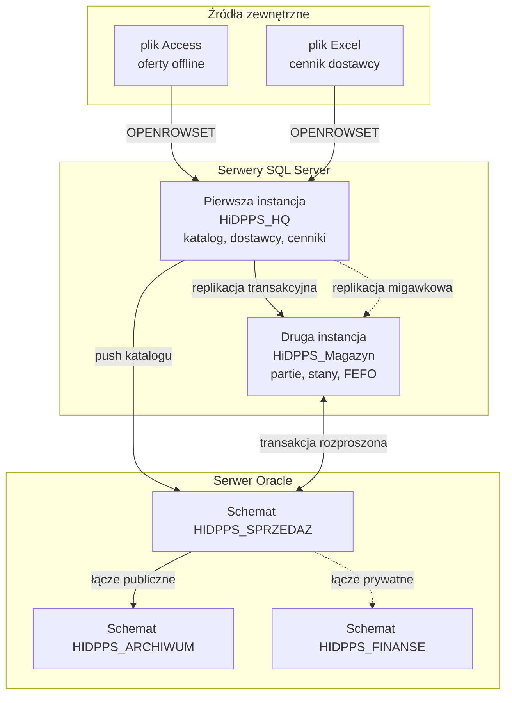

# Duży brainstorm: raport projektu HiDPPS, wersja trzecia

Data: 2026-05-21. Tryb: duży. Cel: dokładnie przemyśleć układ, treść i formę raportu, zanim cokolwiek powstanie w pliku finalnym HiDPPS.md. Zatwierdzenie układu jest warunkiem napisania v3.

## Faza zerowa. Kontekst pracy

### Co już wiem o oczekiwaniach autora

1. Raport ma być po polsku, prostym językiem technicznym. Nie ma być "AI w huj" - czyli bez markerów typu "uproszczony", "MVP", "scope", "constraints", "soft delete", "freeze".
2. Bez długiej kreski (em-dash). Stosujemy zwykły myślnik lub przecinek.
3. Bez osobnego słownika pojęć i skrótów. Skróty HiDPPS i FEFO są dopuszczalne wprost. Każdy inny skrót wyjaśniamy w nawiasie przy pierwszym użyciu.
4. Wprowadzenie ma być krótkie, jeden lub dwa akapity. Pełna nazwa projektu w nim pada. Opis dziedziny i procesu biznesowego należy umieścić w tym samym rozdziale, jako jego część.
5. Wymagania biznesowe są osobnym rozdziałem. Lista musi być sformułowana lepiej niż w wersji drugiej.
6. Architektura: jeden czytelny diagram architektury rozproszonej bazy danych, a obok osobne diagramy związków encji dla każdej z baz.
7. Bez rozdziału z wymaganiami funkcjonalnymi i niefunkcjonalnymi rozumianymi jak w klasycznym raporcie inżynierskim.
8. Pokrycie wszystkich trzynastu punktów technicznych z [Projekt.md](../../../RBZ/PROJEKT/Projekt.md) jest obowiązkowe.
9. Diagram nie może nakładać się sam na siebie. Każdy element ma być widoczny.
10. Procedury opisujemy najpierw słownie, a dopiero potem kodem.

### Co już wiem o samej dziedzinie projektu

Projekt nosi nazwę "Hurtownia i Dystrybucja Przetworzonych Produktów Spożywczych", w skrócie HiDPPS. Autorzy to Mateusz Mróz numer indeksu 251190 i Maciej Górka numer indeksu 251143. Przedmiot to Rozproszone Bazy Danych, semestr szósty, kierunek Informatyka, Wydział Elektrotechniki, Elektroniki, Informatyki i Automatyki Politechniki Łódzkiej.

Dziedzina obejmuje:

1. Centralę firmy, która prowadzi katalog produktów, listę dostawców i cenniki zakupowe.
2. Magazyn, w którym towar jest składowany w partiach posiadających numer, datę produkcji i datę przydatności. Magazyn ma trzy rodzaje stref składowania zależne od wymagań produktu: strefa sucha, chłodnicza i mroźnicza. Zasada rozchodu to metoda FEFO, w której najpierw schodzi towar o najwcześniejszej dacie przydatności do spożycia.
3. Dział sprzedaży, który obsługuje zamówienia klientów. Każdy klient ma jeden z trzech segmentów (klient zwykły, klient hurtowy, klient kluczowy) wpływający na obowiązujące go ceny.
4. Dział finansowy, który prowadzi własną ewidencję opłat serwisowych i kosztów operacyjnych. Ewidencja ta nie jest dostępna dla pozostałych użytkowników.
5. Archiwum, do którego trafiają zamówienia starsze niż dwa lata, w formie odchudzonego, denormalizowanego zapisu.

### Co już wiem o stronie technicznej

Architektura składa się z:

1. Pierwszej instancji SQL Server o nazwie roboczej MSSQL_HQ, w której znajduje się baza HiDPPS_HQ. Tu są tabele: kraje, kategorie produktów, produkty, dostawcy, cenniki zakupowe.
2. Drugiej instancji SQL Server o nazwie roboczej MSSQL_MAG, w której znajduje się baza HiDPPS_Magazyn. Tu są tabele: kopia produktów (otrzymywana przez replikację z centrali), strefy magazynowe, partie, stany magazynowe.
3. Jednej instancji Oracle 19c. Wewnątrz są trzy schematy logiczne, traktowane w raporcie jako trzy niezależne źródła: HIDPPS_SPRZEDAZ, HIDPPS_ARCHIWUM, HIDPPS_FINANSE.
4. Pliku biurowego z arkuszem kalkulacyjnym, zawierającego cennik dostawcy.
5. Pliku z bazą Access, używanego przez przedstawiciela handlowego do offline'owej rejestracji ofert.

Mechanizmy rozproszone to:

1. Polecenia ad-hoc dostępu do zdalnych źródeł, polecenie OPENROWSET dla czterech rodzajów źródeł (SQL Server, Oracle, Access, Excel) i jeden widok wielodostępny łączący co najmniej dwa źródła.
2. Cztery serwery powiązane Linked Server (do drugiej instancji SQL Server, do Oracle, do pliku Access, do pliku Excel) i jawne mapowanie loginów po stronie SQL Server.
3. Polecenie OPENQUERY pozwalające na przekazanie zapytania w trybie pass-through po stronie Oracle.
4. Operacje wstawiania i modyfikacji danych na zdalnym serwerze (push katalogu produktów z centrali do schematu HIDPPS_SPRZEDAZ).
5. Konfiguracja koordynatora transakcji rozproszonych MS DTC i jeden scenariusz transakcji obejmującej zarówno bazę SQL Server, jak i bazę Oracle. Scenariusz to atomowa rezerwacja partii w magazynie i zmiana statusu zamówienia w schemacie HIDPPS_SPRZEDAZ.
6. Replikacja: typ transakcyjny (katalog produktów z centrali do magazynu, opóźnienie liczone w sekundach) oraz typ migawkowy (cennik zakupowy, jeden raz w ciągu nocy).
7. Po stronie Oracle: trzy role i trzech użytkowników. Role: rola do odczytu sprzedaży, rola do zapisu sprzedaży i rola do odczytu danych finansowych.
8. Po stronie Oracle: dwa łącza bazy danych. Jedno łącze publiczne do schematu HIDPPS_ARCHIWUM. Jedno łącze prywatne do schematu HIDPPS_FINANSE, widoczne tylko dla użytkownika działu finansów.
9. Widok rozproszony łączący zamówienia bieżące ze sprzedaży i zamówienia z archiwum, z jawnym rzutowaniem typów.
10. Wyzwalacze typu INSTEAD OF na widoku rozproszonym (kierujące operacje INSERT, UPDATE i DELETE we właściwe miejsce).
11. Pakiet PL/SQL po stronie Oracle zawierający procedury: rejestracja zamówienia, dodanie pozycji do zamówienia z zamrożeniem ceny na chwilę składania zamówienia, anulowanie zamówienia z walidacją statusu, raport najlepszych klientów oparty o kursor, scalenie tabeli pomocniczej katalogu (procedura MERGE).
12. Procedury po stronie SQL Server: rezerwacja partii metodą FEFO przy użyciu kursora, push katalogu produktów do Oracle, atomowe potwierdzenie zamówienia z użyciem MS DTC.

## Faza pierwsza. Tablica prawdy

| Numer | Zasada | Status |
|-------|--------|--------|
| 1 | Język polski. Skróty inne niż HiDPPS i FEFO wyjaśniane w nawiasie przy pierwszym użyciu. | Obowiązkowa |
| 2 | Brak długiej kreski. Stosujemy zwykły myślnik lub średnik. | Obowiązkowa |
| 3 | Brak osobnego rozdziału ze słownikiem pojęć. | Obowiązkowa |
| 4 | Wprowadzenie to jeden lub dwa akapity. Opis dziedziny i procesu biznesowego znajduje się w tym samym rozdziale. | Obowiązkowa |
| 5 | Wymagania biznesowe to osobny rozdział. Lista numerowana, jedno wymaganie to jedno czytelne zdanie. | Obowiązkowa |
| 6 | Rozdział o architekturze zawiera jeden czytelny diagram architektury rozproszonej bazy oraz oddzielne diagramy związków encji dla każdej z baz. | Obowiązkowa |
| 7 | Brak rozdziału o wymaganiach funkcjonalnych i niefunkcjonalnych w klasycznej formie inżynierskiej. | Obowiązkowa |
| 8 | Każdy z trzynastu punktów technicznych z [Projekt.md](../../../RBZ/PROJEKT/Projekt.md) ma swój podrozdział w rozdziale o realizacji mechanizmów rozproszonych. | Obowiązkowa |
| 9 | Każda procedura jest opisana najpierw słownie, a dopiero potem prezentowany jest kod. | Obowiązkowa |
| 10 | Diagramy są wykonane w taki sposób, aby elementy się nie nakładały. | Obowiązkowa |

## Faza druga. Pomysły na układ rozdziałów

### Pomysł pierwszy. Układ minimalistyczny, pięć rozdziałów

1. Wprowadzenie (krótkie, plus opis dziedziny i procesu biznesowego)
2. Wymagania biznesowe
3. Architektura systemu i model danych (jeden rozdział, kilka podrozdziałów)
4. Realizacja mechanizmów rozproszonych (trzynaście podrozdziałów)
5. Wnioski i podział pracy

Ocena: siedem na dziesięć. Zaleta: krótko i konkretnie. Wada: rozdział trzeci robi się gigantyczny, miesza architekturę logiczną z modelem danych, a to są dwie różne rzeczy.

### Pomysł drugi. Układ rozdzielający architekturę od modelu danych, sześć rozdziałów

1. Wprowadzenie (krótkie, plus opis dziedziny i procesu biznesowego)
2. Wymagania biznesowe
3. Architektura rozproszonej bazy danych (jeden diagram, opis serwerów i baz)
4. Model danych (oddzielny diagram związków encji dla każdej z baz)
5. Realizacja mechanizmów rozproszonych (trzynaście podrozdziałów)
6. Wnioski i podział pracy

Ocena: dziewięć na dziesięć. Zaleta: czytelny podział na architekturę logiczną i model danych. Wada: brak miejsca na wyróżnione przedstawienie procedur, ale procedury można zmieścić w odpowiednich podrozdziałach rozdziału piątego.

### Pomysł trzeci. Układ z wydzielonym rozdziałem o procedurach, siedem rozdziałów

1. Wprowadzenie
2. Wymagania biznesowe
3. Architektura rozproszonej bazy danych
4. Model danych
5. Realizacja mechanizmów rozproszonych (trzynaście podrozdziałów)
6. Procedury i logika po stronie serwera bazy (jeden rozdział, pełne kody)
7. Wnioski i podział pracy

Ocena: osiem na dziesięć. Zaleta: procedury są w jednym miejscu. Wada: rozdział szósty częściowo powtarza treść z podrozdziałów rozdziału piątego (na przykład 5.13 to procedury PL/SQL).

### Pomysł czwarty. Układ z wprowadzeniem dwuczęściowym, sześć rozdziałów

1. Wprowadzenie ogólne (kilka zdań o przedmiocie, autorach i celu)
2. Dziedzina projektu i proces biznesowy (oddzielny rozdział)
3. Wymagania biznesowe
4. Architektura i model danych (rozdział z dwoma podrozdziałami)
5. Realizacja mechanizmów rozproszonych
6. Wnioski i podział pracy

Ocena: sześć na dziesięć. Wada: autor mówi wprost, że opis dziedziny ma być w tym samym rozdziale co wprowadzenie. Ten układ łamie regułę numer cztery z tablicy prawdy.

### Rekomendacja

Pomysł drugi, sześć rozdziałów. Spełnia wszystkie reguły z tablicy prawdy, jest czytelny, nie ma powtórzeń i pozwala wpleść opis każdej procedury w odpowiedni podrozdział rozdziału piątego.

## Faza trzecia. Konstrukcja każdego rozdziału

### Rozdział pierwszy. Wprowadzenie

Cel rozdziału: powiedzieć czytelnikowi czym jest dokument, czego dotyczy projekt, kim są autorzy i jak działa modelowana firma.

Forma: jeden lub dwa akapity tekstu ciągłego. Bez podpunktów. Bez podrozdziałów.

Treść do napisania w wersji trzeciej (gotowiec, jeszcze nie wstawiamy do pliku finalnego):

Akapit pierwszy. Dokument przedstawia projekt rozproszonej bazy danych dla hurtowni o nazwie Hurtownia i Dystrybucja Przetworzonych Produktów Spożywczych, w dalszej części określanej skrótem HiDPPS. Projekt został przygotowany przez Mateusza Mroza (numer albumu 251190) i Macieja Górkę (numer albumu 251143) w ramach przedmiotu Rozproszone Bazy Danych prowadzonego na Wydziale Elektrotechniki, Elektroniki, Informatyki i Automatyki Politechniki Łódzkiej, na kierunku Informatyka, w semestrze szóstym studiów pierwszego stopnia.

Akapit drugi. HiDPPS prowadzi sprzedaż przetworzonych produktów spożywczych dla klientów detalicznych i hurtowych. W działalności firmy występują cztery główne obszary informacyjne: centrala odpowiadająca za katalog produktów i współpracę z dostawcami, magazyn odpowiadający za składowanie towaru w partiach o określonej dacie przydatności i wydawanie towaru metodą FEFO (od angielskiego First Expired First Out, czyli najpierw schodzi towar o najwcześniejszej dacie przydatności do spożycia), dział sprzedaży obsługujący zamówienia klientów oraz dział finansowy prowadzący odrębną ewidencję opłat operacyjnych. Każdy z tych obszarów został odwzorowany na osobne źródło danych w architekturze rozproszonej, co pozwoliło na jednoczesne pokrycie wymagań biznesowych firmy oraz wszystkich elementów technicznych wymaganych w treści zadania projektowego.

### Rozdział drugi. Wymagania biznesowe

Cel rozdziału: pokazać czego firma oczekuje od systemu, bez wchodzenia w technologię. Forma: lista numerowana. Jedno wymaganie to jedno krótkie zdanie napisane językiem zrozumiałym dla osoby z działu sprzedaży lub działu magazynu.

W wersji drugiej raportu lista wymagań brzmiała sztucznie. W tej iteracji proponuję inną formę: krótkie zdania, każde mówi o jednej rzeczy. Bez wyliczeń wewnątrz pozycji. Bez słów takich jak "system pozwala na" - bo to brzmi jak wymaganie funkcjonalne, a my mówimy o tym, czego biznes oczekuje.

Propozycja listy do v3 (gotowiec, do akceptacji):

1. Każdy produkt sprzedawany przez firmę należy do jednej kategorii i ma jednoznacznie określoną wymaganą strefę temperaturową: suchą, chłodniczą albo mroźniczą.
2. Każda kategoria produktów ma przypisaną stawkę podatku od towarów i usług, w skrócie VAT (od angielskiego Value Added Tax, czyli podatek od wartości dodanej).
3. Firma utrzymuje historię cen zakupowych. Dany produkt może być oferowany przez wielu dostawców, a każda oferta cenowa obowiązuje w zadeklarowanym przedziale dat.
4. Towar przyjmowany do magazynu jest dzielony na partie. Każda partia ma własny numer, datę produkcji i datę przydatności do spożycia.
5. Wydawanie towaru z magazynu odbywa się metodą FEFO. Pracownik magazynu pobiera w pierwszej kolejności partie o najwcześniejszej dacie przydatności.
6. Towar nie może zostać przyjęty do strefy magazynowej innej niż strefa wymagana dla jego kategorii. Próba takiego zapisu musi zostać odrzucona przez bazę danych.
7. Klienci hurtowni są podzieleni na trzy segmenty: klient zwykły, klient hurtowy i klient kluczowy. Segment klienta wpływa na cenę jednostkową obowiązującą przy sprzedaży.
8. Cena jednostkowa pozycji zamówienia jest zamrażana w chwili dodania pozycji. Późniejsza zmiana cennika nie zmienia wartości złożonego już zamówienia.
9. Zamówienie może zostać anulowane jedynie wtedy, gdy znajduje się w statusie "złożone" lub "potwierdzone". Późniejsza anulacja wymaga osobnej procedury i nie jest przedmiotem niniejszego projektu.
10. Zamówienia starsze niż dwa lata są przenoszone do archiwum w postaci skróconej. Archiwum nie pozwala na zmiany historycznych zapisów.
11. Dział finansowy prowadzi własną ewidencję opłat. Ewidencja ta nie jest widoczna dla użytkowników z innych działów.
12. Przedstawiciel handlowy w terenie zapisuje wstępne oferty klientów w pliku z bazą Access (plik z rozszerzeniem accdb). Po powrocie do biura plik ten jest odczytywany przez bazę centralną bez konieczności ręcznego przepisywania danych.
13. Aktualny cennik dostawcy przekazywany jest do firmy w postaci pliku z arkuszem kalkulacyjnym (plik z rozszerzeniem xlsx). Plik ten powinien być możliwy do odczytu wprost z bazy centralnej, bez wcześniejszego importu do tabeli.

Każde z trzynastu wymagań biznesowych jest realizowane w warstwie technicznej projektu. Mapowanie wymagań biznesowych na elementy bazy danych zostanie pokazane w rozdziale piątym, w odpowiednich podrozdziałach.

### Rozdział trzeci. Architektura rozproszonej bazy danych

Cel rozdziału: pokazać z jakich elementów składa się rozwiązanie oraz jak są one ze sobą połączone.

Podrozdział 3.1. Uzasadnienie podziału na trzy serwery.

Treść w zarysie: argumenty za podziałem.
1. Każdy z trzech rodzajów źródeł obsługuje inny rodzaj operacji: centrala obsługuje wolnozmienny katalog, magazyn obsługuje intensywny ruch operacyjny związany z partiami i stanami, sprzedaż obsługuje zapis zamówień i agregacje raportowe.
2. Awaria magazynu nie zatrzymuje pracy działu sprzedaży, ponieważ zamówienie zostaje przyjęte do bazy sprzedaży, a rezerwacja w magazynie odbywa się w osobnej operacji.
3. Heterogeniczność (różnorodność technologiczna): zastosowanie SQL Server i Oracle pozwala pokazać w jednym projekcie zarówno mechanizmy replikacji wewnętrzne dla SQL Server, jak i mechanizmy łączy bazy danych wewnętrzne dla Oracle.

Podrozdział 3.2. Diagram architektury.

Forma: jeden diagram wykonany w notacji Mermaid. Trzy poziomy w pionie. Pierwszy poziom: źródła zewnętrzne (Access, Excel). Drugi poziom: dwie instancje SQL Server (centrala, magazyn). Trzeci poziom: instancja Oracle z trzema schematami (sprzedaż, archiwum, finanse).

Po lewej stronie znajdują się źródła zasilające centralę (Access, Excel). Pomiędzy centralą a magazynem przebiega replikacja. Pomiędzy magazynem a sprzedażą przebiega kanał transakcji rozproszonej. Pomiędzy centralą a sprzedażą przebiega kanał push katalogu produktów. Pomiędzy sprzedażą a archiwum oraz sprzedażą a finansami przebiegają łącza bazy danych po stronie Oracle.

Każde połączenie jest podpisane jednym lub dwoma słowami opisującymi rodzaj mechanizmu. Czcionka podpisów ma być na tyle duża, aby tekst nie nakładał się na ikony bloków.

W brainstormie analizujemy trzy warianty diagramu:

Wariant A. Trzy poziomy w pionie. Linie połączeń biegną pionowo. Mało linii poziomych. Czytelność wysoka.

Wariant B. Trzy kolumny obok siebie. Linie biegną poziomo. Czytelność średnia, bo linii poziomych jest dużo i przecinają się.

Wariant C. Środek to magazyn, wokół niego rozchodzą się pozostałe serwery. Diagram radialny. Wygląda ciekawie, ale w Mermaid nie ma natywnej obsługi diagramów radialnych, a wymuszanie ich przez flowchart prowadzi do bałaganu.

Rekomendacja: wariant A.

Podrozdział 3.3. Tabela serwerów i baz.

Forma: tabela z kolumnami: nazwa serwera, technologia, baza lub schemat, główni użytkownicy, rola w systemie.

### Rozdział czwarty. Model danych

Cel rozdziału: pokazać szczegółowo, jakie tabele zawiera każda z baz i jakie relacje łączą tabele wewnątrz tej samej bazy.

Podrozdział 4.1. Baza HiDPPS_HQ na pierwszej instancji SQL Server.

Sekcja podrozdziału składa się z:
1. Tabeli opisującej każdą z pięciu tabel bazy. Kolumny: nazwa tabeli, krótki opis, kluczowe pola.
2. Diagramu związków encji.
3. Komentarza o ograniczeniach CHECK użytych w tabeli kategorii produktów (wymagana strefa, stawka VAT).

Podrozdział 4.2. Baza HiDPPS_Magazyn na drugiej instancji SQL Server.

Sekcja zawiera: tabelę z czterema tabelami bazy (kopia produktów, strefy magazynowe, partie, stany magazynowe), diagram związków encji, opis wyzwalacza typu INSTEAD OF zabezpieczającego przed przyjęciem produktu do niewłaściwej strefy magazynowej.

Podrozdział 4.3. Schemat HIDPPS_SPRZEDAZ na serwerze Oracle.

Sekcja zawiera: opis sześciu tabel (klienci, adresy dostaw, kopia katalogu produktów, cenniki sprzedażowe, zamówienia, pozycje zamówień), diagram związków encji, opis zamrażania ceny w pozycji zamówienia.

Podrozdział 4.4. Schemat HIDPPS_ARCHIWUM na serwerze Oracle.

Sekcja zawiera: opis jednej tabeli (zamówienia archiwum), uzasadnienie denormalizacji (w archiwum nie potrzeba relacji do tabeli klientów, ponieważ nazwa klienta jest tu zapisana bezpośrednio).

Podrozdział 4.5. Schemat HIDPPS_FINANSE na serwerze Oracle.

Sekcja zawiera: opis jednej tabeli (opłaty serwisowe), informację o ograniczeniu widoczności tego schematu wyłącznie dla użytkownika działu finansowego.

### Rozdział piąty. Realizacja mechanizmów rozproszonych

Cel rozdziału: omówić każdy z trzynastu punktów technicznych z [Projekt.md](../../../RBZ/PROJEKT/Projekt.md). Każdy podrozdział ma trzy części: opis słowny czego dotyczy mechanizm, kod, weryfikacja działania.

Numeracja podrozdziałów odpowiada dokładnie numeracji w specyfikacji projektu, co ułatwia ocenę prowadzącemu.

Podrozdział 5.1. Struktura bazy i uzasadnienie podziału.

Forma: krótkie odwołanie do rozdziału trzeciego oraz uzupełniający opis o związku między podziałem fizycznym serwerów a podziałem logicznym na obszary biznesowe firmy.

Podrozdział 5.2. Polecenie OPENROWSET i widok wielodostępny.

Trzy elementy:
1. Cztery polecenia OPENROWSET wykonane na bazie centrali. Po jednym dla każdego rodzaju źródła: druga instancja SQL Server, Oracle, Access, Excel.
2. Jeden widok łączący co najmniej dwa źródła. Propozycja: widok porównujący aktualną cenę zakupową z pliku Excel z średnią ceną sprzedaży policzoną po stronie Oracle (z użyciem OPENQUERY).
3. Komentarz na temat ustawień konfiguracji opcji "Ad Hoc Distributed Queries" w SQL Server.

Podrozdział 5.3. Serwery powiązane i mapowanie loginów.

Cztery wymagane Linked Server (do drugiej instancji SQL Server, do Oracle, do pliku Access, do pliku Excel) plus jedno dodatkowe (do centrali od strony magazynu, ułatwiające raportowanie). Dla każdego: polecenie tworzenia, polecenie mapowania loginu i tabela weryfikacyjna.

Podrozdział 5.4. Polecenie OPENQUERY.

Procedura zapisana po stronie centrali, raportująca dziesięciu najlepszych klientów na podstawie danych z Oracle. Cała agregacja przebiega po stronie Oracle, do centrali wraca jedynie krótka tabela wynikowa.

Podrozdział 5.5. Operacje wstawiania i modyfikacji danych na zdalnym serwerze.

Procedura wstawiająca aktualny katalog produktów z centrali do tabeli pomocniczej po stronie Oracle, a następnie wywołująca procedurę MERGE po stronie Oracle, scalającą tabelę pomocniczą z docelową tabelą kopii katalogu w schemacie sprzedaży.

Podrozdział 5.6. Konfiguracja koordynatora transakcji rozproszonych MS DTC.

Trzy elementy:
1. Lista czynności konfiguracyjnych po stronie systemu Windows.
2. Lista czynności konfiguracyjnych po stronie Oracle (uprawnienia związane z usługą Oracle Services for MTS, w skrócie OraMTS, czyli usługa obsługująca transakcje rozproszone Microsoftu po stronie Oracle).
3. Scenariusz transakcji: rezerwacja partii w magazynie metodą FEFO i jednoczesna zmiana statusu zamówienia z "złożone" na "potwierdzone" w schemacie sprzedaży. Procedura uruchamiana z poziomu drugiej instancji SQL Server.

Podrozdział 5.7. Replikacja.

Dwa typy replikacji:
1. Replikacja transakcyjna katalogu produktów z centrali do magazynu. Opóźnienie liczone w sekundach.
2. Replikacja migawkowa cennika zakupowego z centrali do magazynu, jedna migawka na dobę o godzinie drugiej w nocy.

Podrozdział 5.8. Użytkownicy i role w bazie Oracle.

Trzy role i trzech użytkowników. Tabela uprawnień: rola, obiekt, rodzaj uprawnienia.

Podrozdział 5.9. Łącza bazy danych publiczne i prywatne.

Dwa łącza: jedno publiczne wskazujące na schemat HIDPPS_ARCHIWUM i jedno prywatne wskazujące na schemat HIDPPS_FINANSE.

Podrozdział 5.10. Symulacja zdalnych źródeł przez łącze bazy danych.

Opisanie, w jaki sposób trzy schematy na jednym serwerze Oracle są traktowane jako trzy osobne źródła. Dostęp do schematów innych niż HIDPPS_SPRZEDAZ odbywa się wyłącznie poprzez łącza bazy danych.

Podrozdział 5.11. Widok rozproszony z rzutowaniem typów.

Widok łączący zamówienia bieżące ze schematu HIDPPS_SPRZEDAZ z zamówieniami archiwum dostępnymi przez łącze publiczne. Wszystkie kolumny są jawnie rzutowane na ten sam typ, co umożliwia użycie polecenia UNION ALL.

Podrozdział 5.12. Wyzwalacze typu INSTEAD OF.

Trzy wyzwalacze na widoku z punktu 5.11: INSTEAD OF INSERT (kieruje zapis do bieżącej tabeli zamówień, jeśli data nie jest starsza niż dwa lata, w przeciwnym wypadku do archiwum), INSTEAD OF UPDATE (zezwala na zmianę wartości tylko po stronie bieżącej, archiwum jest niezmienne), INSTEAD OF DELETE (operacja jest zabroniona).

Podrozdział 5.13. Procedury w języku PL/SQL.

Cztery procedury i jedna funkcja zamknięte w pakiecie:
1. Procedura rejestrująca nagłówek zamówienia.
2. Procedura dodająca pojedynczą pozycję, wraz z zamrożeniem ceny i policzeniem wartości pozycji według formuły wartość brutto równa się wartość netto powiększona o wartość podatku.
3. Procedura anulująca zamówienie z walidacją dopuszczalnego statusu.
4. Procedura raportująca najlepszych klientów, oparta o kursor.
5. Funkcja pobierająca aktualną cenę produktu dla segmentu klienta w zadanym dniu.

### Rozdział szósty. Wnioski i podział pracy

Cel rozdziału: krótkie zamknięcie tematu.

Podrozdział 6.1. Wnioski merytoryczne.

Forma: trzy do pięciu akapitów. Co projekt pokazuje, co było najtrudniejsze, co zaskoczyło autorów.

Podrozdział 6.2. Ograniczenia obecnej wersji.

Forma: lista numerowana, każda pozycja to jedno zdanie. Wszystkie ograniczenia opisane są normalnym językiem, bez słów typu "MVP". Przykładowe pozycje listy:
1. Wersja nie obejmuje wystawiania faktur korygujących i obsługi zwrotów towaru.
2. Wersja nie obejmuje planowania tras dostawczych i nie zawiera bazy pojazdów.
3. Wersja nie obejmuje pełnej historii zmian rekordów. Każda zmiana nadpisuje wartość poprzednią.
4. Wersja zakłada jeden magazyn fizyczny. W przyszłej rozbudowie tabela strefy magazynowej zostałaby powiązana z tabelą magazyny.

Podrozdział 6.3. Podział pracy.

Tabela z trzema kolumnami: obszar, Mateusz Mróz, Maciej Górka.

## Faza czwarta. Analiza wybranych elementów spornych

### Element pierwszy. Diagram architektury w wersji drugiej raportu

Diagram w wersji drugiej miał strzałki przebiegające w wielu kierunkach. Etykiety strzałek nakładały się na ikony bloków bazy danych. Wprowadzony zostanie układ pionowy trójpoziomowy (źródła zewnętrzne na górze, serwery SQL Server po środku, serwer Oracle na dole). Strzałki pomiędzy poziomami będą biegły z lewa na prawo wewnątrz danego poziomu, a w pionie pomiędzy poziomami. Etykiety strzałek będą krótkie, dwa lub trzy słowa.

Rozważone propozycje zapisu w Mermaid:

Analiza diagramu pod kątem czytelności:

1. Trzy poziomy w pionie. Nie ma elementów zachodzących na siebie.
2. Łączy w obrębie poziomu Oracle (sprzedaż do archiwum i sprzedaż do finansów) są dwie, jedna ciągła i jedna kropkowana, łatwe do rozróżnienia.
3. Łącze transakcyjne pomiędzy magazynem a sprzedażą jest oznaczone podwójną strzałką, co podkreśla atomowość operacji.

### Element drugi. Diagramy związków encji per baza

Każda z pięciu sekcji rozdziału czwartego zawiera własny diagram. Wszystkie diagramy mają tę samą konwencję: notacja Mermaid classDiagram, etykieta PK przy kluczu głównym, etykieta FK przy kluczu obcym, etykieta UK przy unikalnym indeksie.

W brainstormie analizujemy dwa warianty:

Wariant A. Pięć osobnych diagramów (po jednym na bazę). Czytelność wysoka.

Wariant B. Jeden zbiorczy diagram pokazujący wszystkie tabele i wszystkie relacje. Czytelność niska, bo relacji jest dużo i przebiegałyby przez granice baz.

Rekomendacja: wariant A.

### Element trzeci. Lista wymagań biznesowych

W wersji drugiej raportu pozycje listy były długie, wielowątkowe i zawierały elementy techniczne (typy danych, nazwy mechanizmów). W wersji trzeciej skracamy każde wymaganie do jednego zdania, usuwamy detale techniczne. Detal techniczny pojawi się w odpowiednim podrozdziale rozdziału piątego, a w rozdziale drugim mówimy o tym, czego oczekuje biznes.

W brainstormie analizujemy trzy warianty formy:

Wariant A. Trzynaście wymagań po jednym zdaniu. Numeracja arabska. Wcięcia brak. Najbardziej zwarty.

Wariant B. Wymagania pogrupowane na cztery sekcje: katalog i dostawcy, magazyn i partie, sprzedaż i klienci, dział finansowy i sytuacje szczególne. W każdej sekcji od dwóch do czterech pozycji.

Wariant C. Pojedyncze pozycje z dwuczęściową budową: zdanie wymagania i zdanie uzasadniające. Czytelne, ale powiela treść z rozdziału pierwszego.

Rekomendacja: wariant A (proste, jednoznaczne, brak powtórzeń).

### Element czwarty. Czy procedury są w rozdziale piątym czy w osobnym rozdziale szóstym

Wybieramy umieszczenie procedur w rozdziale piątym, w odpowiednich podrozdziałach (zwłaszcza 5.6 dla MS DTC, 5.4 dla OPENQUERY, 5.5 dla push katalogu, 5.13 dla pakietu PL/SQL, 5.7 dla replikacji). Procedury rezerwacji metodą FEFO i procedura potwierdzenia zamówienia są opisane w 5.6.

Argument za tą decyzją: prowadzący ocenia raport według trzynastu punktów [Projekt.md](../../../RBZ/PROJEKT/Projekt.md). Łatwiej będzie ocenić punkt 5.13, jeśli pakiet PL/SQL znajduje się dokładnie w podrozdziale 5.13, a nie w osobnym rozdziale, do którego trzeba szukać odsyłaczy.

## Faza piąta. Strategie decyzyjne

### Strategia pierwsza. Test "co odpowiem na obronie"

Każda decyzja architektoniczna sprawdzona pod kątem pytania, które prowadzący prawdopodobnie zada:

1. Dlaczego dwie instancje SQL Server, a nie jedna? Odpowiedź: dla pokazania replikacji wewnętrznej dla SQL Server. Replikacja na pojedynczej instancji jest techniką "leniwą".
2. Dlaczego trzy schematy w Oracle, a nie trzy bazy? Odpowiedź: serwer Oracle w odróżnieniu od SQL Server traktuje schemat jako logicznie oddzielony obszar użytkownika. Trzy schematy z trzema osobnymi użytkownikami, dwa łącza bazy danych (publiczne i prywatne) pozwalają na czysty pokaz mechanizmu łączy.
3. Dlaczego nie ma osobnego rozdziału o wymaganiach niefunkcjonalnych? Odpowiedź: w przedmiocie Rozproszone Bazy Danych skupiamy się na mechanizmach rozproszonych, a nie na pełnej dokumentacji inżynierskiej. Wymagania niefunkcjonalne istotne dla rozproszenia (atomowość, spójność, izolacja, trwałość, opóźnienie replikacji) są omawiane w kontekście konkretnych mechanizmów w rozdziale piątym.
4. Dlaczego procedura potwierdzenia zamówienia jest uruchamiana z poziomu drugiej instancji SQL Server, a nie z poziomu Oracle? Odpowiedź: koordynatorem transakcji rozproszonej jest MS DTC, a najprostsza ścieżka jego użycia prowadzi od SQL Server. Po stronie Oracle używamy usługi OraMTS, która umożliwia partycypację w transakcji koordynowanej przez MS DTC.

### Strategia druga. Test "premortum"

Wyobraźmy sobie, że raport został oddany i prowadzący zwraca uwagi krytyczne. Możliwe uwagi:

1. "Brakuje opisu firmy" - obronione przez wprowadzenie zawierające akapit drugi.
2. "Wymagania brzmią jak techniczne, nie biznesowe" - obronione przez wymóg, że jedno wymaganie to jedno zdanie bez detali technicznych.
3. "Nie wiadomo, co który mechanizm robi" - obronione przez to, że każdy podrozdział rozdziału piątego ma najpierw opis słowny, a dopiero potem kod.
4. "Brakuje słownika" - obronione tym, że każdy nieoczywisty skrót jest wyjaśniony w nawiasie przy pierwszym użyciu, zgodnie z preferencją autora raportu.
5. "Diagram jest nieczytelny" - obronione decyzją o trzypoziomowym układzie pionowym i krótkich podpisach strzałek.
6. "Trzynastej procedury PL/SQL brakuje" - mapowanie do trzynastu punktów technicznych z [Projekt.md](../../../RBZ/PROJEKT/Projekt.md) zawiera podrozdział 5.13.

### Strategia trzeci. Test "Pareto"

Pytanie: które elementy raportu zajmują 80 procent objętości, ale dają 20 procent punktów? Odpowiedź: rozbudowane opisy historii decyzji, opisy procesu pisania raportu, długie tabele z mapowaniami. Z wersji drugiej raportu usuwamy:

1. Tabelę pokrycia wymagań na początku dokumentu (zostaje krótsza wersja, w tekście, w rozdziale drugim).
2. Sekcję "Ograniczenia MVP" rozumianą jako oddzielne rozważanie dlaczego coś nie zostało zrobione. W wersji trzeciej ograniczenia są zwięzłe i znajdują się w rozdziale szóstym.
3. Sekcję o sposobie uruchomienia demo - rozproszona w rozdziale piątym przy odpowiednich procedurach.

## Faza szósta. Ostateczny wybór

Wybrany układ rozdziałów:

1. Wprowadzenie
2. Wymagania biznesowe
3. Architektura rozproszonej bazy danych
4. Model danych
5. Realizacja mechanizmów rozproszonych
6. Wnioski i podział pracy

Wybrana lista wymagań biznesowych: trzynaście pozycji w formie krótkich zdań (treść w fazie trzeciej, rozdział drugi).

Wybrana forma wprowadzenia: dwa akapity tekstu ciągłego (treść w fazie trzeciej, rozdział pierwszy).

Wybrane diagramy: jeden diagram architektury w układzie pionowym trójpoziomowym, pięć diagramów związków encji (po jednym na bazę lub schemat).

Wybrane lokalizacje procedur: każda procedura w odpowiednim podrozdziale rozdziału piątego.

Wybrane zasady językowe: język polski, bez długich kresek, bez słów typu "MVP", "scope", "constraints", "soft delete", skróty inne niż HiDPPS i FEFO wyjaśniane w nawiasie przy pierwszym użyciu.

## Faza siódma. Plan implementacji wersji trzeciej

1. Zachowanie kopii wersji drugiej raportu pod nazwą HiDPPS_v2.md.
2. Utworzenie nowego pliku HiDPPS.md zawierającego sześć rozdziałów według układu z fazy szóstej.
3. Zapisanie wprowadzenia w postaci dwóch akapitów.
4. Wpisanie trzynastu wymagań biznesowych w formie krótkich zdań.
5. Przeniesienie i rozszerzenie opisu architektury, z jednym czytelnym diagramem.
6. Wpisanie pięciu sekcji modelu danych, z pięcioma diagramami związków encji.
7. Wpisanie trzynastu podrozdziałów realizacji mechanizmów rozproszonych. Każdy podrozdział zawiera opis słowny, kod i krótką weryfikację.
8. Wpisanie krótkich wniosków i podziału pracy.
9. Przegląd całego dokumentu pod kątem zasad językowych: brak długich kresek, brak słów "MVP", "scope", "constraints", "soft delete", "freeze", "pass-through" bez wyjaśnienia, brak mieszania języków.

## Faza ósma. Pytania do akceptacji

Lista pytań w ankiecie:

1. Czy układ sześciu rozdziałów jest akceptowalny?
2. Czy treść proponowanego wprowadzenia (dwa akapity) jest właściwa, czy zmieniamy ją w czymkolwiek?
3. Czy lista trzynastu wymagań biznesowych w formie z fazy trzeciej rozdziału drugiego jest akceptowalna?
4. Czy układ diagramu architektury (trzy poziomy w pionie, krótkie podpisy) jest akceptowalny?
5. Czy decyzja o pięciu osobnych diagramach związków encji (po jednym na bazę lub schemat) jest akceptowalna?

Ankieta zostanie zadana w wiadomości towarzyszącej brainstormowi, poprzez narzędzie ankietowe edytora.
